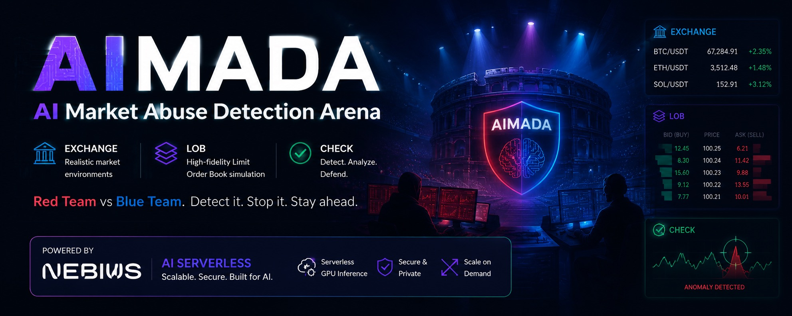
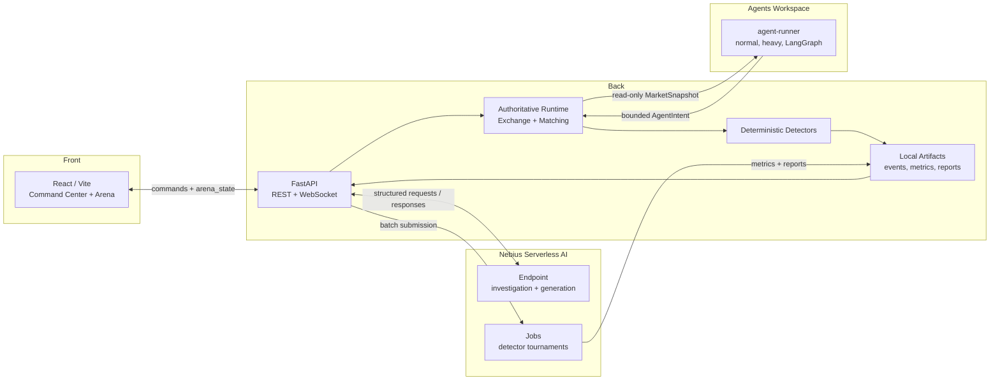

# AI Market Abuse Detection Arena

## Built on Nebius AI Serverless



<p align="center">
  <a href="https://github.com/khab40/aimada"></a>
  <a href="https://github.com/nebius"></a>
  <a href="https://github.com/python/cpython"></a>
  <a href="https://github.com/fastapi/fastapi"></a>
  <a href="https://github.com/facebook/react"></a>
  <a href="https://github.com/vitejs/vite"></a>
  <a href="https://github.com/vllm-project/vllm"></a>
  <a href="https://github.com/langchain-ai/langgraph"></a>
  <a href="https://github.com/docker/compose"></a>
  <a href="https://github.com/kubernetes/kubernetes"></a>
  <a href="https://github.com/khab40/aimada/actions/workflows/ci.yml"></a>
</p>

AIMADA is a Nebius AI Serverless-first market surveillance command center for synthetic market-abuse workloads. The Arena generates suspicious market activity; Nebius AI Serverless investigates incidents, generates scenarios, and runs detector tournaments.

Nebius value is visible in the first demo minute:

- **Nebius AI Serverless Endpoint** powers the interactive path: AI Investigation Team, AI Scenario Generator, incident explanations, and structured reports.
- **Nebius Serverless Jobs** power the batch path: AI Detector Tournament, scenario replay at scale, detector metrics, leaderboards, and artifacts.
- **Local mock fallback** keeps the challenge demo reliable without credentials while preserving the same response schemas and UI labels used by the real Nebius path.



Quick Start: Get running in 5 minutes with local mock fallback. See [Quick Start](#quick-start) below, [docs/QUICKSTART.md](docs/QUICKSTART.md), or the challenge-focused [demo script](docs/demo-script.md).

## ⚠️ Disclaimer

This project is an educational simulation. It does not detect real market manipulation, does not provide trading signals, and should not be used for compliance decisions. The scenarios are synthetic "abuse-like" patterns designed to demonstrate order-book anomaly detection and AI Investigator explanations. See [docs/safety-and-disclaimers.md](docs/safety-and-disclaimers.md) for details.

## Current Implementation Status

Implemented:

- AI Command Center as the primary UI entry point for AI investigation, scenario generation, detector tournaments, runtime status, and execution traces.
- Nebius AI Investigation Team as the primary Serverless Endpoint feature: `POST /api/nebius/investigation-team/analyze` calls `/investigation-team` and returns specialist agent findings, consensus, timeline, and recommended action.
- Nebius AI Scenario Generator: `POST /api/nebius/scenario-generator/generate` calls `/generate-market-abuse-scenario`, preserves ground truth, and projects generated scenarios into the existing Arena replay path.
- Nebius AI Detector Tournament: `POST /api/nebius/tournament/start` runs the Serverless Job-compatible tournament runner locally by default and returns leaderboard, precision, recall, F1, false positives, false negatives, latency, summary, and artifacts.
- Polished Serverless E2E smoke demo: `POST /api/nebius/serverless-smoke/run` creates one spoofing incident flow and writes `outputs/serverless-smoke/{summary.json,scenario.json,simulation_events.json,detector_alerts.json,investigation_report.md,tournament_result.json,serverless_job.json,manifest.json}`.
- Live React/FastAPI Market Workload Generator with WebSocket state, order-book visualization, scenario launch, detector scores, incidents, and report/replay workflows.
- In-process `AgentManager` for hundreds of lightweight normal agents with per-tick deadlines and single-writer exchange application.
- Separate `agent-runner` service for out-of-process agents over HTTP, while the backend keeps the exchange/order book authoritative.
- LangGraph-compatible generic remote agents and worker-pool heavy agents inside `agent-runner`.
- Optional Google authentication behind `ENABLE_GOOGLE_AUTH=false` by default; local demo flows require no login.
- Multiuser platform foundation with demo fallback identity, workspace metadata, case ownership, reviewer metadata, report attribution, and audit trail records for investigation actions.
- Deterministic detector evidence model for synthetic spoofing-like, layering-like, quote-stuffing-like, and liquidity-shock patterns.
- Nebius endpoint and job scaffolds with local typed fallbacks, Docker/config files, scripts, and UI control surfaces, including `/investigation-team`, `/generate-market-abuse-scenario`, `/investigation-report`, `/orderbook-alert`, and `/generate-smart-scenario`.
- Production validation completed more than ten Nebius Serverless AI Job runs and exercised a vLLM-backed Serverless AI Endpoint across scenario generation, incident analysis, investigation reporting, and structured market-event explanation routes.
- Phase 4.5 Managed Experiments with deterministic attack manifests, local smart-batch execution, artifact normalization, aggregation, bounded AI Investigator reports, and Detection review of summaries, leaderboards, markdown reports, artifact indexes, and original local-batch files.
- Commit-safe [benchmark evidence](outputs/benchmark/README.md) with completed Job records, Endpoint investigations, S3 evidence metadata, metrics, reports, a manifest, and SHA-256 checksums.
- Reduced demo navigation around AI Command Center, Workload Generator, and Docs / Demo.
- Demo page for three deterministic 3-minute product demo paths: Real Nebius AI Run, Two-Model Pipeline, and Streaming Explanation.
- Arena split into Scenario / Attack Configuration, Market, and Detection sections, with Standard and Battlefield market visualization modes.
- Detection owns live detector output, incident replay, evidence, AI Investigator reports, and report artifacts; Reports is no longer a primary navigation destination.
- Nebius AI page focuses on why Nebius matters: model selection, inference, batch execution, GPU utilization, datasets, and Managed Experiments.
- About and ARD-0001 include four-area architecture diagrams covering Front, Back, Agent Runners Workspace, and Nebius Serverless Cloud.
- Coherent day/night/system UI theme behavior across widgets, charts, status chips, order-book levels, and canvas visualizations, plus compact vertical-navigation controls, paused-state-stable liquidity visualization, and documentation set for quick start, architecture, ARDs, runtime model, benchmark methodology, safety framing, deployment, and design ideas.

Before final submission:

- Runtime/cost measurements and Nebius console screenshots linked from the judge-facing submission index.
- Final screenshot assets for the README screenshot table beyond the About architecture diagram.

Future work:

- Dedicated Judge Mode timeline-window selector and formal benchmark artifact schema versioning.
- Durable backend workspace/organization tables, case assignment APIs, and persisted audit-log APIs beyond the current frontend platform foundation.

## Repository Structure

```
backend/          FastAPI simulator, detectors, reports, local storage
agent-runner/     Out-of-process normal, heavy, and LangGraph agent workspace
frontend/         Vite React UI for live arena and benchmark views
serverless/       Nebius endpoint, job images, configs, and batch runners
docs/             Complete architecture, deployment, and research notes
assets/           Research articles, screenshots, diagrams, banners
data/             Sample input data for local testing
outputs/          Generated logs, incidents, reports, artifacts
```

## Getting Started

### 1. Clone and Configure

```bash
git clone https://github.com/khab40/aimada.git
cd aimada
cp .env.example .env
```

### 2. Start the Full Local Stack

```bash
docker compose up --build
```

The default stack builds the agent runner, backend, and frontend from source. It
does not pull GHCR images, require Nebius credentials, or start vLLM/GPU work.
Nebius calls use the deterministic mock path, and generated artifacts are
written to `./outputs`.

Real Nebius mode is opt-in and validates the endpoint URL before startup:

```bash
docker compose -f docker-compose.yml -f docker-compose.nebius.yml up --build
```

This override installs the Nebius CLI and mounts
`$HOME/.nebius/{config,credentials}.yaml`; see
[Nebius Deployment](docs/nebius-deployment.md) before using it.

Secret rotation is dry-run first:

```bash
make secrets-plan
make secrets-check
make secrets-rotate
```

To import newly issued Google/Nebius provider credentials without exposing them
on the command line, place only the supported keys in a temporary file outside
the repository and run `./scripts/rotate-secrets.sh --import-env /path/to/provider.env --apply --restart`.
Disable old provider credentials only after the health check succeeds.

- **Frontend**: http://localhost:5173
- **Backend**: http://localhost:8000
- **WebSocket**: ws://localhost:8000/ws/arena

### 3. Explore

Open http://localhost:5173 to land directly in the AI Command Center.

Default demo flow:

1. Open Command Center and click `Run Serverless E2E Demo`.
2. Show the generated spoofing scenario and LOB simulation events.
3. Show the rule-based detector alert and incident explanation.
4. Show the AI Investigation Team report.
5. Show the detector tournament leaderboard.
6. Open artifacts under `outputs/serverless-smoke/`.

Real Nebius mode uses `NEBIUS_JOB_*_COMMAND_TEMPLATE` for job submission/status/logs/artifacts. If those templates are missing, the UI and `serverless_job.json` show `real_nebius_pending` rather than pretending cloud success.

For guided next steps, see [docs/QUICKSTART.md](docs/QUICKSTART.md), [docs/runtime-model.md](docs/runtime-model.md), and [docs/ui-theme.md](docs/ui-theme.md).

## Architecture Decisions

- **Serverless Endpoint for interactive AI**: AI investigation and scenario generation are latency-sensitive user actions. The backend shapes evidence, calls the Nebius AI Serverless Endpoint, validates structured JSON, persists the result, and falls back to deterministic local responses when credentials are absent.
- **Serverless Jobs for batch benchmarks**: detector tournaments are embarrassingly parallel. Nebius Serverless Jobs run many synthetic scenario replays, compare detector predictions to ground truth, and write metrics, leaderboards, reports, and chart artifacts.
- **Fallback mode for reliable judging**: local mock mode is deliberate, not a second-class path. It keeps the demo runnable offline while preserving the same API contracts, UI surfaces, and artifact schema used by the Nebius path.

## Screenshot Checklist

Capture these screens for submission:

- AI Command Center with `Powered by Nebius AI Serverless Endpoint`.
- Nebius AI Scenario Generator result with ground truth and replay route.
- Nebius AI Investigation Team result with agent findings and evidence timeline.
- Nebius AI Detector Tournament leaderboard with `Powered by Nebius Serverless Jobs`.
- Artifact links for metrics, results, benchmark report, and charts.

## Development

### Continuous Integration

GitHub Actions validates Ruff and backend tests, the agent workspace contract,
frontend lint and production compilation, a three-run deterministic CPU
evaluation, local Compose configuration, the backend/frontend/agent-runner
images, and repository history with Gitleaks. CI needs no Nebius credentials,
private data, GPU, or external private service. It does not build the long-running
Nebius Serverless Endpoint or Serverless Job images and never runs vLLM/GPU
inference, pushes images, or deploys infrastructure. Production execution
evidence is indexed in [Challenge Submission](docs/challenge-submission.md).

Run the equivalent checks locally:

```bash
uv sync --project backend --dev --frozen
uv run --project backend ruff check backend serverless scripts
uv run --project backend pytest -c backend/pyproject.toml backend/tests
uv run --project backend python scripts/validate_agent_workspace.py
PYTHONPATH=backend uv run --project backend python scripts/generate_scenarios.py --samples 3 --output outputs/ci-eval/synthetic-dataset
PYTHONPATH=backend uv run --project backend python scripts/run_local_eval.py --runs 3 --batch-size 2 --output outputs/ci-eval
uv run --project backend python scripts/validate_ci_artifacts.py outputs/ci-eval
(cd frontend && npm ci && npm run lint && npm run build)
docker compose --env-file .env.example config --quiet
docker compose build backend frontend agent-runner
make secrets-check
gitleaks git --redact --verbose
```

Freeze a credential-free, timestamped deployment evidence bundle with Git,
Docker, Nebius Endpoint, environment, model, prompt, architecture, screenshot,
and benchmark metadata:

```bash
./scripts/freeze-release.sh
```

The bundle is written to `evidence/deployment-YYYY-MM-DD-HHMM/`. Use
`--offline` when Docker, the local backend, or the Nebius CLI is unavailable.

```bash
make backend-dev              # Run backend with auto-reload
make frontend-dev             # Run frontend dev server
make backend-test             # Run pytest suite
cd backend && uv run pytest --cov=app --cov-report=term-missing
make serverless-benchmark     # Build batch job scaffold
```

## Docker Compose

Run the backend and frontend together:

```bash
docker compose up --build
```

- Frontend: http://localhost:5173
- Backend: http://localhost:8000
- WebSocket: ws://localhost:8000/ws/arena

Run the FastAPI backend directly:

```bash
cd backend
uv sync
uvicorn app.main:app --reload --host 0.0.0.0 --port 8000
```

## Common API Endpoints

Backend health and control:

```bash
curl http://localhost:8000/health
curl http://localhost:8000/api/status
curl http://localhost:8000/api/nebius/status
curl http://localhost:8000/api/arena/state
curl -X POST http://localhost:8000/api/simulation/start
curl -X POST http://localhost:8000/api/simulation/pause
curl -X POST http://localhost:8000/api/simulation/reset
```

Scenario injection:

```bash
curl -X POST http://localhost:8000/api/scenarios/spoofing-like
curl -X POST http://localhost:8000/api/scenarios/layering-like
curl -X POST http://localhost:8000/api/scenarios/quote-stuffing
curl -X POST http://localhost:8000/api/scenarios/liquidity-evaporation
```

Incident inspection:

```bash
curl http://localhost:8000/api/incidents
curl http://localhost:8000/api/incidents/INC-000001
curl -X POST http://localhost:8000/api/incidents/INC-000001/explain
```

Red-team and scenario generation:

```bash
curl -X POST http://localhost:8000/api/red-team/generate-scenario \
  -H 'Content-Type: application/json' \
  -d '{"scenario_family":"quote_stuffing","market_regime":"volatile","goal":"hard_to_detect","constraints":{"max_duration_seconds":5}}'

curl -X POST http://localhost:8000/api/nebius/red-team-scenario \
  -H 'Content-Type: application/json' \
  -d '{"prompt":"short spoofing-like wall in a thin book","constraints":{"scenario_type":"spoofing_like_wall"}}'
```

Nebius control path:

```bash
curl -X POST http://localhost:8000/api/nebius/smart-scenario
curl -X POST http://localhost:8000/api/nebius/smart-detection \
  -H 'Content-Type: application/json' \
  -d '{"features":{"wall_size_ratio":8.2,"message_rate":21,"cancel_to_trade_ratio":5.4},"scenario_hint":"spoofing"}'
curl -X POST http://localhost:8000/api/nebius/smart-batches \
  -H 'Content-Type: application/json' \
  -d '{"runs":100,"batch_size":100,"scenarios":["normal_market","spoofing","layering","quote_stuffing","pump_and_cancel"]}'
curl http://localhost:8000/api/nebius/observatory
```

Managed experiment path:

```bash
curl -X POST http://localhost:8000/api/experiments \
  -H 'Content-Type: application/json' \
  -d '{"name":"Local detector benchmark","attack_count":10,"batch_size":5,"scenarios":["normal_market","spoofing","layering","quote_stuffing","pump_and_cancel"],"seed":42,"nebius_mode":"mock"}'

curl -X POST http://localhost:8000/api/experiments/EXP_ID/generate-manifest
curl -X POST http://localhost:8000/api/experiments/EXP_ID/run-local-batch
curl -X POST http://localhost:8000/api/experiments/EXP_ID/normalize-artifacts
curl -X POST http://localhost:8000/api/experiments/EXP_ID/aggregate
curl -X POST 'http://localhost:8000/api/experiments/EXP_ID/run-investigations?top_k=7'
curl http://localhost:8000/api/experiments/EXP_ID/summary
curl http://localhost:8000/api/experiments/EXP_ID/leaderboard
curl http://localhost:8000/api/experiments/EXP_ID/report
curl http://localhost:8000/api/experiments/EXP_ID/investigations
```

The local experiment path writes synthetic benchmark evidence under `outputs/experiments/<experiment_id>/`, including `attacks.jsonl`, original `local-batch/` files, normalized artifact links, `artifact_index.json`, `experiment_summary.json`, `leaderboard.json`, `benchmark_report.md`, and optional AI Investigator reports. Detection previews these artifacts for review. This is simulator evidence for education and reproducibility, not real market surveillance or compliance output.

## Environment Configuration

Nebius endpoint and job wiring is configured through environment variables. The cloud endpoint defaults to a GPU local-vLLM path; use mock mode only for local deterministic development.

Investigation inference uses a bounded, evidence-first request schema and strict
JSON response contract. Raw order-book streams are summarized before prompting,
and the model is invoked only for meaningful episode or aggregate-analysis
triggers. See [professional surveillance prompting](docs/surveillance-prompting.md).

```bash
ENDPOINT_TOKEN=endpoint-auth-token
NEBIUS_ENDPOINT_MODE=local_vllm        # local_vllm | mock
NEBIUS_ENDPOINT_PLATFORM=gpu-l40s-g
NEBIUS_ENDPOINT_PRESET=1gpu-16vcpu-200gb
LOCAL_VLLM_BASE_URL=http://127.0.0.1:8001/v1
LOCAL_VLLM_MODEL=Qwen/Qwen2.5-14B-Instruct
LOCAL_VLLM_HOST=127.0.0.1
LOCAL_VLLM_PORT=8001
LOCAL_VLLM_DTYPE=auto
LOCAL_VLLM_GPU_MEMORY_UTILIZATION=0.90
LOCAL_VLLM_MAX_MODEL_LEN=16384
LOCAL_VLLM_ENABLE_PREFIX_CACHING=true
LOCAL_VLLM_MAX_NUM_SEQS=16
LOCAL_VLLM_TRUST_REMOTE_CODE=true
NEBIUS_PROMPT_SEED=42
NEBIUS_REQUEST_TIMEOUT_SECONDS=180
NEBIUS_INFERENCE_TIMEOUT_SECONDS=180
NEBIUS_ENDPOINT_BASE_URL=https://your-nebius-endpoint
```

The backend derives Endpoint routes from `NEBIUS_ENDPOINT_BASE_URL`. Set explicit `NEBIUS_*_URL` overrides only when a deployed endpoint uses different route URLs:

- `NEBIUS_INCIDENT_EXPLAINER_URL`
- `NEBIUS_SCENARIO_GENERATOR_URL`
- `NEBIUS_MARKET_ABUSE_SCENARIO_URL`
- `NEBIUS_ORDERBOOK_ALERT_URL`
- `NEBIUS_INVESTIGATION_REPORT_URL`
- `NEBIUS_INVESTIGATION_TEAM_URL`

Local mock mode:

- `NEBIUS_ENDPOINT_MODE=mock`
- no Google login required
- all primary demo actions return deterministic structured responses

Nebius GPU local-vLLM integration path:

- deploy `serverless/endpoint/app.py` as the Nebius AI Serverless Endpoint
- set `NEBIUS_ENDPOINT_BASE_URL` or the route-specific `NEBIUS_*_URL` variables
- set `ENDPOINT_TOKEN` for endpoint auth
- configure `NEBIUS_JOB_IMAGE` and `NEBIUS_JOB_SUBMIT_COMMAND_TEMPLATE` for real Nebius Serverless Jobs

Nebius AI Scenario Generator:

```bash
curl -X POST http://localhost:8000/api/nebius/scenario-generator/generate \
  -H 'Content-Type: application/json' \
  -d '{"manipulation_type":"spoofing","difficulty":"medium","symbol":"AIMD","duration_ticks":120,"liquidity_regime":"thin","volatility_regime":"high","seed":42}'
```

The response includes `ground_truth`, simulator-compatible `events`, `expected_detector_behavior`, and replay projection metadata. With no Nebius credentials, deterministic mock generation remains enabled.

Nebius AI Detector Tournament:

```bash
curl -X POST http://localhost:8000/api/nebius/tournament/start \
  -H 'Content-Type: application/json' \
  -d '{"number_of_scenarios":100,"manipulation_types":["spoofing","layering","quote_stuffing"],"difficulty_mix":{"easy":0.2,"medium":0.5,"hard":0.2,"adversarial":0.1},"detector_set":["spoofing_like","layering_like","quote_stuffing"],"random_seed":42,"execution_mode":"local_mock"}'
```

Phase 4 reproducibility:

```bash
python scripts/generate_scenarios.py
python scripts/run_local_eval.py
python scripts/submit_nebius_job.py --dry-run
python scripts/call_endpoint.py --base-url http://localhost:9000 --route orderbook-alert
```

Nebius resource creation:

```bash
export NEBIUS_PARENT_ID=<project-id>
export NEBIUS_SUBNET_ID=<vpc-subnet-id>
export ENDPOINT_TOKEN=<endpoint-bearer-token>
export NEBIUS_ENDPOINT_IMAGE=ghcr.io/<your-org>/ai-market-abuse-detection-arena-endpoint:<tag>
export NEBIUS_JOB_IMAGE=ghcr.io/<your-org>/ai-market-abuse-detection-arena-jobs:<tag>

./scripts/create-nebius-ai-endpoint.sh
./scripts/create-nebius-ai-job.sh

# Durable Job and Endpoint evidence: private bucket -> backend -> UI.
./scripts/configure-nebius-artifact-storage.sh \
  --project-id "${NEBIUS_PARENT_ID}" \
  --tenant-id <tenant-id> \
  --bucket-name <globally-unique-bucket-name> \
  --apply --restart
```

In real Nebius mode this enables `NEBIUS_EVIDENCE_ARCHIVE_ENABLED=true`. Every
AI Endpoint request/response and every managed-experiment or detector-tournament
Job lifecycle snapshot is written under `outputs/nebius/evidence/`, uploaded to
`{NEBIUS_JOB_OUTPUT_URI}/evidence/`, and exposed as UI download links. Use
`POST /api/nebius/evidence/sync` (or **Sync evidence from S3** in Execution Trace)
to retry pending uploads and restore the S3 archive to backend-local storage.

Right-sized Nebius L40S endpoint with local vLLM:

```bash
export NEBIUS_PARENT_ID=<project-id>
export NEBIUS_SUBNET_ID=<vpc-subnet-id>
export ENDPOINT_TOKEN=<endpoint-bearer-token>
export NEBIUS_ENDPOINT_IMAGE=ghcr.io/<your-org>/ai-market-abuse-detection-arena-endpoint:<tag>
export NEBIUS_ENDPOINT_MODE=local_vllm
export NEBIUS_ENDPOINT_PLATFORM=gpu-l40s-g
export NEBIUS_ENDPOINT_PRESET=1gpu-16vcpu-200gb
export LOCAL_VLLM_MODEL=Qwen/Qwen2.5-14B-Instruct
export LOCAL_VLLM_HOST=127.0.0.1
export LOCAL_VLLM_PORT=8001
export LOCAL_VLLM_BASE_URL=http://127.0.0.1:8001/v1
export LOCAL_VLLM_DTYPE=auto
export LOCAL_VLLM_GPU_MEMORY_UTILIZATION=0.90
export LOCAL_VLLM_MAX_MODEL_LEN=16384
export LOCAL_VLLM_ENABLE_PREFIX_CACHING=true
export LOCAL_VLLM_MAX_NUM_SEQS=16
export LOCAL_VLLM_TRUST_REMOTE_CODE=true

./scripts/create-nebius-ai-endpoint.sh
```

The 14.7B-parameter model occupies about 27.4 GiB in BF16. A 16,384-token KV
cache is about 3 GiB per fully occupied sequence, leaving practical headroom on
the L40S 48 GB GPU for vLLM/CUDA overhead and shorter concurrent requests. See
[L40S migration and benchmark estimates](docs/l40s-migration.md) for the memory
calculation, H100 comparison, rollout, and rollback procedure.

Frontend WebSocket connection:

```bash
VITE_ARENA_MODE=websocket
VITE_ARENA_WS_URL=ws://localhost:8000/ws/arena
```

Agent scheduler:

```bash
ARENA_AGENT_COUNT=3
ARENA_DATA_RETENTION_DAYS=1
ARENA_AGENT_DECISION_TIMEOUT_SECONDS=0.05
ARENA_REMOTE_AGENT_URLS=http://agent-runner:9100
ARENA_REMOTE_AGENT_TIMEOUT_SECONDS=0.05
ARENA_BASELINE_LIQUIDITY_LEVELS=12
ARENA_BASELINE_LIQUIDITY_BASE_SIZE=1.5
ARENA_BASELINE_LIQUIDITY_TICK_SIZE=1.0
ARENA_BASELINE_LIQUIDITY_REFERENCE_PRICE=68125.0
ARENA_MAX_AGENT_QUOTE_SIZE=25.0
ARENA_TICK_HISTORY_INTERVAL=10
ARENA_PERSIST_ALL_EVENTS=false
AGENT_RUNNER_AGENT_COUNT=24
AGENT_RUNNER_MAX_AGENT_COUNT=48
AGENT_RUNNER_HEAVY_AGENT_COUNT=0
AGENT_RUNNER_MAX_HEAVY_AGENT_COUNT=2
AGENT_RUNNER_HEAVY_AGENT_WORKERS=1
AGENT_RUNNER_MAX_HEAVY_AGENT_WORKERS=1
AGENT_RUNNER_LANGGRAPH_AGENT_COUNT=0
AGENT_RUNNER_MAX_LANGGRAPH_AGENT_COUNT=4
AGENT_RUNNER_LANGGRAPH_STRATEGY=liquidity_rebalancer
```

Docker Compose starts `agent-runner`, `backend`, and `frontend` together. The backend defaults `ARENA_REMOTE_AGENT_URLS` to `http://agent-runner:9100`, so live Arena ticks use the out-of-process runner without a separate profile. Worker env values are clamped by `AGENT_RUNNER_MAX_*` caps so stale `.env` values cannot spawn hundreds of agents by accident. The backend receives only `AgentIntent` objects; LangGraph and heavy-agent execution stay inside the runner. The `ARENA_BASELINE_LIQUIDITY_*` settings maintain a minimum bid/ask ladder around the reference price so market orders and scenarios cannot leave one side permanently empty. Agent `set_level` intents are additive per agent at a price level and capped by `ARENA_MAX_AGENT_QUOTE_SIZE`; scenarios can still replace whole levels when they need scripted walls or cancellations. `ARENA_DATA_RETENTION_DAYS=1` removes generated output files older than one day on backend startup. `ARENA_TICK_HISTORY_INTERVAL` and `ARENA_PERSIST_ALL_EVENTS=false` keep local JSONL history bounded enough for long demos while preserving significant scenario and detector evidence.

Google authentication:

```bash
ENABLE_GOOGLE_AUTH=false
VITE_ENABLE_GOOGLE_AUTH=false
GOOGLE_CLIENT_ID=your-google-oauth-client-id
GOOGLE_CLIENT_SECRET=your-google-oauth-client-secret
GOOGLE_REDIRECT_URI=http://localhost:5173
AIMADA_JWT_SECRET=replace-with-a-long-random-secret
AIMADA_JWT_ISSUER=ai-market-abuse-detection-arena
AIMADA_JWT_EXPIRES_IN_SECONDS=43200
```

Google auth is hidden and disabled in the default demo. When both `ENABLE_GOOGLE_AUTH=true` and `GOOGLE_CLIENT_ID` are configured, `POST /api/auth/google/complete` requires a Google `id_token` or authorization code. The backend verifies the Google token, stores/updates the user in `outputs/auth/auth.db`, and returns its own app JWT. Google tokens are not used as long-lived app sessions.

Demo surface flags:

```bash
ENABLE_ADVANCED_ATTACK_CONTROLS=false
ENABLE_LEGACY_PAGES=false
VITE_ENABLE_ADVANCED_ATTACK_CONTROLS=false
VITE_ENABLE_LEGACY_PAGES=false
```

## WebSocket

Browser smoke test:

```js
const ws = new WebSocket("ws://localhost:8000/ws/arena");
ws.onmessage = (event) => console.log(JSON.parse(event.data));
ws.onopen = () => ws.send(JSON.stringify({ type: "arena_control", action: "start" }));
```

## Documentation Index

Start with the guides above, then explore:

| Topic | File | Purpose |
|-------|------|---------|
| **Quick Start** | [docs/QUICKSTART.md](docs/QUICKSTART.md) | 5-minute setup walkthrough |
| **Architecture Overview** | [docs/architecture.md](docs/architecture.md) | System design with Mermaid diagrams |
| **Architecture Records** | [docs/architecture/README.md](docs/architecture/README.md) | Decision records (ARD-0001 to ARD-0017) |
| **Use Cases & Workflows** | [docs/USE_CASES.md](docs/USE_CASES.md) | Eight primary workflows |
| **Runtime Model** | [docs/runtime-model.md](docs/runtime-model.md) | How the simulation engine executes |
| **Benchmark Methodology** | [docs/benchmark-methodology.md](docs/benchmark-methodology.md) | Detector quality metrics |
| **Nebius Deployment** | [docs/nebius-deployment.md](docs/nebius-deployment.md) | Setup serverless components |
| **Challenge Submission** | [docs/challenge-submission.md](docs/challenge-submission.md) | How to submit results |
| **Research Notes** | [docs/research-notes.md](docs/research-notes.md) | Market microstructure background |
| **Design Ideas** | [docs/DESIGN-IDEAS.md](docs/DESIGN-IDEAS.md) | Design exploration notes |
| **Development Timeline** | [docs/PHASES.md](docs/PHASES.md) | Milestones and phases |
| **Documentation Guide** | [docs/DOCUMENTATION_GUIDE.md](docs/DOCUMENTATION_GUIDE.md) | For maintainers & contributors |

## Key Concepts

| Concept | Description |
|---------|-------------|
| **Interactive Path** | Live React UI where operators control a synthetic exchange, inject scenarios, and review detector alerts in real time |
| **Batch Path** | Managed Experiment jobs that run many simulations and compute detector metrics (precision, recall, F1) |
| **Arena** | The live order-book visualization showing normal trading agents, abuse-like scenario behavior, and Standard/Battlefield market visualization modes |
| **Agent Runners Workspace** | Local Docker or remote `agent-runner` processes that receive read-only snapshots and return bounded normal, heavy, or LangGraph `AgentIntent` decisions; only the backend mutates the exchange |
| **Detector** | Deterministic algorithm that analyzes order-book microstructure and produces confidence scores |
| **Smart Detection** | Nebius-backed or fallback order-book scoring path used for endpoint-style detector checks |
| **Incident** | A time window flagged by the detector with supporting evidence |
| **Scenario** | A bounded abuse-like pattern (spoofing-like, layering-like, quote-stuffing-like) |
| **AI Investigator** | Nebius AI or deterministic fallback workflow that explains incidents and generates narrative reports from persisted evidence |
| **Nebius AI** | UI destination for model selection, inference, batch execution, GPU utilization, datasets, and Managed Experiment operations |
| **Managed Experiment** | Durable workflow for manifests, local or production Jobs, S3 synchronization, aggregation, and bounded investigations; missing cloud configuration remains explicitly pending |
| **Detection Outputs** | UI workflow for summaries, leaderboards, reports, investigations, artifact indexes, and downloadable local or S3-synchronized evidence |
| **Benchmark** | Evaluation of detector quality against labeled synthetic scenarios |
| **UI Shell Preferences** | Local browser preferences for collapsed auth controls and day/night/system theme behavior |

## Screenshots

Status: `[partial]`

The GitHub banner uses `assets/img/ai-mada.jpg`. `assets/screenshots/` currently contains only `.gitkeep`; the following screenshot assets are still planned:

| View | Planned Path | Description |
| --- | --- | --- |
| Arena cockpit | `assets/screenshots/arena-cockpit.svg` | Live order-book, detector alerts, incident details |
| Incident Details | `assets/screenshots/incident-replay-drawer.svg` | Timeline replay, evidence metrics, AI Investigator explanation |
| Managed Experiment / Nebius job | `assets/screenshots/experiment-lab.svg` | Batch job config, live metrics, results streaming |
| Nebius logs and metrics | `assets/screenshots/nebius-logs-metrics.svg` | Log stream, CPU/memory/latency charts, worker health |

## For Maintainers & Contributors

Want to update the documentation or contribute? Read [docs/DOCUMENTATION_GUIDE.md](docs/DOCUMENTATION_GUIDE.md) for:
- Documentation structure and principles
- How to update docs and avoid stale information
- Validation checklist
- Common issues and fixes
