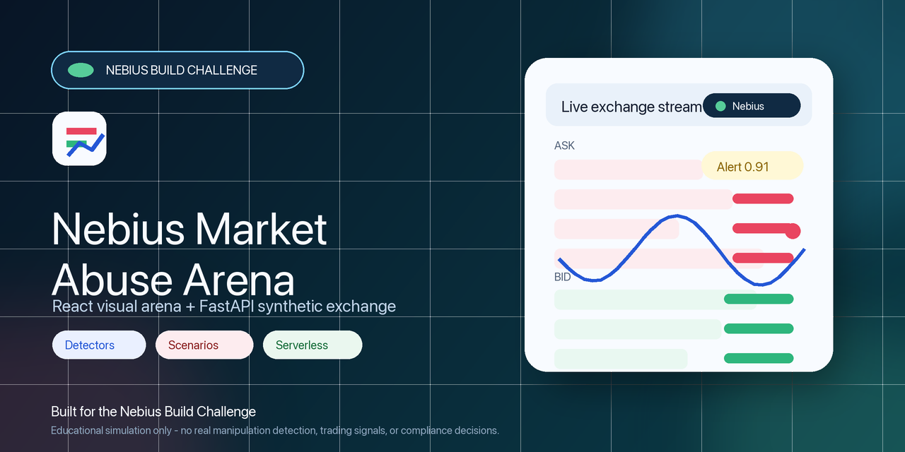

# Nebius Market Abuse Arena



A research and performance engineering workspace for synthetic order-book market abuse detection, live visualization, benchmark runs, and AI-generated incident explanations.

## Disclaimer

This project is an educational simulation. It does not detect real market manipulation, does not provide trading signals, and should not be used for compliance decisions. The scenarios are synthetic “abuse-like” patterns designed to demonstrate order-book anomaly detection and AI-generated explanations.

## Repository structure

- `backend/` - FastAPI demo backend, simulator, detectors, reports, and local storage
- `frontend/` - Vite React UI for the live arena and benchmark views
- `serverless/` - Nebius serverless endpoint and batch job scaffolds
- `docs/` - architecture, deployment, benchmark, safety, and research notes
- `assets/` - research articles, screenshots, diagrams, and demo-video assets
- `data/` - sample input data for local testing and demos
- `outputs/` - generated logs, incidents, reports, and benchmark artifacts

## Getting started

1. Clone the repository:
   ```bash
   git clone https://github.com/khab40/nebius-market-abuse-arena.git
   ```
2. Install dependencies and configure your environment.
3. Copy `.env.example` to `.env` and add any required local values.
4. Start the full local stack:
   ```bash
   docker compose up --build
   ```

## Development

- Backend: `make backend-dev`
- Frontend: `make frontend-dev`
- Tests: `make backend-test`
- Batch benchmark scaffold: `make serverless-benchmark`

## Documentation

See the `docs/` folder for project documentation and notes:

- [High-Level Architecture](docs/architecture.md)
- [Runtime Model](docs/runtime-model.md)
- [Challenge Submission](docs/challenge-submission.md)
- [Nebius Deployment](docs/nebius-deployment.md)
- [Benchmark Methodology](docs/benchmark-methodology.md)
- [Research Notes](docs/research-notes.md)
- [Safety and Disclaimers](docs/safety-and-disclaimers.md)
