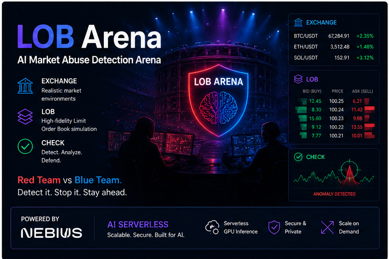
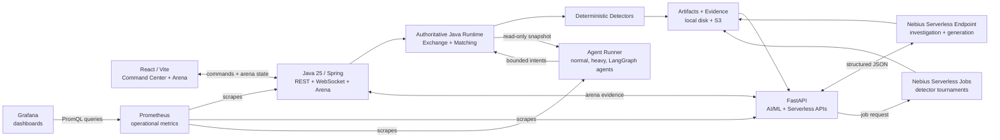

# LOB Arena

**Adversarial Synthetic Market Simulation for Surveillance Benchmarking**



<p align="center">
  <a href="https://github.com/khab40/lob-arena"></a>
  <a href="https://github.com/khab40/lob-arena/actions/workflows/ci.yml"></a>
  <a href="https://github.com/nebius"></a>
  <a href="https://github.com/python/cpython"></a>
  <a href="https://github.com/fastapi/fastapi"></a>
  <a href="https://github.com/facebook/react"></a>
  <a href="https://github.com/vitejs/vite"></a>
  <a href="https://github.com/vllm-project/vllm"></a>
  <a href="https://github.com/langchain-ai/langgraph"></a>
  <a href="https://github.com/docker/compose"></a>
  <a href="https://github.com/kubernetes/kubernetes"></a>
</p>

A multi-agent platform that generates realistic synthetic limit-order-book activity and benchmarks market-surveillance systems against adaptive manipulation strategies.

## Problem

Market-surveillance systems need realistic, labeled abuse scenarios to measure detection quality. Real order-flow data is sensitive, confirmed manipulation examples are scarce, and static test fixtures do not represent strategies that adapt to surveillance controls.

Teams need a reproducible environment where they can generate synthetic limit-order-book activity, exercise detectors, explain alerts, and compare results without using customer or exchange data.

> **Safety boundary:** LOB Arena is educational and synthetic. It does not detect real manipulation, generate trading signals, or make compliance decisions.

## Solution

LOB Arena combines a live synthetic exchange, bounded multi-agent scenarios, deterministic detectors, AI-assisted investigation, and repeatable detector tournaments.

- Generate normal and adversarial order-book activity with explicit ground-truth labels.
- Run deterministic detectors before any LLM explanation is requested.
- Investigate structured evidence through a vLLM-backed Nebius Serverless AI Endpoint.
- Benchmark precision, recall, F1, false positives, and detection latency locally or with Nebius Serverless Jobs.
- Preserve reports, metrics, logs, and artifacts in checksum-verified evidence bundles.
- Run the complete reviewer workflow in Local Mock mode without cloud credentials.

| Workflow | Runtime | Output |
| --- | --- | --- |
| Local Mock demo | Laptop + Docker Compose | Synthetic incidents and deterministic reports |
| Endpoint investigation | Nebius Serverless Endpoint | Structured JSON investigation reports |
| Detector tournament | Local fallback or Nebius Serverless Job | Metrics, leaderboard, benchmark report |
| Evidence sync | Local store + Object Storage | Reviewable artifacts and integrity metadata |

## Architecture



Java is the only writer to the exchange and owns browser WebSocket delivery and runner orchestration. Agents receive read-only market snapshots and return bounded decisions. Python is retained for AI/ML, LangGraph-capable runner work, experiments, and serverless components; the LLM receives summarized evidence rather than raw order-book streams.

Prometheus and Grafana form an optional, read-only observability plane; neither is
in the simulation or detector decision path. Prometheus scrapes operational
metrics from Java Spring Actuator, FastAPI, and the agent runner every 15 seconds
and stores the resulting time series. Grafana queries Prometheus and presents
provisioned dashboards for end-to-end health, Java/JVM behavior, component
latency, and bottleneck isolation. These runtime signals complement—but do not
replace—the precision, recall, F1, and latency artifacts produced by detector
tournaments.

```text
backend/          FastAPI AI/ML, experiments, serverless, and evidence APIs
java/             Java 25 arena, exchange kernel, orchestration, REST, and WebSocket
agent-runner/     Out-of-process normal, heavy, and LangGraph agents
frontend/         React UI for the arena, investigations, and tournaments
serverless/       Nebius Endpoint and Job images, prompts, and runners
scripts/          Deployment, evidence, CI, and secret utilities
docs/             Architecture, deployment, safety, and benchmark docs
outputs/          Commit-safe benchmark artifacts
evidence/         Frozen deployment evidence bundles
```

## Screenshots

| Runtime and cloud status | AI Investigation Team |
| --- | --- |
|  |  |

| Detector Tournament | Execution Trace |
| --- | --- |
|  |  |

## Quick start

```bash
git clone https://github.com/khab40/lob-arena.git
cd lob-arena
cp .env.example .env
docker compose up --build
```

Open:

- Frontend: http://localhost:5173
- Retained Python AI API: http://localhost:8000
- Java control plane: http://localhost:8081/api/kernel/status
- Same-origin WebSocket: ws://localhost:5173/ws/arena

The default Compose path builds `java-kernel`, `agent-runner`, `backend`, and `frontend` from source with serverless access disabled and `NEBIUS_ENDPOINT_MODE=mock`. Java owns the deterministic kernel, live arena, scenarios, detectors, incidents, orchestration, REST controls, and WebSocket. Python retains AI/ML, experiments, and serverless work. Local Mock requires no Nebius credentials, private images, or GPU/vLLM runtime. The backend entrypoint clears stale endpoint, job-command, and object-storage values unless `NEBIUS_SERVERLESS_ENABLED=true`.

### Historical and hybrid replay

The Java exchange replays both existing `canonical_csv_v1` order events and
LOBSTER message/order-book imports through the same integer matching engine used
by synthetic runs. LOBSTER ingestion remains the existing paired-file workflow:
the Python adapter validates the public six-column message and `4 × depth`
order-book formats, writes aligned Parquet plus a checksummed manifest, and the
Java exchange reconstructs each contemporaneous book state from that immutable
stream.

The small public [LOBSTER-compatible fixture](data/lobster/README.md) contains
synthetic test records covering add, partial cancel, delete, visible/hidden
execution, cross trade, and halt messages. It can be imported from **Data
Ingestion** without redistributing licensed market data. The older
[canonical CSV fixture](data/historical/README.md) remains supported.

In the Arena UI:

1. Import a LOBSTER pair in **Data Ingestion**.
2. Select **Historical control**, choose the imported dataset, load it, and
   start replay for an unlabeled control run.
3. Select **Hybrid + attacks**, load the same dataset, then launch the existing
   spoofing-like or layering-like attack from **Scenario Setup**. Attacks are
   intentionally launched from the UI/API after the replay source is loaded;
   the historical importer never creates attacks or labels.

Historical records are immutable and never become benign ground truth. Only the synthetic overlay supplies attack labels, and detector features do not contain scenario labels or synthetic-only metadata. Historical and synthetic participant/order IDs use separate `HIST:` and `SYN:` namespaces.

At each replay step, records are ordered by exchange timestamp, historical
phase, source priority, actor ID, source sequence, and insertion sequence.
Historical records therefore win equal-timestamp ties; the attack generator
then reads only the reconstructed live book. It never reads a future Parquet
row. The attack seed is derived from the configured master seed, dataset,
scenario family, and deterministic scenario number. Synthetic-only runs keep
their previous fixed behavior.

Example request bodies are committed as
[historical-control.json](configs/replay/historical-control.json) and
[hybrid-with-ui-attack.json](configs/replay/hybrid-with-ui-attack.json). Load
one with:

```bash
curl -sS -X POST http://localhost:8081/api/arena/data-source \
  -H 'Content-Type: application/json' \
  --data @configs/replay/historical-control.json
```

The Java comparison endpoint executes both modes over the same source:

```bash
curl -sS -X POST http://localhost:8081/api/arena/replay-comparison \
  -H 'Content-Type: application/json' \
  -d '{"dataset_id":"sample-btcusdt-0945","scenario_family":"spoofing_like_wall","master_seed":42,"max_ticks":10000}'
```

To reuse the tournament precision/recall/F1 calculation and create a checksummed artifact bundle:

```bash
backend/.venv/bin/python scripts/run_historical_replay_comparison.py \
  --base-url http://localhost:8081 \
  --dataset sample-btcusdt-0945 \
  --scenario spoofing_like_wall \
  --master-seed 42 \
  --output outputs/historical-replay/sample-btcusdt-0945
```

The bundle contains `control.json`, `hybrid.json`, `comparison.json`,
`manifest.json`, and `checksums.sha256`. It records full-stream, historical-only,
and synthetic-only hashes, source/event counts, detector alerts, TP/FN/FP/TN,
precision, recall, F1, and basic final-book realism deltas.

Known limitation: LOBSTER exposes aggregate depth snapshots but not participant
identity, and selected windows can begin after orders were originally entered.
The replay therefore represents historical liquidity as deterministic
per-price `HIST:` level orders while preserving every source message sequence
and its aligned post-event snapshot. Synthetic orders remain separate and
retain their own lifecycle. This is deterministic and faithful at the visible
depth supplied by LOBSTER, but it cannot recover queue priority or participant
identity absent from the source files.
Injection granularity is the configured replay batch
(`LOB_ARENA_HISTORICAL_ROWS_PER_TICK`, default `250`); within a batch every
historical message is applied in source order before the synthetic attack reads
the resulting live book.

Architecture decisions are recorded in
[ARD-0022](docs/architecture/ARD-0022-historical-market-data-ingestion.md) for
ingestion/storage and
[ARD-0023](docs/architecture/ARD-0023-hybrid-historical-replay.md) for hybrid
ordering, provenance, seed derivation, label isolation, metrics, and artifacts.

Compose options can be combined:

| Runtime | Command |
| --- | --- |
| Core only | `docker compose up --build` |
| Core + Prometheus | `docker compose --profile prometheus up --build` |
| Core + Prometheus + Grafana | `docker compose --profile grafana up --build` |
| Core + Nebius Serverless | `make docker-up-serverless` |
| Everything | `make docker-up-all` |

The older `monitoring` profile remains an alias for the Prometheus/Grafana pair:

```bash
docker compose --profile monitoring up --build
```

Open Grafana at http://localhost:3000 and Prometheus at http://localhost:9090. Grafana is provisioned with end-to-end, Java, component, bottleneck, and detector-tournament dashboards.

### Role of Prometheus and Grafana

| Component | Role in LOB Arena |
| --- | --- |
| Prometheus | Pulls and stores operational time-series metrics from `java-kernel:8080/actuator/prometheus`, `backend:8000/metrics`, `agent-runner:9100/metrics`, and Prometheus itself. Its target view and PromQL UI help verify scrape health and inspect raw metrics. |
| Grafana | Uses Prometheus as its automatically provisioned datasource and turns those metrics into the `LOB Arena E2E Overview`, `LOB Arena Java Kernel`, `LOB Arena Components`, `LOB Arena Bottlenecks`, and `LOB Arena Detector Tournaments` dashboards. |

Use `--profile prometheus` when raw metrics and PromQL are sufficient. Use
`--profile grafana` when you also want dashboards; this profile starts both
services. Both are opt-in local diagnostics and are not required for a valid
simulation, AI investigation, or detector tournament. See
[Kernel Observability](docs/kernel-observability.md) for the metric sources,
dashboard workflow, and troubleshooting guidance.

Detector-tournament orchestration exposes bounded lifecycle telemetry—runs,
completion status, duration, scenario throughput, in-flight work, and Nebius
artifact collection—through the backend `/metrics` endpoint. The
`LOB Arena Detector Tournaments` dashboard visualizes these signals. Prometheus
does not scrape short-lived tournament processes or use tournament IDs as
labels; detailed leaderboards remain durable artifacts.

## Automated grader

From a fresh checkout of the default `main` branch, run exactly:

```bash
make grader-smoke
```

This credential-free command installs locked dependencies when needed, launches the backend and frontend on local ephemeral ports, submits one fixed-seed Local Mock scenario, and validates backend health, the rendered frontend, detector output, results metrics, event data, and all eight artifacts. It uses temporary output and prints `GRADER_OK` only after every check succeeds. It does not require Docker, cloud credentials, a GPU, or access to Nebius services.


## Hardware Configuration, Runtime, Cost and Expected Outputs

### Hardware Configuration

#### Local Development

| Component | Requirement |
|-----------|-------------|
| CPU | 4+ vCPUs (8 recommended) |
| Memory | 8 GB minimum (16 GB recommended) |
| Disk | 5 GB free |
| Docker | Docker Engine + Docker Compose |
| OS | Linux, macOS or Windows |

The default Local Mock mode does **not** require a GPU or Nebius credentials.

#### Nebius Production Configuration

| Component | Configuration |
|-----------|---------------|
| AI Endpoint | NVIDIA L40S (`gpu-l40s-d`) |
| Endpoint preset | `1gpu-16vcpu-96gb` |
| Model | `Qwen/Qwen2.5-14B-Instruct` |
| Runtime | vLLM |
| Batch execution | Nebius Serverless Jobs (`cpu-d3`, 4 vCPU / 16 GB RAM) |

### Approximate Runtime and Cost

| Workflow | Runtime | Approximate Cost |
|----------|--------:|-----------------:|
| Local Docker demo | 3–5 min | $0 |
| Local detector tournament (10 scenarios) | ~0.7 s | $0 |
| Nebius Serverless Job (5 scenarios) | ~181 s | ~$0.005 |
| Nebius Endpoint investigation (2 requests) | P50 24.2 s / P95 28.8 s | ~$0.023 |

Measured on representative production runs. Actual runtime and billing depend on model, startup latency and current Nebius pricing.

### Expected Outputs

Running the end-to-end demo produces:

**Interactive outputs**

- Synthetic market abuse scenario
- Order-book replay
- Detector alerts
- AI Investigation Team report
- Detector Tournament leaderboard
- Execution trace

**Generated artifacts**

Artifacts are written under `outputs/serverless-smoke/`, including:

- `summary.json`
- `scenario.json`
- `simulation_events.json`
- `detector_alerts.json`
- `investigation_report.md`
- `tournament_result.json`
- `serverless_job.json`
- `manifest.json`

Benchmark execution additionally produces metrics, leaderboard reports, manifests and checksum-verified evidence bundles under `outputs/benchmark/` and `evidence/`.


## Demo

**Video walkthrough:** [LOB Arena — real Nebius cloud E2E demo](https://youtu.be/PZOrEwa4lqg)

1. Open the AI Command Center.
2. Run the Serverless E2E demo.
3. Review the generated scenario and order-book events.
4. Inspect detector alerts and incident evidence.
5. Run the AI Investigation Team.
6. Run or inspect the Detector Tournament.
7. Open synchronized artifacts and evidence records.

Generated local demo artifacts are written under `outputs/serverless-smoke/`.

## Evidence

The public evidence is sanitized and checksum-verified: credentials, bearer tokens, signed URLs, and private Endpoint hostnames are excluded.

- [Challenge submission index](docs/challenge-submission.md)
- [Manual Nebius Control Panel evidence (100-workload Job + 12 real Endpoint calls)](evidence/manual-ui-2026-07-15/README.md)
- [Six-job production E2E evidence (1,200 workloads)](evidence/production-e2e-2026-07-15/README.md)
- [Production L40S/vLLM Endpoint evidence (25 real calls)](evidence/production-endpoint-2026-07-15/README.md)
- [Representative scenario benchmark](evidence/deployment-2026-07-14-1412/representative-scenario-benchmark.md)
- [Frozen benchmark bundle](evidence/deployment-2026-07-14-1412/benchmarks/outputs/benchmark/EXP-390EFAC2/README.md)
- [Frozen Nebius deployment bundle](evidence/deployment-2026-07-14-1412/README.md)

The corrected production evidence records six completed Nebius Jobs with 1,200 disjoint-seed workloads plus 25 real L40S/vLLM Endpoint calls. A separate manual Control Panel session adds one completed 100-workload Job, 12,414 events, seven AI investigation reports, 12 real Endpoint calls, and synchronized Object Storage artifacts.

Freeze a new local evidence snapshot with `./scripts/freeze-release.sh`; add `--offline` when Docker, the backend, or Nebius CLI is unavailable.

## Nebius Cloud

Real cloud execution is opt-in. Configure the variables below, confirm that `$HOME/.nebius` contains `config.yaml` and `credentials.yaml`, and review [docs/nebius-deployment.md](docs/nebius-deployment.md):

```bash
NEBIUS_SERVERLESS_ENABLED=true \
NEBIUS_CLI_CONFIG_DIR="$HOME/.nebius" \
docker compose up --build
```

Add `--profile prometheus` for metrics only or `--profile grafana` for the full dashboard stack. `make docker-up-serverless` and `make docker-up-all` are equivalent shortcuts.

Core variables:

```bash
NEBIUS_SERVERLESS_ENABLED=true
NEBIUS_CLI_CONFIG_DIR=/absolute/path/to/.nebius
ENDPOINT_TOKEN=endpoint-auth-token
NEBIUS_ENDPOINT_BASE_URL=https://your-nebius-endpoint
NEBIUS_ENDPOINT_MODE=local_vllm
NEBIUS_ENDPOINT_PLATFORM=gpu-l40s-d
NEBIUS_ENDPOINT_PRESET=1gpu-16vcpu-96gb
LOCAL_VLLM_MODEL=Qwen/Qwen2.5-14B-Instruct
NEBIUS_JOB_IMAGE=ghcr.io/khab40/lob-arena-jobs:<tag>
NEBIUS_JOB_SUBMIT_COMMAND_TEMPLATE='...'
NEBIUS_JOB_STATUS_COMMAND_TEMPLATE='...'
NEBIUS_JOB_ARTIFACTS_COMMAND_TEMPLATE='...'
NEBIUS_JOB_OUTPUT_URI=s3://...
```

If Job command templates are missing, the backend records `real_nebius_pending` instead of pretending a cloud run completed.

## Development

CI validates retained Python tests and Ruff, frontend lint/build, the authoritative Java 25 kernel and live control plane, deterministic CPU evaluation, agent workspace contracts, Compose config, application Docker images, and Gitleaks. It intentionally does not build long-running Nebius Endpoint/Job images and does not run GPU/vLLM inference.

Run the main checks locally:

```bash
uv sync --project backend --dev --frozen
PYTHONPATH=. uv run --project backend ruff check backend serverless scripts
PYTHONPATH=. uv run --project backend pytest -c backend/pyproject.toml backend/tests
(cd frontend && corepack enable && pnpm install --frozen-lockfile && pnpm run lint && pnpm run build)
(cd java && ./gradlew clean check)
docker compose --env-file .env.example config --quiet
./scripts/check-secrets.sh
```

Common dev commands:

```bash
make grader-smoke
make backend-dev
make frontend-dev
make backend-test
make serverless-benchmark
make secrets-plan
make secrets-check
```

## Documentation

| Topic | File |
| --- | --- |
| Quick start | [docs/QUICKSTART.md](docs/QUICKSTART.md) |
| Architecture | [docs/architecture.md](docs/architecture.md) |
| Architecture decisions | [docs/architecture/README.md](docs/architecture/README.md) |
| Runtime model | [docs/runtime-model.md](docs/runtime-model.md) |
| Prometheus and Grafana observability | [docs/kernel-observability.md](docs/kernel-observability.md) |
| Benchmark methodology | [docs/benchmark-methodology.md](docs/benchmark-methodology.md) |
| Nebius deployment | [docs/nebius-deployment.md](docs/nebius-deployment.md) |
| L40S migration | [docs/l40s-migration.md](docs/l40s-migration.md) |
| Prompting layer | [docs/surveillance-prompting.md](docs/surveillance-prompting.md) |
| Safety | [docs/safety-and-disclaimers.md](docs/safety-and-disclaimers.md) |
| Challenge submission | [docs/challenge-submission.md](docs/challenge-submission.md) |
| Documentation guide | [docs/DOCUMENTATION_GUIDE.md](docs/DOCUMENTATION_GUIDE.md) |

## Maintainer Notes

- Keep README concise; put detailed API examples in docs.
- Keep local fallback honest and explicitly labeled.
- Do not commit credentials, private endpoints, signed URLs, or unredacted cloud logs.
- Never print or attach `.env`; inspect only named non-secret keys and use `docker compose config --quiet` for validation.
- Run `./scripts/check-secrets.sh` before publishing evidence.
