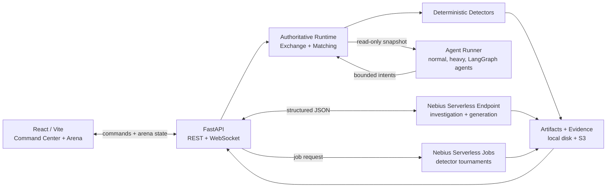

# LOB Arena

**Adversarial Synthetic Market Simulation for Surveillance Benchmarking**


<p align="center">
  <a href="https://github.com/khab40/lob-arena"></a>
  <a href="https://github.com/khab40/lob-arena/actions/workflows/ci.yml"></a>
  <a href="https://github.com/nebius"></a>
  <a href="https://github.com/python/cpython"></a>
  <a href="https://github.com/fastapi/fastapi"></a>
  <a href="https://github.com/facebook/react"></a>
  <a href="https://github.com/vitejs/vite"></a>
  <a href="https://github.com/vllm-project/vllm"></a>
  <a href="https://github.com/langchain-ai/langgraph"></a>
  <a href="https://github.com/docker/compose"></a>
  <a href="https://github.com/kubernetes/kubernetes"></a>
</p>

A multi-agent platform that generates realistic synthetic limit-order-book activity and benchmarks market-surveillance systems against adaptive manipulation strategies.

## Problem

Market-surveillance systems need realistic, labeled abuse scenarios to measure detection quality. Real order-flow data is sensitive, confirmed manipulation examples are scarce, and static test fixtures do not represent strategies that adapt to surveillance controls.

Teams need a reproducible environment where they can generate synthetic limit-order-book activity, exercise detectors, explain alerts, and compare results without using customer or exchange data.

> **Safety boundary:** LOB Arena is educational and synthetic. It does not detect real manipulation, generate trading signals, or make compliance decisions.

## Solution

LOB Arena combines a live synthetic exchange, bounded multi-agent scenarios, deterministic detectors, AI-assisted investigation, and repeatable detector tournaments.

- Generate normal and adversarial order-book activity with explicit ground-truth labels.
- Run deterministic detectors before any LLM explanation is requested.
- Investigate structured evidence through a vLLM-backed Nebius Serverless AI Endpoint.
- Benchmark precision, recall, F1, false positives, and detection latency locally or with Nebius Serverless Jobs.
- Preserve reports, metrics, logs, and artifacts in checksum-verified evidence bundles.
- Run the complete reviewer workflow in Local Mock mode without cloud credentials.

| Workflow | Runtime | Output |
| --- | --- | --- |
| Local Mock demo | Laptop + Docker Compose | Synthetic incidents and deterministic reports |
| Endpoint investigation | Nebius Serverless Endpoint | Structured JSON investigation reports |
| Detector tournament | Local fallback or Nebius Serverless Job | Metrics, leaderboard, benchmark report |
| Evidence sync | Local store + Object Storage | Reviewable artifacts and integrity metadata |

## Architecture



The backend is the only writer to the exchange. Agents receive read-only market snapshots and return bounded decisions. Detectors run deterministically over synthetic market state; the LLM receives summarized evidence rather than raw order-book streams.

```text
backend/          FastAPI simulator, detectors, experiments, evidence APIs
agent-runner/     Out-of-process normal, heavy, and LangGraph agents
frontend/         React UI for the arena, investigations, and tournaments
serverless/       Nebius Endpoint and Job images, prompts, and runners
scripts/          Deployment, evidence, CI, and secret utilities
docs/             Architecture, deployment, safety, and benchmark docs
outputs/          Commit-safe benchmark artifacts
evidence/         Frozen deployment evidence bundles
```

## Screenshots

| Runtime and cloud status | AI Investigation Team |
| --- | --- |
|  |  |

| Detector Tournament | Execution Trace |
| --- | --- |
|  |  |

## Quick start

```bash
git clone https://github.com/khab40/lob-arena.git
cd lob-arena
cp .env.example .env
docker compose up --build
```

Open:

- Frontend: http://localhost:5173
- Backend: http://localhost:8000
- WebSocket: ws://localhost:8000/ws/arena

The default Compose path builds `agent-runner`, `backend`, and `frontend` from source with `NEBIUS_ENDPOINT_MODE=mock`. Local Mock requires no Nebius credentials, private images, or GPU/vLLM runtime. Cloud calls use deterministic local fallback unless Nebius Cloud mode is explicitly configured.


## Hardware Configuration, Runtime, Cost and Expected Outputs

### Hardware Configuration

#### Local Development

| Component | Requirement |
|-----------|-------------|
| CPU | 4+ vCPUs (8 recommended) |
| Memory | 8 GB minimum (16 GB recommended) |
| Disk | 5 GB free |
| Docker | Docker Engine + Docker Compose |
| OS | Linux, macOS or Windows |

The default Local Mock mode does **not** require a GPU or Nebius credentials.

#### Nebius Production Configuration

| Component | Configuration |
|-----------|---------------|
| AI Endpoint | NVIDIA L40S (`gpu-l40s-g`) |
| Endpoint preset | `1gpu-16vcpu-200gb` |
| Model | `Qwen/Qwen2.5-14B-Instruct` |
| Runtime | vLLM |
| Batch execution | Nebius Serverless Jobs (`cpu-d3`, 4 vCPU / 16 GB RAM) |

### Approximate Runtime and Cost

| Workflow | Runtime | Approximate Cost |
|----------|--------:|-----------------:|
| Local Docker demo | 3–5 min | $0 |
| Local detector tournament (10 scenarios) | ~0.7 s | $0 |
| Nebius Serverless Job (5 scenarios) | ~181 s | ~$0.005 |
| Nebius Endpoint investigation (2 requests) | P50 24.2 s / P95 28.8 s | ~$0.023 |

Measured on representative production runs. Actual runtime and billing depend on model, startup latency and current Nebius pricing.

### Expected Outputs

Running the end-to-end demo produces:

**Interactive outputs**

- Synthetic market abuse scenario
- Order-book replay
- Detector alerts
- AI Investigation Team report
- Detector Tournament leaderboard
- Execution trace

**Generated artifacts**

Artifacts are written under `outputs/serverless-smoke/`, including:

- `summary.json`
- `scenario.json`
- `simulation_events.json`
- `detector_alerts.json`
- `investigation_report.md`
- `tournament_result.json`
- `serverless_job.json`
- `manifest.json`

Benchmark execution additionally produces metrics, leaderboard reports, manifests and checksum-verified evidence bundles under `outputs/benchmark/` and `evidence/`.


## Demo

1. Open the AI Command Center.
2. Run the Serverless E2E demo.
3. Review the generated scenario and order-book events.
4. Inspect detector alerts and incident evidence.
5. Run the AI Investigation Team.
6. Run or inspect the Detector Tournament.
7. Open synchronized artifacts and evidence records.

Generated local demo artifacts are written under `outputs/serverless-smoke/`.

## Evidence

The public evidence is sanitized and checksum-verified: credentials, bearer tokens, signed URLs, and private Endpoint hostnames are excluded.

- [Challenge submission index](docs/challenge-submission.md)
- [Representative scenario benchmark](evidence/deployment-2026-07-14-1412/representative-scenario-benchmark.md)
- [Committed benchmark bundle](outputs/benchmark/EXP-18E88EAF/README.md)
- [Frozen Nebius deployment bundle](evidence/deployment-2026-07-14-1412/README.md)

The latest bundle records Job `aijob-e00q7cdpz32jyk0bsg`, experiment `EXP-18E88EAF`, two successful Endpoint calls, and synchronized artifacts.

Freeze a new local evidence snapshot with `./scripts/freeze-release.sh`; add `--offline` when Docker, the backend, or Nebius CLI is unavailable.

## Nebius Cloud

Real cloud execution is opt-in. Use the override only after configuring Nebius credentials and reviewing [docs/nebius-deployment.md](docs/nebius-deployment.md):

```bash
docker compose -f docker-compose.yml -f docker-compose.nebius.yml up --build
```

Core variables:

```bash
ENDPOINT_TOKEN=endpoint-auth-token
NEBIUS_ENDPOINT_BASE_URL=https://your-nebius-endpoint
NEBIUS_ENDPOINT_MODE=local_vllm
NEBIUS_ENDPOINT_PLATFORM=gpu-l40s-g
NEBIUS_ENDPOINT_PRESET=1gpu-16vcpu-200gb
LOCAL_VLLM_MODEL=Qwen/Qwen2.5-14B-Instruct
NEBIUS_JOB_IMAGE=ghcr.io/khab40/lob-arena-jobs:<tag>
NEBIUS_JOB_SUBMIT_COMMAND_TEMPLATE='...'
NEBIUS_JOB_STATUS_COMMAND_TEMPLATE='...'
NEBIUS_JOB_ARTIFACTS_COMMAND_TEMPLATE='...'
NEBIUS_JOB_OUTPUT_URI=s3://...
```

If Job command templates are missing, the backend records `real_nebius_pending` instead of pretending a cloud run completed.

## Development

CI validates backend tests, Ruff, frontend lint/build, deterministic CPU evaluation, agent workspace contracts, Compose config, application Docker images, and Gitleaks. It intentionally does not build long-running Nebius Endpoint/Job images and does not run GPU/vLLM inference.

Run the main checks locally:

```bash
uv sync --project backend --dev --frozen
PYTHONPATH=. uv run --project backend ruff check backend serverless scripts
PYTHONPATH=. uv run --project backend pytest -c backend/pyproject.toml backend/tests
(cd frontend && npm ci && npm run lint && npm run build)
docker compose --env-file .env.example config --quiet
./scripts/check-secrets.sh
```

Common dev commands:

```bash
make backend-dev
make frontend-dev
make backend-test
make serverless-benchmark
make secrets-plan
make secrets-check
```

## Documentation

| Topic | File |
| --- | --- |
| Quick start | [docs/QUICKSTART.md](docs/QUICKSTART.md) |
| Architecture | [docs/architecture.md](docs/architecture.md) |
| Architecture decisions | [docs/architecture/README.md](docs/architecture/README.md) |
| Runtime model | [docs/runtime-model.md](docs/runtime-model.md) |
| Benchmark methodology | [docs/benchmark-methodology.md](docs/benchmark-methodology.md) |
| Nebius deployment | [docs/nebius-deployment.md](docs/nebius-deployment.md) |
| L40S migration | [docs/l40s-migration.md](docs/l40s-migration.md) |
| Prompting layer | [docs/surveillance-prompting.md](docs/surveillance-prompting.md) |
| Safety | [docs/safety-and-disclaimers.md](docs/safety-and-disclaimers.md) |
| Challenge submission | [docs/challenge-submission.md](docs/challenge-submission.md) |
| Documentation guide | [docs/DOCUMENTATION_GUIDE.md](docs/DOCUMENTATION_GUIDE.md) |

## Maintainer Notes

- Keep README concise; put detailed API examples in docs.
- Keep local fallback honest and explicitly labeled.
- Do not commit credentials, private endpoints, signed URLs, or unredacted cloud logs.
- Run `./scripts/check-secrets.sh` before publishing evidence.
