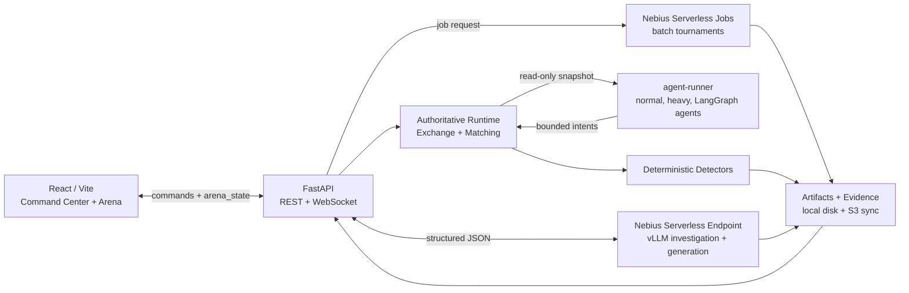

# AIMADA

## AI Market Abuse Detection Arena


<p align="center">
  <a href="https://github.com/khab40/aimada"></a>
  <a href="https://github.com/khab40/aimada/actions/workflows/ci.yml"></a>
  <a href="https://github.com/nebius"></a>
  <a href="https://github.com/python/cpython"></a>
  <a href="https://github.com/fastapi/fastapi"></a>
  <a href="https://github.com/facebook/react"></a>
  <a href="https://github.com/vitejs/vite"></a>
  <a href="https://github.com/vllm-project/vllm"></a>
  <a href="https://github.com/langchain-ai/langgraph"></a>
  <a href="https://github.com/docker/compose"></a>
  <a href="https://github.com/kubernetes/kubernetes"></a>
</p>

AIMADA is a synthetic market-abuse simulation and evaluation arena built around Nebius Serverless AI. It runs bounded order-book scenarios, deterministic detectors, AI-assisted investigations, and repeatable detector tournaments without using real trading data.

Safety boundary: AIMADA is educational and synthetic. It does not detect real manipulation, does not generate trading signals, and is not suitable for compliance decisions.

Key links:

- [Challenge submission](docs/challenge-submission.md)
- [Production Nebius evidence](evidence/deployment-2026-07-14-1412/README.md)
- [Committed benchmark evidence](outputs/benchmark/EXP-18E88EAF/README.md)
- [Quick start](docs/QUICKSTART.md)
- [Nebius deployment](docs/nebius-deployment.md)
- [LinkedIn technical article draft](docs/linkedin-technical-blog-post.md)

## What AIMADA Demonstrates

- Interactive investigation through a vLLM-backed Nebius Serverless AI Endpoint.
- Batch detector tournaments through Nebius Serverless Jobs.
- Deterministic detectors that produce structured evidence before any LLM explanation.
- A React/FastAPI live arena with an authoritative backend exchange and bounded agents.
- S3-compatible evidence archival, backend synchronization, UI artifact links, and commit-safe evidence bundles.
- Local Docker fallback with the same response shapes, so reviewers can reproduce the workflow without private cloud credentials.

## Screenshots

| Runtime and cloud status | AI Investigation Team |
| --- | --- |
|  |  |

| Detector Tournament | Execution Trace |
| --- | --- |
|  |  |

## Quick Start

```bash
git clone https://github.com/khab40/aimada.git
cd aimada
cp .env.example .env
docker compose up --build
```

Open:

- Frontend: http://localhost:5173
- Backend: http://localhost:8000
- WebSocket: ws://localhost:8000/ws/arena

The default Compose path builds `agent-runner`, `backend`, and `frontend` from source. It does not require Nebius credentials, does not pull private GHCR images, and does not start GPU/vLLM work. Cloud calls use deterministic local fallback unless real Nebius mode is explicitly configured.

## Recommended Demo Flow

1. Open the AI Command Center.
2. Run the Serverless E2E demo.
3. Review the generated scenario and order-book events.
4. Inspect detector alerts and incident evidence.
5. Run the AI Investigation Team.
6. Run or inspect the Detector Tournament.
7. Open synchronized artifacts and evidence records.

Generated local demo artifacts are written under `outputs/serverless-smoke/`.

## Architecture



The backend is the only writer to the exchange. Agents receive read-only market snapshots and return bounded `AgentIntent` decisions. Detectors run deterministically over synthetic market state. The LLM receives summarized evidence, not raw order-book streams.

## Main Workflows

| Workflow | Infrastructure | Output |
| --- | --- | --- |
| Local mock demo | Laptop + Docker Compose | Demo artifacts, deterministic reports |
| Endpoint investigation | Nebius Serverless Endpoint, vLLM, Qwen2.5-14B | Structured JSON investigation reports |
| Detector tournament | Nebius Serverless Job or local fallback | Metrics, leaderboard, benchmark report |
| Evidence sync | Object Storage + backend local store | Downloadable UI evidence and artifacts |

Measured publication values are recorded in [docs/challenge-submission.md](docs/challenge-submission.md). The latest compact evidence bundle records Job `aijob-e00q7cdpz32jyk0bsg`, experiment `EXP-18E88EAF`, two successful Endpoint calls, and synchronized artifacts.

## Repository Layout

```text
backend/          FastAPI simulator, detectors, experiments, evidence APIs
agent-runner/     Out-of-process normal, heavy, and LangGraph agent workspace
frontend/         Vite React UI for arena, investigations, tournaments, evidence
serverless/       Nebius Endpoint and Job images, configs, prompts, runners
scripts/          Deployment, evidence, CI, and secret-rotation utilities
docs/             Architecture, deployment, safety, benchmark, submission docs
assets/           Banner, screenshots, article visuals, demo scripts
outputs/          Commit-safe benchmark evidence plus local generated artifacts
evidence/         Frozen deployment evidence bundles
```

## Real Nebius Mode

Real cloud execution is opt-in. Use the override only after configuring Nebius credentials and reviewing [docs/nebius-deployment.md](docs/nebius-deployment.md):

```bash
docker compose -f docker-compose.yml -f docker-compose.nebius.yml up --build
```

Core variables:

```bash
ENDPOINT_TOKEN=endpoint-auth-token
NEBIUS_ENDPOINT_BASE_URL=https://your-nebius-endpoint
NEBIUS_ENDPOINT_MODE=local_vllm
NEBIUS_ENDPOINT_PLATFORM=gpu-l40s-g
NEBIUS_ENDPOINT_PRESET=1gpu-16vcpu-200gb
LOCAL_VLLM_MODEL=Qwen/Qwen2.5-14B-Instruct
NEBIUS_JOB_IMAGE=ghcr.io/khab40/ai-market-abuse-detection-arena-jobs:<tag>
NEBIUS_JOB_SUBMIT_COMMAND_TEMPLATE='...'
NEBIUS_JOB_STATUS_COMMAND_TEMPLATE='...'
NEBIUS_JOB_ARTIFACTS_COMMAND_TEMPLATE='...'
NEBIUS_JOB_OUTPUT_URI=s3://...
```

If Job command templates are missing, the backend records `real_nebius_pending` instead of pretending a cloud run completed.

## Evidence and Reproducibility

Publication evidence is intentionally sanitized:

- no credentials;
- no bearer tokens;
- no signed S3 URLs;
- no private Endpoint hostnames in public bundles;
- checksums for committed evidence files.

Useful entry points:

- [Representative scenario benchmark](evidence/deployment-2026-07-14-1412/representative-scenario-benchmark.md)
- [Fresh benchmark bundle](outputs/benchmark/EXP-18E88EAF/README.md)
- [Frozen deployment bundle](evidence/deployment-2026-07-14-1412/README.md)
- [Challenge submission index](docs/challenge-submission.md)

Freeze a new local evidence snapshot:

```bash
./scripts/freeze-release.sh
```

Use `--offline` when Docker, the backend, or Nebius CLI is unavailable.

## Development

CI validates backend tests, Ruff, frontend lint/build, deterministic CPU evaluation, agent workspace contracts, Compose config, application Docker images, and Gitleaks. It intentionally does not build long-running Nebius Endpoint/Job images and does not run GPU/vLLM inference.

Run the main checks locally:

```bash
uv sync --project backend --dev --frozen
PYTHONPATH=. uv run --project backend ruff check backend serverless scripts
PYTHONPATH=. uv run --project backend pytest -c backend/pyproject.toml backend/tests
(cd frontend && npm ci && npm run lint && npm run build)
docker compose --env-file .env.example config --quiet
./scripts/check-secrets.sh
```

Common dev commands:

```bash
make backend-dev
make frontend-dev
make backend-test
make serverless-benchmark
make secrets-plan
make secrets-check
```

## Documentation

| Topic | File |
| --- | --- |
| Quick start | [docs/QUICKSTART.md](docs/QUICKSTART.md) |
| Architecture | [docs/architecture.md](docs/architecture.md) |
| Architecture decisions | [docs/architecture/README.md](docs/architecture/README.md) |
| Runtime model | [docs/runtime-model.md](docs/runtime-model.md) |
| Benchmark methodology | [docs/benchmark-methodology.md](docs/benchmark-methodology.md) |
| Nebius deployment | [docs/nebius-deployment.md](docs/nebius-deployment.md) |
| L40S migration | [docs/l40s-migration.md](docs/l40s-migration.md) |
| Prompting layer | [docs/surveillance-prompting.md](docs/surveillance-prompting.md) |
| Safety | [docs/safety-and-disclaimers.md](docs/safety-and-disclaimers.md) |
| Challenge submission | [docs/challenge-submission.md](docs/challenge-submission.md) |
| Documentation guide | [docs/DOCUMENTATION_GUIDE.md](docs/DOCUMENTATION_GUIDE.md) |

## Maintainer Notes

- Keep README concise; put detailed API examples in docs.
- Keep local fallback honest and explicitly labeled.
- Do not commit credentials, private endpoints, signed URLs, or unredacted cloud logs.
- Run `./scripts/check-secrets.sh` before publishing evidence.
