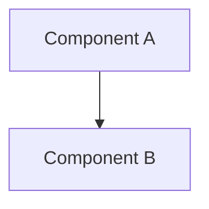

# Documentation Guide

This guide explains the documentation structure and conventions for LOB Arena.

## Documentation Structure

```mermaid
graph TD
    Docs["docs"]
    Quickstart["QUICKSTART.md - Get running in 5 minutes"]
    Architecture["architecture.md - System overview"]
    ARDs["architecture - Architecture records"]
    UseCases["USE_CASES.md - Workflow diagrams"]
    Runtime["runtime-model.md - Simulation runtime"]
    Observability["kernel-observability.md - Prometheus and Grafana"]
    Benchmark["benchmark-methodology.md - Detector metrics"]
    Nebius["nebius-deployment.md - Serverless setup"]
    Submission["challenge-submission.md - Submission guide"]
    Ideas["DESIGN-IDEAS.md - Design exploration"]
    Research["research-notes.md - Research background"]
    Safety["safety-and-disclaimers.md - Educational limits"]
    Phases["PHASES.md - Development phases"]

    Docs --> Quickstart
    Docs --> Architecture
    Docs --> ARDs
    Docs --> UseCases
    Docs --> Runtime
    Docs --> Observability
    Docs --> Benchmark
    Docs --> Nebius
    Docs --> Submission
    Docs --> Ideas
    Docs --> Research
    Docs --> Safety
    Docs --> Phases
    ARDs --> ARDIndex["README.md - ARD index"]
    ARDs --> ARDFiles["ARD-NNNN files - Decisions"]
```



## Key Documentation

### Entry Points

1. **For newcomers**: Start with [QUICKSTART.md](QUICKSTART.md)
2. **For architecture understanding**: Start with [architecture.md](architecture.md)
3. **For workflows**: Read [USE_CASES.md](USE_CASES.md)
4. **For deployment**: Read [nebius-deployment.md](nebius-deployment.md)

### Core References

- **[README.md](../README.md)** — Master index and navigation guide
- **[architecture.md](architecture.md)** — System design with component responsibilities and data flow
- **[architecture/README.md](architecture/README.md)** — Index of all Architecture Records
- **[USE_CASES.md](USE_CASES.md)** — Eight primary workflows with business value

### Specialized Topics

- **[runtime-model.md](runtime-model.md)** — How the simulation engine works
- **[kernel-observability.md](kernel-observability.md)** — Prometheus metric collection, Grafana dashboards, and bottleneck diagnosis
- **[java-kernel-migration.md](java-kernel-migration.md)** — Parity-gated Python-reference to Java-kernel migration
- **[architecture/ARD-0020-java-arena-websocket-agent-orchestration.md](architecture/ARD-0020-java-arena-websocket-agent-orchestration.md)** — Java live arena, WebSocket, agent orchestration, and retained Python boundary
- **[architecture/ARD-0022-historical-market-data-ingestion.md](architecture/ARD-0022-historical-market-data-ingestion.md)** — LOBSTER discovery, validation, normalized storage, and dataset registration
- **[architecture/ARD-0023-hybrid-historical-replay.md](architecture/ARD-0023-hybrid-historical-replay.md)** — Deterministic historical/synthetic merge, provenance, labels, metrics, and replay artifacts
- **[hybrid-dataset-validation.md](hybrid-dataset-validation.md)** — LOBSTER invariants, causal-neighbourhood equivalence, signed validation reports, and verification
- **[client-historical-dataset-validation-runbook.md](client-historical-dataset-validation-runbook.md)** — Operational client-data ingestion, signed evidence generation, acceptance gates, and delivery checklist
- **[determinism-contract-v1.md](determinism-contract-v1.md)** — Cross-language numeric, ordering, PRNG, identifier, and exchange rules
- **[canonical-hashing-v1.md](canonical-hashing-v1.md)** — Cross-language canonical bytes and event/book/stream SHA-256 rules
- **[benchmark-methodology.md](benchmark-methodology.md)** — Evaluating detector performance
- **[nebius-deployment.md](nebius-deployment.md)** — Setting up Nebius serverless components
- **[challenge-submission.md](challenge-submission.md)** — Submitting your work
- **[research-notes.md](research-notes.md)** — Market microstructure background
- **[safety-and-disclaimers.md](safety-and-disclaimers.md)** — Educational focus and limitations

## Documentation Principles

### 1. Consistency & Linking

- **All cross-references use markdown links** with relative paths
- **Links are tested** to ensure they work (broken links indicate stale docs)
- **ARDs are linked** from [architecture.md](architecture.md) and [USE_CASES.md](USE_CASES.md)
- **Use cases are mapped** to architecture components in [USE_CASES.md](USE_CASES.md)

### 2. Freshness

- **Architecture is single-source-of-truth**: Changes to architecture.md must propagate to affected ARDs
- **Use cases stay current**: If a workflow changes, update [USE_CASES.md](USE_CASES.md) and audit [architecture.md](architecture.md)
- **ARDs are never deleted**: Superseded decisions are marked `Status: Superseded` with reference to replacement

### 3. Mermaid Diagrams

- **All Mermaid diagrams use conservative `graph TD` or `graph LR` syntax** for broad VS Code compatibility
- **VS Code requires Mermaid preview support**: install the recommended `bierner.markdown-mermaid` extension if diagrams render as code blocks
- **Diagrams are self-contained**: No external dependencies
- **Diagrams include labels** for clarity

Example (proper formatting):


### 4. Navigability

- **Each document links to related documents** at the end
- **README.md is the master index** — it links to all major sections
- **Breadcrumbs**: Use "Related Documentation" sections to show context
- **Visual hierarchy**: Use headings (H1, H2, H3) consistently

## Updating Documentation

### When to Update

| Change | Documents to Update |
|--------|---------------------|
| Architecture changes | [architecture.md](architecture.md), affected ARDs, [USE_CASES.md](USE_CASES.md) |
| New workflow added | [USE_CASES.md](USE_CASES.md), [architecture.md](architecture.md), [README.md](../README.md) |
| API changes | [backend/README.md](../backend/README.md), [QUICKSTART.md](QUICKSTART.md), affected ARDs |
| New ARD created | [architecture/README.md](architecture/README.md), [architecture.md](architecture.md), [USE_CASES.md](USE_CASES.md) |
| UI shell or presentation behavior changes | [DESIGN-IDEAS.md](DESIGN-IDEAS.md), [architecture.md](architecture.md), [USE_CASES.md](USE_CASES.md), affected ARDs |
| Deployment changes | [nebius-deployment.md](nebius-deployment.md), [QUICKSTART.md](QUICKSTART.md) |
| Safety/legal implications | [safety-and-disclaimers.md](safety-and-disclaimers.md) |

### How to Update

1. **Identify the primary document** that owns the change
2. **Update that document first**
3. **Update all dependent documents** (use grep to find references)
4. **Test all markdown links** (VS Code should show link validation)
5. **Verify Mermaid diagrams render** (they appear visually in VS Code)

### Creating a New ARD

1. Copy an existing ARD as a template
2. Follow the format in [architecture/README.md](architecture/README.md)
3. Add to [architecture/README.md](architecture/README.md) index
4. Link from [architecture.md](architecture.md)
5. Add "Related Documentation" linking back to main docs

## Validation Checklist

Use this checklist when making documentation changes:

- [ ] All markdown links are relative paths (no `file://`, no `http://`)
- [ ] All links use proper markdown syntax: `[text](path#section)`
- [ ] No backticks around file names or links
- [ ] Mermaid diagrams render without errors (check in VS Code preview)
- [ ] Architecture-related changes update [architecture.md](architecture.md)
- [ ] Workflow changes update [USE_CASES.md](USE_CASES.md)
- [ ] New sections added to [README.md](../README.md) index
- [ ] "Related Documentation" sections are current
- [ ] No references to files that don't exist
- [ ] No outdated version numbers or dates

## Common Issues & Fixes

### Issue: Broken links in VS Code
**Fix**: Ensure relative paths are correct. Paths should be:
- From current file to target: `../path/file.md`
- Same directory: `file.md`
- Subdirectory: `subdir/file.md`

### Issue: Mermaid diagram not rendering
**Fix**: Check syntax in VS Code markdown preview. Common issues:
- Missing space after `flowchart` keyword
- Unclosed quotes in node labels
- Invalid node references (typos)

### Issue: Documentation doesn't match code
**Fix**: Find the right section using grep:
```bash
grep -r "old_component_name" docs/
```
Then update all occurrences.

### Issue: Stale API endpoints
**Fix**: Compare with `backend/README.md` — if it differs, update both docs.

## Documentation Tools

### View Mermaid Diagrams
- **VS Code**: Built-in markdown preview (Cmd+Shift+V)
- **GitHub**: Automatic rendering in .md files
- **Online**: https://mermaid.live

### Check Links
- **VS Code**: Markdown link validator (built-in)
- **Terminal**: `grep -r "\[.*\](" docs/` to find all links
- **Manual**: Click each link in VS Code preview

### Search Across Docs
```bash
# Find all references to a file
grep -r "USE_CASES.md" docs/

# Find all links in a file
grep -o "\[.*\](.*)" docs/file.md

# Find stale references
grep -r "ARD-0010" docs/  # (if ARD-0010 doesn't exist, this is stale)
```

## Responsibilities

- **Maintainers**: Keep docs current with code changes
- **Contributors**: Update docs when submitting PRs that affect architecture/workflows
- **Reviewers**: Check that docs are updated before approving PRs

## Questions?

If documentation is unclear or missing:
1. Check the index in [README.md](../README.md)
2. Follow the breadcrumb links in "Related Documentation"
3. Check [QUICKSTART.md](QUICKSTART.md) for common tasks
4. Review [USE_CASES.md](USE_CASES.md) for workflows
