# Use Cases

AI Market Abuse Detection Arena is an educational synthetic market simulation for demonstrating order-book anomaly detection, red-team scenario injection, deterministic detector evaluation, and AI Investigator explanations.

This document describes business-style use cases. It does not describe real market surveillance, trading signals, or compliance decisioning.

**For architecture details**, see [High-Level Architecture](architecture.md) and [Architecture Records (ARDs)](architecture/README.md).

## What We Solve

The project solves a demo and evaluation problem: how to make market
microstructure anomaly detection understandable, inspectable, and measurable
without using real market data or claiming real surveillance capability.

We provide:

- a live visual arena where synthetic normal and abuse-like agents act in real time
- deterministic detectors that convert order-book behavior into confidence scores and evidence
- AI Investigator explanations that make detector evidence understandable to a reviewer
- batch benchmarks that measure detector precision, recall, F1, and latency
- synthetic labeled datasets for repeatable experiments
- Google-authenticated demo personas with app-issued JWT sessions for role-aware review
- local UI shell preferences for day/night/system display and compact auth controls
- safety framing that keeps the project educational and non-compliance-oriented

The core business value is not "detect manipulation in production." The value is
to demonstrate a complete engineering workflow for synthetic anomaly detection:
simulate, inject scenarios, detect, explain, benchmark, and report.

## How We Use Nebius Serverless

Nebius is used for two distinct serverless surfaces:

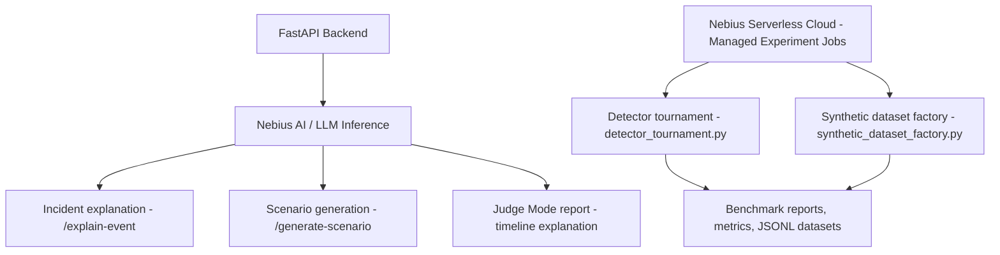

Nebius AI / LLM inference:

- receives compact evidence from the backend
- generates AI Investigator explanations for the Arena UI
- generates bounded red-team scenario drafts for Scenario Generator
- supports Judge Mode timeline explanations
- runs in deterministic mock mode for first wiring and AI mode after deployment

Nebius Serverless Cloud - Managed Experiment jobs:

- run detector tournament benchmarks outside the interactive UI
- generate labeled synthetic datasets
- produce benchmark reports and metrics artifacts
- keep long-running experiment work separate from live demo latency

## Full System

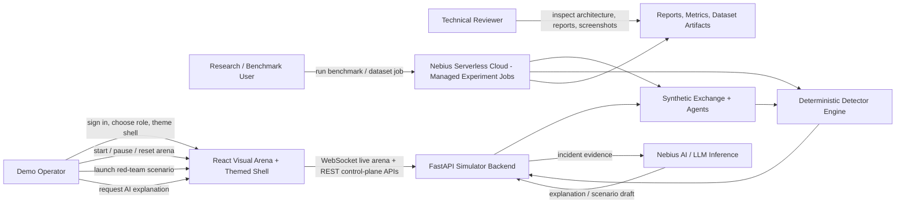

## Use Case Summary

| Use case | Primary actor | Business outcome |
| --- | --- | --- |
| Product Demo | Demo Operator | Launch deterministic Real Nebius AI Run, Two-Model Pipeline, or Streaming Explanation paths for a 3-minute presentation. |
| Live Arena Mode | Demo Operator | Show a changing synthetic order book with normal and red-team activity. |
| Manual Scenario Launch | Demo Operator | Inject a bounded abuse-like pattern and observe visible market effects. |
| Incident Investigation | Demo Operator / Reviewer | Use AI Investigator to turn detector evidence into a clear explanation. |
| Red-Team Scenario Generation | Demo Operator | Use Scenario Generator to create a launchable synthetic scenario configuration. |
| Detector Tournament Benchmark | Research / Benchmark User | Use Managed Experiment jobs to compare detector precision, recall, F1, and latency. |
| Synthetic Dataset Generation | Research / Benchmark User | Use Managed Experiment jobs to produce labeled synthetic event/snapshot/incident artifacts. |
| Challenge Submission Evidence | Technical Reviewer | Review architecture, metrics, screenshots, and safety framing. |
| Role-Based Demo Review | Demo Operator / Reviewer | Sign in with Google, keep app JWT sessions separate from Google tokens, and use role/session context during demos. |
| UI Shell Personalization | Demo Operator / Reviewer | Hide the auth panel, use compact navigation, and switch day/night/system display without changing backend state. |

## Live Arena Mode

Purpose: demonstrate a live synthetic market with changing order-book state.

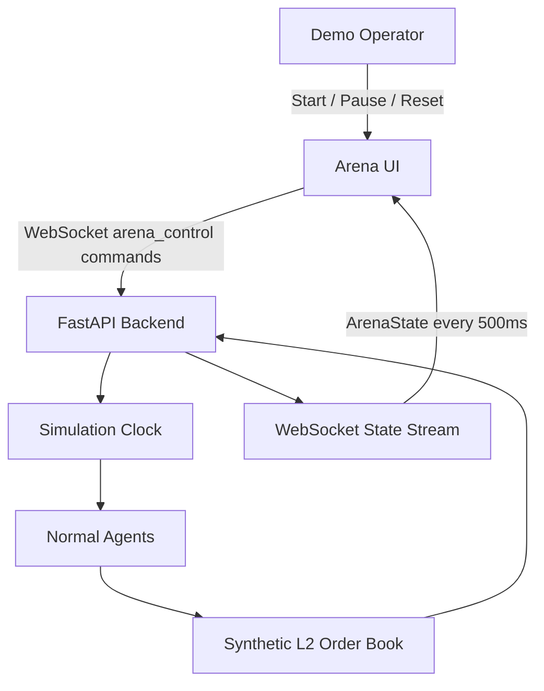

Business value:

- Gives reviewers an immediate visual understanding of the system.
- Shows that detector and AI features are grounded in live synthetic state.
- Provides a demo cockpit before any batch or Nebius workflow is introduced.

Nebius role:

- No direct Nebius call is needed for the baseline live loop.
- The live arena creates the state and incidents later sent to Nebius AI / LLM inference.

## Role-Based Demo Review

Purpose: let a demo operator or reviewer authenticate with Google, keep a stable local user record, and retain app-owned session state without using Google tokens as the arena session.

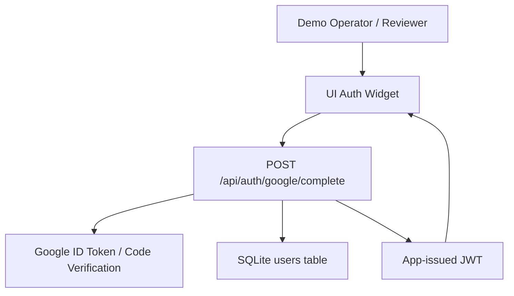

Business value:

- Gives demos a familiar sign-in and account surface without exposing Google tokens as long-lived app sessions.
- Supports Observer, Judge, Red Team, Detection, and Operator personas in a way reviewers can understand.
- Keeps identity verification in the backend and session presentation in the UI shell.

Nebius role:

- No Nebius call is required for authentication.
- Authenticated sessions can later be used to associate reports, promoted evidence, and benchmark review history.

## UI Shell Personalization

Purpose: make the arena usable in repeated demos, recordings, and reviews without changing simulation state.

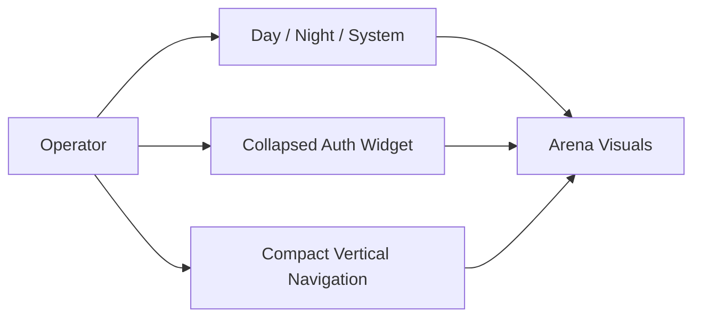

Business value:

- Makes the UI cleaner for screenshots and demos.
- Supports dark rooms, light rooms, and system-following display behavior.
- Keeps visual preferences local to the browser, separate from backend runtime and detector behavior.

Nebius role:

- No Nebius call is required.
- Cleaner UI state improves review of Nebius-generated reports and benchmark artifacts.

## Manual Scenario Launch

Purpose: let an operator inject bounded synthetic abuse-like patterns.

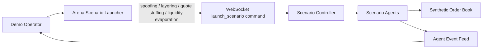

Business value:

- Creates a controlled, repeatable demo moment.
- Separates synthetic red-team behavior from normal market agents.
- Makes scenario labels available for detector and benchmark evaluation.

Nebius role:

- Manually launched scenarios can be generated or narrated by Nebius AI.
- Scenario labels become inputs for Managed Experiment benchmark runs.

## Incident Investigation

Purpose: explain a detected synthetic incident using compact replay evidence.

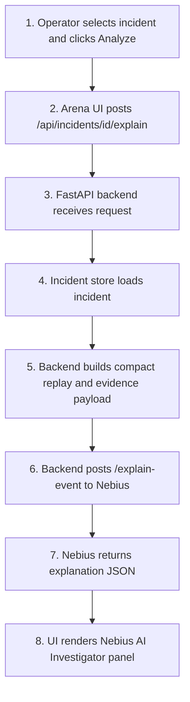

Business value:

- Converts detector evidence into a readable investigation narrative.
- Keeps Nebius credentials and endpoint details out of the browser.
- Preserves safety framing with synthetic-only disclaimers.

Nebius role:

- Backend calls `NEBIUS_INCIDENT_EXPLAINER_URL`, deployed as `/explain-event`.
- Request contains compact replay context, detector evidence, and incident metadata.
- Response is typed explanation JSON for the UI's Nebius AI Investigator panel.

## Red-Team Scenario Generation

Purpose: generate a launchable synthetic scenario configuration from business
constraints.

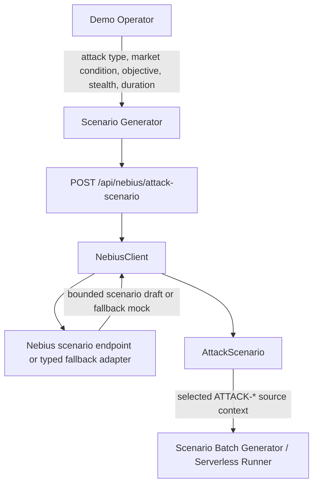

Business value:

- Lets the demo create scenario variants without hardcoding every variant.
- Keeps generated scenarios bounded, persisted, selectable, and usable as source context for scenario grids or Nebius Serverless batches.
- Supports both Nebius endpoint mode and local mock fallback mode.

Nebius role:

- Backend calls the configured Nebius scenario endpoint when available and falls back to a typed local adapter.
- Input includes attack type, market condition, objective, stealth level, attack duration, red-team agent count, and detector difficulty.
- Output is normalized into `AttackScenario`; persisted scenarios can be selected later in the Control Panel and submitted to the Scenario Batch Generator or Serverless Batch Experiment Runner.

## Detector Tournament Benchmark

Purpose: evaluate deterministic detectors across labeled synthetic scenario
families.

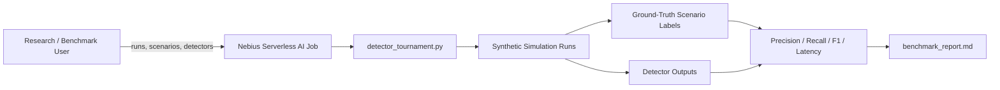

Business value:

- Provides measurable evidence beyond a visual demo.
- Shows detector performance by scenario family.
- Produces artifacts suitable for challenge review and iteration.

Nebius role:

- Runs as a Nebius Serverless AI Job using `serverless/jobs/detector_tournament.py`.
- Accepts `--runs`, `--scenarios`, `--detectors`, and `--output`.
- Writes `benchmark_report.md`, `metrics.csv`, and `results.json`.

## Synthetic Dataset Generation

Purpose: create labeled synthetic artifacts for demos, tests, and analysis.

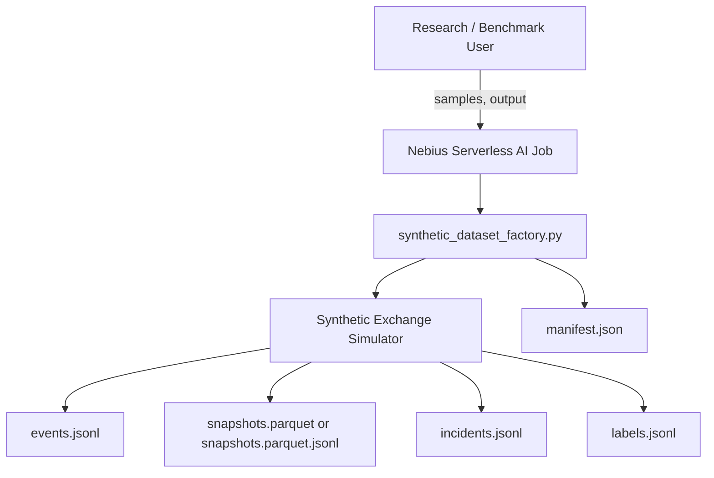

Business value:

- Produces repeatable labeled synthetic data without external market feeds.
- Supports offline analysis and regression tests.
- Falls back to JSONL when Parquet dependencies are unavailable.

Nebius role:

- Runs as a Nebius Serverless AI Job using `serverless/jobs/synthetic_dataset_factory.py`.
- Accepts `--samples` and `--output`.
- Writes JSONL artifacts and Parquet or Parquet-like JSON fallback snapshots.

## Judge Mode Investigation Report

Purpose: explain a selected timeline window, not only a pre-created incident.

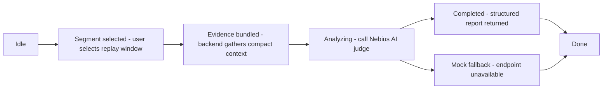

Business value:

- Supports a more exploratory review workflow.
- Connects charts, order-book state, events, and detector signals.
- Produces an investigation-style report while preserving educational framing.

Nebius AI role:

- Uses the same Nebius AI / LLM inference family as AI Investigator.
- Sends bounded timeline context rather than full raw event logs.
- Returns a structured investigation report for reviewer-facing analysis.

## Challenge Submission Evidence

Purpose: package the project story for technical review.

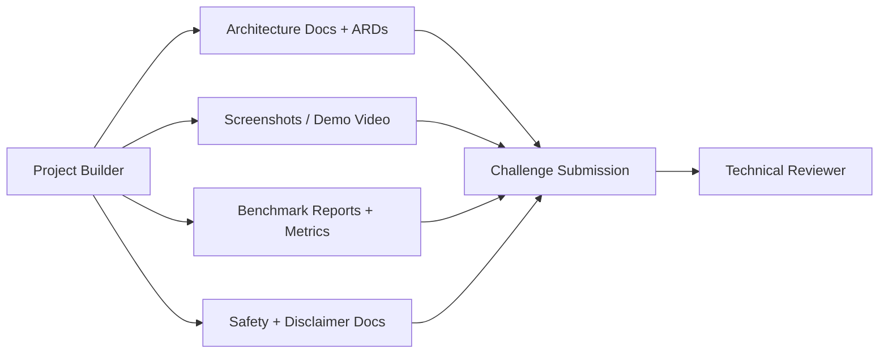

Business value:

- Shows both the visual demo and engineering rigor.
- Makes Nebius usage explicit through endpoint and job workflows.
- Provides a reviewable path from architecture decisions to runnable artifacts.

Nebius role:

- Endpoint evidence: incident explanations, scenario drafts, Judge Mode reports.
- Job evidence: detector tournament metrics and synthetic dataset artifacts.
- Deployment evidence: endpoint/job configs, Dockerfiles, and serverless docs.

## Use Cases → Architecture Mapping

Each use case is supported by specific architecture components:

| Use Case | Primary Path | Key Components | ARDs |
|----------|--------------|-----------------|------|
| Live Arena Mode | Interactive | UI + Backend + Runtime + Exchange | [ARD-0001](architecture/ARD-0001-overall-architecture.md), [ARD-0002](architecture/ARD-0002-websocket-state-schema.md) |
| Manual Scenario Launch | Interactive | Scenario Launcher + Backend API | [ARD-0006](architecture/ARD-0006-scenario-labeling-and-reproducibility.md) |
| Incident Investigation | Interactive | Incident Store + Nebius Endpoint | [ARD-0005](architecture/ARD-0005-nebius-endpoint-contract.md), [ARD-0008](architecture/ARD-0008-nebius-serverless-ai-endpoints.md), [ARD-0015](architecture/ARD-0015-nebius-ai-investigation-team.md) |
| Red-Team Scenario Generation | Interactive | Nebius Endpoint /generate-scenario | [ARD-0005](architecture/ARD-0005-nebius-endpoint-contract.md), [ARD-0016](architecture/ARD-0016-ai-scenario-generator.md) |
| Detector Tournament Benchmark | Batch | Nebius Jobs + Simulation + Metrics | [ARD-0004](architecture/ARD-0004-benchmark-artifact-format.md), [ARD-0007](architecture/ARD-0007-nebius-serverless-ai-jobs.md), [ARD-0017](architecture/ARD-0017-ai-detector-tournament.md) |
| Synthetic Dataset Generation | Batch | Nebius Jobs + Dataset Factory | [ARD-0004](architecture/ARD-0004-benchmark-artifact-format.md), [ARD-0007](architecture/ARD-0007-nebius-serverless-ai-jobs.md) |
| Role-Based Demo Review | Interactive | UI Auth Widget + Backend Auth Store + JWT Session | [ARD-0012](architecture/ARD-0012-google-authentication.md), [ARD-0013](architecture/ARD-0013-ui-shell-preferences.md) |
| UI Shell Personalization | Interactive | Themed Shell + Local Preferences + Arena Visual Stability | [ARD-0013](architecture/ARD-0013-ui-shell-preferences.md) |

## Related Documentation

- [Architecture Overview](architecture.md) — System design and data flow
- [Architecture Records (ARDs)](architecture/README.md) — Detailed design decisions
- [Runtime Model](runtime-model.md) — Simulation engine execution
- [Benchmark Methodology](benchmark-methodology.md) — How we measure detector quality
- [Nebius Deployment](nebius-deployment.md) — Setup instructions
- [Quick Start](QUICKSTART.md) — Get running in 5 minutes
- [Safety & Disclaimers](safety-and-disclaimers.md) — Educational focus and limitations
