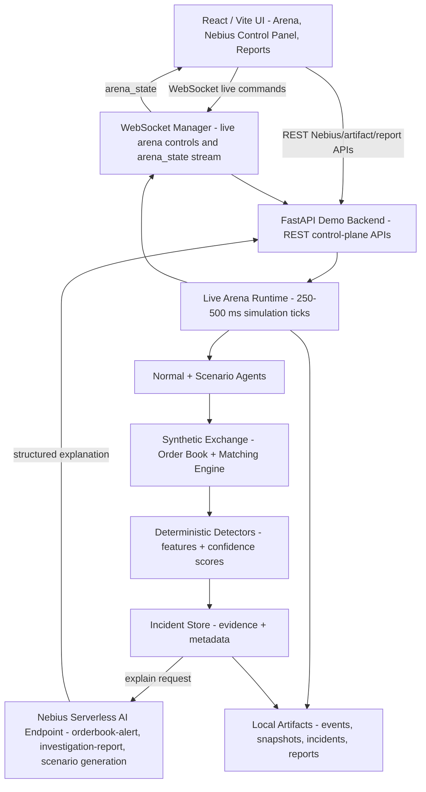
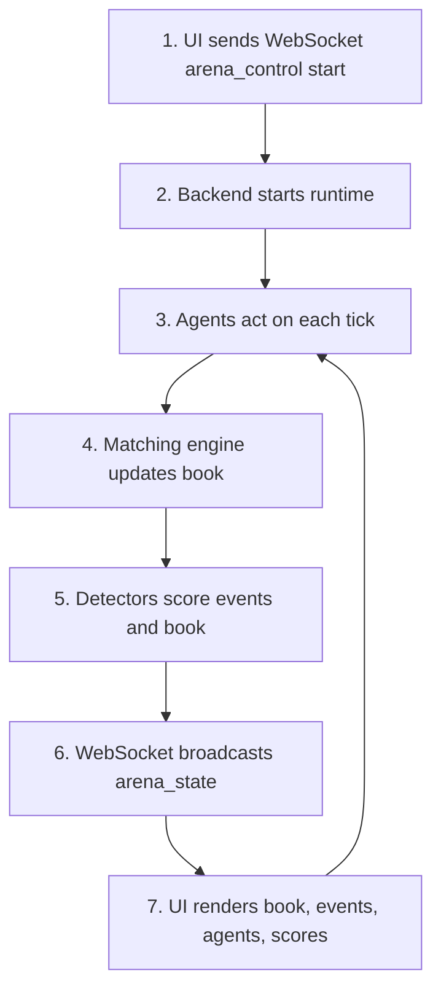
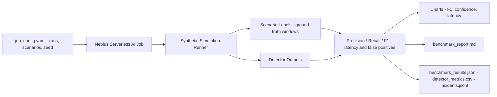
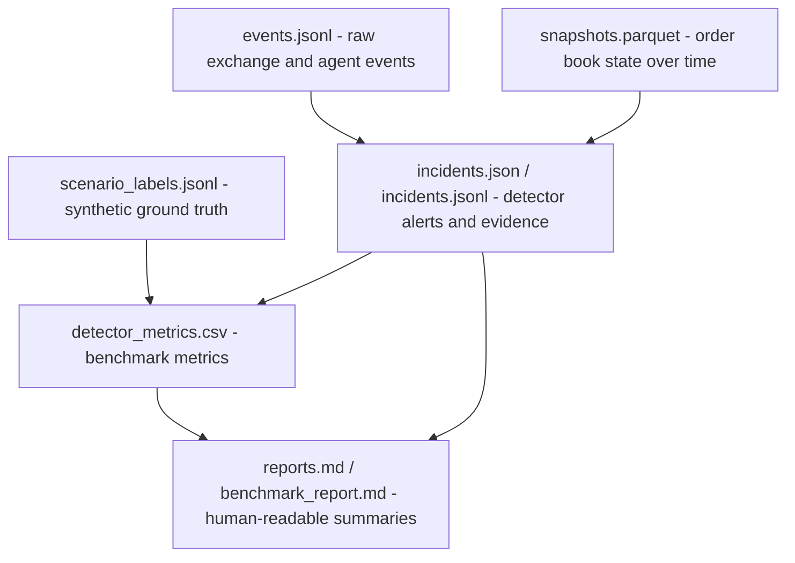

# High-Level Architecture

Nebius Market Abuse Arena is organized around two execution paths:

- an interactive demo path for live simulation, visualization, incident review, and AI-assisted explanations
- a batch benchmark path for running many synthetic simulations and measuring detector quality

The design keeps the browser UI, demo orchestration backend, local simulation engine, Nebius AI endpoints, and persisted event artifacts separate so each part can evolve independently.

## Interactive Demo Path

### Component Responsibilities

| Component | Responsibility |
| --- | --- |
| React / Vite UI | Presents the live order book, charts, agent activity, scenario controls, alerts, Nebius Control Panel operations, and Reports evidence. Arena live controls and state use WebSocket; Nebius, artifact, and report actions use backend REST APIs. |
| FastAPI demo backend | Owns the demo control plane. It starts and stops simulations, launches scenarios, broadcasts state to the UI, persists incidents, and calls Nebius AI endpoints for explanation and report generation. |
| Local live simulation | Runs the in-process market simulation. It models an exchange, normal trading agents, synthetic abuse-like behaviors, and the detector engine. |
| Nebius Serverless AI endpoint | Provides LLM-assisted explanation and summarization APIs for events, whole simulations, and incident reports. |
| Event / snapshot log | Stores replayable event streams, order book snapshots, detected incidents, and generated reports for inspection and offline analysis. |

### Runtime Flow

1. The user starts or controls a scenario from the React / Vite UI.
2. The UI sends a WebSocket command to `/ws/arena`.
3. The backend starts or updates the local simulation and returns complete `arena_state` messages over the same stream.
4. The simulation emits order events, snapshots, agent actions, detector signals, and incidents.
5. The backend persists events and snapshots, then broadcasts live updates to connected UI clients over WebSocket.
6. When an explanation or report is requested, the backend calls the Nebius Serverless AI endpoint and stores the generated result.
7. The UI renders the latest market state, detector alerts, incident details, and AI-generated explanations.

### Live Tick Sequence

## Batch / Benchmark Path

The batch path is intended for repeatable detector evaluation rather than live interaction. A serverless job runs many synthetic simulations, injects labeled abuse-like patterns, collects detector outputs, and compares them against the known scenario labels.

### Benchmark Outputs

- detector metrics: precision, recall, F1, false positives, and false negatives
- per-scenario summaries for spoofing-like, layering-like, and quote-stuffing-like patterns
- benchmark charts for report inclusion
- generated benchmark report describing detector behavior and observed failure modes
- persisted raw artifacts for later review and reproducibility

## Data Artifacts

| Artifact | Purpose |
| --- | --- |
| `events.jsonl` | Append-only stream of simulation events, agent actions, detector signals, and state changes. |
| `snapshots.parquet` | Structured order book and market snapshots optimized for offline analysis. |
| `incidents.json` | Detected incidents with metadata, timestamps, involved agents, scenario labels, and detector evidence. |
| `reports.md` | Human-readable AI-generated explanations, incident summaries, and benchmark reports. |

### Artifact Relationships

## Architectural Boundaries

- The UI should not directly call the simulation engine or Nebius AI endpoints. It should communicate through the FastAPI backend.
- The simulation engine should emit structured events and detector results without depending on UI concerns.
- The backend should be the integration boundary for live transport, persistence, scenario orchestration, and AI calls.
- Batch benchmark jobs should share simulation and detector code with the live path where practical, but should not depend on the interactive UI.
- Persisted artifacts should be treated as replay and audit inputs, not only as transient logs.

## Related Documentation

This architecture supports all workflows described in [Use Cases](USE_CASES.md):

1. **Live Arena Mode** — Supported by WebSocket live commands and `arena_state` streaming
2. **Manual Scenario Launch** — Scenario launcher through the WebSocket-backed Arena UI
3. **Incident Investigation** — Incident store and Nebius Serverless AI Endpoint
4. **Red-Team Scenario Generation** — Nebius Control Panel attack generator through backend Nebius adapters
5. **Detector Tournament / Smart Batch Benchmark** — Batch / Benchmark Path with Nebius Jobs
6. **Synthetic Dataset Generation** — Batch / Benchmark Path artifact outputs
7. **Reports And Evidence Review** — Reports tab reads persisted benchmark, Nebius, explanation, screenshot, and promoted evidence artifacts

Detailed architecture decisions are recorded in [Architecture Records (ARDs)](architecture/README.md):

- [ARD-0001: Overall Architecture](architecture/ARD-0001-overall-architecture.md) — This architecture
- [ARD-0002: WebSocket State Schema](architecture/ARD-0002-websocket-state-schema.md) — Real-time state transport
- [ARD-0003: Detector Evidence Model](architecture/ARD-0003-detector-evidence-model.md) — How detectors report findings
- [ARD-0004: Benchmark Artifact Format](architecture/ARD-0004-benchmark-artifact-format.md) — Persisted data formats
- [ARD-0005: Nebius Endpoint Contract](architecture/ARD-0005-nebius-endpoint-contract.md) — AI service API contracts
- [ARD-0007: Nebius Serverless AI Jobs](architecture/ARD-0007-nebius-serverless-ai-jobs.md) — Batch execution
- [ARD-0008: Nebius Serverless AI Endpoints](architecture/ARD-0008-nebius-serverless-ai-endpoints.md) — Interactive AI service
- [ARD-0009: Judge Mode Investigation Reports](architecture/ARD-0009-judge-mode-investigation-reports.md) — Investigation mode
