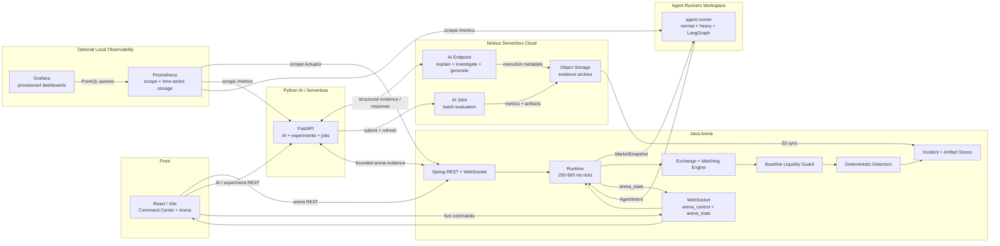
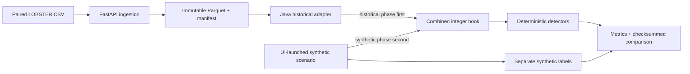
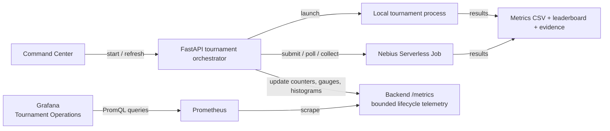
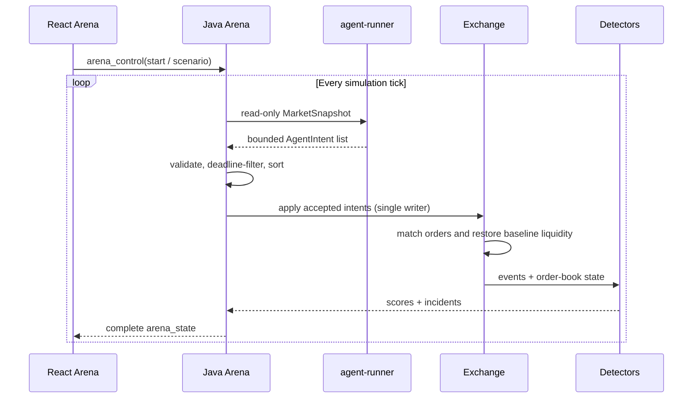
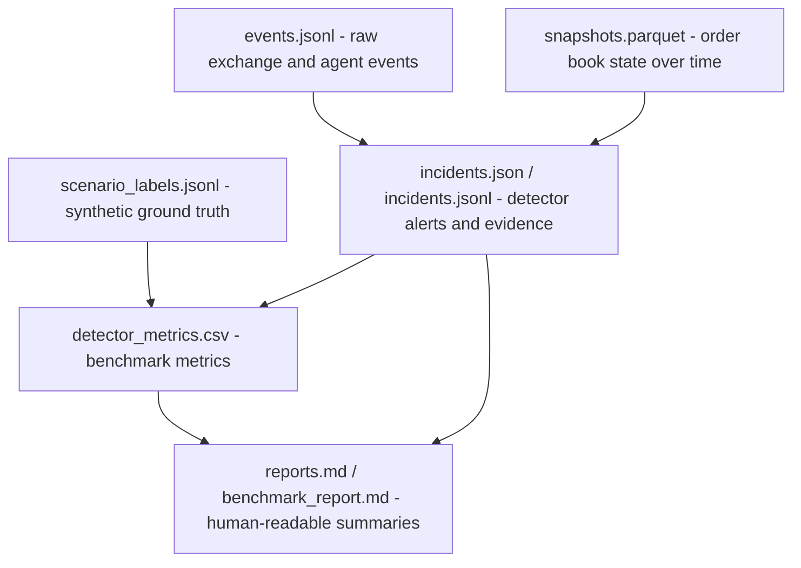

# High-Level Architecture

LOB Arena is organized around five execution areas and two execution paths.

The five execution areas are:

- **Front**: React/Vite browser UI with primary navigation ordered as Data
  Ingestion, Arena, Control Panel, and About.
- **Java Arena**: Java 25/Spring owner of exchange state, live scheduling, scenarios, deterministic detectors/incidents, agent orchestration, persistence, REST controls, and WebSocket streaming.
- **Python AI/Serverless**: FastAPI adapters for Nebius AI/ML, experiments, evidence, and serverless jobs; it reads arena evidence through a thin Java HTTP client.
- **Agent Runners Workspace**: local Docker or remote `agent-runner` processes where normal, CPU-heavy, and LangGraph-compatible agents convert read-only market snapshots into bounded intents.
- **Nebius Serverless Cloud**: Nebius AI model selection, LLM inference, Managed Experiment jobs, GPU utilization, datasets, and artifacts.

The two execution paths are:

- an interactive demo path for orchestrating deterministic demo modes, live simulation, visualization, incident review, Smart Detection, and AI Investigator explanations
- a batch benchmark path for running many synthetic simulations and measuring detector quality through Managed Experiments

The design keeps the browser UI, Java arena, retained Python AI/serverless service, agent runner workspace, Nebius Serverless Cloud, and persisted event artifacts separate so each part can evolve independently.

An opt-in observability plane supports these execution areas without becoming a
sixth execution area or a runtime dependency. Java, FastAPI, and agent-runner
expose operational metrics; Prometheus pulls and stores those metrics; Grafana
queries Prometheus to visualize system health and isolate bottlenecks.

## Interactive Demo Path

### Component Responsibilities

| Component | Responsibility |
| --- | --- |
| React / Vite UI | Presents the themed product shell with Data Ingestion, Arena, Control Panel, and About navigation, plus 2D order-book views, detector output, Incident Details, and AI Investigator reports. Arena live controls and state use WebSocket; Nebius AI, experiment, artifact, and report actions use backend REST APIs. |
| Java arena/control plane | Owns the live exchange, scenarios, deterministic detectors/incidents, journals, REST controls, WebSocket sessions, and agent fan-out as the sole book writer. |
| FastAPI AI/serverless service | Owns Nebius AI/ML, explanations, experiments, evidence archives, and serverless workflows. Its arena compatibility routes are thin Java clients. |
| Agent Runners Workspace | Runs out-of-process normal, CPU-heavy, ML, and LangGraph-compatible agents behind the common intent protocol. Runners return intents and never mutate the exchange directly. |
| Experiment manager | Owns Managed Experiment manifests on `/api/experiments`, persists `outputs/experiments/<experiment_id>/experiment.json`, and exposes smart-batch-compatible artifact paths to Detection without replacing the Nebius AI smart-batch API. |
| Nebius Serverless Cloud | Provides Nebius AI inference for Smart Detection and AI Investigator reports, plus Managed Experiment batch execution, GPU utilization, datasets, and artifacts. |
| Prometheus | Opt-in operational telemetry store that scrapes Java Actuator, FastAPI, agent-runner, and its own health. It is outside the exchange and detector decision path. |
| Grafana | Opt-in visualization layer that queries Prometheus through a provisioned datasource and supplies end-to-end, Java, component, bottleneck, and detector-tournament dashboards. |
| Event / snapshot log | Stores replayable event streams, order book snapshots, detected incidents, and generated reports for inspection and offline analysis. |

The exchange produces a versioned canonical stream of `add`, `modify`,
`cancel`, `execute`, and `snapshot` events. Simulation, strict canonical CSV,
and normalized LOBSTER Parquet now enter the same Java exchange while preserving
upstream sequence/timestamps separately from canonical replay order. Arena
state/WebSocket messages carry a bounded event tail,
`/api/arena/exchange-events` provides cursor replay, and append-only history
stores full events plus snapshot-only checkpoints.

### Historical And Hybrid Replay Path

Historical-only control and hybrid runs reuse the same dataset window. LOBSTER
visible depth is reconstructed as deterministic `HIST:` aggregate level orders;
synthetic scenario orders use a disjoint `SYN:` namespace. Every source snapshot
is recorded from the immutable historical payload, while attacks and detectors
read the combined live book. Ground truth comes only from the launched synthetic
scenario and is never part of detector input.

### Detector Tournament Observability

Detector tournaments participate in the observability plane through
FastAPI, which already owns local child-process execution and Nebius Job
submission, status refresh, and artifact collection. Prometheus does not scrape
short-lived tournament processes or Nebius Jobs directly.

The implemented operational contract is deliberately bounded:

| Metric family | Purpose | Bounded labels |
| --- | --- | --- |
| `detector_tournament_runs_total` | Count tournament terminal outcomes | `execution_mode`, `outcome` |
| `detector_tournament_duration_seconds` | Measure end-to-end tournament duration | `execution_mode`, `outcome` |
| `detector_tournament_in_flight` | Show queued or running work | `execution_mode` |
| `detector_tournament_scenarios_total` | Measure completed scenario throughput | `execution_mode`, `outcome` |
| `detector_tournament_artifact_collections_total` | Track successful, failed, and incomplete result collection | `execution_mode`, `outcome` |

Tournament IDs, Job IDs, seeds, scenario IDs, and artifact paths must not become
Prometheus labels. Precision, recall, F1, detector leaderboards, and per-scenario
results remain in the artifact store and product UI. Grafana's tournament view
is for operational questions—whether work is completing, how long it takes, and
where it fails—not for replacing the benchmark report.

Java 25 owns both the versioned deterministic kernel API and the stateful live arena. Spring Boot exposes kernel and arena REST plus `/ws/arena`, while framework objects remain outside the matching hot loop. FastAPI retains only AI/ML, Nebius, experiments, evidence, and serverless capabilities.

### Runtime Flow

1. The user starts from Demo or controls a scenario directly from the React / Vite UI.
2. The UI sends a WebSocket command to `/ws/arena`.
3. Spring starts or updates the Java arena and returns complete `arena_state` messages over the same stream.
4. Each tick, Java concurrently sends read-only snapshots to configured Python agent runners and collects bounded `AgentIntent` responses.
5. Java validates, sorts, and applies accepted intents as the only exchange writer; runtime `set_level` intents update that agent's own bounded quote.
6. Java restores the baseline bid/ask ladder before publishing state, so the live book remains two-sided.
7. The simulation emits order events, snapshots, agent actions, detector signals, and incidents.
8. Java persists events and snapshots, then broadcasts live updates to connected UI clients over WebSocket.
9. When AI Investigator or report generation is requested, FastAPI reads bounded Java evidence, calls Nebius AI or deterministic fallback adapters, and stores the generated result.
10. The UI renders the latest market state, detector alerts, incident details, AI Investigator explanations, and AI cost/latency metrics. Day/night/system theme mode remains browser-side presentation state.

### Live Tick Sequence

## Batch / Benchmark Path

```mermaid
graph LR
    ExperimentAPI["Experiment Manager - /api/experiments"]
    ExperimentManifest["Experiment Manifest - outputs/experiments/<id>/experiment.json"]
    Config["job_config.yaml - runs, scenarios, seed"]
    Job["Nebius Serverless Cloud - Managed Experiment Job"]
    Simulation["Synthetic Simulation Runner"]
    Labels["Scenario Labels - ground-truth windows"]
    DetectorOutputs["Detector Outputs"]
    Metrics["Precision / Recall / F1 - latency and false positives"]
    Charts["Charts - F1, confidence, latency"]
    Report["benchmark_report.md"]
    Results["benchmark_results.json - detector_metrics.csv - incidents.jsonl"]
    ObjectStorage["Object Storage - Job evidence archive"]
    BackendEvidence["Backend evidence sync - UI download links"]

    ExperimentAPI --> ExperimentManifest
    ExperimentManifest --> Config
    Config --> Job
    Job --> Simulation
    Simulation --> Labels
    Simulation --> DetectorOutputs
    Labels --> Metrics
    DetectorOutputs --> Metrics
    Metrics --> Charts
    Metrics --> Report
    Metrics --> Results
    Results --> ObjectStorage
    Report --> ObjectStorage
    ObjectStorage --> BackendEvidence
```

The batch path is intended for repeatable detector evaluation rather than live interaction. A serverless job runs many synthetic simulations, injects labeled abuse-like patterns, collects detector outputs, and compares them against the known scenario labels.

Phase 4.5 adds a Managed Experiment manifest control plane before execution. The manifest records the requested attack count, batch size, scenarios, seed, Nebius mode, status, optional smart-batch link, artifact directory, artifact paths, and metrics. `POST /api/experiments/{id}/generate-manifest` writes deterministic `attacks.jsonl` rows from that manifest without running simulation. `POST /api/experiments/{id}/run-local-batch` reuses the same local smart-batch runner used by `/api/nebius/smart-batches`, writes outputs under `outputs/experiments/<id>/local-batch/`, records `jobs.jsonl`, normalizes root-level experiment artifacts, and updates the experiment status. `POST /api/experiments/{id}/normalize-artifacts` can re-run that copy/index step without deleting original local-batch files. `POST /api/experiments/{id}/run-investigations` consumes persisted alerts only, selects a bounded top-confidence set, calls the existing Nebius investigation-report client, persists JSON/Markdown AI Investigator reports, and updates experiment metrics; it is intentionally not a per-tick LLM loop. `POST /api/experiments/{id}/aggregate` reuses existing `detector_metrics.csv` values to produce `experiment_summary.json`, `leaderboard.json`, and `benchmark_report.md` without recalculating detector metrics incorrectly. `/nebius` provides the Nebius AI operator flow for this lifecycle, while Detection provides the review flow: experiment list, selected summary, leaderboard, benchmark report preview, AI Investigator files, `artifact_index.json`, and original `local-batch` artifacts. `POST /api/experiments/{id}/submit-nebius` is the real orchestration boundary: it renders the experiment job config, records `real_nebius_pending` when no submit command template is configured, or executes `NEBIUS_JOB_SUBMIT_COMMAND_TEMPLATE` and records a queued real Nebius job id. Refresh uses optional status/log/artifact command templates and does not mark cloud execution completed until status plus artifact collection confirm it. `POST /api/experiments/{id}/collect-nebius-artifacts` collects only the expected job output files from mounted cloud output into the canonical experiment artifact layout; if files are unavailable, the experiment status is `cloud_artifacts_pending`. Nebius AI keeps owning its smart-batch UI/API while `/api/experiments` owns durable experiment intent, manifest lookup, and experiment-scoped local/Nebius submission.

### Benchmark Outputs

- detector metrics: precision, recall, F1, false positives, and false negatives
- per-scenario summaries for Spoofing-like Wall, Layering-like Pattern, Quote Stuffing Burst, and Liquidity Evaporation
- benchmark charts for report inclusion
- generated benchmark report describing detector behavior and observed failure modes
- persisted raw artifacts for later review and reproducibility

## Data Artifacts

| Artifact | Purpose |
| --- | --- |
| `events.jsonl` | Append-only stream of simulation events, agent actions, detector signals, and state changes. |
| `history/exchange_events.jsonl` | Canonical add/modify/cancel/execute/snapshot archive, segmented by stream ID for replay. |
| `history/lob_snapshots.jsonl` | Snapshot-only canonical checkpoints for efficient L2 state scans. |
| `data/processed/lobster/<dataset_id>/` | Immutable normalized LOBSTER events, aligned visible-depth snapshots, and registry manifest. |
| `historical-replay/<run>/control.json` / `hybrid.json` | Historical-only and hybrid summaries over the same source window, including source/canonical counts and stream hashes. |
| `historical-replay/<run>/comparison.json` | Detector TP/FN/FP/TN, precision, recall, F1, alert timing, and final-book realism deltas. |
| `historical-replay/<run>/manifest.json` / `checksums.sha256` | Replay comparison inventory and integrity checks. |
| `experiments/<experiment_id>/experiment.json` | Phase 4.5 experiment manifest with requested scenarios, execution mode, status, artifact paths, optional smart-batch link, and metrics. |
| `experiments/<experiment_id>/attacks.jsonl` | Deterministic attack plan rows with expected labels, detector family, timing, agent profile, and parameters for each planned run. |
| `experiments/<experiment_id>/jobs.jsonl` | Experiment-scoped local and Nebius Job records, including queued, running, completed, failed, and explicitly unconfigured states. |
| `experiments/<experiment_id>/local-batch/` | Local smart-batch outputs for the experiment, including order-book events, trades, labels, alerts, metrics, report, and batch manifest. |
| `experiments/<experiment_id>/artifact_index.json` | Index mapping original local-batch artifact names to canonical experiment-root artifact names. |
| `experiments/<experiment_id>/investigations/` | Per-alert AI Investigator reports as JSON and Markdown, generated from persisted top-confidence batch alerts. |
| `experiments/<experiment_id>/experiment_summary.json` / `leaderboard.json` | Aggregated experiment totals and scenario leaderboard sourced from detector metrics, labels, alerts, and investigations. |
| `experiments/<experiment_id>/benchmark_report.md` | Human-readable synthetic educational benchmark report shown in Reports after aggregation. |
| `snapshots.parquet` | Structured order book and market snapshots optimized for offline analysis. |
| `incidents.json` | Detected incidents with metadata, timestamps, involved agents, scenario labels, and detector evidence. |
| `reports.md` | Human-readable AI Investigator explanations, incident summaries, and benchmark reports. |

### Artifact Relationships

## Architectural Boundaries

- The UI should not directly call the simulation engine, Agent Runners Workspace, or Nebius AI endpoints. It should communicate through the FastAPI backend.
- UI shell theme preferences are local browser state.
- The simulation engine should emit structured events and detector results without depending on UI concerns.
- Agent runners may decide remotely, but they must return intents only; they must not mutate exchange state directly.
- The backend should be the integration boundary for live transport, persistence, scenario orchestration, and AI calls.
- `/api/experiments` owns durable experiment manifests and report visibility; `/api/nebius/smart-batches` continues to own Nebius Control smart-batch execution.
- Real Nebius Serverless Job submit, status, log, and artifact collection calls are isolated in `backend/app/experiments/nebius_orchestrator.py`; absent configuration records `real_nebius_pending`, while completion requires confirmed cloud status and collected artifacts.
- Batch benchmark jobs should share simulation and detector code with the live path where practical, but should not depend on the interactive UI.
- Persisted artifacts should be treated as replay and audit inputs, not only as transient logs.
- Historical source records and source snapshots are immutable. Hybrid
  execution may add synthetic orders to the live book but must not rewrite the
  historical snapshot payload or infer benign labels.
- Detector inputs must remain numeric/event-derived projections and must not
  expose scenario labels, attack seeds, or synthetic-only identifiers.
- Prometheus and Grafana are read-only operational diagnostics. Their absence or
  failure must not change deterministic simulation results, and their time
  series must not be confused with detector benchmark artifacts.
- Detector-tournament processes publish operational telemetry through the
  backend orchestration boundary; they are not direct Prometheus scrape targets.
- Detection reports and generated AI Investigator text are synthetic educational evidence for this simulator, not real surveillance, trading, or compliance outputs.

## Related Documentation

This architecture supports all workflows described in [Use Cases](USE_CASES.md):

1. **Live Arena Mode** — Supported by WebSocket live commands and `arena_state` streaming
2. **Manual Scenario Launch** — Scenario launcher through the WebSocket-backed Arena UI
3. **Hybrid Historical Replay** — LOBSTER control and UI-launched synthetic overlay through the Java exchange
4. **Incident Investigation** — Incident store and AI Investigator
5. **Red-Team Scenario Generation** — Scenario Generator through backend Nebius AI adapters
6. **Detector Tournament / Smart Batch Benchmark** — Batch / Benchmark Path with Managed Experiment jobs
7. **Synthetic Dataset Generation** — Batch / Benchmark Path artifact outputs
8. **Detection Outputs And Evidence Review** — Detection reads persisted benchmark, Managed Experiment, Nebius AI, AI Investigator, screenshot, and promoted evidence artifacts
9. **UI Shell Personalization** — Local day/night/system preferences

Detailed architecture decisions are recorded in [Architecture Records (ARDs)](architecture/README.md):

- [ARD-0001: Overall Architecture](architecture/ARD-0001-overall-architecture.md) — This architecture
- [ARD-0002: WebSocket State Schema](architecture/ARD-0002-websocket-state-schema.md) — Real-time state transport
- [ARD-0003: Detector Evidence Model](architecture/ARD-0003-detector-evidence-model.md) — How detectors report findings
- [ARD-0004: Benchmark Artifact Format](architecture/ARD-0004-benchmark-artifact-format.md) — Persisted data formats
- [ARD-0005: Nebius Endpoint Contract](architecture/ARD-0005-nebius-endpoint-contract.md) — AI service API contracts
- [ARD-0006: Scenario Labeling and Reproducibility](architecture/ARD-0006-scenario-labeling-and-reproducibility.md) — Ground truth labels and deterministic replay
- [ARD-0007: Nebius Serverless AI Jobs](architecture/ARD-0007-nebius-serverless-ai-jobs.md) — Batch execution
- [ARD-0008: Nebius Serverless AI Endpoints](architecture/ARD-0008-nebius-serverless-ai-endpoints.md) — Interactive AI service
- [ARD-0009: Judge Mode Investigation Reports](architecture/ARD-0009-judge-mode-investigation-reports.md) — Investigation mode
- [ARD-0010: Agent Runner Execution Architecture](architecture/ARD-0010-agent-runner-execution.md) — Local, remote, heavy, and LangGraph-compatible agents
- [ARD-0011: Exchange Liquidity Invariant And Agent Quote Ownership](architecture/ARD-0011-exchange-liquidity-invariant.md) — Baseline ladder and per-agent quote ownership
- [ARD-0013: UI Shell Preferences And Demo Presentation](architecture/ARD-0013-ui-shell-preferences.md) — Banner asset, theme preference, compact navigation, and paused visualizations
- [ARD-0015: Nebius AI Investigation Team](architecture/ARD-0015-nebius-ai-investigation-team.md) — Interactive multi-agent investigation via Nebius AI Serverless Endpoint
- [ARD-0016: AI Scenario Generator](architecture/ARD-0016-ai-scenario-generator.md) — Simulator-compatible AI scenario generation via Nebius AI Serverless Endpoint
- [ARD-0017: AI Detector Tournament](architecture/ARD-0017-ai-detector-tournament.md) — Detector tournament facade and Serverless Jobs execution contract
- [ARD-0018: Canonical Exchange Event Stream](architecture/ARD-0018-canonical-exchange-event-stream.md) — Simulation and historical-ready exchange events, replay, delivery, and persistence
- [ARD-0019: Python Reference And Java Kernel Migration](architecture/ARD-0019-python-reference-java-kernel-migration.md) — Completed parity-gated Java kernel cut-over and retained Python ownership boundary
- [ARD-0020: Java Arena WebSocket And Agent Orchestration](architecture/ARD-0020-java-arena-websocket-agent-orchestration.md) — Java live-arena ownership and Python AI/ML/serverless boundary
- [ARD-0021: Local Observability With Prometheus And Grafana](architecture/ARD-0021-local-observability-grafana.md) — Optional local monitoring profile and bottleneck dashboards
- [ARD-0022: Historical Market Data Ingestion And Replay](architecture/ARD-0022-historical-market-data-ingestion.md) — LOBSTER discovery, validation, Parquet normalization, and registry contract
- [ARD-0023: Deterministic Hybrid Historical Replay](architecture/ARD-0023-hybrid-historical-replay.md) — Java historical/synthetic merge ordering, provenance, seed, labels, metrics, and artifacts
