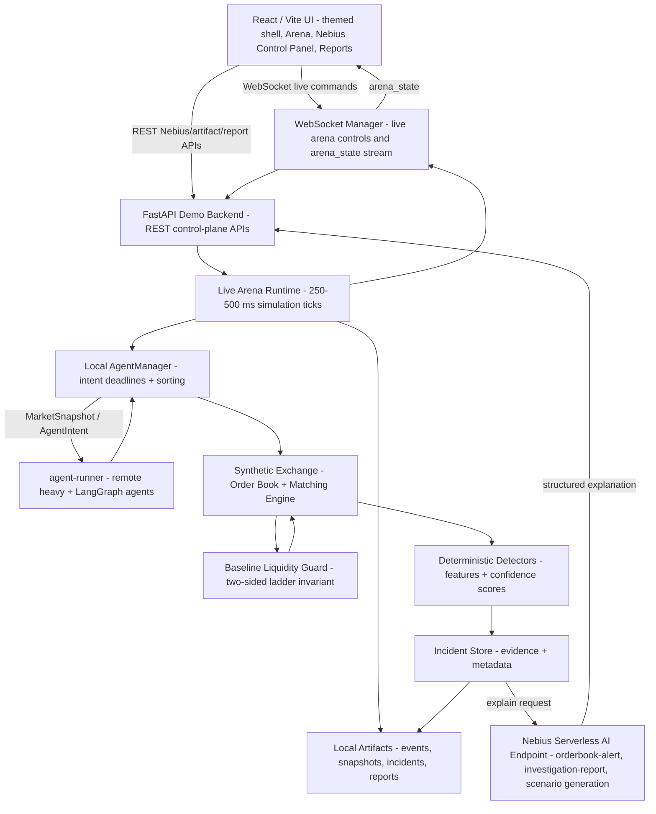
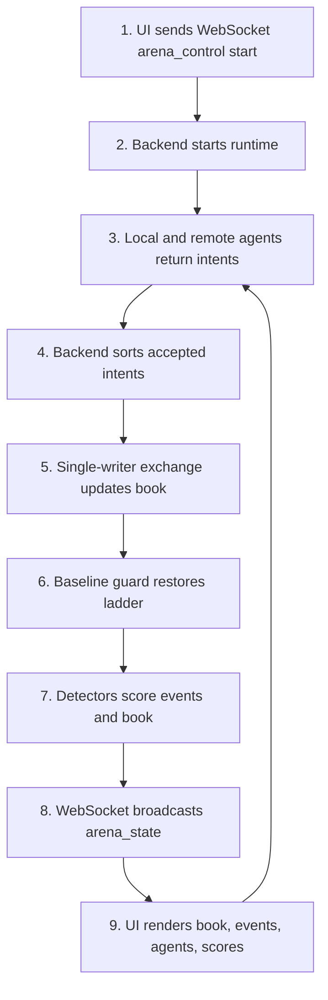
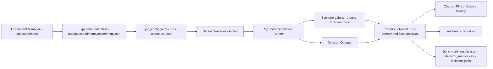
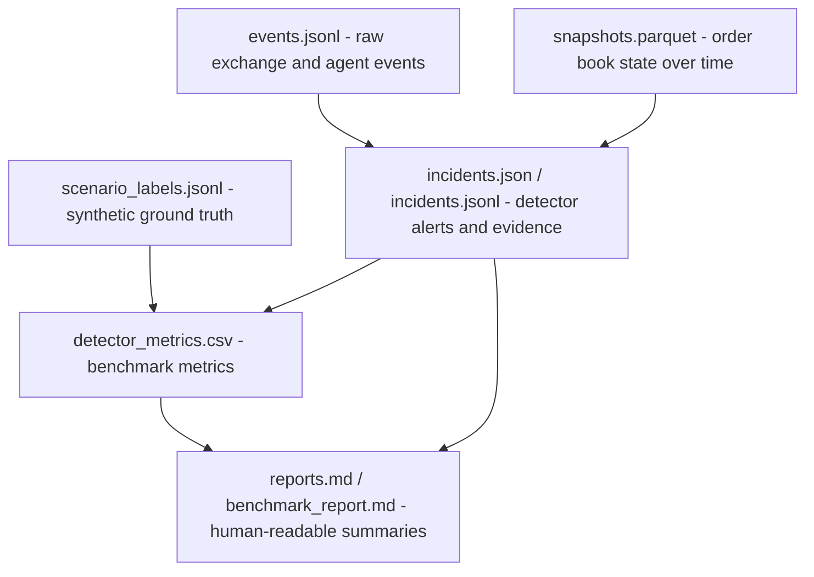

# High-Level Architecture

AI Market Abuse Detection Arena is organized around two execution paths:

- an interactive demo path for live simulation, visualization, incident review, and AI-assisted explanations
- a batch benchmark path for running many synthetic simulations and measuring detector quality

The design keeps the browser UI, demo orchestration backend, local simulation engine, Nebius AI endpoints, and persisted event artifacts separate so each part can evolve independently.

## Interactive Demo Path

### Component Responsibilities

| Component | Responsibility |
| --- | --- |
| React / Vite UI | Presents the themed product shell, Google/auth widget, role/session controls, live order book, charts, agent activity, scenario controls, alerts, Nebius Control Panel operations, Experiment Lab, and Reports evidence. Arena live controls and state use WebSocket; Nebius, experiment, artifact, and report actions use backend REST APIs. |
| FastAPI demo backend | Owns the demo control plane. It starts and stops simulations, launches scenarios, broadcasts state to the UI, persists incidents, and calls Nebius AI endpoints for explanation and report generation. |
| Local live simulation | Runs the authoritative exchange, scenario state, detector engine, local agent scheduling, single-writer book mutation, per-agent quote ownership, and baseline liquidity guard. |
| Agent runner | Runs out-of-process normal, heavy, and LangGraph-compatible agents behind `/decide`; returns intents but never mutates the exchange. |
| Experiment manager | Owns Phase 4.5 experiment manifests on `/api/experiments`, persists `outputs/experiments/<experiment_id>/experiment.json`, and exposes smart-batch-compatible artifact paths to Reports without replacing the Nebius Control smart-batch API. |
| Nebius Serverless AI endpoint | Provides LLM-assisted explanation and summarization APIs for events, whole simulations, and incident reports. |
| Event / snapshot log | Stores replayable event streams, order book snapshots, detected incidents, and generated reports for inspection and offline analysis. |

### Runtime Flow

1. The user starts or controls a scenario from the React / Vite UI.
2. The UI sends a WebSocket command to `/ws/arena`.
3. The backend starts or updates the local simulation and returns complete `arena_state` messages over the same stream.
4. Each tick, the backend sends read-only snapshots to local and remote agents and collects bounded `AgentIntent` responses.
5. The backend sorts accepted intents and applies them to the exchange as the only writer; runtime `set_level` intents update that agent's own bounded quote.
6. The backend restores the configured baseline bid/ask ladder before publishing state, so the live book remains two-sided.
7. The simulation emits order events, snapshots, agent actions, detector signals, and incidents.
8. The backend persists events and snapshots, then broadcasts live updates to connected UI clients over WebSocket.
9. When an explanation or report is requested, the backend calls the Nebius Serverless AI endpoint and stores the generated result.
10. The UI renders the latest market state, detector alerts, incident details, and AI-generated explanations. Local shell preferences such as collapsed auth controls and day/night/system theme mode remain browser-side presentation state.

### Live Tick Sequence

## Batch / Benchmark Path

The batch path is intended for repeatable detector evaluation rather than live interaction. A serverless job runs many synthetic simulations, injects labeled abuse-like patterns, collects detector outputs, and compares them against the known scenario labels.

Phase 4.5 adds an experiment manifest control plane before execution. The manifest records the requested attack count, batch size, scenarios, seed, Nebius mode, status, optional smart-batch link, artifact directory, artifact paths, and metrics. `POST /api/experiments/{id}/generate-manifest` writes deterministic `attacks.jsonl` rows from that manifest without running simulation. `POST /api/experiments/{id}/run-local-batch` reuses the same local smart-batch runner used by `/api/nebius/smart-batches`, writes outputs under `outputs/experiments/<id>/local-batch/`, records `jobs.jsonl`, normalizes root-level experiment artifacts, and updates the experiment status. `POST /api/experiments/{id}/normalize-artifacts` can re-run that copy/index step without deleting original local-batch files. `POST /api/experiments/{id}/run-investigations` consumes persisted alerts only, selects a bounded top-confidence set, calls the existing Nebius investigation-report client, persists JSON/Markdown reports, and updates experiment metrics; it is intentionally not a per-tick LLM loop. `POST /api/experiments/{id}/aggregate` reuses existing `detector_metrics.csv` values to produce `experiment_summary.json`, `leaderboard.json`, and `benchmark_report.md` without recalculating detector metrics incorrectly. `/nebius` provides the operator flow for this lifecycle, while `/reports` provides the review flow: experiment list, selected summary, leaderboard, benchmark report preview, investigation files, `artifact_index.json`, and original `local-batch` artifacts. `POST /api/experiments/{id}/submit-nebius` is the real orchestration boundary: it renders the experiment job config, records `real_nebius_pending` when no submit command template is configured, or executes `NEBIUS_JOB_SUBMIT_COMMAND_TEMPLATE` and records a queued real Nebius job id. Refresh uses optional status/log/artifact command templates and does not mark cloud execution completed until status plus artifact collection confirm it. Nebius Control keeps owning its smart-batch UI/API while `/api/experiments` owns durable experiment intent, manifest lookup, and experiment-scoped local/Nebius submission.

### Benchmark Outputs

- detector metrics: precision, recall, F1, false positives, and false negatives
- per-scenario summaries for spoofing-like, layering-like, and quote-stuffing-like patterns
- benchmark charts for report inclusion
- generated benchmark report describing detector behavior and observed failure modes
- persisted raw artifacts for later review and reproducibility

## Data Artifacts

| Artifact | Purpose |
| --- | --- |
| `events.jsonl` | Append-only stream of simulation events, agent actions, detector signals, and state changes. |
| `experiments/<experiment_id>/experiment.json` | Phase 4.5 experiment manifest with requested scenarios, execution mode, status, artifact paths, optional smart-batch link, and metrics. |
| `experiments/<experiment_id>/attacks.jsonl` | Deterministic attack plan rows with expected labels, detector family, timing, agent profile, and parameters for each planned run. |
| `experiments/<experiment_id>/jobs.jsonl` | Experiment-scoped job records, including `local_parallel_batch` submissions and pending `nebius_serverless_job` orchestration records. |
| `experiments/<experiment_id>/local-batch/` | Local smart-batch outputs for the experiment, including order-book events, trades, labels, alerts, metrics, report, and batch manifest. |
| `experiments/<experiment_id>/artifact_index.json` | Index mapping original local-batch artifact names to canonical experiment-root artifact names. |
| `experiments/<experiment_id>/investigations/` | Per-alert AI investigation reports as JSON and Markdown, generated from persisted top-confidence batch alerts. |
| `experiments/<experiment_id>/experiment_summary.json` / `leaderboard.json` | Aggregated experiment totals and scenario leaderboard sourced from detector metrics, labels, alerts, and investigations. |
| `experiments/<experiment_id>/benchmark_report.md` | Human-readable synthetic educational benchmark report shown in Reports after aggregation. |
| `snapshots.parquet` | Structured order book and market snapshots optimized for offline analysis. |
| `incidents.json` | Detected incidents with metadata, timestamps, involved agents, scenario labels, and detector evidence. |
| `reports.md` | Human-readable AI-generated explanations, incident summaries, and benchmark reports. |

### Artifact Relationships

## Architectural Boundaries

- The UI should not directly call the simulation engine or Nebius AI endpoints. It should communicate through the FastAPI backend.
- UI shell preferences such as theme mode and auth-widget visibility are local browser preferences; the backend owns identity verification and app session issuance.
- The simulation engine should emit structured events and detector results without depending on UI concerns.
- Agent runners may decide remotely, but they must return intents only; they must not mutate exchange state directly.
- The backend should be the integration boundary for live transport, persistence, scenario orchestration, and AI calls.
- `/api/experiments` owns durable experiment manifests and report visibility; `/api/nebius/smart-batches` continues to own Nebius Control smart-batch execution.
- Real Nebius Serverless Job calls must be added only inside `backend/app/experiments/nebius_orchestrator.py`; until then Nebius experiment submission records `real_nebius_pending`, and docs/UI must not claim real cloud execution.
- Batch benchmark jobs should share simulation and detector code with the live path where practical, but should not depend on the interactive UI.
- Persisted artifacts should be treated as replay and audit inputs, not only as transient logs.
- Reports and generated investigation text are synthetic educational evidence for this simulator, not real surveillance, trading, or compliance outputs.

## Related Documentation

This architecture supports all workflows described in [Use Cases](USE_CASES.md):

1. **Live Arena Mode** — Supported by WebSocket live commands and `arena_state` streaming
2. **Manual Scenario Launch** — Scenario launcher through the WebSocket-backed Arena UI
3. **Incident Investigation** — Incident store and Nebius Serverless AI Endpoint
4. **Red-Team Scenario Generation** — Nebius Control Panel attack generator through backend Nebius adapters
5. **Detector Tournament / Smart Batch Benchmark** — Batch / Benchmark Path with Nebius Jobs
6. **Synthetic Dataset Generation** — Batch / Benchmark Path artifact outputs
7. **Reports And Evidence Review** — Reports tab reads persisted benchmark, managed experiment, Nebius, explanation, screenshot, and promoted evidence artifacts
8. **Role-Based Demo Review And UI Shell Personalization** — Google-authenticated role/session state plus local day/night/system and auth-widget preferences

Detailed architecture decisions are recorded in [Architecture Records (ARDs)](architecture/README.md):

- [ARD-0001: Overall Architecture](architecture/ARD-0001-overall-architecture.md) — This architecture
- [ARD-0002: WebSocket State Schema](architecture/ARD-0002-websocket-state-schema.md) — Real-time state transport
- [ARD-0003: Detector Evidence Model](architecture/ARD-0003-detector-evidence-model.md) — How detectors report findings
- [ARD-0004: Benchmark Artifact Format](architecture/ARD-0004-benchmark-artifact-format.md) — Persisted data formats
- [ARD-0005: Nebius Endpoint Contract](architecture/ARD-0005-nebius-endpoint-contract.md) — AI service API contracts
- [ARD-0007: Nebius Serverless AI Jobs](architecture/ARD-0007-nebius-serverless-ai-jobs.md) — Batch execution
- [ARD-0008: Nebius Serverless AI Endpoints](architecture/ARD-0008-nebius-serverless-ai-endpoints.md) — Interactive AI service
- [ARD-0009: Judge Mode Investigation Reports](architecture/ARD-0009-judge-mode-investigation-reports.md) — Investigation mode
- [ARD-0010: Agent Runner Execution Architecture](architecture/ARD-0010-agent-runner-execution.md) — Local, remote, heavy, and LangGraph-compatible agents
- [ARD-0011: Exchange Liquidity Invariant And Agent Quote Ownership](architecture/ARD-0011-exchange-liquidity-invariant.md) — Baseline ladder and per-agent quote ownership
- [ARD-0012: Google Authentication And App Sessions](architecture/ARD-0012-google-authentication.md) — Google verification, user persistence, and app JWT sessions
- [ARD-0013: UI Shell Preferences And Demo Presentation](architecture/ARD-0013-ui-shell-preferences.md) — Banner asset, theme preference, collapsible auth widget, compact navigation, and paused visualizations
