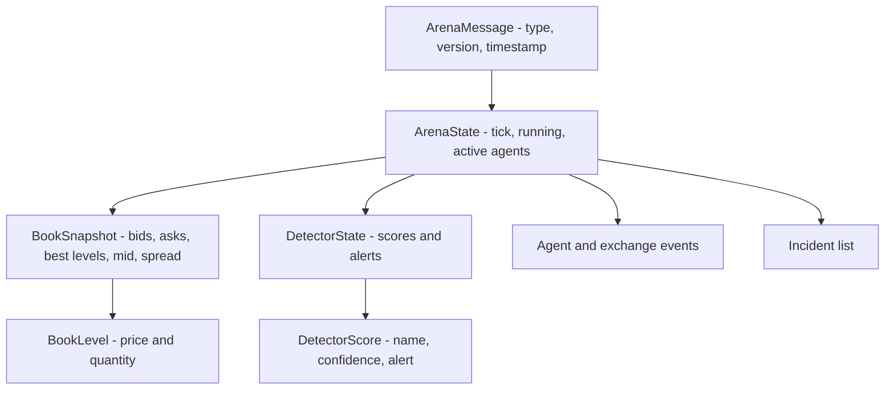
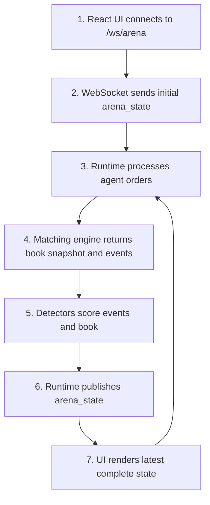

# ARD-0002: WebSocket State Schema

Status: Accepted

Date: 2026-06-01

## Context

The React arena needs frequent state updates from the FastAPI simulator. The UI should not reconstruct exchange state from raw events. It needs a compact, stable state envelope that can drive the order book ladder, charts, agent feed, active agents, detector confidence, and incident cards.

The backend already owns the live simulation clock and broadcasts messages through `/ws/arena`.

## Decision

Use a versioned WebSocket message envelope with `type`, `version`, `timestamp`, and `payload`. The primary live message type is `arena_state`.

The payload should include the latest complete UI-ready state, not only a delta.

```json
{
  "type": "arena_state",
  "version": 1,
  "timestamp": "2026-06-01T12:00:00Z",
  "payload": {
    "tick": 42,
    "running": true,
    "book": {
      "bids": [{"price": 99.99, "quantity": 256}],
      "asks": [{"price": 100.01, "quantity": 240}],
      "best_bid": 99.99,
      "best_ask": 100.01,
      "mid": 100.0,
      "spread": 0.02
    },
    "events": [],
    "active_agents": ["MM_01", "NOISE_01", "TAKER_01"],
    "detectors": {"scores": [], "alerts": []},
    "incidents": []
  }
}
```

## Schema Diagram



## Message Flow



## Consequences

Positive:

- UI rendering is simple and robust.
- Late-joining clients receive a complete current state.
- The schema can evolve through `version`.

Tradeoffs:

- Full-state messages are larger than deltas.
- The backend must keep the payload shape stable.
- High-frequency updates may need throttling if the payload grows.

## Related Documentation

- `docs/runtime-model.md`
- `docs/architecture.md`
- [ARD-0001: Overall Architecture](ARD-0001-overall-architecture.md)
