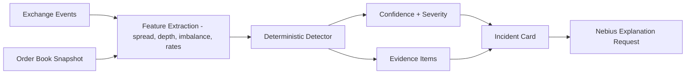
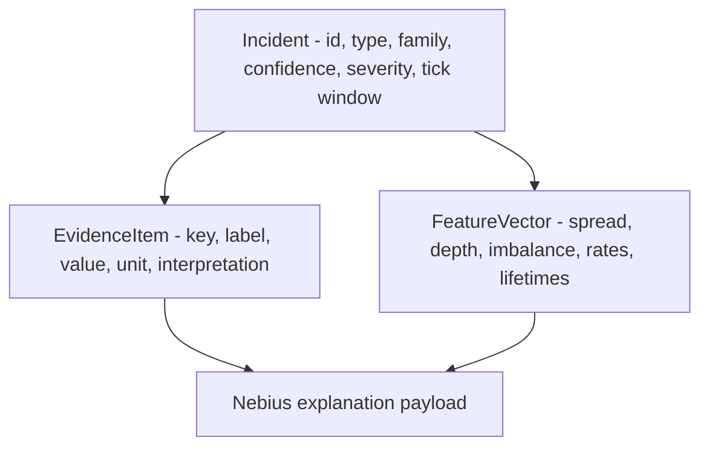

# ARD-0003: Detector Evidence Model

Status: Accepted

Date: 2026-06-01

## Implementation Status

Status as of 2026-06-23: `[done]`

Implemented:

- Deterministic feature extraction and detector modules for spoofing-like, layering-like, quote-stuffing-like, and liquidity shock patterns.
- Aggregate detector scores, incident cards, Incident Details evidence, persisted incident records, and backend explanation payloads grounded in structured evidence.
- Benchmark and report surfaces that reuse detector evidence rather than relying on generated prose as the detector.
- Regression tests for normal market-making false positives, spoofing-like alerts, layering-like alerts, quote-stuffing noise limits, and deterministic replay incident linkage.

Follow-up:

- Threshold calibration against broader historical-style replay datasets remains future validation work.

## Context

Detector alerts must be explainable without relying on AI-generated text. The project needs deterministic confidence scores and evidence items that can be shown in the UI, written to benchmark artifacts, and sent to the Nebius explanation endpoint.

## Decision

Represent every detector result as a structured evidence model:

- detector name
- scenario family, when known
- confidence score
- severity
- evidence items
- input features
- source event ids or order ids
- tick or timestamp window

AI explanations may summarize this evidence, but they must not create the detection itself.

## Evidence Flow



## Evidence Schema



## Example

```json
{
  "incident_id": "INC-00042",
  "type": "spoofing_like_wall",
  "scenario_family": "spoofing_like",
  "confidence": 0.91,
  "severity": "high",
  "start_tick": 120,
  "end_tick": 127,
  "evidence": [
    {
      "key": "wall_size_ratio",
      "label": "Wall size ratio",
      "value": "8.4",
      "unit": "x",
      "interpretation": "visible wall was much larger than nearby depth"
    }
  ]
}
```

## Consequences

Positive:

- Incidents are reproducible and benchmarkable.
- UI and reports can use the same evidence object.
- Explanation prompts can stay grounded in structured facts.

Tradeoffs:

- Detectors must return more than a boolean alert.
- Evidence extraction needs explicit thresholds and labels.
- Schema changes affect UI, benchmark output, and explanation payloads.

## Related Documentation

- `docs/benchmark-methodology.md`
- `docs/runtime-model.md`
- [ARD-0005: Nebius Endpoint Contract](ARD-0005-nebius-endpoint-contract.md)
