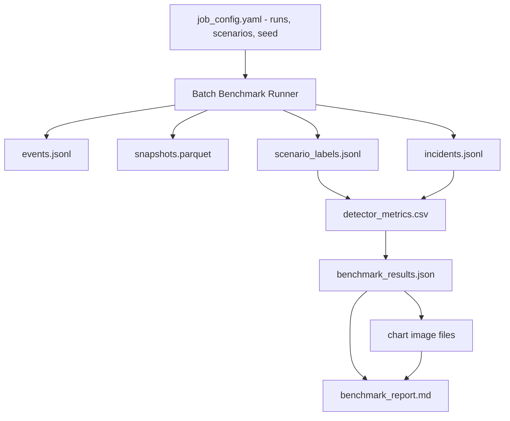
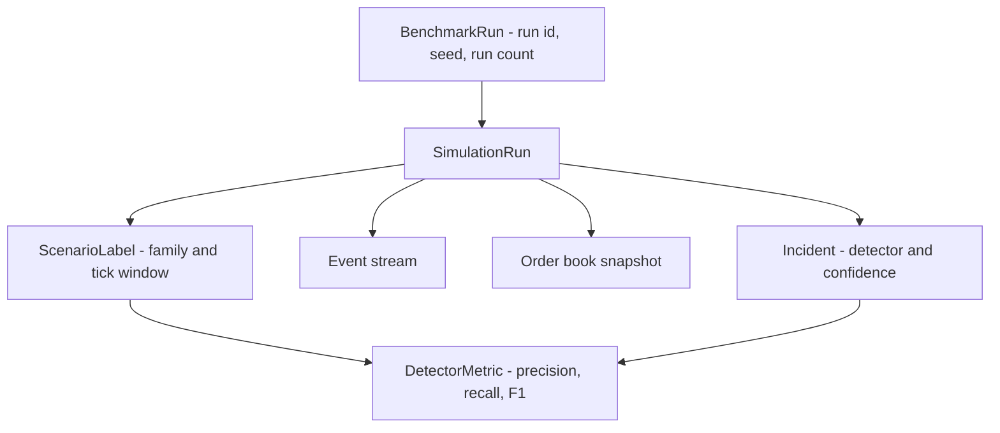

# ARD-0004: Benchmark Artifact Format

Status: Accepted

Date: 2026-06-01

## Implementation Status

Status as of 2026-07-13: `[partial]`

Implemented:

- Local detector tournament writes benchmark JSON, CSV, Markdown report, and optional chart artifacts.
- Synthetic dataset factory writes events, incidents, labels, snapshots, and manifest artifacts, with a JSONL fallback when Parquet dependencies are unavailable.
- Smart batch runner writes serverless-batch style artifacts for attack/detect experiments.
- A sanitized production evidence sample is committed under [`outputs/benchmark/EXP-18E88EAF`](../../outputs/benchmark/EXP-18E88EAF/README.md).

Future work:

- The canonical ARD path shape is run-specific (`outputs/benchmark/<run_id>/...`), while the current local detector tournament path still uses flatter files such as `outputs/benchmark/results.json`, `metrics.csv`, and `benchmark_report.md`.
- Artifact schema versioning is not yet formalized.

## Context

The Nebius Serverless AI Job must run many synthetic simulations and produce artifacts that are easy to inspect, reproduce, and cite in submission material. The benchmark should compare detector outputs against known scenario labels and preserve enough raw data for debugging.

## Decision

Write benchmark artifacts under a run-specific output directory:

```text
outputs/benchmark/<run_id>/
  benchmark_report.md
  benchmark_results.json
  incidents.jsonl
  detector_metrics.csv
  scenario_labels.jsonl
  events.jsonl
  snapshots.parquet
  charts/
    f1_by_scenario.png
    confidence_distribution.png
    detection_latency.png
```

The canonical machine-readable summary is `benchmark_results.json`. CSV and Markdown outputs are derived from the same metrics.

## Artifact Pipeline



## Artifact Relationships



## Consequences

Positive:

- Benchmark results are reproducible and auditable.
- Human and machine-readable outputs are both available.
- Charts and reports can be regenerated from JSON/CSV.

Tradeoffs:

- Output directories can grow quickly.
- Artifact versioning is required once schemas change.
- Parquet support may require optional dependencies in lightweight environments.

## Related Documentation

- `docs/benchmark-methodology.md`
- `serverless/jobs/README.md`
- [ARD-0006: Scenario Labeling and Reproducibility](ARD-0006-scenario-labeling-and-reproducibility.md)
