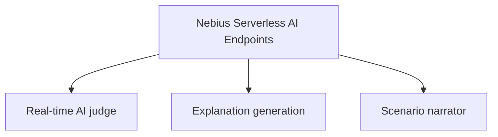
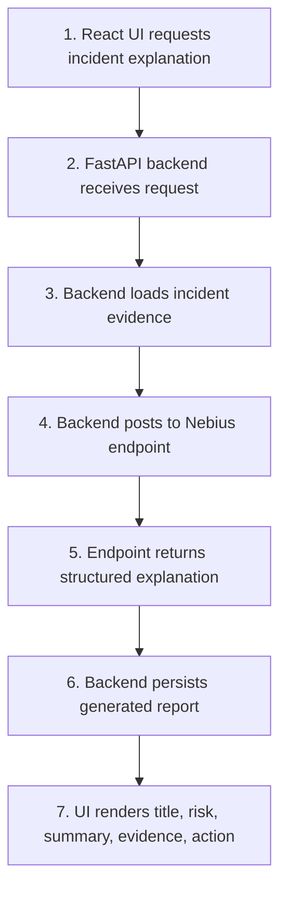
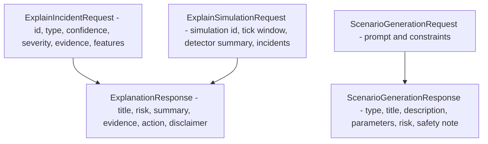

# ARD-0005: Nebius Endpoint Contract

Status: Accepted

Date: 2026-06-01

## Context

The backend needs AI-generated explanations for detected synthetic incidents and simulation summaries. The UI should not call Nebius directly. The backend should pass structured detector evidence to the serverless endpoint and receive structured response fields that can be stored and rendered.

## Decision

Expose Nebius Serverless AI Endpoints with explicit health, event explanation, simulation explanation, report-generation, and bounded scenario-generation routes.

Endpoint roles:

Routes:

- `GET /health`
- `POST /explain-event`
- `POST /explain-simulation`
- `POST /generate-report`
- `POST /generate-scenario`

The endpoint accepts structured JSON evidence and returns structured JSON explanation output.

## Endpoint Flow

## Contract Diagram

## Response Requirements

The endpoint response must include:

- `title`
- `risk_level`
- `plain_english_summary`
- `evidence`
- `recommended_action`
- `disclaimer`

The disclaimer must preserve the project framing: educational simulation only, no real manipulation detection, no trading signals, and no compliance decisions.

## Environment Variables

The backend reads endpoint wiring from:

- `NEBIUS_INCIDENT_EXPLAINER_URL`
- `NEBIUS_SCENARIO_GENERATOR_URL`
- `NEBIUS_API_KEY` optional
- `NEBIUS_TENANT_ID` optional metadata/status field

## Consequences

Positive:

- UI remains decoupled from Nebius credentials and endpoint details.
- Explanations are grounded in deterministic detector evidence.
- Reports can be persisted with clear schema.

Tradeoffs:

- Backend must handle endpoint failures gracefully.
- Endpoint contract changes require backend and UI updates.
- Generated summaries still require safety framing and review.

## Related Documentation

- `docs/nebius-deployment.md`
- `serverless/endpoint/README.md`
- [ARD-0003: Detector Evidence Model](ARD-0003-detector-evidence-model.md)
- [ARD-0008: Nebius Serverless AI Endpoints](ARD-0008-nebius-serverless-ai-endpoints.md)
- [ARD-0009: Judge Mode Investigation Reports](ARD-0009-judge-mode-investigation-reports.md)
