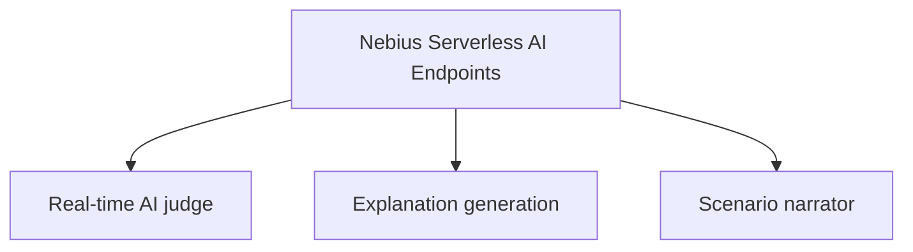
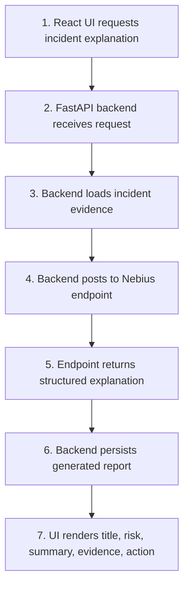
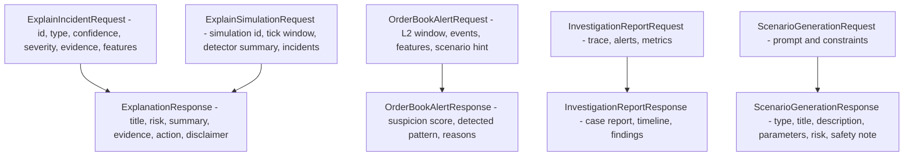

# ARD-0005: Nebius Endpoint Contract

Status: Accepted

Date: 2026-06-01

## Implementation Status

Status as of 2026-06-23: `[partial]`

Implemented:

- Serverless endpoint app exposes health, explanation, scenario generation, smart scenario, order-book alert, and investigation-report routes.
- Backend `NebiusClient` shapes typed requests, handles environment-based URLs, and falls back to deterministic typed mock responses.
- UI and backend routes support incident explanation, smart detection, investigation report generation, and scenario drafting without exposing endpoint credentials to the browser.
- Endpoint contract tests cover the local serverless app.

Not yet complete:

- The contract has not yet been proven with an archived real Nebius endpoint execution.
- Production authentication, rate limiting, and endpoint observability evidence remain follow-up work.

## Context

The backend needs AI-generated explanations for detected synthetic incidents,
simulation summaries, smart order-book alert scoring, and investigation-style
reports. The UI should not call Nebius directly. The backend should pass
structured detector evidence to the serverless endpoint and receive structured
response fields that can be stored and rendered.

## Decision

Expose Nebius Serverless AI Endpoints with explicit health, smart detection,
investigation report, event explanation, simulation explanation,
report-generation, and bounded scenario-generation routes.

Endpoint roles:

Routes:

- `GET /health`
- `POST /orderbook-alert`
- `POST /investigation-report`
- `POST /explain-event`
- `POST /explain-simulation`
- `POST /generate-report`
- `POST /generate-scenario`
- `POST /generate-smart-scenario`

The endpoint accepts structured JSON evidence and returns structured JSON explanation output.

## Endpoint Flow

## Contract Diagram

## Response Requirements

Explanation responses must include:

- `title`
- `risk_level`
- `plain_english_summary`
- `evidence`
- `recommended_action`
- `disclaimer`

Order-book alert responses must include:

- `suspicion_score`
- `detected_pattern`
- `confidence`
- `reasons`
- `recommended_action`

Investigation report responses must include:

- `title`
- `summary`
- `timeline`
- `detector_findings`
- `limitations`
- `recommended_next_steps`

The disclaimer must preserve the project framing: educational simulation only, no real manipulation detection, no trading signals, and no compliance decisions.

## Environment Variables

The backend reads endpoint wiring from:

- `NEBIUS_INCIDENT_EXPLAINER_URL`
- `NEBIUS_SCENARIO_GENERATOR_URL`
- `NEBIUS_ENDPOINT_BASE_URL`
- `NEBIUS_API_KEY` optional
- `NEBIUS_TENANT_ID` optional metadata/status field

## Consequences

Positive:

- UI remains decoupled from Nebius credentials and endpoint details.
- Explanations are grounded in deterministic detector evidence.
- Reports can be persisted with clear schema.

Tradeoffs:

- Backend must handle endpoint failures gracefully.
- Endpoint contract changes require backend and UI updates.
- Generated summaries still require safety framing and review.

## Related Documentation

- `docs/nebius-deployment.md`
- `serverless/endpoint/README.md`
- [ARD-0003: Detector Evidence Model](ARD-0003-detector-evidence-model.md)
- [ARD-0008: Nebius Serverless AI Endpoints](ARD-0008-nebius-serverless-ai-endpoints.md)
- [ARD-0009: Judge Mode Investigation Reports](ARD-0009-judge-mode-investigation-reports.md)
