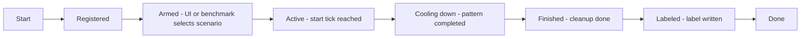
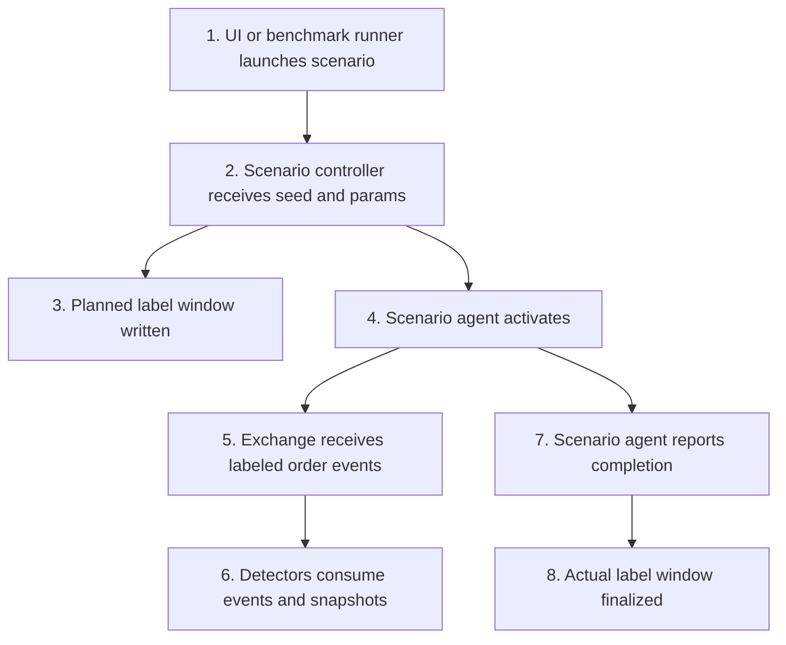
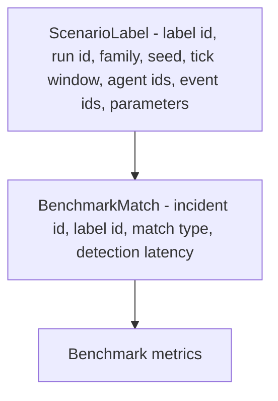

# ARD-0006: Scenario Labeling and Reproducibility

Status: Accepted

Date: 2026-06-01

## Implementation Status

Status as of 2026-06-23: `[partial]`

Implemented:

- Scenario IDs, families, parameters, and metadata propagate through scenario controllers, agents, exchange events, detector inputs, and benchmark outputs.
- Benchmark and dataset scripts write scenario/attack labels for detector evaluation.
- Tests cover scenario launch, metadata preservation, and deterministic scenario behavior.

Not yet complete:

- Live-demo label records do not yet fully finalize every event/order ID linkage described in this ARD.
- Reproducible replay packaging from a saved label set is still limited to local benchmark and dataset scripts.

## Context

Scenario agents generate synthetic abuse-like behavior for demos and benchmarks. To measure detector precision and recall, the system needs ground-truth labels describing which scenario ran, when it was active, and which events belong to it.

The benchmark job also needs deterministic replay so results can be regenerated from a fixed seed.

## Decision

Every scenario launch must create a label record with:

- scenario id
- scenario family
- run id
- random seed
- start tick
- expected end tick or actual end tick
- involved synthetic agents
- event ids or order ids when available
- parameter values used by the scenario

The benchmark job writes these labels to `scenario_labels.jsonl` and evaluates detector incidents against labeled tick windows.

## Scenario Lifecycle

## Labeling Flow

## Label Schema

## Reproducibility Rules

- Use an explicit seed for every benchmark run.
- Persist scenario parameters alongside labels.
- Avoid wall-clock timestamps as the primary benchmark coordinate; use ticks.
- Keep label windows separate from detector output.
- Evaluate detector results against labels after the simulation run completes.

## Consequences

Positive:

- Precision, recall, and F1 can be computed consistently.
- Scenario behavior can be replayed and debugged.
- Detector false positives and false negatives can be traced to label windows.

Tradeoffs:

- Scenario agents must expose their parameters.
- Benchmark output includes additional label artifacts.
- Live demos may need a lighter label path than offline benchmarks.

## Related Documentation

- `PHASES.md`
- `docs/benchmark-methodology.md`
- [ARD-0004: Benchmark Artifact Format](ARD-0004-benchmark-artifact-format.md)
