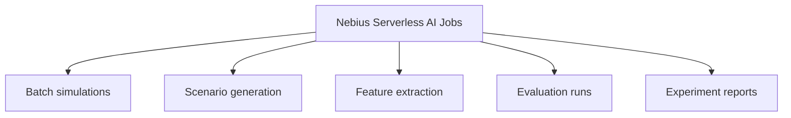
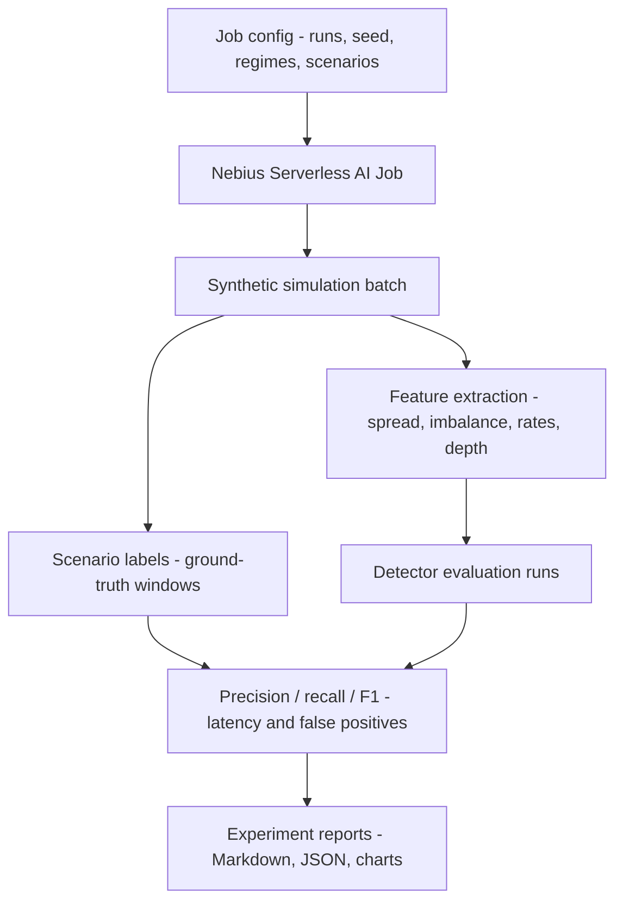

# ARD-0007: Nebius Serverless AI Jobs

Status: Accepted

Date: 2026-06-02

## Implementation Status

Status as of 2026-06-23: `[partial]`

Implemented:

- Detector tournament, batch benchmark, synthetic dataset factory, and parallel attack/detect batch scripts under `serverless/jobs/`.
- Job Dockerfile, example configs, Nebius job config, image build script, and submit script with dry-run support.
- Backend and UI paths for smart batch creation, artifact workbench access, usage evidence, and local parsing of benchmark artifacts.

Not yet complete:

- One real Nebius Serverless AI Job execution has not yet been archived with logs, metrics screenshots, and resulting artifacts.
- Cost/runtime guardrails are documented but not enforced by a remote job policy layer.

## Context

Experiment Mode needs repeatable offline work that is too heavy or too slow for
the live arena request path. The project needs batch simulations, synthetic
dataset generation, feature extraction, detector evaluation, and report
generation while keeping the UI responsive.

The job path must also control cost and runtime. Development runs should use
small synthetic batches before any larger challenge benchmark run.

## Decision

Use Nebius Serverless AI Jobs for offline experiment workloads:



The job runner accepts a bounded configuration, runs synthetic simulations,
collects detector outputs against known labels, and writes artifacts under a
run-specific output directory.

Phase 4 adds a smart attack/detect batch runner under `serverless/jobs/` that
can execute many independent simulations concurrently. The default demo command
uses 100 parallel workers so endpoint/job observability can show ramp-up and
ramp-down behavior.

## Job Flow



## Scope

In scope:

- small and medium synthetic benchmark batches
- detector tournament benchmarks
- parallel attack/detect batches across normal, spoofing, layering, quote
  stuffing, and pump-and-cancel scenarios
- synthetic dataset generation from simulator events
- feature extraction from event and snapshot artifacts
- benchmark reports, metrics, and charts

Out of scope:

- real market data ingestion
- real manipulation detection
- trading signals
- compliance decisioning
- unbounded or uncontrolled large-scale dataset generation

## Cost Controls

Default development runs should stay small:

- `runs=100` for smoke and local validation
- `runs=500` for medium comparison
- `runs=1000` only for final benchmark evidence when needed

Job configuration must make run count, scenario set, market regime, seed, and
output directory explicit.

## Artifact Contract

Jobs write artifacts compatible with
[ARD-0004: Benchmark Artifact Format](ARD-0004-benchmark-artifact-format.md):

```text
outputs/benchmark/<run_id>/
  benchmark_report.md
  benchmark_results.json
  detector_metrics.csv
  incidents.jsonl
  scenario_labels.jsonl
  charts/

outputs/serverless-batch/<run_id>/
  order_book_events.jsonl
  trades.jsonl
  attack_labels.jsonl
  blue_team_alerts.jsonl
  detector_metrics.csv
  generated_report.md
  manifest.json
```

## Consequences

Positive:

- Experiment Mode is separated from the live UI path.
- Detector quality can be measured repeatably.
- Reports and charts can be regenerated from artifacts.

Tradeoffs:

- Job configs and artifact schemas need versioning.
- Large runs can consume credits quickly if not bounded.
- Offline results may not exactly match live arena timing.

## Related Documentation

- `docs/nebius-deployment.md`
- `docs/benchmark-methodology.md`
- `serverless/jobs/README.md`
- [ARD-0004: Benchmark Artifact Format](ARD-0004-benchmark-artifact-format.md)
- [ARD-0006: Scenario Labeling and Reproducibility](ARD-0006-scenario-labeling-and-reproducibility.md)
