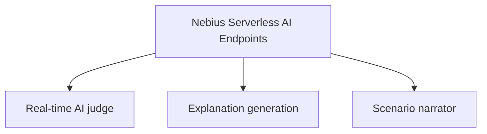
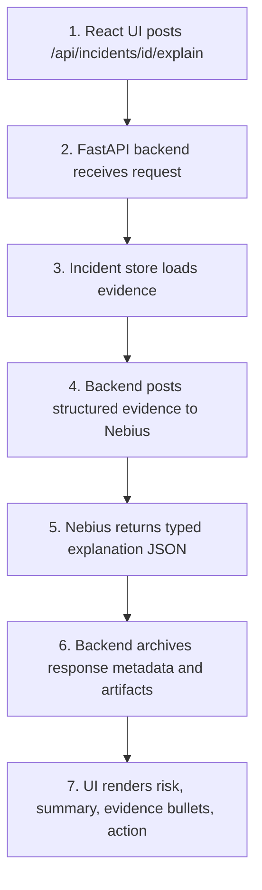
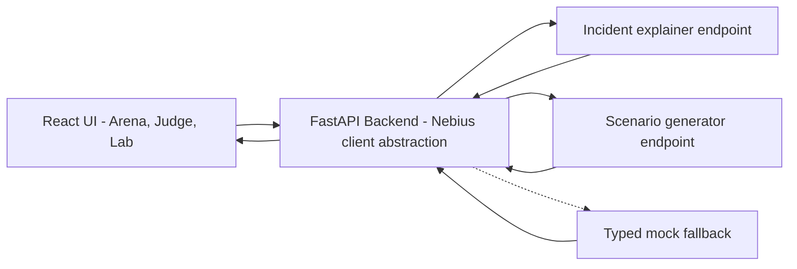

# ARD-0008: Nebius Serverless AI Endpoints

Status: Accepted

Date: 2026-06-02

## Implementation Status

Status as of 2026-07-14: `[partial]`

Implemented:

- Serverless endpoint app, endpoint Dockerfile/configs, prompt scaffolding, and endpoint contract tests.
- FastAPI backend integration boundary with URL/env configuration, optional API key, timeout handling, and typed fallback responses.
- UI flows for AI incident explanation, smart order-book alert scoring, investigation reports, and bounded red-team scenario drafting.
- Real Endpoint investigations with latency, fallback, response, and S3 evidence are archived in the frozen [benchmark bundle](../../evidence/deployment-2026-07-14-1412/benchmarks/outputs/benchmark/EXP-390EFAC2/README.md), with consolidated latency in the submission index.

Scope boundary:

- The endpoint path remains a demo/integration surface, not a production monitoring service.

## Context

Live Arena Mode and Judge Mode need low-latency AI assistance without exposing
Nebius endpoint URLs or API tokens to the browser. The backend should send
structured, bounded evidence to Nebius and receive structured outputs that the
UI can render safely.

The endpoint path can run a small classifier, an LLM, or both. Deterministic
backend detectors remain the primary local baseline; the endpoint adds smart
order-book alert scoring and report generation for the Nebius demo path.

## Decision

Use Nebius Serverless AI Endpoints for interactive AI requests:



The FastAPI backend is the integration boundary. It reads endpoint URLs and
optional tokens from environment variables, shapes request payloads, handles
timeouts, and falls back to typed mock responses when endpoints are not
configured.

## Endpoint Flow



## Endpoint Responsibilities

The endpoints support:

- `/orderbook-alert` for suspicion score plus detected synthetic pattern from a
  recent L2 order-book window
- `/investigation-report` for a human-readable synthetic case report from trace,
  alerts, and metrics
- incident explanation from detector evidence
- selected timeline segment explanation for Judge Mode
- scenario narration for demo playback
- bounded red-team scenario draft generation

They do not:

- inspect live market data directly
- decide whether manipulation occurred in real markets
- provide trading signals
- make compliance decisions

## Environment Contract

Endpoint wiring is controlled by environment variables:

```text
NEBIUS_INCIDENT_EXPLAINER_URL
NEBIUS_SCENARIO_GENERATOR_URL
NEBIUS_ENDPOINT_BASE_URL
ENDPOINT_TOKEN optional
NEBIUS_TENANT_ID optional metadata/status field
```

Secrets must not be committed. The UI never receives the endpoint token.

## Component Diagram



## Consequences

Positive:

- Secrets remain server-side.
- UI receives stable response shapes.
- Local development works without deployed Nebius endpoints.
- AI output remains grounded in deterministic detector evidence.

Tradeoffs:

- Endpoint schema changes require backend client updates.
- Timeout and fallback behavior must be visible in the UI.
- Generated narration must preserve educational safety framing.

## Related Documentation

- `docs/nebius-deployment.md`
- `serverless/endpoint/README.md`
- [ARD-0003: Detector Evidence Model](ARD-0003-detector-evidence-model.md)
- [ARD-0005: Nebius Endpoint Contract](ARD-0005-nebius-endpoint-contract.md)
