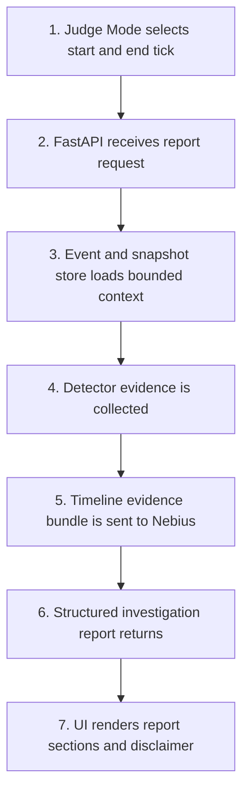
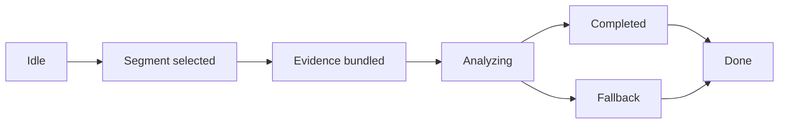

# ARD-0009: Judge Mode Investigation Reports

Status: Accepted

Date: 2026-06-02

## Implementation Status

Status as of 2026-06-23: `[partial]`

Implemented:

- Backend investigation-report endpoint contract and Nebius client response model.
- UI report/replay surfaces for incident-centered evidence review and generated investigation summaries.
- Artifact workbench actions for exporting, replaying, comparing, and promoting report evidence.

Future work:

- A dedicated Judge Mode timeline-window selector with bounded evidence bundling is not fully implemented.
- Persisted report workflow exists through the artifact/report surfaces, but the full state machine in this ARD remains future work.

## Context

Judge Mode should let an operator select a timeline segment and ask an AI judge
to explain what happened. The output should look like an investigation report
for the synthetic simulator, while preserving the project disclaimer: this is
not real market surveillance and not compliance tooling.

Judge Mode connects the demo experience to the engineering evidence path. It
uses deterministic detector evidence, order-book snapshots, agent events, and
scenario labels as inputs.

## Decision

Implement Judge Mode as a backend-mediated endpoint workflow:

1. The UI selects a timeline window.
2. The backend gathers bounded evidence for that window.
3. The backend calls a Nebius Serverless AI Endpoint.
4. The endpoint returns a structured investigation report.
5. The backend returns and may persist the report.

## Investigation Flow

## Report Shape

Judge Mode reports should include:

- title
- selected time window
- synthetic scenario context
- detector confidence timeline
- key order-book observations
- evidence bullets
- plain-English explanation
- recommended review action
- educational simulation disclaimer

## Evidence Boundary

The AI judge receives a bounded, pre-processed evidence bundle. It should not
receive entire event logs or large raw datasets during interactive use.

Recommended interactive payload bounds:

- 5 to 15 seconds of timeline context
- top 5 to 10 book levels around mid
- latest detector scores and evidence items
- relevant agent events and scenario labels

## State Diagram

## Consequences

Positive:

- The challenge demo gets a clear AI-assisted investigation surface.
- The report is grounded in deterministic simulator evidence.
- Payload bounds control latency, cost, and prompt drift.

Tradeoffs:

- Judge Mode needs careful schema design before implementation.
- Generated reports can sound more authoritative than intended unless the
  disclaimer is mandatory.
- Timeline selection and evidence bundling require UI and backend coordination.

## Related Documentation

- `docs/nebius-deployment.md`
- `docs/runtime-model.md`
- [ARD-0003: Detector Evidence Model](ARD-0003-detector-evidence-model.md)
- [ARD-0008: Nebius Serverless AI Endpoints](ARD-0008-nebius-serverless-ai-endpoints.md)
