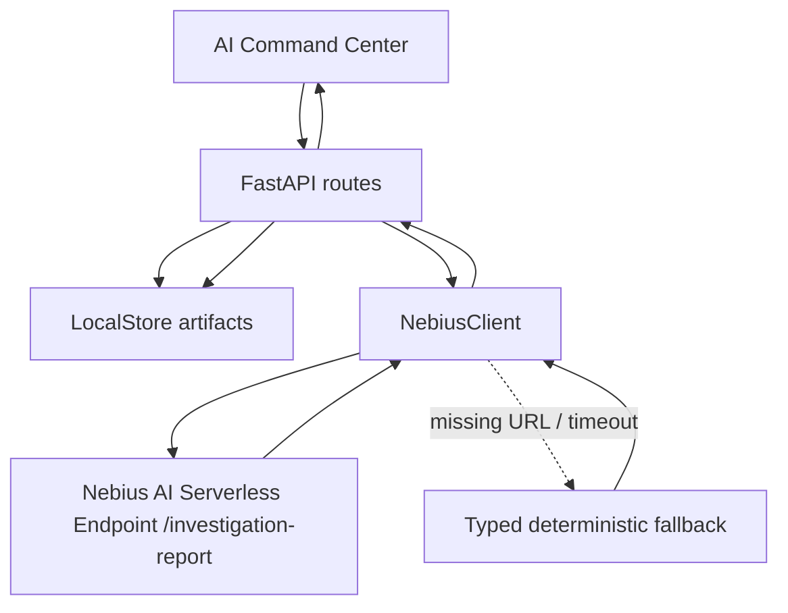

# ARD-001: Nebius AI Investigation Team

Status: Done

Date: 2026-07-06

## Context

AIMADA already generates synthetic incidents, detector alerts, replay evidence, and experiment artifacts. The product should present this as a Nebius AI Serverless-powered investigation workflow, not as a simulator with optional AI buttons.

Existing code already has most of the path:

- `backend/app/nebius/client.py`: `InvestigationReportRequest`, `InvestigationReportResponse`, `NebiusClient.investigation_report()`
- `backend/app/api/routes_nebius.py`: `POST /api/nebius/investigation-report`
- `backend/app/experiments/investigation_pipeline.py`: `run_batch_investigations()`
- `backend/app/api/routes_experiments.py`: `POST /api/experiments/{experiment_id}/run-investigations`
- `serverless/endpoint/app.py`: `POST /investigation-report`
- `frontend/src/pages/NebiusControlPanelPage.tsx`: AI Investigation action area

## Decision

Use Nebius AI Serverless Endpoint as the central execution layer for investigation reports. The FastAPI backend remains the boundary for evidence shaping, endpoint configuration, persistence, and fallback behavior.



## Objective

Turn detector outputs into analyst-readable investigation reports through Nebius AI Serverless, while preserving deterministic fallback for local demos.

## Current Code To Reuse

- Incident evidence: `backend/app/schemas/arena.py`, `backend/app/api/routes_incidents.py`
- Batch alerts: `serverless/jobs/run_batch_experiments.py` writes `blue_team_alerts.jsonl`
- Experiment investigation: `backend/app/experiments/investigation_pipeline.py`
- Report response parser and fallback: `backend/app/nebius/client.py`
- Frontend trigger: `runManagedExperimentInvestigations()` in `frontend/src/api/client.ts`

## Backend Changes

- Keep `POST /api/nebius/investigation-report` for direct report generation.
- Keep `POST /api/experiments/{experiment_id}/run-investigations?top_k=7` as batch investigation path.
- Enrich `InvestigationReportRequest` with compact fields when available:
  - `experiment_id`
  - `run_id`
  - `alert_id`
  - `scenario`
  - `detector`
- Persist result mode and fallback reason in investigation artifact JSON.

## Serverless Endpoint Changes

- Reuse `serverless/endpoint/app.py`.
- Keep `POST /investigation-report`.
- Add stricter validation only if model output is unstable; do not change backend response shape unless frontend contract changes too.

## Frontend Changes

- AI Command Center keeps one action: `Run AI Investigation`.
- Show `mode`, investigation count, and artifact links.
- If mode is mock/fallback, show it as deterministic fallback.
- Keep Google Auth hidden from this flow.

## Data Contracts

Request to backend:

```json
{
  "scenario_trace": {
    "id": "Spoofing Attack #042",
    "active_window": "last 60 seconds",
    "source": "arena"
  },
  "alerts": [
    {
      "alert_id": "batch-000012-SpoofingWallDetector",
      "run_id": "batch-000012",
      "tick": 14,
      "scenario": "spoofing",
      "detector": "SpoofingWallDetector",
      "confidence": 0.91,
      "evidence": ["large bid wall", "cancel before execution"]
    }
  ],
  "metrics": {
    "precision": 0.82,
    "recall": 0.76,
    "f1": 0.79
  }
}
```

Response from backend:

```json
{
  "mode": "nebius",
  "endpoint": "https://<endpoint>/investigation-report",
  "title": "Synthetic investigation report: spoofing",
  "summary": "Evidence is consistent with a synthetic spoofing-like pattern.",
  "timeline": ["tick 8: quote wall appears", "tick 14: detector alert"],
  "detector_findings": ["confidence 0.91 from wall size and cancellation"],
  "limitations": ["synthetic data only"],
  "recommended_next_steps": ["review replay", "compare detector threshold"]
}
```

## Fallback / Mock Behavior

- Missing `NEBIUS_INVESTIGATION_REPORT_URL` and `NEBIUS_ENDPOINT_BASE_URL` returns `mode: "mock"`.
- Endpoint running with `NEBIUS_ENDPOINT_MODE=mock` returns `model_mode: "deterministic_fallback"`.
- Exceptions in `NebiusClient.investigation_report()` return typed fallback with `fallback_reason`.

## Demo Script

1. Open `/nebius`.
2. Create detector tournament.
3. Run Local Demo tournament.
4. Click `Run AI Investigation`.
5. Show `experiments/{id}/investigations/` artifacts.
6. Switch to Cloud mode and show endpoint status.

## Acceptance Criteria

- `POST /api/nebius/investigation-report` returns typed JSON in mock and endpoint modes.
- `POST /api/experiments/{id}/run-investigations` writes investigation artifacts.
- UI displays investigation count and fallback mode.
- No frontend route requires Google Auth.
- Report never claims real market abuse detection.

## Risks And Shortcuts

- Risk: evidence payload grows too large. Shortcut: keep top `top_k=7` alerts and summarize metrics.
- Risk: endpoint returns invalid JSON. Shortcut: serverless endpoint validates model output and uses deterministic report.
- Risk: demo has no endpoint. Shortcut: show fallback mode and endpoint health in command center.
