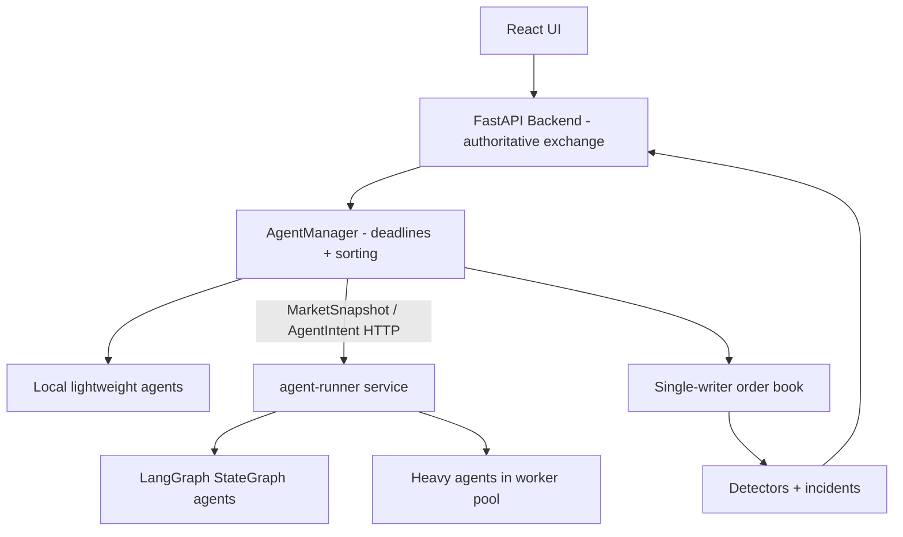

# ARD-0010: Agent Runner Execution Architecture

Status: Accepted

Date: 2026-06-23

## Implementation Status

Status as of 2026-06-23: `[done]`

Implemented:

- In-process `AgentManager` that gathers agent intents with per-tick deadlines.
- Remote HTTP `agent-runner` service with `/health`, `/agents`, and `/decide` endpoints.
- Backend `RemoteAgentClient` integration through `ARENA_REMOTE_AGENT_URLS`.
- Heavy-agent worker-pool execution inside `agent-runner` using process-pool workers.
- Generic LangGraph-compatible remote agents built with `StateGraph` and compiled graphs.
- Docker Compose separation between backend/exchange and agent-runner containers.

Future work:

- Authentication or signing between backend and remote agent runners.
- Durable queue transport for high-latency WAN runners.
- Full LangGraph checkpointing/persistence for long-running stateful agents.

## Context

The live arena needs to support many agents without allowing concurrent writes to the order book. Some agents are lightweight deterministic strategies, while future agents may be CPU-heavy, LLM-backed, or LangGraph workflows. Running all of that inside the FastAPI backend would increase memory pressure and make the exchange less predictable.

## Decision

Separate agent decision work from exchange mutation.

The backend remains the authoritative exchange and order-book writer. Agents receive a read-only `MarketSnapshot` and return `AgentIntent` objects. The backend sorts accepted intents by tick, latency bucket, agent id, sequence, and kind before applying them to the book. Runtime `set_level` intents update each agent's own bounded synthetic quote; the backend then restores the baseline ladder invariant before publishing state.

Remote runners expose a small HTTP protocol:

- `GET /health`
- `GET /agents`
- `POST /decide`

`POST /decide` accepts:

```json
{
  "snapshot": {
    "tick": 1,
    "bids": [],
    "asks": [],
    "best_bid": 68124.0,
    "best_ask": 68126.0,
    "mid": 68125.0,
    "spread": 2.0
  }
}
```

It returns:

```json
{
  "runner_id": "remote-1",
  "agent_ids": ["REMOTE_LANGGRAPH_001"],
  "intents": [
    {
      "tick": 1,
      "agent_id": "REMOTE_LANGGRAPH_001",
      "kind": "set_level",
      "side": "ask",
      "price": 68126.0,
      "quantity": 2.1
    }
  ]
}
```

## Architecture



## LangGraph Compatibility

Generic remote agents in `agent-runner/langgraph_agents.py` are implemented with LangGraph `StateGraph`:

- graph state contains the market snapshot, agent id, strategy, and output intents
- `observe` node derives depth and imbalance features
- `decide` node emits one or more `AgentIntent` objects
- compiled graphs are invoked by the runner behind `/decide`

This makes remote agents replaceable with richer LangGraph workflows later without changing the backend exchange protocol.

## Consequences

Positive:

- Agent decision work can scale independently from the exchange backend.
- Heavy or LangGraph agents cannot mutate the book directly.
- Remote agent quote output is bounded by backend exchange guardrails.
- Remote runners can move to another container or server by changing `ARENA_REMOTE_AGENT_URLS`.
- The exchange remains deterministic and testable.

Tradeoffs:

- Remote HTTP calls add per-tick latency and failure modes.
- Missed deadlines drop runner output for that tick.
- Multi-server runners need authentication and observability before production use.

## Related Documentation

- `docs/runtime-model.md`
- `docs/architecture.md`
- [ARD-0001: Overall Architecture](ARD-0001-overall-architecture.md)
- [ARD-0003: Detector Evidence Model](ARD-0003-detector-evidence-model.md)
- [ARD-0011: Exchange Liquidity Invariant And Agent Quote Ownership](ARD-0011-exchange-liquidity-invariant.md)
