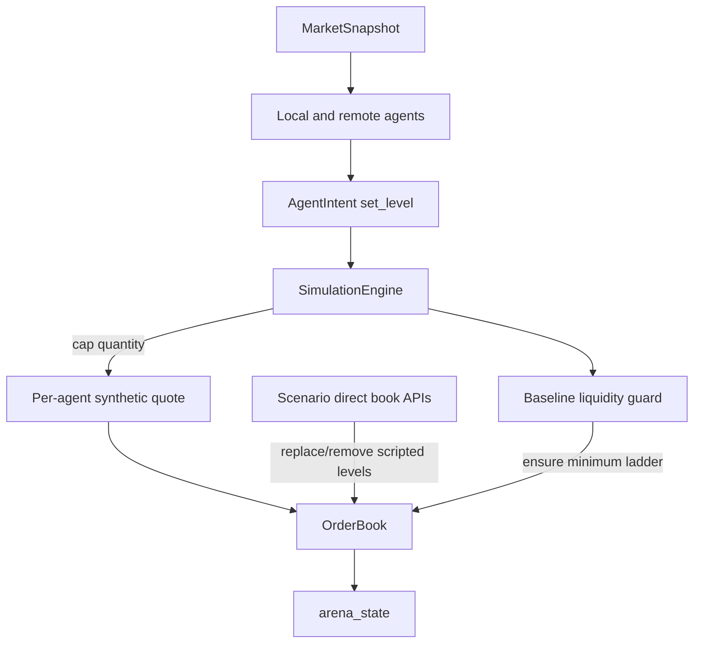

# ARD-0011: Exchange Liquidity Invariant And Agent Quote Ownership

Status: Accepted

Date: 2026-06-23

## Implementation Status

Status as of 2026-06-23: `[done]`

Implemented:

- Baseline bid/ask ladder guard in the backend simulation engine.
- Per-agent synthetic quote ownership for runtime `set_level` intents.
- `ARENA_BASELINE_LIQUIDITY_*` configuration for ladder depth, size, tick size, and reference price.
- `ARENA_MAX_AGENT_QUOTE_SIZE` guardrail to cap normal/remote agent quote size before exchange mutation.
- Regression tests for empty-side reseeding, shared-price additive liquidity, quote clamping, and long-run bounded depth.

Not yet complete:

- Dynamic reference-price tracking for regimes where the simulated mid should drift materially.
- Per-agent inventory and risk limits beyond the current quote-size cap.
- UI controls for tuning the baseline ladder from the browser.

## Context

The arena now supports hundreds of local and remote agents. Earlier runtime agents treated a `set_level` intent as "replace the whole visible price level." That worked for a small number of synthetic agents, but it created two problems at higher scale:

1. Multiple agents quoting the same price overwrote each other instead of contributing independent liquidity.
2. Market orders and scenarios could consume or remove all asks or bids, after which agents that depended on an existing best quote could not reseed that side.

The exchange must remain synthetic and educational, but it still needs basic market invariants so detector behavior is stable and readable.

## Decision

Maintain a baseline exchange liquidity invariant after every simulation tick.

The backend simulation owns a configured reference-price ladder. After applying agent intents and scenario effects, it ensures at least the configured bid and ask levels exist around the reference price. If a side was fully consumed, the guard recreates it before the next `arena_state` is published.

Runtime `set_level` intents are interpreted as per-agent quote updates, not whole-level replacement. Each agent owns its own synthetic order at a price. The visible level quantity is the sum of all resting orders at that price. Scripted scenarios still use direct order-book replacement APIs when they intentionally need walls, layer placement, or cancellations.

Agent quote sizes are capped before mutation by `ARENA_MAX_AGENT_QUOTE_SIZE`, so a bad or experimental remote agent cannot create pathological visible depth.

## Architecture

## Consequences

Positive:

- The live book remains two-sided even after aggressive market orders or liquidity-shock scenarios.
- Hundreds of agents can quote the same price without overwriting each other.
- Bad remote agent output is bounded before it can distort the exchange.
- Detector signals remain interpretable because book collapse is a scenario effect, not a permanent simulator failure.

Tradeoffs:

- The baseline guard makes the exchange less like a fully free-running market; it is intentionally a bounded simulator.
- A fixed reference price is simple and stable, but future drifting-market regimes should use a reference-price model.
- Additive per-agent quotes require agents to emit their own quote size rather than aggregate level size.

## Related Documentation

- `docs/runtime-model.md`
- `docs/architecture.md`
- [ARD-0001: Overall Architecture](ARD-0001-overall-architecture.md)
- [ARD-0010: Agent Runner Execution Architecture](ARD-0010-agent-runner-execution.md)
