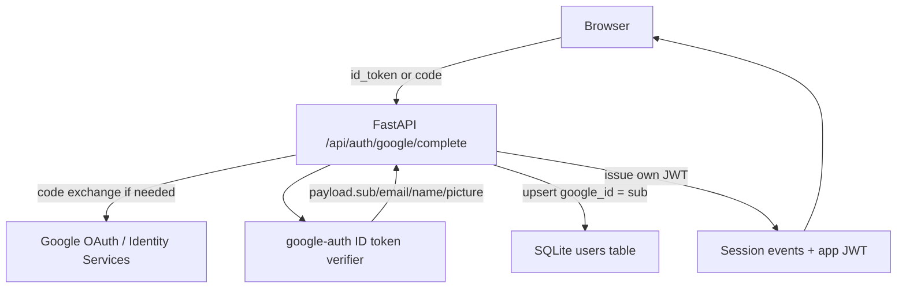

# ARD-0012: Google Authentication And App Sessions

Status: Accepted

Date: 2026-06-24

## Implementation Status

Status as of 2026-06-24: `[done]`

Implemented:

- Google ID token verification using `google-auth` when `GOOGLE_CLIENT_ID` is configured.
- Optional Google authorization-code exchange using `GOOGLE_CLIENT_ID` and `GOOGLE_CLIENT_SECRET`; the frontend popup code flow passes the browser origin as `redirect_uri`, while redirect-mode clients may provide their callback URI explicitly.
- SQLite-backed `users` table under `ARENA_OUTPUT_DIR/auth/auth.db`.
- User persistence fields: `id`, `email`, `name`, `avatar_url`, `google_id`, `auth_provider`, `created_at`, and `updated_at`.
- Stable Google user identity through `google_id = payload.sub`.
- App-issued HS256 JWT after Google verification; Google tokens are not used as long-lived app sessions.
- Backward-compatible `X-AIMADA-Session-ID` session header plus `Authorization: Bearer <app-jwt>` support.
- Frontend maps authenticated users into the platform identity model defined by ARD-0014; when Google is not configured, the UI uses the local `Demo Analyst` identity and `Aimada Surveillance Desk` workspace.

Future work:

- JWT refresh-token rotation and revocation list.
- Moving app JWT signing to an asymmetric key pair or external secret manager.

## Context

The previous auth flow was a local Google stub used to attach a tournament persona and history snapshots to a browser session. That was enough for demos, but it did not verify Google identity and did not store users in a durable user table.

The arena needs real Google authentication while preserving the existing local development path and history snapshot behavior.

## Decision

The backend owns authentication completion.

A client sends either a Google `id_token` or an OAuth authorization code to `POST /api/auth/google/complete`. If `GOOGLE_CLIENT_ID` is configured, the backend verifies the resulting Google ID token and extracts the stable Google identifier from `payload.sub`. Google Identity Services popup authorization codes are exchanged with the browser origin as `redirect_uri`; redirect-mode clients may pass their callback URI explicitly. The backend then upserts the user into SQLite and creates its own short-lived app JWT.

The Google token is only an input proof. It is not stored as the arena session token and is not reused as the app session. The app session is represented by:

- a server-side session event in `auth/sessions.jsonl` for history restore/logout flows
- an app-issued JWT returned as `access_token`

## User Table

```sql
CREATE TABLE users (
  id TEXT PRIMARY KEY,
  email TEXT NOT NULL,
  name TEXT NOT NULL,
  avatar_url TEXT,
  google_id TEXT NOT NULL UNIQUE,
  auth_provider TEXT NOT NULL CHECK (auth_provider = 'google'),
  created_at TEXT NOT NULL,
  updated_at TEXT NOT NULL
);
```

## Request Flow



## Consequences

Positive:

- Google identity is verified before user creation when OAuth is configured.
- `payload.sub` is the stable external identity and is unique in the DB.
- The app is not coupled to Google tokens for its own session lifetime.
- Local demo mode still works without Google credentials.
- Google login now has product purpose beyond decoration: it supplies the platform user identity used for case ownership, report attribution, and audit-trail records.

Tradeoffs:

- HS256 signing requires `AIMADA_JWT_SECRET` to be strong and private in deployed environments.
- SQLite is appropriate for the local arena but should be migrated if multi-instance backend writes are needed.
- The frontend uses Google Identity Services for configured deployments, while local stub mode remains available when Google credentials are absent.

## Related Documentation

- `README.md`
- `docs/runtime-model.md`
- [ARD-0001: Overall Architecture](ARD-0001-overall-architecture.md)
- [ARD-0013: UI Shell Preferences And Demo Presentation](ARD-0013-ui-shell-preferences.md)
- [ARD-0014: Multiuser Platform Foundation](ARD-0014-multiuser-platform-foundation.md)
