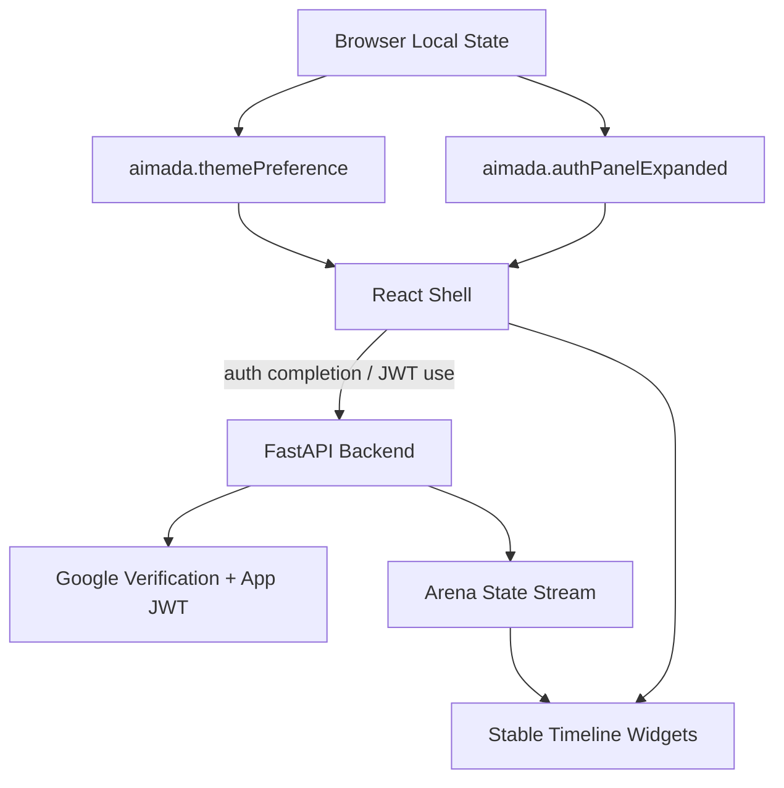

# ARD-0013: UI Shell Preferences And Demo Presentation

Status: Accepted

Date: 2026-06-24

## Implementation Status

Status as of 2026-06-24: `[done]`

Implemented:

- README/GitHub banner switched to `assets/img/ai-mada.jpg`.
- Stale UI subtitle text removed from the product shell.
- Compact vertical navigation collapse/expand control sized closer to browser vertical-tab controls.
- Collapsible Google/auth widget with `aimada.authPanelExpanded` local persistence and compact authenticated account state.
- Day/night/system theme preference with `aimada.themePreference`, document `data-theme`, and system-mode `prefers-color-scheme` handling.
- Light-theme and dark-theme surface, border, text, chart, status, bid/ask, warning, danger, success, and accent tokens for shared widgets.
- Theme-aware Recharts timeline colors, tooltips, and axes.
- Theme-aware Liquidity Map canvas background, axis labels, grid line, low-liquidity cells, and bid/ask/abuser colors.
- Liquidity Map/timeline frame updates gated by arena tick progression so paused or not-started state remains visually stable.

Not yet complete:

- Final screenshot set under `assets/screenshots/`.
- Dedicated accessibility contrast audit for the final visual palette.

## Context

The arena is used for live demos, screenshots, and technical review. Permanent auth panels, oversized navigation controls, stale branding text, and visuals that keep moving while the simulation is stopped make the product feel less controlled than the backend runtime actually is.

The UI shell needs professional presentation behavior without moving authentication or simulation responsibility into the browser.

## Decision

Treat display and chrome state as local UI shell preferences. Authentication verification and app session issuance remain backend responsibilities, while the browser may remember how much account UI to show and which visual theme to use.

The shell supports three theme modes and applies the same semantic tokens to panels, controls, status chips, charts, order-book levels, and canvas visualizations:

- `system`: follow the operating system color-scheme preference.
- `light`: force day mode.
- `dark`: force night mode.

The shell persists those choices in local storage and applies the resolved mode through `data-theme`. The auth widget can collapse without ending the session. Navigation collapse controls are compact icon-style controls. Timeline-like widgets append frames only when backend tick values advance.

## Architecture

## Consequences

Positive:

- Demo operators can hide auth chrome and pick a theme without changing backend state.
- Google tokens remain verification input only; the UI shell never becomes the source of identity truth.
- Screenshots and recordings can use a cleaner, more stable presentation.
- Paused arena state visually matches backend runtime state.

Tradeoffs:

- More CSS tokens must be maintained across dark and light modes.
- Chart-specific light-mode tuning may still be needed after real screenshot capture.
- Local browser preferences are intentionally per-browser, not synchronized user profile settings.

## Related Documentation

- `README.md`
- `docs/DESIGN-IDEAS.md`
- `docs/PHASES.md`
- `docs/runtime-model.md`
- [ARD-0001: Overall Architecture](ARD-0001-overall-architecture.md)
- [ARD-0012: Google Authentication And App Sessions](ARD-0012-google-authentication.md)
