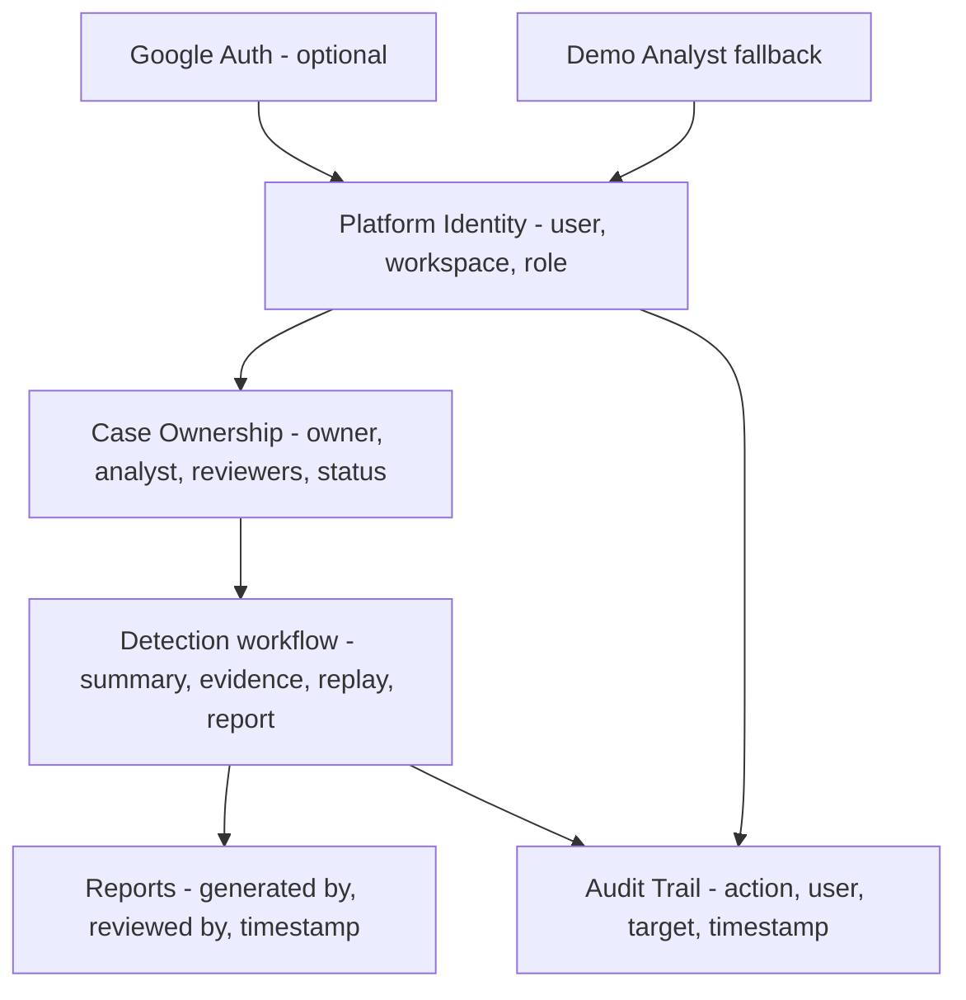

# ARD-0014: Multiuser Platform Foundation

Status: Accepted

Date: 2026-07-03

## Implementation Status

Status as of 2026-07-03: `[partial]`

Implemented:

- Shared frontend platform identity model for users, workspaces, roles, case ownership, report attribution, and audit trail entries.
- Global workspace/user menu that uses Google identity when configured and a local `Demo Analyst` fallback otherwise.
- Detection page metadata for assigned analyst, reviewer, case status, generated-by, reviewed-by, timestamps, and audit trail.
- Demo mode remains unblocked when Google Auth is unavailable.

Not yet complete:

- Durable backend workspace/organization tables.
- Backend case assignment APIs.
- Persisted audit-log APIs and immutable audit storage.
- Role-based authorization enforcement beyond UI metadata.

## Context

Google Auth should support Aimada as a multiuser investigation platform, not act as login decoration. Investigations, reports, reviewer approvals, and exported evidence need clear ownership even during local demos.

## Decision

Introduce a platform identity layer with users, workspaces, roles, case ownership, and audit trail metadata. The first implementation lives in the frontend platform model and uses authenticated Google users when available. When Google is not configured, it uses a deterministic demo identity and workspace so the product demo keeps working.

## Model

- `User`: id, name, email, avatar, auth provider.
- `Workspace`: id, name, members, default role.
- `Role`: admin, analyst, reviewer, viewer.
- `Case ownership`: owner, assigned analyst, reviewers, status, last updated by.
- `Audit entry`: user, timestamp, action type, target entity, short description.

## Consequences

Positive:

- Google identity now has a product purpose in investigations and reports.
- Demo mode remains deterministic and does not require sign-in.
- Reports can show generated-by and reviewed-by metadata.
- Investigation pages can show ownership and audit context without adding duplicate auth widgets.

Negative:

- The first implementation is metadata-oriented and not yet a durable backend authorization boundary.
- Backend persistence and role enforcement still require follow-up work.

## Related Documentation

- [ARD-0001: Overall Architecture](ARD-0001-overall-architecture.md)
- [ARD-0012: Google Authentication And App Sessions](ARD-0012-google-authentication.md)
- [ARD-0013: UI Shell Preferences And Demo Presentation](ARD-0013-ui-shell-preferences.md)
- [High-Level Architecture](../architecture.md)
