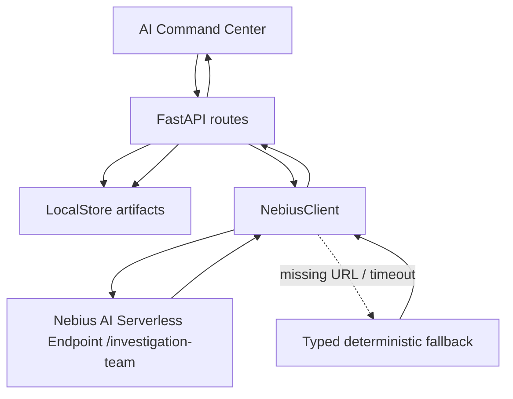

# ARD-0015: Nebius AI Investigation Team

Status: Accepted

Date: 2026-07-06

Implementation Status: `[done]`

Primary implementation:

- Backend API: `POST /api/nebius/investigation-team/analyze`
- Backend service: `backend/app/nebius/investigation_team.py`
- Serverless endpoint: `POST /investigation-team`
- Frontend surface: AI Command Center investigation team panel

## Context

LOB Arena already generates synthetic incidents, detector alerts, replay evidence, and experiment artifacts. The product should present this as a Nebius AI Serverless-powered investigation workflow, not as a simulator with optional AI buttons.

Existing code already has most of the path:

- `backend/app/nebius/client.py`: `AIInvestigationTeamRequest`, endpoint URL derivation, and fallback-aware HTTP client behavior
- `backend/app/nebius/investigation_team.py`: request shaping, Nebius client call, response normalization, and deterministic mock response
- `backend/app/api/routes_nebius.py`: `POST /api/nebius/investigation-team/analyze`
- `backend/app/experiments/investigation_pipeline.py`: `run_batch_investigations()`
- `backend/app/api/routes_experiments.py`: `POST /api/experiments/{experiment_id}/run-investigations`
- `serverless/endpoint/app.py`: `POST /investigation-team`
- `frontend/src/pages/NebiusControlPanelPage.tsx`: Nebius AI Investigation Team panel

## Decision

Use Nebius AI Serverless Endpoint as the central execution layer for an AI Investigation Team. The FastAPI backend remains the boundary for evidence shaping, endpoint configuration, persistence, and fallback behavior. Legacy investigation-report routes remain compatible, but the primary interactive workflow is the multi-agent team endpoint.



## Objective

Turn a compact replay summary into a structured multi-agent investigation through Nebius AI Serverless, while preserving deterministic fallback for local demos. The request carries simulation metadata, regime/instrument context, episode timing, summarized order-book state, trades, event timeline, derived features, cancellation/execution metrics, detector scores, and optional ground truth; it never sends an unbounded raw stream.

## Current Code To Reuse

- Incident evidence: `backend/app/schemas/arena.py`, `backend/app/api/routes_incidents.py`
- Batch alerts: `serverless/jobs/run_batch_experiments.py` writes `blue_team_alerts.jsonl`
- Experiment investigation: `backend/app/experiments/investigation_pipeline.py`
- Report response parser and fallback: `backend/app/nebius/client.py`
- Frontend trigger: `runManagedExperimentInvestigations()` in `frontend/src/api/client.ts`

## Backend Changes

- Add `POST /api/nebius/investigation-team/analyze` as the primary interactive analysis route.
- Keep `POST /api/nebius/investigation-report` as a compatibility report-generation route.
- Keep `POST /api/experiments/{experiment_id}/run-investigations?top_k=7` as batch investigation path.
- Persist team results to `nebius/investigation_team_reports.jsonl` and history artifacts.
- Preserve fallback metadata so the UI can distinguish real endpoint, endpoint mock, and local deterministic mock.

## Serverless Endpoint Changes

- Reuse `serverless/endpoint/app.py`.
- Add `POST /investigation-team`.
- Keep `POST /investigation-report` for compatibility.
- Return the same structured schema in real AI mode and deterministic mock mode.
- Validate model output before returning; if invalid, return deterministic team findings with a fallback reason.

## Frontend Changes

- AI Command Center exposes one primary action: `Run Nebius AI Investigation Team`.
- Show consensus, risk score, confidence, agent findings, evidence timeline, recommended action, and fallback mode.
- If mode is mock/fallback, show it as deterministic fallback.
- Keep Google Auth hidden from this flow.

## Data Contracts

Request to backend:

```json
{
  "incident": {
    "incident_id": "INC-00042",
    "symbol": "AIMD",
    "manipulation_type": "spoofing",
    "severity": "high"
  },
  "detector_outputs": [
    {
      "name": "spoofing_like",
      "risk_score": 0.91,
      "confidence": 0.91,
      "evidence": ["large bid wall", "cancel before execution"]
    }
  ],
  "order_book_context": {
    "symbol": "AIMD",
    "window": "last_120_ticks",
    "events": [],
    "snapshot": {}
  },
  "trades": [],
  "market_metrics": {
    "cancel_to_trade_ratio": 8.4,
    "wall_size_ratio": 5.6
  },
  "episode_summary": {
    "event_timeline": [],
    "cancellation_metrics": {},
    "execution_metrics": {},
    "price_movement": {}
  }
}
```

The endpoint validates the model's professional surveillance object (`classification`, `severity`, evidence and counter-evidence, alternatives, timeline, detector disagreement, recommended actions, and regulatory framing) and returns it as `structured_assessment` alongside the legacy team fields. This keeps existing clients compatible while making the structured contract available to new consumers.

Response from backend:

```json
{
  "investigation_id": "AIT-20260706-0001",
  "manipulation_type": "spoofing",
  "risk_score": 0.91,
  "confidence": 0.87,
  "agents": [
    {
      "name": "OrderBookExpertAgent",
      "role": "order book microstructure",
      "finding": "Large visible bid wall appeared and cancelled before execution.",
      "confidence": 0.89,
      "evidence": ["wall_size_ratio=5.6", "rapid cancellation cluster"]
    }
  ],
  "consensus": "Likely synthetic spoofing pattern.",
  "evidence_timeline": [
    {
      "timestamp": "tick-14",
      "event": "spoofing_like alert",
      "importance": "high",
      "details": "Detector confidence crossed threshold."
    }
  ],
  "recommended_action": "Review replay and compare threshold sensitivity.",
  "executive_summary": "Team findings agree that the synthetic incident matches spoofing-like pressure."
}
```

## Fallback / Mock Behavior

- Missing `NEBIUS_INVESTIGATION_TEAM_URL` and `NEBIUS_ENDPOINT_BASE_URL` returns deterministic mock output.
- Endpoint running with `NEBIUS_ENDPOINT_MODE=mock` returns `model_mode: "deterministic_fallback"`.
- Exceptions in the Nebius client path return typed fallback with `fallback_reason`.

## Demo Script

1. Open `/nebius`.
2. Create detector tournament.
3. Run Local Demo tournament.
4. Click `Run Nebius AI Investigation Team`.
5. Show `experiments/{id}/investigations/` artifacts.
6. Switch to Cloud mode and show endpoint status.

## Acceptance Criteria

- `POST /api/nebius/investigation-team/analyze` returns typed JSON in mock and endpoint modes.
- Response includes `investigation_id`, `agents`, `consensus`, `evidence_timeline`, `recommended_action`, and `executive_summary`.
- `POST /api/experiments/{id}/run-investigations` writes investigation artifacts.
- UI displays final verdict, confidence, agent findings, evidence timeline, recommended action, and fallback mode.
- No frontend route requires Google Auth.
- Report never claims real market abuse detection.

## Risks And Shortcuts

- Risk: evidence payload grows too large. Shortcut: keep top `top_k=7` alerts and summarize metrics.
- Risk: endpoint returns invalid JSON. Shortcut: serverless endpoint validates model output and uses deterministic report.
- Risk: demo has no endpoint. Shortcut: show fallback mode and endpoint health in command center.
