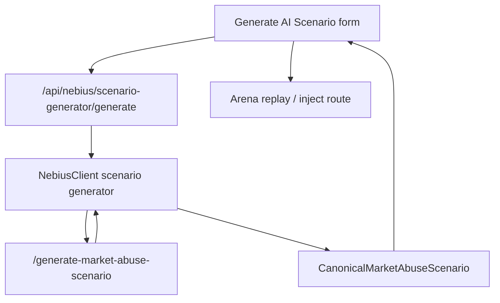

# ARD-0016: AI Scenario Generator

Status: Accepted

Date: 2026-07-06

Implementation Status: `[done]`

Primary implementation:

- Backend API: `POST /api/nebius/scenario-generator/generate`
- Backend service: `backend/app/nebius/scenario_generator.py`
- Serverless endpoint: `POST /generate-market-abuse-scenario`
- Frontend surface: AI Command Center scenario generator panel

## Context

LOB Arena already has red-team scenario generation, local templates, variant generation, and Arena injection. Phase 2 promotes this into an AI Scenario Generator where Nebius AI Serverless creates synthetic market-abuse scenarios that the existing simulator can replay.

Existing code to reuse:

- `backend/app/nebius/client.py`: `RedTeamScenarioRequest`, `RedTeamScenarioResponse`, `NebiusClient.generate_red_team_scenario()`
- `backend/app/api/routes_nebius.py`: `AttackScenarioInput`, `AttackScenario`, `POST /api/nebius/attack-scenario`, variants, list, template, and inject routes
- `backend/app/arena/engine.py`: `SimulationEngine.launch_scenario()` and `start_scenario()`
- `serverless/endpoint/app.py`: `ScenarioGenerationRequest`, `ScenarioGenerationResponse`, `POST /generate-scenario`, `POST /generate-smart-scenario`
- `frontend/src/pages/AttackScenarioGeneratorPage.tsx`
- `frontend/src/components/AttackBuilder.tsx`

## Decision

Use a canonical AI scenario contract and expose it through promoted routes:

- Backend: `POST /api/nebius/scenario-generator/generate`
- Serverless endpoint: `POST /generate-market-abuse-scenario`

Keep the current `/api/nebius/attack-scenario*`, `/generate-scenario`, and `/generate-smart-scenario` routes working as compatibility paths. The backend remains responsible for normalizing Nebius output into a replayable simulator scenario and preserving ground truth.



## Objective

Generate bounded synthetic market-abuse workloads from six demo controls:

- manipulation type: `spoofing_like_wall`, `layering_like`, `quote_stuffing`, `liquidity_evaporation`
- difficulty: `easy`, `medium`, `hard`, `adversarial`
- symbol
- duration
- liquidity regime
- volatility regime

The generated result must be replayable by Arena and must carry ground truth for detectors and later tournament jobs.

## Canonical Schema

Backend request model: `MarketAbuseScenarioGenerationRequest`.

```json
{
  "manipulation_type": "spoofing",
  "difficulty": "medium",
  "symbol": "AIMD",
  "duration_ticks": 120,
  "liquidity_regime": "thin",
  "volatility_regime": "high",
  "seed": 42
}
```

Validation:

- `manipulation_type`: `spoofing_like_wall | layering_like | quote_stuffing | liquidity_evaporation`
- `difficulty`: `easy | medium | hard | adversarial`
- `duration_ticks`: bounded to the simulator replay window, recommended `30..600`
- `liquidity_regime`: `thin | normal | deep`
- `volatility_regime`: `low | medium | high`
- `seed`: optional deterministic fallback seed

Backend response model: `CanonicalMarketAbuseScenario`.

```json
{
  "scenario_id": "ai-scenario-20260706-0001",
  "title": "Spoofing Pressure Near Mid",
  "description": "Synthetic spoofing workload with visible bid-side depth that cancels before execution.",
  "manipulation_type": "spoofing",
  "difficulty": "medium",
  "symbol": "AIMD",
  "duration_ticks": 120,
  "ground_truth": {
    "label": "spoofing",
    "manipulation_windows": [{"start_tick": 20, "end_tick": 96}],
    "manipulator_agent_ids": ["AI-SPOOF-001"],
    "expected_detector_targets": ["wall_size_ratio", "cancel_to_trade_ratio"],
    "positive_event_ids": ["evt-0020-place", "evt-0024-cancel"]
  },
  "events": [
    {
      "event_id": "evt-0020-place",
      "tick": 20,
      "event_type": "place_order",
      "agent_id": "AI-SPOOF-001",
      "symbol": "AIMD",
      "side": "buy",
      "price": 99.75,
      "quantity": 750,
      "order_id": "ord-0020-a",
      "metadata": {"intent": "visible_depth_pressure"}
    },
    {
      "event_id": "evt-0024-cancel",
      "tick": 24,
      "event_type": "cancel_order",
      "agent_id": "AI-SPOOF-001",
      "symbol": "AIMD",
      "order_id": "ord-0020-a",
      "metadata": {"reason": "cancel_before_execution"}
    }
  ],
  "expected_detector_behavior": {
    "primary_signals": ["wall_size_ratio", "cancel_to_trade_ratio"],
    "expected_risk_score": 0.76,
    "false_positive_risk": "medium"
  },
  "explanation": "The workload creates transient visible depth and rapid cancellation without real execution.",
  "source": {
    "mode": "mock",
    "provider": "nebius_serverless",
    "endpoint": "/generate-market-abuse-scenario",
    "model": "deterministic-template"
  }
}
```

Event contract:

- `event_type`: `place_order | cancel_order | trade | quote_update`
- Required for replay ordering: `event_id`, `tick`, `event_type`, `agent_id`, `symbol`
- Order fields when applicable: `side`, `price`, `quantity`, `order_id`
- Extra fields stay under `metadata` so simulator adapters can ignore unknown values.

## Backend Changes

Implemented in `backend/app/nebius/scenario_generator.py` with:

- `MarketAbuseScenarioGenerationRequest`
- `ScenarioEvent`
- `ScenarioGroundTruth`
- `ExpectedDetectorBehavior`
- `CanonicalMarketAbuseScenario`
- `generate_with_client(client, request)`: prepares payload, calls `NebiusClient`, validates and normalizes response, falls back to deterministic templates
- `project_attack_scenario(scenario)`: adapts canonical scenarios into the existing Arena attack-scenario projection

Implemented route in `backend/app/api/routes_nebius.py`:

```http
POST /api/nebius/scenario-generator/generate
Content-Type: application/json
```

Route behavior:

1. Accept `MarketAbuseScenarioGenerationRequest`.
2. Call the Nebius client with endpoint path `/generate-market-abuse-scenario`.
3. Normalize endpoint output into `CanonicalMarketAbuseScenario`.
4. Persist to `nebius/generated_market_abuse_scenarios.jsonl`.
5. Also store a compatibility `AttackScenario` projection in `nebius/attack_scenarios.jsonl` so existing list/inject UI keeps working.

Compatibility projection:

| Canonical field | Existing `AttackScenario` field |
| --- | --- |
| `scenario_id` | `id` |
| `title` | `name` |
| `manipulation_type` | `attackType` |
| `liquidity_regime` + `volatility_regime` | `marketRegime` |
| `duration_ticks` | `durationTicks` |
| `ground_truth.expected_detector_targets` | `expectedSignals` |
| `source` | `source` |

Replay mapping:

| Canonical manipulation type | Existing Arena route |
| --- | --- |
| `spoofing` | `spoofing-like` |
| `layering` | `layering-like` |
| `quote_stuffing` | `quote-stuffing` |
| `liquidity_evaporation` | native Arena replay with top-of-book thinning and spread widening |

Do not remove:

- `POST /api/nebius/attack-scenario`
- `POST /api/nebius/attack-scenario/variants`
- `POST /api/nebius/attack-scenario/{scenario_id}/inject`

## Serverless Endpoint Changes

Implemented route in `serverless/endpoint/app.py`:

```http
POST /generate-market-abuse-scenario
Content-Type: application/json
```

Request payload is the canonical generation request. Response payload is the canonical scenario response.

Real AI mode:

- Use the existing `_call_model_json()` helper.
- Use a new prompt in `serverless/endpoint/prompts.py` that requires JSON only and constrains events to the canonical schema.
- Validate required fields before returning.
- If model JSON is invalid, return deterministic fallback with model metadata.

Mock mode:

- Use deterministic templates keyed by `manipulation_type`, `difficulty`, `symbol`, `duration_ticks`, `liquidity_regime`, `volatility_regime`, and `seed`.
- Always include ground truth and at least one positive event id.
- Set `source.mode="mock"` and `source.model="deterministic-template"`.

Compatibility:

- Keep `/generate-scenario` and `/generate-smart-scenario`.
- They may call the same internal generator after adapting old `ScenarioGenerationRequest` fields.

## Frontend Changes

The AI Command Center implements the “Generate AI Scenario” flow in `frontend/src/pages/NebiusControlPanelPage.tsx`, while the existing attack scenario page remains a compatibility surface.

Visible controls:

- manipulation type
- difficulty
- symbol
- duration
- liquidity regime
- volatility regime

Primary actions:

- `Generate AI Scenario`
- `Replay in Arena`
- optional `Send to AI Investigation`

Display after generation:

- Title and description
- Small badge: `Powered by Nebius AI Serverless Endpoint`
- Source mode: `configured`, `mock`, or `fallback`
- Ground truth summary
- Expected detector behavior
- Event count and replay route

The frontend should call:

```ts
POST /api/nebius/scenario-generator/generate
```

The “Replay in Arena” button can initially call existing:

```http
POST /api/nebius/attack-scenario/{scenario_id}/inject
```

after the backend stores the compatibility projection.

## Data Contracts

Backend request:

```json
{
  "manipulation_type": "layering",
  "difficulty": "hard",
  "symbol": "NBS",
  "duration_ticks": 180,
  "liquidity_regime": "thin",
  "volatility_regime": "high"
}
```

Backend response:

```json
{
  "scenario_id": "ai-layering-nbs-180-001",
  "title": "Layered Sell-Side Pressure",
  "description": "Synthetic layering workload across multiple sell levels.",
  "manipulation_type": "layering",
  "difficulty": "hard",
  "symbol": "NBS",
  "duration_ticks": 180,
  "ground_truth": {
    "label": "layering",
    "manipulation_windows": [{"start_tick": 30, "end_tick": 150}],
    "manipulator_agent_ids": ["AI-LAYER-001"],
    "expected_detector_targets": ["depth_imbalance", "rapid_cancel_cluster"],
    "positive_event_ids": ["evt-0030-place", "evt-0033-cancel"]
  },
  "events": [],
  "expected_detector_behavior": {
    "primary_signals": ["depth_imbalance", "rapid_cancel_cluster"],
    "expected_risk_score": 0.84,
    "false_positive_risk": "low"
  },
  "explanation": "Layered orders create temporary sell-side pressure and are canceled as the book reacts.",
  "source": {
    "mode": "nebius",
    "provider": "nebius_serverless",
    "endpoint": "https://<endpoint>/generate-market-abuse-scenario",
    "model": "Qwen/Qwen3-30B-A3B"
  }
}
```

## Fallback / Mock Behavior

- Missing endpoint URL, API key, or invalid model JSON returns deterministic templates.
- Templates are stable for the same request and seed.
- Fallback preserves `ground_truth`, `events`, and `expected_detector_behavior`.
- UI must label fallback as local template mode, while still showing the Nebius Serverless integration path.

## Demo Script

1. Open `/nebius`.
2. Click `Generate AI Scenario`.
3. Select `Spoofing`, `Medium`, `AIMD`, `120 ticks`, `Thin`, `High`.
4. Generate scenario.
5. Confirm badge `Powered by Nebius AI Serverless Endpoint` and source mode.
6. Click `Replay in Arena`.
7. Open incident/detector output.
8. Send resulting incident to AI Investigation Team.

## Acceptance Criteria

- Generated scenario can be replayed by the existing Arena injection path.
- Ground truth is preserved in the canonical response and stored artifact.
- UI clearly shows `Powered by Nebius AI Serverless Endpoint`.
- Works with no Nebius credentials through deterministic mock mode.
- Existing `/api/nebius/attack-scenario*` and `/generate-smart-scenario` routes continue to work.
- Unsupported or invalid model output is normalized or replaced with deterministic fallback.

## Risks And Shortcuts

- Risk: canonical event replay is richer than current Arena scenario launch. Shortcut: store canonical events now, project to existing scenario names for replay, then add direct event replay later.
- Requests are limited to the four first-class Arena routes so generated scenarios always replay their named implementation.
- Risk: AI output violates enums. Shortcut: backend schema validation plus deterministic fallback.
- Risk: too many controls in demo. The active page keeps only the core controls; legacy tuning is preserved under `archived/advanced-controls/`.
