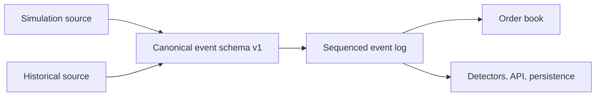

# ARD-0018: Canonical Exchange Event Stream

Status: Accepted and Implemented

Date: 2026-07-18

Implementation Status: `[done]`

Completion: All ten implementation steps are complete in commit `32dc799`.

## Context

Before this decision was implemented, the simulator mutated its in-memory book directly and passed loosely shaped dictionaries between the order book and matching engine. That was sufficient for synthetic UI state, but it did not provide a stable source contract for detector replay or future historical exchange data.

Simulation and historical data need one ordered representation for order adds, modifications, cancellations, executions, and L2 snapshots. Historical venue fields and nanosecond timestamps must be preserved without forcing simulator ticks to imitate wall-clock exchange time.

## Completion Scope

This ARD is fully implemented. Completion includes:

- canonical schemas for all five exchange event types;
- sequence assignment, validation, cursor replay, and JSONL round trips;
- modify-order and price-time-priority behavior;
- matching and simulation event generation;
- one L2 snapshot checkpoint per completed simulation tick;
- REST and WebSocket delivery;
- typed frontend consumption and the Exchange Event Tape;
- live simulation, canonical JSONL, and historical-normalizer source boundaries;
- append-only event and snapshot persistence with stream-scoped replay;
- focused, end-to-end, backend, and frontend validation.

A venue/vendor mapping for a future historical dataset is not unfinished ARD-0018 work. It is a new data-source integration performed after a dataset and its format are selected. That integration uses the completed `HistoricalRecordNormalizer` boundary without changing this architecture.

## Decision

Introduce a versioned canonical exchange-event model in `backend/app/exchange/schemas.py`.

- The supported discriminators are `add`, `modify`, `cancel`, `execute`, and `snapshot`.
- Every event carries identity, normalized source, venue, symbol, optional canonical/source sequences, optional simulator tick, optional nanosecond timestamps, and scenario lineage.
- Event-specific dataclasses validate required identifiers, positive price/quantity state, non-negative remainders, snapshot depth, and modification priority claims.
- The normalized event-log sequence is distinct from a historical venue's `source_sequence`.
- Simulation may use a logical `tick` without inventing exchange timestamps. Historical adapters preserve source timestamps independently.
- Dictionary serialization is the stable boundary used by persistence, APIs, WebSockets, and frontend consumers.

The migration was additive: the schema was introduced first, and matching output migrated to canonical events in step 4 without breaking the existing UI event projection.

## Architecture

## Step 1 Implementation Record

- Added a common immutable event envelope and one typed payload per supported event.
- Added stable `to_dict()` serialization for JSON-compatible downstream boundaries.
- Added schema tests covering every discriminator, historical sequence/timestamp fidelity, invalid order state, and priority validation.
- No existing matching, simulation, API, or frontend behavior changed during this step.

## Step 2 Implementation Record

- Replaced the untyped list log with an append-only typed `EventLog`.
- The log assigns contiguous canonical sequences, prevents duplicate event IDs, and rejects sequence gaps.
- Added bounded tail reads and cursor-based replay after a canonical sequence.
- Added JSONL writing/loading with typed deserialization, schema validation, ordering validation, and line-specific errors.
- At this stage, runtime paths did not consume the log; integration followed in step 4.

## Step 3 Implementation Record

- Added `modify` to accepted exchange order commands and an explicit `OrderBook.modify_order` operation.
- Same-price quantity changes retain queue position and original priority timestamp.
- Price changes cancel/reinsert the order at the back of the new price level and adopt the modification timestamp.
- Side changes, agent ownership changes, duplicate adds, and non-positive remaining quantities are rejected.
- Unknown-order modify returns no result; source adapters decide whether that is ignored, counted, or treated as a malformed feed.

## Step 4 Implementation Record

- `MatchingEngine` now owns an `EventLog` and returns the same sequenced canonical events it appends.
- Limit remainders emit `add`; successful changes emit `modify` or `cancel`; each fill emits `execute` in price-time order.
- Execution payloads retain aggressor/resting order and agent identities plus both post-trade remainders.
- Event IDs are deterministic within a stream (`venue:type:sequence`) and simulator order timestamps map to logical ticks.
- Commands that do not mutate exchange state emit no canonical state event.

## Step 5 Implementation Record

- The order book now constructs the typed `OrderBookSnapshot` as its primary snapshot representation.
- Existing dictionary snapshots serialize from that model, preserving current consumer compatibility.
- `MatchingEngine.record_snapshot` appends a sequenced, configurable-depth canonical checkpoint with tick, timing, and scenario context.
- Snapshot depth must be positive and emitted levels cannot exceed the declared depth.

## Step 6 Implementation Record

- `SimulationEngine` now owns one matching engine, order book, and canonical event log per run.
- Agent limit, market, and cancel commands route through matching; synthetic per-agent level updates are captured at the book mutation boundary.
- Scenario and baseline direct mutations emit canonical events in operation order, including transient add/cancel bursts with zero net L2 change.
- Scenario mutation context propagates scenario ID, name, and family into canonical events.
- Exactly one depth-configurable snapshot is appended after all mutations in every completed tick.
- Reset replaces the book, matching engine, and event log together.

## Step 7 Implementation Record

- Added an API exchange-event record and replay envelope to the arena schema.
- Existing arena state and versioned WebSocket messages now carry an ascending bounded event tail.
- Added `GET /api/arena/exchange-events` with an exclusive `after_sequence` cursor, bounded page size, latest sequence, and `has_more` indicator.
- Existing `events` remains the UI/detector projection, keeping API migration additive.

## Step 8 Implementation Record

- Added a discriminated TypeScript union for all five canonical event payloads.
- Added a compact Exchange Event Tape to Arena with sequence, event type, state-change summary, and stream context.
- Snapshot rows summarize depth and level counts without duplicating the full L2 ladder visually.
- Local mock/demo mode emits a compatible bounded stream so frontend behavior is consistent across source modes.

## Step 9 Implementation Record

- Added a common cursor-based `ExchangeEventSource` protocol and batch envelope.
- The simulation API now reads through a live `SimulationEventSource` instead of its concrete log.
- Added validated canonical JSONL replay as another source implementation.
- Added a historical record-normalizer boundary that preserves upstream sequence/timestamps and assigns independent canonical order.
- Established the extension point now used by strict canonical CSV and
  normalized LOBSTER Parquet replay.

## Step 10 Implementation Record

- Every completed tick appends new canonical events to `history/exchange_events.jsonl`.
- Snapshot checkpoints are also written to `history/lob_snapshots.jsonl`.
- Persisted rows add run/stream archive metadata without changing the canonical event payload.
- Reset starts a new stream segment so canonical sequence restarts remain unambiguous in append-only history.
- Added stream-scoped persisted replay with schema and sequence validation.
- Added end-to-end coverage for all five event types, sequence continuity, snapshot cadence, replay equality, reset segmentation, and final-book checkpoint equality.

## Consequences

Positive:

- Simulation and future historical feeds share a detector-facing vocabulary.
- Source sequencing and canonical replay ordering cannot be accidentally conflated.
- Execution events retain both sides of a match and their post-trade remainders.
- Schema validation catches invalid stream state at its origin.

Tradeoffs:

- The schema contains more identifiers and timing fields than the current simulator immediately needs.
- Schema version changes will require explicit adapter and persistence migrations.
- Full order-by-order reconstruction requires canonical events; L2 snapshots alone remain observational checkpoints.

## Historical Replay Evolution

ARD-0023 implements the historical extension point without changing the
versioned event schema:

- strict canonical CSV maps source lifecycle events into add/modify/cancel/
  execute-compatible kernel mutations;
- normalized LOBSTER replay reconstructs deterministic visible aggregate
  levels and records the immutable source L2 snapshot;
- historical source sequence remains distinct from total canonical sequence;
  and
- synthetic overlays share the live kernel but retain separate source,
  identity, seed, and ground-truth provenance.

## Related Documentation

- [Exchange Event Stream](../exchange-event-stream.md)
- [ARD-0002: WebSocket State Schema](ARD-0002-websocket-state-schema.md)
- [ARD-0004: Benchmark Artifact Format](ARD-0004-benchmark-artifact-format.md)
- [ARD-0011: Exchange Liquidity Invariant](ARD-0011-exchange-liquidity-invariant.md)
- [ARD-0022: Historical Market Data Ingestion](ARD-0022-historical-market-data-ingestion.md)
- [ARD-0023: Deterministic Hybrid Historical Replay](ARD-0023-hybrid-historical-replay.md)
