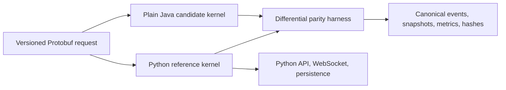

# ARD-0019: Python Reference And Java Kernel Migration

Status: Accepted and Implemented

Date: 2026-07-18

Implementation Status: `[done: step 17 of 17]`

## Context

LOB Arena now has a canonical, replayable exchange-event stream, but its deterministic simulation, order book, matching, scenarios, detectors, API, and orchestration are implemented in Python. Rewriting the complete backend at once would combine correctness, delivery, deployment, and operational risk while removing the working reference needed to prove behavioral equivalence.

The performance-sensitive exchange kernel can move independently if both implementations share a language-neutral request/result contract and deterministic semantics.

## Decision

Migrate through a reference-and-candidate architecture:

- Python remains authoritative until parity is demonstrated.
- Protobuf defines simulation input, canonical events, trades, snapshots, metrics, and result hashes.
- Java 25 implements the candidate kernel as plain Java modules.
- Spring Boot remains outside the kernel and becomes the Java control-plane framework only after kernel stability.
- Python and Java receive identical scenario requests and are compared by a differential harness.
- Authority moves by component and runtime mode only after correctness, performance, observability, and rollback gates pass.
- Python replay remains in CI after Java becomes authoritative.

## Initial Component Boundary

The first Java boundary owns the simulation clock, deterministic scheduler, managed PRNG streams, order book, matching, canonical event production, and snapshots. Python initially retains scenarios, detector authority, persistence, REST, WebSocket delivery, agent orchestration, and Nebius integration.

## Step 1 Implementation Record

- Froze component ownership and the initial Java authority boundary.
- Defined `python`, `shadow`, and `java` authority modes.
- Defined correctness, performance, observability, rollback, and long-term reference gates.
- Recorded Java 25, repository-owned Gradle/toolchain, and build-owned Protobuf generation policy.
- Explicitly excluded Kafka, Chronicle Queue, Agrona, ClickHouse, Parquet, and full Spring migration from correctness parity work unless later gates justify them.
- Confirmed the current workstation has Java 21 and no global Gradle or `protoc`; repository-owned tooling is required before Java compilation.

## Step 2 Implementation Record

- Added the versioned `lob.exchange.v1` Protobuf package with Java package and multiple-file generation options.
- Defined language-neutral simulation requests/configuration, scenario parameters, all five exchange event payloads, L2 books, quantized metrics, hashes, and simulation results.
- Represented price and quantity state as integer ticks/lots and midpoint as twice-price ticks; no floating-point fields or maps exist in the deterministic request/result boundary.
- Added checked-in Python bindings plus a build script that generates them with the locked compiler and detects stale generated sources.
- Added descriptor, oneof discriminator, all-event, request/result, integer-unit, and round-trip tests.
- Java generation remains owned by the Gradle scaffold in step 7; step 2 does not require global Gradle or `protoc`.

## Step 3 Implementation Record

- Froze signed 64-bit price ticks, quantity lots, exact nanounit conversion, twice-price midpoint representation, and quantized metric rounding.
- Froze a six-field total event-order key and numeric phase order for agents, scenarios, baseline repair, snapshots, and final metrics.
- Selected portable SplitMix64 with explicit unsigned overflow and rejection-sampled bounded integers.
- Added SHA-256-derived named PRNG stream seeds so components do not share order-sensitive random state.
- Froze simulation identifier, logical-time, modify, FIFO matching, execution emission, and tick-phase rules.
- Added executable language-neutral JSON vectors and Python reference tests for PRNG output, stream derivation, ordering, units, midpoints, rounding, and identifiers.

## Step 4 Implementation Record

- Defined fixed-width big-endian primitive encoding, NFC UTF-8 strings, explicit optional presence, and ordered repeated values.
- Added payload-discriminated canonical bytes for all five exchange events and a standalone canonical L2 book encoding.
- Added per-event and book SHA-256 digests plus a domain-separated rolling stream hash chain.
- Required matching schema version and contiguous sequence starting at 1 before stream hashing.
- Added golden canonical bytes/digests and tests for all payloads, optional presence, state sensitivity, sequence/version rejection, Unicode normalization, and independence from Protobuf wire serialization.

## Step 5 Implementation Record

- Added an authoritative `PythonReferenceKernel` that accepts `SimulationRequest` and returns `SimulationResult` without changing runtime authority.
- Added missing deterministic inputs for tick interval, agent count, baseline tick spacing, and maximum agent quote size to the additive Protobuf config.
- Converted all canonical Python event variants and L2 books into exact integer-tick/lot Protobuf messages.
- Returned contiguous events, final book, canonical event/book hashes, sorted quantized market/detector metrics, and explicit termination status.
- Added repeat-run byte determinism, five-event scenario coverage, snapshot cadence, hash verification, metadata propagation, metric ordering, parameter rejection, and event-limit tests.

## Step 6 Implementation Record

- Checked in immutable deterministic Protobuf request/result pairs for normal market, empty book, and every active abuse scenario.
- Covered add, modify, cancel, execute, and L2 snapshot events across multiple seeds, including absent optional best-price fields.
- Added a language-neutral manifest with raw-file SHA-256 checksums, canonical stream/book hashes, event-type counts, and metric counts.
- Added authoritative regeneration and freshness validation plus semantic self-consistency and Python replay tests.
- Required a new versioned corpus directory and ARD decision for intentional behavioral changes instead of mutating version 1 evidence.

## Step 7 Implementation Record

- Added a repository-owned Gradle 9.6.1 wrapper and Java 25 toolchain auto-provisioning; no developer-global Gradle or JDK 25 install is required.
- Added `exchange-proto`, `simulation-kernel`, and `control-plane` modules with shared dependency and test conventions.
- Generated Java Protobuf types directly from the root language-neutral schema and parsed a checked-in golden request in Java tests.
- Kept Spring Boot dependencies outside the framework-free simulation kernel and added a control-plane context smoke test.
- Added a dedicated Java 25 GitHub Actions job that runs the full Gradle `clean check` lifecycle.

## Step 8 Implementation Record

- Implemented Java total event ordering and the frozen phase codes with non-negative and ASCII boundary validation.
- Implemented bit-exact SplitMix64, full-range rejection-sampled bounded integers, and SHA-256-derived named PRNG streams.
- Implemented exact base-10 tick/lot conversion, round-half-even metric quantization, midpoint overflow checks, and simulation event identifiers.
- Implemented all five canonical event payload encodings, book encoding, per-object SHA-256 digests, and the rolling stream hash chain.
- Matched Java outputs to every frozen PRNG, seed, ordering, numeric, identifier, canonical-byte, event-hash, book-hash, and rolling-hash vector.

## Step 9 Implementation Record

- Added a signed-int64 tick/lot order model and deterministic bid/ask price maps with FIFO queues at each level.
- Implemented best-price matching for both aggressor sides, crossing limits, partial fills, one execution per resting fill, and residual limit-order resting.
- Implemented actual-state cancel, same-price priority preservation, price-change priority loss, ownership validation, baseline/agent level maintenance, and deterministic synthetic IDs.
- Emitted contiguous version 1 Protobuf add, modify, cancel, execute, and depth-limited snapshot events directly from the Java matching boundary.
- Added tests for ordering, both sides, limits, remainders, modification queues/timestamps, cancel state, owners, baseline construction, empty optionals, all payloads, sequences, and canonical hashability.

## Step 10 Implementation Record

- Added a framework-free `JavaSimulationKernel` that validates and executes the shared Protobuf request and returns the shared result.
- Implemented the logical clock and frozen per-tick phases for ordered normal-agent intents, scenarios, baseline repair, snapshots, and metrics.
- Implemented reference market-maker, noise-trader, and liquidity-taker behavior plus all four active scenario state machines.
- Implemented deterministic market features and detector confidences with sorted scale-six metric output and event-limit enforcement.
- Matched all six checked-in golden cases exactly for every ordered event, event-stream hash, final book/hash, and quantized metric while retaining Python authority.

## Step 11 Implementation Record

- Added the unary `lob.exchange.v1.SimulationKernel.RunSimulation` operation directly to the shared Protobuf contract.
- Generated checked-in Python gRPC bindings and build-owned Java message/service stubs from the same schema.
- Added a Python service adapter that delegates to the authoritative reference kernel and maps deterministic contract failures to `INVALID_ARGUMENT`.
- Added a separate Java `kernel-grpc` module that delegates to the framework-free candidate kernel and keeps transport code outside the hot loop.
- Verified the Java endpoint through an in-process generated client against the complete exact golden Protobuf result; no runtime authority changed.

## Step 12 Implementation Record

- Added a reusable differential runner that serializes each request once and gives Python and Java independent copies of identical deterministic bytes.
- Added structured parity reports for contract identity, ordered events, event hashes, executions, LOB snapshots, final book/hash, quantized metrics, and termination.
- Localized the first ordered event divergence by canonical sequence and retained both complete Protobuf results for deeper investigation.
- Added a JSON-compatible summary for later persistence and observability without copying full event payloads into routine reports.
- Verified all six golden cases plus targeted mismatch injection for trades, books, metrics, hashes, termination, identity, and missing events; authority remains Python.

## Step 13 Implementation Record

- Added a runnable plain-Java gRPC server and a deadline-bound Python candidate client with explicit channel lifecycle.
- Added synchronous offline shadow replay that retains both results and returns Python as the authoritative result on match, mismatch, or Java failure.
- Added live shadow mirroring that returns Python before bounded background Java comparison completes.
- Added `match`, `mismatch`, `error`, and capacity-pressure `skipped` outcomes plus drain/close lifecycle controls; candidate transport failures cannot replace the Python result.
- Added a corpus replay command and verified all six golden scenarios over a real local gRPC socket: 320 events, 10 executions, and 51 snapshots with no divergence.

## Step 14 Implementation Record

- Added a separate Java benchmark module using OpenJDK JMH 1.37 without introducing benchmark dependencies into the hot-loop module.
- Added forked simulation benchmarks for normal, quote-stuffing, and liquidity-evaporation requests plus a crossing integer-order-book match benchmark.
- Added GC allocation profiling commands and verified forked Java 25 profiling on the current macOS/aarch64 environment.
- Added portable CI smoke ceilings for p99 latency, throughput, and thread allocation on the largest golden kernel run and crossing-match path.
- Kept event-count and canonical-hash assertions inside measured kernel runs, and deferred Agrona or data-structure changes until repeated profiles justify them.

## Step 15 Implementation Record

- Added failure-isolated gRPC boundary telemetry without adding metrics or tracing objects to the deterministic simulation kernel.
- Added bounded request outcomes, latency histograms, and event-count summaries plus Micrometer observations bridged to OpenTelemetry.
- Added Spring Boot Actuator health/metrics/Prometheus exposure with OTLP traces and metrics explicitly opt-in, so local tests require no collector.
- Added thread-safe Python shadow pending gauges, bounded outcome counters, candidate durations, snapshots, and Prometheus rendering without high-cardinality run labels.
- Added Prometheus scrape and Grafana dashboard templates without expanding the optimized Docker Compose service set.

## Step 16 Implementation Record

- Added an explicit Python control-plane authority router with `python`, `shadow`, and `java` modes; the default remains Python.
- Added deterministic run-id percentage cohorts for Java rollout and independently sampled Python parity replay.
- Added automatic Python fallback on Java transport error or known parity mismatch plus a fail-closed option that returns an error instead of publishing divergence.
- Added a bounded Protobuf HTTP kernel endpoint, status endpoint, persisted authority decisions, result authority headers, and FastAPI shadow metric attachment.
- Added environment/Compose controls and a staged 1/5/25/50/100 percent rollout and one-setting rollback runbook without adding a container.

## Step 17 Implementation Record

- Changed the versioned Protobuf kernel API default to 100% Java authority with 10% synchronous Python replay and Python fallback retained.
- Added a fourth purposeful Compose service for the Java kernel and made the Python backend wait for its health before connecting over gRPC.
- Added a multi-stage, non-root Java 25 runtime image with an allow-listed 476 KB source context and no Gradle/JDK/tests/docs/outputs/Windows launchers in the runtime image.
- Added the Java image to CI and a permanent real-service cross-language job that replays 100% of the Python golden corpus through Java gRPC.
- Hardened the permanent parity job to run the production Spring Boot JAR with an explicit lifecycle, bounded timeout, failure-log retention, and isolated per-image Docker build caches.
- Replaced architecture-dependent native float summation with Java-equivalent exact binary-value summation and an explicit scale-three half-even conversion after Linux CI exposed a one-lot liquidity-thinning divergence.
- Added the Protobuf/gRPC runtime dependencies omitted from the minimized Python image and CI smoke checks for backend imports plus the non-root Java runtime JAR layout.
- Verified the built 149.6 MB image locally and confirmed a default-authority golden request selected Java with complete parity and no fallback.

## Consequences

Positive:

- Python remains an executable behavioral specification.
- Divergence is detected at the first canonical event rather than after a backend cutover.
- Java performance work is isolated from HTTP and framework concerns.
- Rollback remains available throughout migration.

Tradeoffs:

- Two kernels coexist during migration.
- Protobuf adapters and parity infrastructure add temporary complexity.
- Exact cross-language determinism constrains numeric representation, PRNG choice, ordering, and hashing.
- Java authority arrives later than a superficial rewrite but with measurable correctness.

## Related Documentation

- [Java Kernel Migration](../java-kernel-migration.md)
- [ARD-0018: Canonical Exchange Event Stream](ARD-0018-canonical-exchange-event-stream.md)
- [ARD-0010: Agent Runner Execution](ARD-0010-agent-runner-execution.md)
- [High-Level Architecture](../architecture.md)
- [Runtime Model](../runtime-model.md)
- [Golden Parity Corpus V1](../golden-parity-corpus-v1.md)
- [gRPC Kernel Boundary](../grpc-kernel-boundary.md)
- [Differential Parity Harness](../differential-parity-harness.md)
- [Kernel Shadow Mode](../kernel-shadow-mode.md)
- [Java Kernel Performance](../java-kernel-performance.md)
- [Kernel Observability](../kernel-observability.md)
- [Kernel Authority Rollout](../kernel-authority-rollout.md)
- [Java Kernel Default Cutover](../java-kernel-cutover.md)
