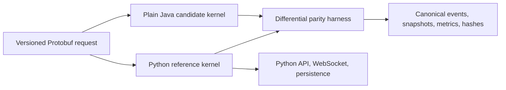

# ARD-0019: Python Reference And Java Kernel Migration

Status: Accepted

Date: 2026-07-18

Implementation Status: `[partial: step 2 of 17]`

## Context

LOB Arena now has a canonical, replayable exchange-event stream, but its deterministic simulation, order book, matching, scenarios, detectors, API, and orchestration are implemented in Python. Rewriting the complete backend at once would combine correctness, delivery, deployment, and operational risk while removing the working reference needed to prove behavioral equivalence.

The performance-sensitive exchange kernel can move independently if both implementations share a language-neutral request/result contract and deterministic semantics.

## Decision

Migrate through a reference-and-candidate architecture:

- Python remains authoritative until parity is demonstrated.
- Protobuf defines simulation input, canonical events, trades, snapshots, metrics, and result hashes.
- Java 25 implements the candidate kernel as plain Java modules.
- Spring Boot remains outside the kernel and becomes the Java control-plane framework only after kernel stability.
- Python and Java receive identical scenario requests and are compared by a differential harness.
- Authority moves by component and runtime mode only after correctness, performance, observability, and rollback gates pass.
- Python replay remains in CI after Java becomes authoritative.

## Initial Component Boundary

The first Java boundary owns the simulation clock, deterministic scheduler, managed PRNG streams, order book, matching, canonical event production, and snapshots. Python initially retains scenarios, detector authority, persistence, REST, WebSocket delivery, agent orchestration, and Nebius integration.

## Step 1 Implementation Record

- Froze component ownership and the initial Java authority boundary.
- Defined `python`, `shadow`, and `java` authority modes.
- Defined correctness, performance, observability, rollback, and long-term reference gates.
- Recorded Java 25, repository-owned Gradle/toolchain, and build-owned Protobuf generation policy.
- Explicitly excluded Kafka, Chronicle Queue, Agrona, ClickHouse, Parquet, and full Spring migration from correctness parity work unless later gates justify them.
- Confirmed the current workstation has Java 21 and no global Gradle or `protoc`; repository-owned tooling is required before Java compilation.

## Step 2 Implementation Record

- Added the versioned `lob.exchange.v1` Protobuf package with Java package and multiple-file generation options.
- Defined language-neutral simulation requests/configuration, scenario parameters, all five exchange event payloads, L2 books, quantized metrics, hashes, and simulation results.
- Represented price and quantity state as integer ticks/lots and midpoint as twice-price ticks; no floating-point fields or maps exist in the deterministic request/result boundary.
- Added checked-in Python bindings plus a build script that generates them with the locked compiler and detects stale generated sources.
- Added descriptor, oneof discriminator, all-event, request/result, integer-unit, and round-trip tests.
- Java generation remains owned by the Gradle scaffold in step 7; step 2 does not require global Gradle or `protoc`.

## Consequences

Positive:

- Python remains an executable behavioral specification.
- Divergence is detected at the first canonical event rather than after a backend cutover.
- Java performance work is isolated from HTTP and framework concerns.
- Rollback remains available throughout migration.

Tradeoffs:

- Two kernels coexist during migration.
- Protobuf adapters and parity infrastructure add temporary complexity.
- Exact cross-language determinism constrains numeric representation, PRNG choice, ordering, and hashing.
- Java authority arrives later than a superficial rewrite but with measurable correctness.

## Related Documentation

- [Java Kernel Migration](../java-kernel-migration.md)
- [ARD-0018: Canonical Exchange Event Stream](ARD-0018-canonical-exchange-event-stream.md)
- [ARD-0010: Agent Runner Execution](ARD-0010-agent-runner-execution.md)
- [High-Level Architecture](../architecture.md)
- [Runtime Model](../runtime-model.md)
