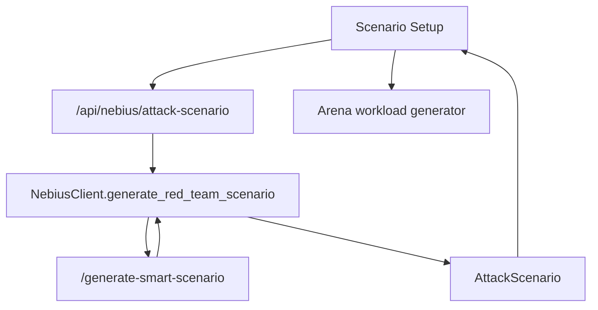

# ARD-002: AI Scenario Generator

Status: Proposed

Date: 2026-07-06

## Context

AIMADA already has red-team scenario generation, local templates, variant generation, and Arena injection. The product should present this as an AI Scenario Generator powered by Nebius AI Serverless Endpoint, with local fallback for demos.

Existing code:

- `backend/app/nebius/client.py`: `RedTeamScenarioRequest`, `RedTeamScenarioResponse`, `NebiusClient.generate_red_team_scenario()`
- `backend/app/api/routes_nebius.py`: `POST /api/nebius/smart-scenario`, `POST /api/nebius/attack-scenario`, variants, inject routes
- `serverless/endpoint/app.py`: `POST /generate-smart-scenario`
- `frontend/src/pages/AttackScenarioGeneratorPage.tsx`
- `frontend/src/components/AttackBuilder.tsx`

## Decision

Use Nebius AI Serverless Endpoint to generate bounded synthetic market scenarios. Backend remains responsible for converting endpoint output into the existing `AttackScenario` contract that Arena can inject.



## Objective

Create launchable synthetic scenarios from user intent while keeping the simulator's bounded, educational attack model.

## Current Code To Reuse

- `AttackScenarioInput`, `AttackScenario`, `AttackScenarioVariantsRequest`, `ScenarioGridRequest` in `routes_nebius.py`
- `NebiusClient._mock_red_team_scenario()` fallback
- `serverless/endpoint/prompts.py`
- `generateNebiusAttackScenario()`, `generateNebiusAttackVariants()`, `injectNebiusAttackScenario()` in `frontend/src/api/client.ts`

## Backend Changes

- Keep existing route names:
  - `POST /api/nebius/smart-scenario`
  - `POST /api/nebius/attack-scenario`
  - `POST /api/nebius/attack-scenario/variants`
  - `POST /api/nebius/attack-scenario/{scenario_id}/inject`
- Add product alias only if needed later; do not remove current routes.
- Persist generated scenarios to `nebius/attack_scenarios.jsonl`.
- Attach raw endpoint response under `AttackScenario.source`.

## Serverless Endpoint / Job Changes

- Reuse `POST /generate-smart-scenario`.
- Prompt must return JSON fields compatible with:
  - `scenario_type`
  - `title`
  - `description`
  - `parameters`
  - `expected_detector_risk`
- No Serverless Job is needed for generation. Jobs consume generated scenarios in Phase 3.

## Frontend Changes

- Keep `/attack-scenarios` as route.
- From `/nebius`, expose Scenario Generator as capability card/action, not duplicate top-level Nebius page.
- Default visible controls:
  - manipulation type
  - difficulty
  - duration
  - generate
  - run in Arena
  - send to AI Investigation
- Keep advanced controls behind `VITE_ENABLE_ADVANCED_ATTACK_CONTROLS`.

## Data Contracts

Backend request:

```json
{
  "attackType": "Layering",
  "marketCondition": "Thin liquidity",
  "objective": "Test detector weakness",
  "stealthLevel": "Medium",
  "attackDuration": "Medium",
  "redTeamAgentCount": 2,
  "detectorDifficulty": "Hard"
}
```

Backend response:

```json
{
  "id": "attack-scenario-001",
  "name": "Layering sequence pressure",
  "attackType": "layering",
  "targetSide": "both",
  "objective": "Test detector weakness",
  "marketRegime": "Thin liquidity",
  "redTeamAgents": ["R-17", "R-22"],
  "startTick": 20,
  "durationTicks": 80,
  "fakeOrderLevels": 3,
  "fakeOrderSizeMultiplier": 8,
  "cancelDelayTicks": 3,
  "stealthLevel": "medium",
  "expectedDetectorDifficulty": "hard",
  "expectedSignals": ["depth imbalance", "rapid cancel"],
  "planSteps": ["stage visible depth", "cancel before fill"],
  "source": {
    "mode": "nebius",
    "endpoint": "https://<endpoint>/generate-smart-scenario"
  }
}
```

Endpoint request:

```json
{
  "prompt": "Create one bounded synthetic market-abuse-like attack scenario for the simulator.",
  "constraints": {
    "scenario_family": "layering",
    "market_regime": "volatile",
    "goal": "hard_to_detect"
  }
}
```

## Fallback / Mock Behavior

- Missing `NEBIUS_SCENARIO_GENERATOR_URL` returns deterministic mock scenario.
- Endpoint in mock mode returns deterministic fallback metadata.
- UI should show generated scenario as launchable in both modes.

## Demo Script

1. Open `/nebius`.
2. Start Scenario Generator.
3. Select `Layering`, `Hard`, `Medium`.
4. Click `Generate`.
5. Click `Run in Arena`.
6. Create incident and send it to AI Investigation.

## Acceptance Criteria

- Scenario generation works offline.
- Generated scenario can be injected into Arena.
- Response stores source mode and endpoint.
- Advanced controls hidden by default.
- Output remains synthetic and bounded.

## Risks And Shortcuts

- Risk: AI output violates enum contract. Shortcut: backend maps endpoint output into existing `AttackScenario` and stores raw source separately.
- Risk: generation adds too many knobs. Shortcut: keep only demo controls by default.
- Risk: harmful framing. Shortcut: prompts and UI keep educational synthetic language.
