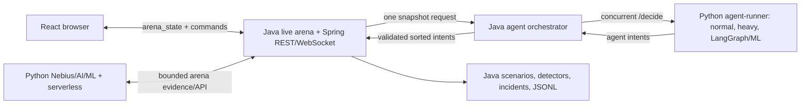

# ARD-0020: Java Arena WebSocket And Agent Orchestration

Status: Accepted

Date: 2026-07-18

Implementation Status: `[done]`

## Context

After the deterministic-kernel cut-over, FastAPI still owns browser WebSocket sessions, agent scheduling, scenarios, detectors, incidents, persistence, and the live exchange writer. These are non-AI responsibilities with reusable Java order-book and determinism foundations.

Agent implementations are intentionally allowed to remain Python when they use LangGraph, ML/AI libraries, or process-pool analysis. Session management, timeouts, fan-out, response validation, deterministic intent ordering, and browser delivery do not require Python.

## Decision

Move the complete non-AI live-arena runtime to Java 25:

1. Spring WebSocket owns `/ws/arena`, client lifecycle, the version 1 `arena_state` envelope, periodic state streaming, and command dispatch.
2. A Java agent orchestrator owns runner discovery, concurrent deadline-bound `/decide` calls, response validation, runtime-source attribution, deterministic intent ordering, and aggregated agent identity.
3. A stateful Java arena owns the clock, single-writer exchange mutation, baseline liquidity, scenario programs, deterministic features/detectors, incidents, replay state, and JSONL arena persistence.
4. Spring REST owns arena state/control, scenario launch, incident lookup, and exchange-event replay.

Retain Python only for Nebius/AI/ML, LangGraph-capable agent execution, experiments, and serverless jobs. Retained Python APIs use a thin HTTP client for Java-owned arena state/evidence and do not schedule agents or mutate the live book.

## Contracts

- Browser messages remain compatible with ARD-0002: `{type, version, timestamp, payload}`.
- Accepted browser commands remain `arena_control` with `start|pause|reset` and `launch_scenario` with a scenario slug.
- The internal orchestration request contains one `snapshot` object.
- The orchestration response contains `agent_ids` and `intents`.
- Intent order is ascending by `tick`, `latency_bucket`, `agent_id`, `sequence`, and `kind`.
- Unknown, malformed, late, or failed runner responses are omitted; they never mutate arena state.
- Java applies accepted intents through the framework-free single-writer matching boundary.

## Failure And Lifecycle Policy

- A failed browser command returns an error envelope without inventing arena state.
- Runner calls have a strict Java-side timeout and no retries inside one tick.
- One failed runner cannot discard valid results from another runner.
- The Java arena starts independently of FastAPI; AI/serverless availability cannot stop deterministic arena ticks.
- FastAPI has no WebSocket route, live arena engine, or local-agent scheduling fallback.

## Cut-over Gate

Cut-over requires Java tests for deterministic ordering, malformed/timeout isolation, state transitions, scenarios, detectors/incidents, persistence, REST, versioned WebSocket envelopes, and session cleanup; retained Python AI-client tests; live Compose verification through Nginx; and removal of FastAPI live-arena/WebSocket authority.

## Implementation Record

- Added the Java-owned live clock, single-writer order book, baseline liquidity, four scenario state machines, deterministic detector/incident production, bounded exchange replay, and JSONL journals.
- Added Spring REST lifecycle/scenario/incident/replay APIs and the versioned `/ws/arena` endpoint with initial state, scheduled broadcasts, commands, error envelopes, and session cleanup.
- Added concurrent deadline-bound Java runner fan-out, malformed/failure isolation, runner identity aggregation, deterministic intent sorting, and HTTP/1.1 runner transport.
- Routed same-origin Nginx arena REST and WebSocket traffic directly to Java while `/api/incidents/*/explain`, Nebius, experiment, and serverless APIs remain on FastAPI.
- Replaced FastAPI live runtime wiring with `JavaArenaClient`; removed the Python WebSocket implementation and unused duplicate live controller. The Python simulation engine remains only for offline/serverless jobs.
- Verified Java service/controller/WebSocket/orchestration tests, the retained Python suite, frontend tests/build, Compose configuration, and live Nginx REST/WebSocket behavior with the real agent runner.

## Consequences

Positive:

- Browser connection load and agent fan-out move to the Java control plane.
- Python remains focused on ML/AI, LangGraph, experiments, and serverless components.
- Agent implementations can evolve independently behind a small HTTP intent contract.
- The Java live exchange remains a single writer.

Tradeoffs:

- Each live tick includes Java-to-runner fan-out when external agents are configured.
- Python AI workflows cross an HTTP boundary to read Java-owned arena evidence.

## Related Documentation

- [ARD-0002: WebSocket State Schema](ARD-0002-websocket-state-schema.md)
- [ARD-0010: Agent Runner Execution Architecture](ARD-0010-agent-runner-execution.md)
- [ARD-0019: Python Reference And Java Kernel Migration](ARD-0019-python-reference-java-kernel-migration.md)
- [Runtime Model](../runtime-model.md)
