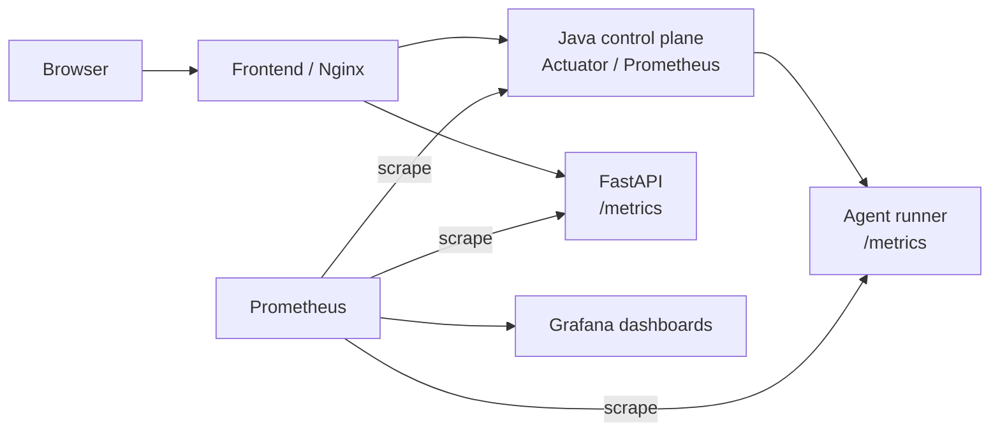

# ARD-0021: Local Observability With Prometheus And Grafana

Status: Accepted

Date: 2026-07-20

Implementation Status: `[done]`

## Context

The Java arena now owns the live exchange, WebSocket, detector, incident, and agent-orchestration loop. FastAPI remains as the AI/ML, experiment, evidence, and serverless boundary, and Python agent-runner remains the execution boundary for normal, heavy, and LangGraph-capable decisions.

Developers need a low-friction way to understand the system end to end and isolate bottlenecks without adding a production observability platform to the normal local path.

## Decision

Add an opt-in local monitoring profile using Prometheus and Grafana:

1. Prometheus scrapes Java Spring Actuator, FastAPI `/metrics`, agent-runner `/metrics`, and Prometheus itself.
2. Grafana is provisioned from files with the Prometheus datasource and dashboards, requiring no manual setup.
3. The default Compose path remains unchanged; monitoring starts only through the `monitoring` profile.
4. Python services expose dependency-free Prometheus text metrics for the bottleneck boundaries they own.

## Metrics Contract

Java keeps Spring Boot Actuator and existing kernel meters:

- `http_server_requests_seconds_*`
- `lob_kernel_grpc_requests_total`
- `lob_kernel_grpc_duration_seconds_*`
- `lob_kernel_grpc_events_*`
- JVM/process/GC meters

FastAPI adds Java-proxy metrics:

- `backend_java_arena_requests_total{method,endpoint,outcome}`
- `backend_java_arena_request_duration_seconds_*{method,endpoint,outcome}`

Agent-runner adds:

- `agent_runner_up{runner_id}`
- `agent_runner_agents{runner_id,agent_type}`
- `agent_runner_uptime_seconds{runner_id}`
- `agent_runner_decide_requests_total{runner_id,outcome}`
- `agent_runner_decide_duration_seconds_*{runner_id,outcome}`
- `agent_runner_intents_returned_*{runner_id}`

Existing arena gauges remain:

- `arena_tick`
- `arena_running`
- `arena_incidents_total`

## Dashboards

Provisioned dashboards are:

- `LOB Arena E2E Overview` for service health, arena state, request rates, latency, event output, and agent capacity.
- `LOB Arena Java Kernel` for Java kernel request, latency, allocation, and event output.
- `LOB Arena Components` for Java JVM pressure, agent runner decision latency/rate, and FastAPI-to-Java proxy metrics.
- `LOB Arena Bottlenecks` for side-by-side latency, error pressure, heap pressure, and agent output.

## Consequences

Positive:

- Developers can see whether a bottleneck is Java, FastAPI proxying, agent decision work, or service health.
- Grafana setup is reproducible and does not require manual clicking.
- Normal local Compose remains small unless monitoring is explicitly requested.

Tradeoffs:

- Python metrics are process-local and reset on container restart.
- Prometheus/Grafana add two opt-in containers and storage volumes.
- Backend `/metrics` reads live Java arena state, so a down Java arena still makes the backend scrape fail; that reflects the current runtime dependency.

## Related Documentation

- [Kernel Observability](../kernel-observability.md)
- [Quickstart](../QUICKSTART.md)
- [ARD-0010: Agent Runner Execution Architecture](ARD-0010-agent-runner-execution.md)
- [ARD-0020: Java Arena WebSocket And Agent Orchestration](ARD-0020-java-arena-websocket-agent-orchestration.md)
