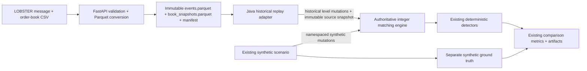

# ARD-0023: Deterministic Hybrid Historical Replay

Status: Accepted and Implemented

Date: 2026-07-24

Implementation Status: `[done]`

## Context

LOB Arena needs to evaluate its existing synthetic spoofing-like, layering-like,
and quote-stuffing scenarios against genuine historical market conditions.
Building a second simulator would split exchange semantics, detector behavior,
hashing, labels, metrics, and artifacts. Treating all historical records as
benign ground truth would also make evaluation claims invalid.

LOBSTER supplies aligned message and visible-depth order-book files, but it
does not provide participant identity or enough information to recover queue
priority when a selected window begins after the original order entry. The
hybrid path therefore needs deterministic visible-book reconstruction without
inventing unavailable source facts.

## Decision

Use the authoritative Java integer matching engine for synthetic-only,
historical-only, and hybrid execution.

Historical inputs may be:

- strict `canonical_csv_v1` lifecycle events; or
- normalized LOBSTER `events.parquet` and `book_snapshots.parquet` produced by
  the existing FastAPI ingestion adapter.

For LOBSTER, each aligned source record updates deterministic aggregate
historical orders for the visible price levels in that record. The source
snapshot itself is appended as an immutable historical canonical snapshot.
The combined live book contains those historical levels plus any synthetic
overlay orders and is used by scenarios and detectors.

The Arena UI remains the attack control surface. Loading **Hybrid + attacks**
does not automatically inject an attack; an operator launches an existing
predefined scenario after the dataset is loaded.

## Architecture



## Deterministic Ordering

Within a replay batch:

1. Historical records are ordered by exchange timestamp.
2. Equal timestamps use the historical phase before the scenario phase.
3. Historical source sequence breaks remaining source ties.
4. The scenario runs only after every historical record in the batch has been
   applied.
5. The post-batch synthetic checkpoint is appended last.

The order is represented by the existing `EventOrderKey` and `EventPhase`
contracts. Historical records therefore win equal-timestamp ties. The attack
generator reads the reconstructed current book after the batch and cannot
inspect an unread Parquet row.

Replay batch size is configurable through
`LOB_ARENA_HISTORICAL_ROWS_PER_TICK`; the default is `250`.

## Identity And Provenance

Historical and synthetic identities occupy disjoint namespaces:

| Identity | Format |
| --- | --- |
| Canonical historical order | `HIST:<dataset>:O:<source-order>` |
| LOBSTER aggregate historical level | `HIST:<dataset>:L2:<side>:<price>` |
| Historical participant placeholder | `HIST:<dataset>:P:<source-or-LOBSTER>` |
| Synthetic scenario order | `SYN:<scenario>:<derived-seed>:O:<suffix>` |
| Synthetic scenario participant | `SYN:ABUSER_01` |

Historical metadata preserves source sequence and exchange timestamp. Synthetic
events use simulation source metadata plus the current injection timestamp.
Canonical sequence remains the total merged-stream order and is not confused
with upstream source sequence.

## Seed Derivation

The configured master seed defaults to `42`. A hybrid attack seed is derived
with the existing domain-separated deterministic seed function from:

```text
hybrid:<dataset-id>:<scenario-family>:<scenario-number>
```

The master seed is accepted by the data-source/comparison APIs and recorded in
comparison artifacts. The derived seed is recorded with the synthetic scenario
and ground truth. Synthetic-only scenario behavior retains its existing fixed
placement.

## Label And Detector Isolation

- Historical records never create benign or attack labels.
- Ground truth is created only when the existing synthetic scenario is
  launched.
- Labels are persisted separately under `labels/scenario_labels.jsonl`.
- Detector input consists of live book/event-derived numeric features.
- Scenario labels, scenario IDs, attack seeds, and `SYN:` identifiers are not
  fields in detector input.
- Detector results are matched against ground truth only during evaluation.

The immutable LOBSTER source snapshot is recorded separately from the combined
live book. This prevents synthetic liquidity from contaminating
historical-sourced snapshot hashes while still allowing detectors and future
scenario actions to observe the combined market.

## Evaluation And Artifacts

The comparison endpoint runs:

1. a historical-only control; and
2. a hybrid run over the same dataset with a UI/API-selected scenario; then
3. repeats both runs to record deterministic stream and trace equality.

The existing Python comparison CLI writes:

- `control.json`
- `hybrid.json`
- `comparison.json`
- `validation-report.json`
- `manifest.sig`
- `validation-public-key.pem`
- `signature.json`
- `manifest.json`
- `checksums.sha256`

Artifacts contain source and canonical event counts, historical/synthetic
hashes, detector alert ticks, TP, FN, FP, TN, precision, recall, F1, and basic
final-book realism deltas. The validation report additionally contains
synthetic lifecycle semantics, attack localisation, immutable historical
snapshot hashes, and paired before/during/after book metrics.

Outside the inclusive synthetic ground-truth interval, the combined control
and hybrid book hashes must match exactly. Spread, top-depth, imbalance, level
count, and message/add/cancel/execute counts must also pass a paired 95%
mean-difference equivalence interval within the documented margin. During the
interval, book divergence or event-flow divergence proves intended impact; the
latter covers quote-stuffing bursts that cancel before the tick snapshot. This
detects ghost orders and unintended post-attack contamination that
final-book-only metrics cannot expose.

The Java loader verifies actual Parquet hashes, sizes, row counts, sequences,
timestamps, session bounds, and message/book pairing before replay. The full
artifact inventory in `manifest.json` is signed with a caller-supplied Ed25519
private key, so the signature binds the control, hybrid, comparison, validation
report, signature metadata, and public key rather than only the report.
Production trust requires independent authentication of the public-key
fingerprint.

## Validation Requirements

Automated coverage must prove:

- the same data, configuration, and seed produce identical stream hashes and
  metrics;
- a seed that changes attack placement changes the synthetic portion without
  changing historical-sourced snapshots;
- every historical source sequence is represented;
- historical control runs have no ground truth;
- hybrid ground truth contains only synthetic identities;
- historical events precede synthetic scenario events at equal injection time;
- detector payloads contain no scenario labels, attack seed, or synthetic ID
  metadata; and
- TP, FN, FP, TN, precision, recall, and F1 follow the shared evaluation
  contract;
- message/order-book alignment, price-level deltas, tracked order lifecycles,
  session boundaries, crossed books, and applicable visible-volume
  conservation are validated;
- future source rows cannot affect an attack action at the current injection
  tick;
- injected add/modify/cancel/execute events obey volume and terminal-state
  semantics; and
- books remain exactly and statistically equivalent outside the labelled
  causal neighbourhood.

## Alternatives Considered

### Build a separate historical simulator

Rejected because it would duplicate matching, attacks, detectors, canonical
ordering, hashing, and artifact generation.

### Translate every LOBSTER message into an inferred order lifecycle

Rejected as the default because selected windows can omit original order entry,
and LOBSTER does not expose participant identity. Inferring those facts would
create false provenance. Strict canonical lifecycle CSV remains available when
the source actually provides that information.

### Mutate stored historical snapshots with synthetic orders

Rejected because historical evidence must remain immutable. The combined live
book is separate from the source snapshot payload.

### Mark historical records as benign labels

Rejected because absence of a synthetic label is not evidence that a genuine
historical window contains no abuse.

## Consequences

Positive:

- Historical and synthetic modes share one authoritative exchange and detector
  implementation.
- Hybrid attacks react only to observed current state.
- Source provenance, ground truth, and detector input remain separated.
- Runs are reproducible and produce existing checksummed evidence bundles.

Tradeoffs:

- LOBSTER replay is faithful to supplied visible depth, not unavailable
  participant identity or queue priority.
- Aggregate historical level updates may emit more than one canonical mutation
  for one source record.
- Injection timing is bounded by the configured replay batch rather than
  timestamp-paced wall-clock scheduling.

## Related Documentation

- [ARD-0006: Scenario Labeling and Reproducibility](ARD-0006-scenario-labeling-and-reproducibility.md)
- [ARD-0018: Canonical Exchange Event Stream](ARD-0018-canonical-exchange-event-stream.md)
- [ARD-0020: Java Arena WebSocket And Agent Orchestration](ARD-0020-java-arena-websocket-agent-orchestration.md)
- [ARD-0022: Historical Market Data Ingestion And Replay](ARD-0022-historical-market-data-ingestion.md)
- [Architecture Overview](../architecture.md)
- [Use Cases](../USE_CASES.md)
- [Historical replay README](../../README.md#historical-and-hybrid-replay)
- [Public LOBSTER-compatible fixture](../../data/lobster/README.md)
