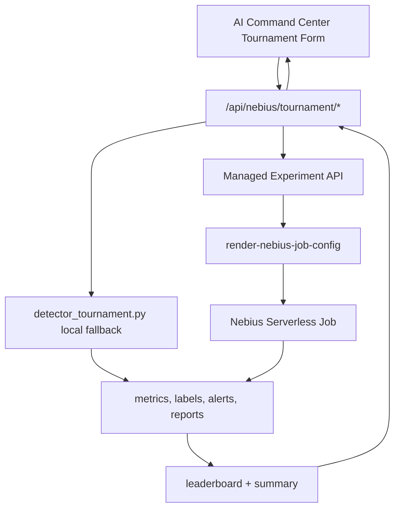

# ARD-003: AI Detector Tournament

Status: Done

Date: 2026-07-06

## Context

AIMADA already has detector tournament pieces:

- `serverless/jobs/detector_tournament.py`: runs detector comparison over simulator scenarios and writes `metrics.csv`, `results.json`, chart artifacts, and `benchmark_report.md`.
- `serverless/jobs/run_batch_experiments.py`: runs larger smart batches and writes canonical experiment artifacts such as `order_book_events.jsonl`, `attack_labels.jsonl`, `blue_team_alerts.jsonl`, `detector_metrics.csv`, and `manifest.json`.
- `backend/app/api/routes_experiments.py`: exposes benchmark runs, managed experiments, local batch fallback, Nebius job config rendering, submit, refresh, collect, aggregate, summary, and leaderboard.
- `backend/app/experiments/manager.py`: persists managed experiment state and artifacts.
- `backend/app/experiments/aggregator.py`: builds `experiment_summary.json`, `leaderboard.json`, and benchmark report output.
- `backend/app/experiments/nebius_orchestrator.py`: renders and tracks Nebius job submit/status/collect paths.
- `frontend/src/pages/NebiusControlPanelPage.tsx`: already shows Detector Tournament controls, jobs, leaderboard, and artifact links.

Phase 3 should expose this as “AI Detector Tournament using Nebius Serverless Jobs” without creating a second orchestration system.

## Decision

Add a Nebius product facade for tournament operations:

- `POST /api/nebius/tournament/start`
- `GET /api/nebius/tournament/{id}`
- `GET /api/nebius/tournament/{id}/artifacts`

The facade reuses existing experiment APIs and runners internally:

- Local/mock fallback uses `serverless/jobs/detector_tournament.py` for detector-set comparison when the user starts a lightweight tournament.
- Managed Nebius job path uses `ManagedExperiment`, `render-nebius-job-config`, `submit-nebius`, `collect-nebius-artifacts`, and `aggregate`.
- Larger artifact-heavy tournaments continue to use `run_batch_experiments.py` because it already produces canonical JSONL/CSV/MD artifacts for investigations and reports.



## Objective

Run scalable detector evaluations over many generated or replayed synthetic scenarios. Each tournament compares detector predictions to synthetic ground truth and returns precision, recall, F1, latency, leaderboard rows, summary text, and downloadable artifacts.

## User Controls

Tournament start form:

- `number_of_scenarios`: integer, default `100`, capped by backend
- `manipulation_types`: list of `spoofing`, `layering`, `wash_trading`, `quote_stuffing`
- `difficulty_mix`: object such as `{ "easy": 0.2, "medium": 0.5, "hard": 0.2, "adversarial": 0.1 }`
- `detector_set`: list of `spoofing_like`, `layering_like`, `quote_stuffing`, `liquidity_shock`
- `random_seed`: integer
- `execution_mode`: `mock | local | nebius`

The first implementation can map `difficulty_mix` into scenario repetition/manifest metadata until simulator difficulty-specific replay is available.

## Backend API

### Start

```http
POST /api/nebius/tournament/start
Content-Type: application/json
```

Request:

```json
{
  "number_of_scenarios": 100,
  "manipulation_types": ["spoofing", "layering", "quote_stuffing"],
  "difficulty_mix": {
    "easy": 0.2,
    "medium": 0.5,
    "hard": 0.2,
    "adversarial": 0.1
  },
  "detector_set": ["spoofing_like", "layering_like", "quote_stuffing"],
  "random_seed": 42,
  "execution_mode": "local"
}
```

Response:

```json
{
  "tournament_id": "TRN-20260706-0001",
  "status": "completed",
  "execution_mode": "local_mock",
  "started_at": "2026-07-06T10:00:00Z",
  "completed_at": "2026-07-06T10:01:12Z",
  "detectors": ["spoofing_like", "layering_like", "quote_stuffing"],
  "leaderboard": [
    {
      "detector": "spoofing_like",
      "scenario": "spoofing",
      "precision": 1.0,
      "recall": 0.75,
      "f1": 0.8571,
      "false_positives": 0,
      "false_negatives": 1,
      "avg_detection_latency_ms": 1200
    }
  ],
  "metrics": {
    "total_scenarios": 100,
    "total_alerts": 87,
    "macro_f1": 0.81
  },
  "artifacts": {
    "results": "outputs/benchmark/TRN-20260706-0001/results.json",
    "metrics": "outputs/benchmark/TRN-20260706-0001/metrics.csv",
    "report": "outputs/benchmark/TRN-20260706-0001/benchmark_report.md"
  },
  "summary": "Local detector tournament completed with deterministic synthetic ground truth."
}
```

### Read Status

```http
GET /api/nebius/tournament/{id}
```

Returns the same envelope with current `status`:

- `queued`
- `running`
- `completed`
- `failed`
- `real_nebius_pending`

### Read Artifacts

```http
GET /api/nebius/tournament/{id}/artifacts
```

Returns artifact metadata and download URLs:

```json
{
  "tournament_id": "TRN-20260706-0001",
  "artifacts": [
    {
      "name": "metrics.csv",
      "path": "outputs/benchmark/TRN-20260706-0001/metrics.csv",
      "download_url": "/api/experiments/artifacts/download?path=..."
    }
  ]
}
```

## Backend Implementation Plan

Add `backend/app/nebius/tournament.py` with schemas:

- `DetectorTournamentStartRequest`
- `DetectorTournamentStatus`
- `DetectorTournamentLeaderboardRow`
- `DetectorTournamentResponse`
- `DetectorTournamentArtifact`
- `DetectorTournamentArtifactsResponse`

Add routes in `backend/app/api/routes_nebius.py`:

- `POST /api/nebius/tournament/start`
- `GET /api/nebius/tournament/{id}`
- `GET /api/nebius/tournament/{id}/artifacts`

Route behavior:

1. Normalize request controls into existing scenario names:
   - `spoofing` -> `spoofing`
   - `layering` -> `layering`
   - `quote_stuffing` -> `quote_stuffing`
   - `wash_trading` -> `pump_and_cancel` or `normal_market` plus manifest metadata until direct simulator support exists
2. If `execution_mode=local` or Nebius job config is missing, run local fallback through `serverless/jobs/detector_tournament.py`.
3. If `execution_mode=nebius` and job submit config is present, create a `ManagedExperiment`, render job config, submit Nebius job, and return `real_nebius_pending` or `queued`.
4. Persist tournament state under `nebius/tournaments/{tournament_id}/`.
5. Append summary rows to `nebius/tournaments.jsonl`.
6. Store history artifact with `kind="run"` and `source="ai_detector_tournament"`.

## Serverless Job Design

Primary lightweight tournament runner:

```bash
python serverless/jobs/detector_tournament.py \
  --runs 100 \
  --scenarios spoofing,layering,quote_stuffing \
  --detectors spoofing_like,layering_like,quote_stuffing \
  --output outputs/benchmark/TRN-20260706-0001
```

Current outputs:

- `metrics.csv`
- `results.json`
- `benchmark_report.md`
- `charts/f1_by_scenario.png`
- `charts/confidence_distribution.png`
- `charts/detection_latency.png`

Artifact-heavy managed path:

```bash
python serverless/jobs/run_batch_experiments.py \
  --runs 100 \
  --batch-size 20 \
  --scenarios normal_market,spoofing,layering,quote_stuffing \
  --output outputs/serverless-batch/TRN-20260706-0001
```

Current outputs:

- `order_book_events.jsonl`
- `trades.jsonl`
- `attack_labels.jsonl`
- `blue_team_alerts.jsonl`
- `detector_metrics.csv`
- `generated_report.md`
- `manifest.json`

Design rule: do not create a third runner. If Phase 3 needs additional fields, extend `detector_tournament.py` or aggregate existing `run_batch_experiments.py` artifacts.

## Data Mapping

| Requested field | Existing source |
| --- | --- |
| `tournament_id` | New facade id or `BenchmarkRunResponse.id` |
| `status` | local process result, `ExperimentJobRecord.status`, or managed experiment status |
| `started_at` | route start time or experiment `created_at` |
| `completed_at` | route completion time or aggregate timestamp |
| `detectors` | request `detector_set` |
| `leaderboard` | `metrics.csv`, `results.json`, or `leaderboard.json` |
| `metrics` | `metrics.csv`, `detector_metrics.csv`, `experiment_summary.json` |
| `artifacts` | artifact paths from benchmark run or managed experiment |
| `summary` | `benchmark_report.md` or generated summary string |

## Frontend Changes

Reuse `NebiusControlPanelPage.tsx` Detector Tournament section.

Add or refine controls:

- number of scenarios
- manipulation type multi-select
- difficulty mix presets: balanced, easy-heavy, hard-heavy, adversarial
- detector set multi-select
- random seed
- execution mode: Local Demo or Nebius Serverless Job

Actions:

- `Start Tournament`
- `Refresh Tournament`
- `View Artifacts`
- `Download Report`

Display:

- status badge: `mock`, `local`, `queued`, `running`, `completed`, `real_nebius_pending`
- leaderboard table
- metric cards: macro F1, total alerts, average latency, scenario count
- artifact links
- note when real Nebius submit is isolated/pending

The current buttons `Create benchmark`, `Run Local Demo tournament`, `Run serverless job`, and `Aggregate` can remain as advanced controls or be called behind `Start Tournament`.

## Fallback / Mock Behavior

- No Nebius credentials or submit template: execute local `detector_tournament.py` and return `status="completed"` with local artifacts.
- `execution_mode=nebius` without config: create a pending job record and return `status="real_nebius_pending"` with rendered config artifact if possible.
- Local failures return `502` with bounded stdout/stderr and keep previous tournament state readable.
- UI must label local fallback clearly and still show leaderboard/artifacts.

## Demo Script

1. Open `/nebius`.
2. Select Detector Tournament.
3. Set `number_of_scenarios=100`.
4. Select `spoofing`, `layering`, `quote_stuffing`.
5. Choose balanced difficulty mix.
6. Select detector set.
7. Start tournament in Local Demo.
8. Show leaderboard, macro F1, latency, and artifacts.
9. Switch to Cloud.
10. Render or submit Nebius Serverless Job.
11. Show `real_nebius_pending` if job submit config is missing, or collect artifacts if remote output exists.

## Acceptance Criteria

- UI can start a tournament from the command center.
- UI can show leaderboard and metric summary.
- Mock/local mode works with no Nebius credentials.
- Real Nebius job path is isolated behind job config and submit commands.
- Artifacts are visible or downloadable.
- Existing experiment APIs and job runners continue to work.
- No duplicate tournament runner is introduced.

## Risks And Shortcuts

- Risk: `wash_trading` does not have a native simulator scenario. Shortcut: map to `pump_and_cancel` or record as manifest metadata until direct replay exists.
- Risk: `difficulty_mix` is not yet supported by simulator physics. Shortcut: store it in manifest and use it to weight scenario selection first.
- Risk: cloud artifacts are not mounted automatically. Shortcut: keep `collect-nebius-artifacts` as explicit step.
- Risk: two existing runners have different artifact names. Shortcut: facade normalizes both into the same response envelope.
