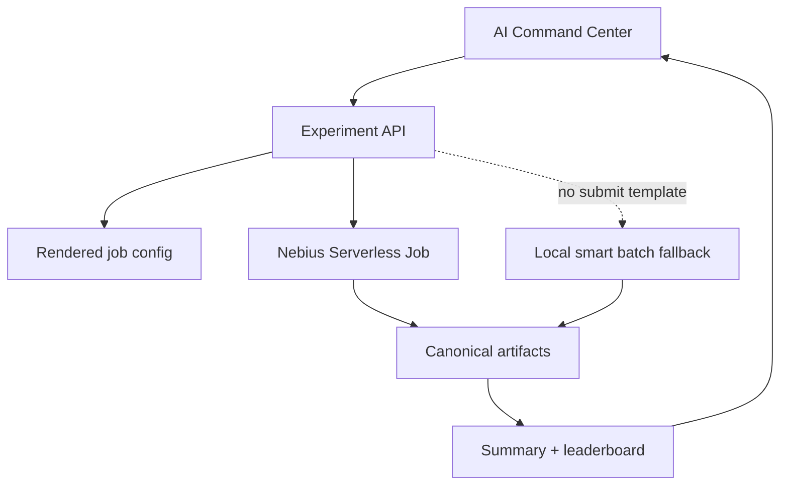

# ARD-003: AI Detector Tournament

Status: Proposed

Date: 2026-07-06

## Context

AIMADA already runs synthetic simulations, writes labels, collects detector alerts, computes metrics, and renders reports. The product should present this as an AI Detector Tournament executed through Nebius Serverless Jobs, with the local batch runner as the exact fallback.

Existing code:

- `serverless/jobs/run_batch_experiments.py`
- `serverless/jobs/nebius_job_config.yaml`
- `serverless/jobs/render_job_config.py`
- `backend/app/nebius/smart_batch_runner.py`
- `backend/app/experiments/manager.py`
- `backend/app/experiments/nebius_orchestrator.py`
- `backend/app/api/routes_experiments.py`
- `frontend/src/pages/NebiusControlPanelPage.tsx`

## Decision

Use Nebius Serverless Jobs for detector tournaments. Local execution uses the same command, args, and artifact names so demo fallback and cloud execution share one contract.



## Objective

Run repeatable detector tournaments that compare detector behavior across synthetic scenarios and produce inspectable artifacts.

## Current Code To Reuse

- Job runner: `serverless/jobs/run_batch_experiments.py`
- Local wrapper: `backend/app/nebius/smart_batch_runner.py`
- Experiment lifecycle: `POST /api/experiments`, `GET /api/experiments/{id}`
- Local batch: `POST /api/experiments/{id}/run-local-batch`
- Config render: `POST /api/experiments/{id}/render-nebius-job-config`
- Job submit: `POST /api/experiments/{id}/submit-nebius`
- Job status: `GET /api/experiments/{id}/jobs`, `POST /api/experiments/{id}/refresh-jobs`
- Artifact collect: `POST /api/experiments/{id}/collect-nebius-artifacts`
- Aggregation: `POST /api/experiments/{id}/aggregate`

## Backend Changes

- Keep `ManagedExperiment` as durable tournament manifest.
- Use `experiment.id` as correlation id in rendered config and job records.
- Store:
  - `experiments/{id}/experiment.json`
  - `experiments/{id}/jobs.jsonl`
  - `experiments/{id}/local-batch/`
  - `experiments/{id}/nebius_job_config.rendered.yaml`
  - `experiments/{id}/experiment_summary.json`
  - `experiments/{id}/leaderboard.json`
- Keep `real_nebius_pending` when submit config is missing.

## Serverless Job Changes

- Keep CLI:

```bash
python serverless/jobs/run_batch_experiments.py \
  --runs 100 \
  --batch-size 20 \
  --scenarios normal_market,spoofing,layering \
  --output outputs/serverless-batch
```

- Keep artifact names:
  - `order_book_events.jsonl`
  - `trades.jsonl`
  - `attack_labels.jsonl`
  - `blue_team_alerts.jsonl`
  - `detector_metrics.csv`
  - `generated_report.md`
  - `manifest.json`

## Frontend Changes

- Keep Detector Tournament inside `NebiusControlPanelPage.tsx`.
- Show compact status:
  - Endpoint: active/mock/configured
  - Jobs: available/mock/pending
- Keep actions:
  - Create benchmark
  - Generate manifest
  - Run Local Demo tournament
  - Render job config
  - Submit serverless job
  - Refresh job status
  - Collect cloud artifacts
  - Aggregate

## Data Contracts

Create experiment:

```json
{
  "name": "AI-MADA detector tournament",
  "attack_count": 100,
  "batch_size": 20,
  "scenarios": ["normal_market", "spoofing", "layering", "quote_stuffing"],
  "seed": 42
}
```

Job manifest:

```json
{
  "created_at": "2026-07-06T00:00:00Z",
  "runs": 100,
  "batch_size": 20,
  "scenarios": ["normal_market", "spoofing"],
  "artifacts": {
    "order_book_event_logs": "outputs/.../order_book_events.jsonl",
    "trades": "outputs/.../trades.jsonl",
    "attack_labels": "outputs/.../attack_labels.jsonl",
    "blue_team_alerts": "outputs/.../blue_team_alerts.jsonl",
    "detector_metrics": "outputs/.../detector_metrics.csv",
    "generated_report": "outputs/.../generated_report.md"
  }
}
```

Metric row:

```json
{
  "scenario": "spoofing",
  "precision": 1.0,
  "recall": 0.75,
  "f1": 0.8571,
  "avg_detection_latency_ms": 1200
}
```

## Fallback / Mock Behavior

- `run-local-batch` executes `run_local_smart_batch()` and writes canonical artifacts.
- Missing `NEBIUS_JOB_SUBMIT_TEMPLATE` records a pending job instead of failing the demo.
- `collect-nebius-artifacts` can normalize remote outputs after manual or scripted copy.

## Demo Script

1. Open `/nebius`.
2. Create benchmark with `attack_count=100`, `batch_size=20`.
3. Generate manifest.
4. Run Local Demo tournament.
5. Aggregate and show leaderboard.
6. Render job config.
7. Submit serverless job or show pending submit template.
8. Collect artifacts when remote output exists.

## Acceptance Criteria

- Local tournament path passes without Nebius credentials.
- Rendered job config references experiment values.
- Submit path records a job or pending job.
- Artifact collection uses canonical names.
- Aggregation reads detector metrics and alerts.
- UI shows endpoint and job status separately.

## Risks And Shortcuts

- Risk: remote job execution not available for demo. Shortcut: render config and show pending state.
- Risk: costs from large runs. Shortcut: defaults are `100` attacks and batch size `20`; API caps still apply.
- Risk: artifact drift. Shortcut: keep `smart_batch_artifact_paths()` as source of truth for local contract.
