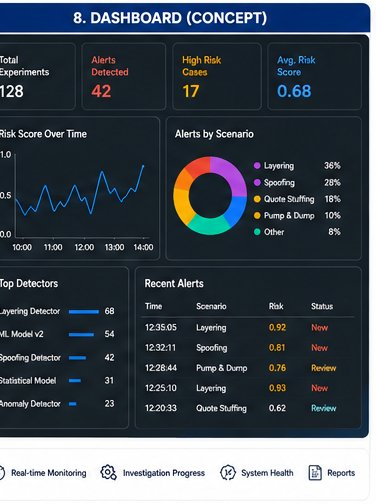
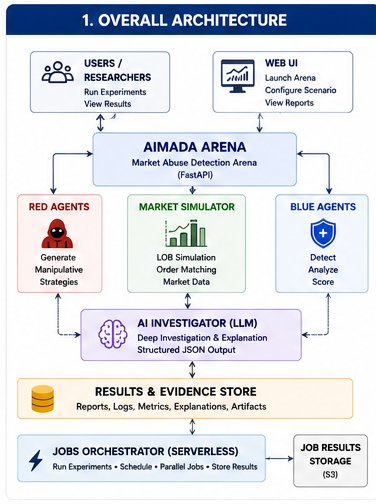
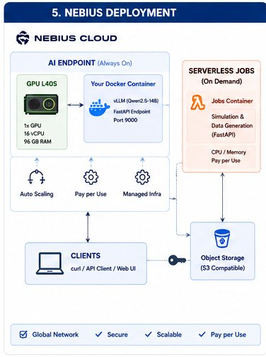
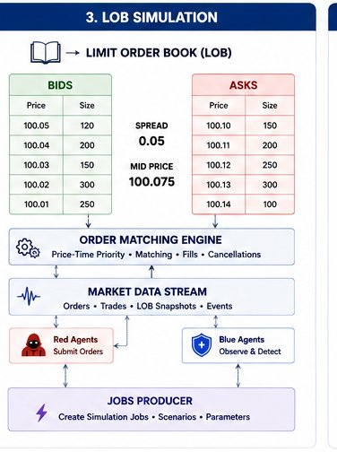
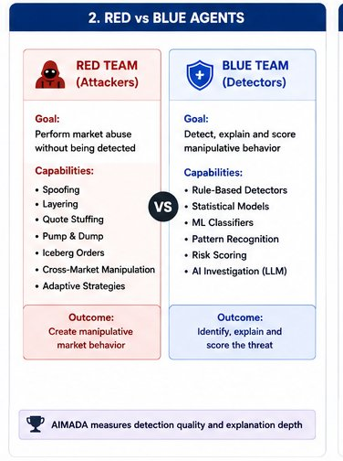
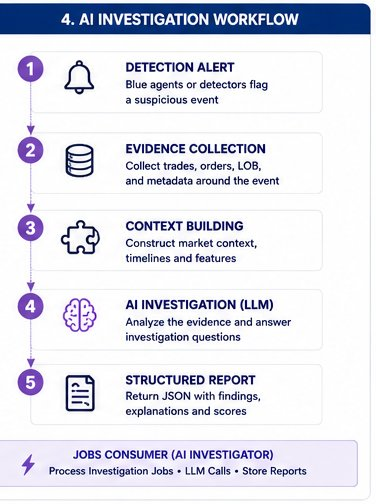
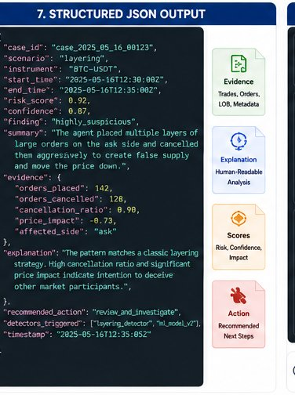
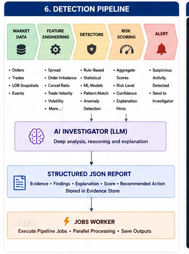

# Building AIMADA: An Adversarial Market-Abuse Evaluation Arena with Nebius Serverless AI

*AIMADA is a synthetic arena for evaluating market-abuse detectors and AI-assisted investigations on Nebius Serverless AI.*

I built AIMADA for the #NebiusServerlessChallenge: a synthetic market-abuse simulation and evaluation platform built and validated with Nebius Serverless AI Jobs and Serverless AI Endpoints.

Repository: [https://github.com/khab40/aimada](https://github.com/khab40/aimada)

The problem I wanted to explore is common in technical AI demos: the interesting part of the domain is difficult to show safely.

Market surveillance involves sensitive data, specialized market-microstructure concepts, noisy event streams, and language that can become misleading when a prototype is presented as a real compliance tool.

I did not want to build a system that claims to detect real manipulation. Instead, I built an educational arena where synthetic normal agents and synthetic abuse-like agents interact inside a controlled limit-order-book simulation.

That creates a concrete engineering surface: generate market events, inject labeled scenarios, run deterministic detectors, preserve structured evidence, and use AI to explain what the detector already found.

The architecture has two main execution paths.

The interactive path uses a React and Vite frontend, a FastAPI control plane, a separate agents workspace, and a Nebius Serverless AI Endpoint. The batch path uses Nebius Serverless AI Jobs for repeatable synthetic workloads, detector evaluation, aggregation, and artifact generation.

*AIMADA separates the React interface, authoritative FastAPI runtime, agents workspace, and Nebius Endpoint and Job execution paths.*

AIMADA was validated on real Nebius production infrastructure. More than ten Nebius Serverless AI Job runs completed successfully, with execution visible in production logs. I also deployed a vLLM-backed Nebius Serverless AI Endpoint and exercised routes for scenario generation, incident analysis, investigation reporting, order-book alert analysis, and structured market-event explanation. Those runs produced Job artifacts, detector metrics, reports, logs, and Endpoint responses. This validation proves the execution contracts; it does not turn AIMADA into a real-market surveillance product.

Job lifecycle records and generated artifacts are archived to Nebius Object Storage. Endpoint execution metadata is archived through the same evidence layer without presenting private credentials or sensitive transport details to the browser. The backend can synchronize archived evidence from S3-compatible storage back to backend-local storage, and the UI exposes the synchronized records and downloadable artifacts. This creates a traceable path from production execution, through durable storage, to evidence that a reviewer can inspect.

*Production Job and Endpoint evidence is archived to Object Storage, synchronized by the backend, and exposed as reviewable UI records and downloads.*

## The interactive path

The frontend renders the live arena: order-book ladders, price and spread charts, liquidity heatmaps, agent activity, detector confidence, incident cards, replay, and report views.

The browser sends commands over WebSocket. The FastAPI backend runs the simulation and publishes complete `arena_state` messages. This keeps the browser away from simulation internals, server credentials, and direct Endpoint access.

*The Live Arena makes synthetic order flow, bounded adversarial scenarios, detector confidence, and incident evidence visible in one workflow.*

During an interactive run, AIMADA uses the separate `agent-runner/` workspace to generate normal synthetic market activity.

At each simulation tick, the backend sends a read-only order-book snapshot to the workspace through its `/decide` API. The workspace returns typed `AgentIntent` objects rather than mutating the market directly. The backend validates and deterministically sorts those intents, remains the single authoritative writer, and applies accepted actions to the synthetic exchange and matching engine.

The workspace runs several kinds of trading agents. Top-of-book market makers refresh visible liquidity on both sides. Deterministic noise traders make small cadence-based changes at selected levels. Periodic liquidity takers alternate bounded synthetic buys and sells. Optional LangGraph agents can choose which side to quote from observed depth imbalance. Optional CPU-heavy agents exercise a more computationally expensive decision path for workload testing.

*Synthetic market makers, liquidity takers, and abuse-like scenario agents trade only inside AIMADA's bounded simulated order book.*

This separation lets the frontend display agent activity while the backend preserves ordering, timeouts, validation, and reproducibility.

None of these agents connects to a broker, exchange, or real market. They trade only inside AIMADA’s synthetic order book and cannot emit real orders or trading signals.

Inside the backend, the core loop is intentionally deterministic. A synthetic exchange, order book, and matching engine process actions from market-making, liquidity-taking, and noise agents. Scenario agents can then inject bounded spoofing-like, layering-like, quote-stuffing-like, liquidity-evaporation, or pump-and-cancel behavior.

The key word is “bounded.” These are synthetic patterns for education and detector testing, not instructions for real market activity.

## Why detection and explanation are separate

Nebius Serverless AI Endpoints do not make AIMADA’s original detection decision.

A deterministic detector produces structured evidence first: spread, visible depth, imbalance, message rate, cancel-to-trade ratio, wall-size ratio, order lifetime, confidence scores, and scenario labels.

The backend then sends a compact incident payload to the Endpoint. The Endpoint can return a readable explanation, investigation assistance, recommended review actions, or a bounded synthetic scenario draft.

This split matters because it keeps the workflow auditable. AI is used for explanation, narration, investigation assistance, and bounded scenario generation. Structured detector evidence remains the source of truth.

*The AI Investigation Team translates deterministic detector evidence into a structured, reviewable narrative without replacing the detector.*

*Endpoint responses are parsed as structured JSON so the UI can separate classification, confidence, evidence, counter-evidence, and recommended actions.*

## The batch path

Nebius Serverless AI Jobs fit the offline evaluation path naturally. Instead of asking a live request to run dozens or hundreds of simulations, a Job can execute repeatable synthetic workloads, evaluate detector output against labels, aggregate metrics, and persist reports and artifacts before terminating.

The outputs are designed to be reviewable: JSON records, CSV metrics, Markdown reports, logs, and chart-ready data. The metric vocabulary includes precision, recall, F1, false positives, false negatives, and detection latency against known synthetic labels.

The repository is organized around those boundaries.

`backend/` contains the FastAPI application, simulation engine, exchange model, detectors, incident storage, Nebius client, evidence synchronization, and report generation.

`agent-runner/` contains the agents workspace service, its `/health`, `/agents`, and `/decide` contracts, normal synthetic agents, optional CPU-heavy agents, and bounded LangGraph strategies.

`frontend/` contains the React arena, Detection workflow, Scenario Generator, Nebius AI controls, evidence views, and visualization components.

`serverless/` contains the Endpoint application, Job runners, Dockerfiles, and example deployment configurations.

`docs/` contains architecture decisions, deployment notes, benchmark methodology, safety framing, and challenge-submission material.

`outputs/benchmark/` contains the public sanitized benchmark and production-evidence sample.

## Four evidence layers

I use four explicit names in the repository so small integration checks are not confused with production validation.

### Smoke Contract Test

The **Smoke Contract Test** is the smallest end-to-end integration check. It verifies that scenario generation, simulation, detector routing, investigation output, tournament execution, and artifact contracts connect correctly.

The deliberately small one-run detector example covers spoofing-like and quote-stuffing scenarios. Matching detectors reach precision 1.0, recall 1.0, and F1 1.0, with an average detection latency of 1,500 ms in that fixture.

Those perfect values are integration evidence only. They validate labels, routing, metric calculation, and artifact persistence on a deliberately simple deterministic fixture. They are not evidence of real-world surveillance accuracy, robustness, or compliance suitability.

### Local Reproducibility Benchmark

The **Local Reproducibility Benchmark** is the deterministic path another practitioner can run with Docker Compose. It generates labeled synthetic workloads and produces metrics, leaderboards, reports, and artifacts without requiring Nebius credentials.

Its purpose is reproducibility: the same configuration and seed should preserve the evaluation contract and make failures inspectable. Local execution is not presented as proof that a cloud Job or Endpoint ran.

### Production Execution Validation

The **Production Execution Validation** covers the real Nebius infrastructure path. More than ten Serverless AI Job runs validated container startup, scenario execution, detector evaluation, aggregation, reporting, logging, and artifact persistence. The vLLM-backed Endpoint separately validated interactive routes.

This layer answers a deployment question: do the packaged Job and Endpoint contracts operate on production infrastructure and produce reviewable outputs? It does not answer whether the synthetic detector generalizes to real markets.

### Representative Production Run

The **Representative Production Run** is the compact, sanitized evidence sample committed for review. It preserves Job records, normalized detector metrics, a detector/model leaderboard, investigation results, an evidence index, a benchmark report, a manifest, and checksums.

The public bundle intentionally excludes credentials, authorization headers, private Endpoint hostnames, signed URLs, and raw environment-specific logs. It also reconciles the benchmark denominator explicitly: the representative 100-workload run contains 80 labeled attack rows and 20 normal-market control rows. A judge can inspect the evidence without access to the private Nebius account or Object Storage bucket.

*Detector Tournament results connect labeled synthetic workloads to metrics, leaderboards, reports, and sanitized production-execution evidence.*

## What I learned

The most important design choice was separating “detect” from “explain.” In many AI prototypes, the model is asked to be both judge and storyteller. That is convenient, but difficult to evaluate.

In AIMADA, detectors are deterministic functions over synthetic order-book state. They create incidents with explicit evidence. The AI layer translates that evidence into plain language, helps organize an investigation, narrates the result, or generates a bounded scenario. It does not silently replace detector logic or become the source of ground truth.

I also found that evidence transport is part of the product architecture. A successful cloud status is useful, but a reviewer needs the associated metrics, reports, logs, timestamps, and artifacts. Archiving to Object Storage, synchronizing through the backend, and exposing downloads in the UI turns an execution claim into an inspectable chain.

The next research steps are to increase benchmark and scenario diversity, develop adaptive adversarial agents, and measure detector degradation as market regimes change. I also want to calibrate synthetic behavior using publicly available market distributions, build richer incident replay tools, and compare deterministic and learned detectors under the same labels and evaluation contracts.

That comparison matters. A learned detector should not receive a more forgiving evaluation path because its internals are more complex. Deterministic and learned approaches should consume compatible evidence, preserve the same ground truth, report the same metric families, and produce artifacts another practitioner can inspect.

Public repository: [https://github.com/khab40/aimada](https://github.com/khab40/aimada)

Safety disclaimer: AIMADA is synthetic and educational. It uses no real trading data, does not detect real market manipulation, does not provide trading signals, and is not suitable for compliance decisions.

#NebiusServerlessChallenge
