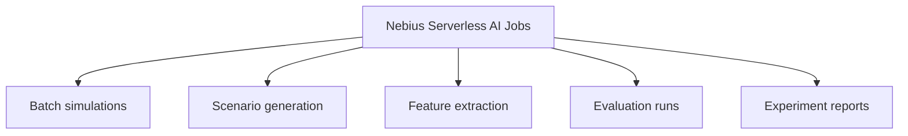
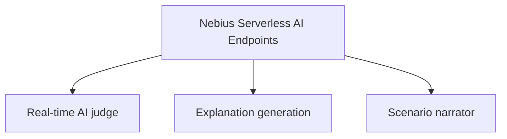

# Nebius Deployment

This project has two Nebius-oriented deployment surfaces:

- a serverless AI endpoint for explanations and report generation
- a serverless batch job for detector benchmarking

The Nebius design is intentionally split between offline jobs and interactive
endpoints. Jobs handle repeatable engineering work that can run outside the UI.
Endpoints handle low-latency explanation and narration requests from the FastAPI
backend.

## Nebius Serverless AI Jobs



Job responsibilities:

- run bounded batches of synthetic simulations
- generate small synthetic datasets for detector evaluation
- extract market microstructure features from event and snapshot artifacts
- run detector tournament benchmarks across scenario families
- produce experiment reports, charts, and reproducible benchmark artifacts

Jobs should use small run counts during development to control time and credit
usage. Large runs belong in final benchmark passes only.

## Nebius Serverless AI Endpoints



Endpoint responsibilities:

- explain detected synthetic incidents from structured evidence
- summarize selected timeline windows in Judge Mode
- narrate scenario behavior for the demo UI
- generate bounded red-team scenario drafts for the simulator

The UI does not call Nebius directly. The FastAPI backend owns endpoint URLs,
optional API tokens, fallback behavior, and request shaping.

## Product Mode Mapping

| Product mode | Nebius surface | Purpose |
| --- | --- | --- |
| Live Arena Mode | Serverless AI Endpoint | Real-time judge, explanation generation, and scenario narration for selected incidents. |
| Experiment Mode | Serverless AI Job | Batch simulations, synthetic dataset generation, feature extraction, detector evaluation, and experiment reports. |
| Judge Mode | Serverless AI Endpoint | Explain a selected timeline segment and produce an investigation-style report. |

## Explanation Endpoint

The endpoint under `serverless/endpoint` exposes:

- `POST /explain-event`
- `POST /explain-simulation`
- `POST /generate-incident-report`
- `POST /generate-scenario`

Configuration starts from `serverless/endpoint/endpoint_config.example.yaml`.

## Batch Benchmark Job

The batch job under `serverless/jobs` runs repeated synthetic simulations, injects labeled abuse-like patterns, computes detector metrics, and emits a benchmark report.

Configuration starts from `serverless/jobs/job_config.example.yaml`.

## Local Configuration

Copy `.env.example` to `.env` and set:

- `NEBIUS_TENANT_ID`
- `NEBIUS_INCIDENT_EXPLAINER_URL`
- `NEBIUS_SCENARIO_GENERATOR_URL`
- `NEBIUS_API_KEY`
- `ARENA_OUTPUT_DIR`

Keep secrets out of source control.

## Production Environment Mapping

Use the same key names, but place them in different deployment surfaces.

### Nebius Serverless AI Endpoint

Set these on the deployed endpoint container:

| Variable | Required | Purpose |
| --- | --- | --- |
| `NEBIUS_ENDPOINT_MODE` | yes | `mock` for deterministic fallback, `ai` to call Nebius AI Studio. |
| `NEBIUS_API_KEY` | only for `ai` mode | Token used by the endpoint to call Nebius AI Studio. Store as a secret. |
| `NEBIUS_AI_STUDIO_BASE_URL` | no | AI Studio API base URL. Defaults to `https://api.studio.nebius.com/v1`. |
| `NEBIUS_AI_MODEL` | no | Model used for explanation/scenario JSON. |
| `NEBIUS_TEMPERATURE` | no | Model temperature. Use `0.2` for stable outputs. |
| `NEBIUS_MAX_TOKENS` | no | Max completion size. Use a small value such as `800`. |
| `NEBIUS_REQUEST_TIMEOUT_SECONDS` | no | Endpoint model-call timeout. |

The endpoint exposes:

```text
GET  /health
POST /explain-event
POST /generate-scenario
POST /explain-simulation
POST /generate-report
```

### FastAPI Backend

Set these on the backend container or backend Docker Compose environment:

| Variable | Required | Purpose |
| --- | --- | --- |
| `NEBIUS_TENANT_ID` | recommended | Tenant metadata shown by `/api/nebius/status`. |
| `NEBIUS_ENDPOINT_BASE_URL` | yes for real endpoint | Base URL for the deployed endpoint. The backend derives `/explain-event` and `/generate-scenario`. |
| `NEBIUS_INCIDENT_EXPLAINER_URL` | no | Explicit full URL override for `/explain-event`. |
| `NEBIUS_SCENARIO_GENERATOR_URL` | no | Explicit full URL override for `/generate-scenario`. |
| `NEBIUS_API_KEY` | optional | Bearer token if the deployed endpoint requires auth. |
| `ARENA_OUTPUT_DIR` | no | Local/output artifact path. |
| `LOG_LEVEL` | no | Backend logging level. |

Example backend production values:

```bash
NEBIUS_TENANT_ID=tenant-e00ek8wmcr5jzwfa9k
NEBIUS_ENDPOINT_BASE_URL=http://<nebius-endpoint>
NEBIUS_API_KEY=<endpoint-auth-token-if-used>
```

### Frontend

Set these for the frontend build/runtime:

| Variable | Required | Purpose |
| --- | --- | --- |
| `VITE_API_BASE_URL` | yes | Public URL of the FastAPI backend. |
| `VITE_ARENA_MODE` | yes | Use `websocket` in production. |
| `VITE_ARENA_WS_URL` | yes | Backend WebSocket URL `/ws/arena`. |

Example frontend production values:

```bash
VITE_API_BASE_URL=https://<backend-host>
VITE_ARENA_MODE=websocket
VITE_ARENA_WS_URL=wss://<backend-host>/ws/arena
```

### Nebius Serverless Jobs

Jobs do not need endpoint URLs for the first benchmark path. Configure job
arguments instead:

```bash
python detector_tournament.py --runs 100 --scenarios spoofing,layering,quote_stuffing,liquidity_evaporation --detectors spoofing_like,layering_like,quote_stuffing,liquidity_shock --output /job/outputs/benchmark
python synthetic_dataset_factory.py --samples 100 --output /job/outputs/synthetic-dataset
```

Keep run counts small for first deployment checks.

## Architecture Records

Nebius implementation should follow the ARDs before adding runtime code:

- [ARD-0005: Nebius Endpoint Contract](architecture/ARD-0005-nebius-endpoint-contract.md)
- [ARD-0007: Nebius Serverless AI Jobs](architecture/ARD-0007-nebius-serverless-ai-jobs.md)
- [ARD-0008: Nebius Serverless AI Endpoints](architecture/ARD-0008-nebius-serverless-ai-endpoints.md)
- [ARD-0009: Judge Mode Investigation Reports](architecture/ARD-0009-judge-mode-investigation-reports.md)
