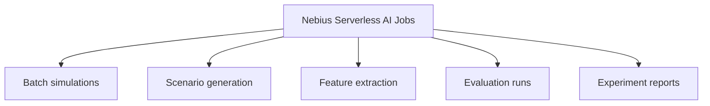
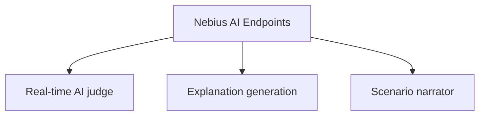

# Nebius Deployment

This project has two Nebius-oriented deployment surfaces:

- a serverless AI endpoint for explanations and report generation
- a serverless batch job for detector benchmarking

The Nebius design is intentionally split between offline jobs and interactive
endpoints. Jobs handle repeatable engineering work that can run outside the UI.
Endpoints handle low-latency explanation and narration requests from the FastAPI
backend.

## Nebius Serverless AI Jobs



Job responsibilities:

- run bounded batches of synthetic simulations
- generate small synthetic datasets for detector evaluation
- extract market microstructure features from event and snapshot artifacts
- run detector tournament benchmarks across scenario families
- produce experiment reports, charts, and reproducible benchmark artifacts

Jobs should use small run counts during development to control time and credit
usage. Large runs belong in final benchmark passes only.

## Nebius AI Endpoints



Endpoint responsibilities:

- explain detected synthetic incidents from structured evidence
- summarize selected timeline windows in Judge Mode
- narrate scenario behavior for the demo UI
- generate bounded red-team scenario drafts for the simulator

The UI does not call Nebius directly. The FastAPI backend owns endpoint URLs,
optional API tokens, fallback behavior, and request shaping.

## Product Mode Mapping

| Product mode | Nebius surface | Purpose |
| --- | --- | --- |
| Live Arena Mode | Nebius AI endpoint | Smart Detection, AI Investigator explanation generation, and scenario narration for selected incidents. |
| Experiment Mode | Managed Experiment job | Batch simulations, synthetic dataset generation, feature extraction, detector evaluation, and experiment reports. |
| Judge Mode | Nebius AI endpoint | Explain a selected timeline segment and produce an AI Investigator report. |

## Reproducibility Commands

Another practitioner should be able to run the Phase 4 path from the repository
root with these commands:

```bash
python scripts/generate_scenarios.py
python scripts/run_local_eval.py
python scripts/submit_nebius_job.py --dry-run
python scripts/call_endpoint.py --base-url http://localhost:9000 --route orderbook-alert
```

For a real Nebius submission, build and push images first:

```bash
SMOKE=true IMAGE_NAMESPACE=ghcr.io/<your-org> TAG=<tag> ./scripts/build-serverless-images.sh
PUSH=true IMAGE_NAMESPACE=ghcr.io/<your-org> TAG=<tag> ./scripts/build-serverless-images.sh
```

Then create the endpoint and job:

```bash
export NEBIUS_SUBNET_ID=<vpc-subnet-id>
export NEBIUS_PARENT_ID=<project-id>
export NEBIUS_ENDPOINT_IMAGE=ghcr.io/<your-org>/ai-market-abuse-detection-arena-endpoint:<tag>
export NEBIUS_JOB_IMAGE=ghcr.io/<your-org>/ai-market-abuse-detection-arena-jobs:<tag>

./scripts/create-nebius-ai-endpoint.sh
./scripts/create-nebius-ai-job.sh
```

After the endpoint, backend, and jobs image are available, run the deployment smoke workflow:

```bash
NEBIUS_ENDPOINT_BASE_URL=https://<endpoint-host> \
BACKEND_BASE_URL=https://<backend-host> \
JOBS_IMAGE=ghcr.io/<your-org>/ai-market-abuse-detection-arena-jobs:<tag> \
./scripts/serverless-smoke.sh
```

The workflow writes `outputs/serverless-smoke/summary.json`. Real Nebius job submission is optional; if submit/artifact command templates are not configured, the summary marks those steps pending instead of failing the smoke.

The shell scripts use the current deterministic CLI surfaces:

- `nebius ai endpoint create`
- `nebius ai job create`
- `nebius ai endpoint logs <endpoint-id> --follow`
- `nebius ai job logs <job-id> --follow`

## Endpoint Contract

The endpoint under `serverless/endpoint` exposes:

- `POST /orderbook-alert`
- `POST /investigation-report`
- `POST /explain-event`
- `POST /explain-simulation`
- `POST /generate-incident-report`
- `POST /generate-scenario`
- `POST /generate-smart-scenario`

Primary routes:

| Route | Input | Output |
| --- | --- | --- |
| `/orderbook-alert` | recent L2 order book window, events, feature snapshot | suspicion score, detected synthetic pattern, reasons |
| `/investigation-report` | scenario trace, alerts, detector metrics | human-readable synthetic market abuse case report |

Configuration starts from `serverless/endpoint/endpoint_config.yaml`.

## Batch Benchmark Job

The batch job under `serverless/jobs` runs repeated synthetic simulations, injects labeled abuse-like patterns, computes detector metrics, and emits a benchmark report.

The smart batch job under `serverless/jobs/` runs attack/detect mode in parallel
batches. It covers:

- normal market
- spoofing attack
- layering attack
- quote stuffing
- pump-and-cancel pattern

Outputs:

- `order_book_events.jsonl`
- `trades.jsonl`
- `attack_labels.jsonl`
- `blue_team_alerts.jsonl`
- `detector_metrics.csv`
- `generated_report.md`
- `manifest.json`

Configuration starts from `serverless/jobs/nebius_job_config.yaml`. For
Phase 4.5 experiments, `serverless/jobs/render_job_config.py` renders
experiment-specific configs to
`outputs/experiments/<experiment_id>/nebius_job_config.rendered.yaml`, overriding
`runs`, `batch_size`, `scenarios`, the job output directory, and the job image
repository/tag while still using the existing `serverless/jobs/Dockerfile` and
`serverless/jobs/run_batch_experiments.py`.

## Phase 4.5 Experiment Flow

The managed experiment flow is available locally through FastAPI and the React UI:

- `/nebius` Managed Experiment Lab creates experiment manifests, generates attack manifests, runs local batches, aggregates outputs, and runs bounded mock/endpoint-backed AI Investigator reports.
- `/nebius` Real Nebius Deployment shows endpoint base URL, endpoint health, endpoint mode, model, job image, rendered job config path, submit-template readiness, latest cloud job status, and artifact collection state. Its buttons call FastAPI to test endpoint health, smoke Smart Detection and AI Investigator report routes, render job config, submit real Nebius jobs, refresh job status, and collect cloud artifacts.
- Detection outputs list experiments and show the selected experiment summary, detector leaderboard, `benchmark_report.md`, AI Investigator report files, `artifact_index.json`, canonical artifacts, and original `local-batch` files.
- Local batch execution reuses `serverless/jobs/run_batch_experiments.py` and writes under `outputs/experiments/<experiment_id>/`.
- `POST /api/experiments/{id}/render-nebius-job-config` renders the existing job config for an experiment without submitting it.
- `POST /api/experiments/{id}/submit-nebius` renders `nebius_job_config.rendered.yaml`. If `NEBIUS_JOB_SUBMIT_COMMAND_TEMPLATE` is unset, it records `real_nebius_pending`; if the template is set, it executes the command, parses a job id, and records a queued Nebius job.

The command-template adapter lives only in `backend/app/experiments/nebius_orchestrator.py`. It supports these environment variables:

| Variable | Purpose |
| --- | --- |
| `NEBIUS_JOB_SUBMIT_COMMAND_TEMPLATE` | Creates/submits the real Nebius job. Missing value keeps `real_nebius_pending`. |
| `NEBIUS_JOB_STATUS_COMMAND_TEMPLATE` | Refreshes queued/running jobs. |
| `NEBIUS_JOB_LOGS_COMMAND_TEMPLATE` | Optional logs collection command. |
| `NEBIUS_JOB_ARTIFACTS_COMMAND_TEMPLATE` | Optional artifacts collection command. |

Supported template variables are `{config_path}`, `{experiment_id}`, `{image}`, and `{output_dir}`. Command stdout/stderr is redacted before persistence. A job is not marked `completed` just because submission succeeded; refresh only marks it completed after status reports completion and artifact collection succeeds.

`POST /api/experiments/{id}/collect-nebius-artifacts` collects the existing job output format from mounted output, or executes `NEBIUS_JOB_ARTIFACTS_COMMAND_TEMPLATE` and then scans the mounted output. It expects these files: `order_book_events.jsonl`, `trades.jsonl`, `attack_labels.jsonl`, `blue_team_alerts.jsonl`, `detector_metrics.csv`, `generated_report.md`, and `manifest.json`. The backend copies only files that exist into the canonical experiment layout and writes `artifact_index.json`; if no collection source is available, the experiment status becomes `cloud_artifacts_pending`.

Do not treat the local batch path, a queued submit record, or `real_nebius_pending` records as evidence of completed real cloud execution. Archive Nebius job logs, metrics, and produced artifacts before making cloud execution claims.

## Local Configuration

Copy `.env.example` to `.env` and set:

- `NEBIUS_TENANT_ID`
- `NEBIUS_INCIDENT_EXPLAINER_URL`
- `NEBIUS_SCENARIO_GENERATOR_URL`
- `NEBIUS_API_KEY`
- `ARENA_OUTPUT_DIR`

Keep secrets out of source control.

## Production Environment Mapping

Use the same key names, but place them in different deployment surfaces.

### Nebius AI Endpoint

Set these on the deployed endpoint container:

| Variable | Required | Purpose |
| --- | --- | --- |
| `NEBIUS_ENDPOINT_MODE` | yes | `mock` for deterministic fallback, `ai` to call the Nebius OpenAI-compatible chat/completions API. |
| `NEBIUS_API_KEY` | only for `ai` mode | Token used by the endpoint to call Nebius AI Studio. Store as a secret. |
| `NEBIUS_BASE_URL` | no | Nebius OpenAI-compatible API base URL. Defaults to `https://api.tokenfactory.nebius.com/v1/`. |
| `NEBIUS_MODEL` | no | Model used for explanation/scenario JSON. |
| `NEBIUS_TEMPERATURE` | no | Model temperature. Use `0.2` for stable outputs. |
| `NEBIUS_MAX_TOKENS` | no | Max completion size. Use a small value such as `800`. |
| `NEBIUS_REQUEST_TIMEOUT_SECONDS` | no | Endpoint model-call timeout. |

Backward-compatible aliases are still supported: `NEBIUS_AI_STUDIO_BASE_URL` is accepted when `NEBIUS_BASE_URL` is unset, and `NEBIUS_AI_MODEL` is accepted when `NEBIUS_MODEL` is unset. New deployments should use `NEBIUS_BASE_URL` and `NEBIUS_MODEL`.

The endpoint exposes:

```text
GET  /health
POST /orderbook-alert
POST /investigation-report
POST /explain-event
POST /generate-scenario
POST /explain-simulation
POST /generate-report
```

### FastAPI Backend

Set these on the backend container or backend Docker Compose environment:

| Variable | Required | Purpose |
| --- | --- | --- |
| `NEBIUS_TENANT_ID` | recommended | Tenant metadata shown by `/api/nebius/status`. |
| `NEBIUS_ENDPOINT_BASE_URL` | yes for real endpoint | Base URL for the deployed endpoint. The backend derives `/explain-event`, `/generate-scenario`, `/orderbook-alert`, and `/investigation-report`. |
| `NEBIUS_INCIDENT_EXPLAINER_URL` | no | Explicit full URL override for `/explain-event`. |
| `NEBIUS_SCENARIO_GENERATOR_URL` | no | Explicit full URL override for `/generate-scenario`. |
| `NEBIUS_ORDERBOOK_ALERT_URL` | no | Explicit full URL override for `/orderbook-alert`. |
| `NEBIUS_INVESTIGATION_REPORT_URL` | no | Explicit full URL override for `/investigation-report`. |
| `NEBIUS_API_KEY` | optional | Bearer token if the deployed endpoint requires auth. |
| `ARENA_OUTPUT_DIR` | no | Local/output artifact path. |
| `LOG_LEVEL` | no | Backend logging level. |

Example backend production values:

```bash
NEBIUS_TENANT_ID=tenant-e00ek8wmcr5jzwfa9k
NEBIUS_ENDPOINT_BASE_URL=http://<nebius-endpoint>
NEBIUS_API_KEY=<endpoint-auth-token-if-used>
```

`/api/nebius/status` and `/api/nebius/observatory` report whether the base URL, order-book alert route, investigation-report route, endpoint mode, and endpoint `/health` probe are configured. If the endpoint is unavailable, backend calls fall back to mock responses instead of failing the demo path.

### Frontend

Set these for the frontend build/runtime:

| Variable | Required | Purpose |
| --- | --- | --- |
| `VITE_API_BASE_URL` | yes | Public URL of the FastAPI backend. |
| `VITE_ARENA_MODE` | yes | Use `websocket` in production. |
| `VITE_ARENA_WS_URL` | yes | Backend WebSocket URL `/ws/arena`. |

Example frontend production values:

```bash
VITE_API_BASE_URL=https://<backend-host>
VITE_ARENA_MODE=websocket
VITE_ARENA_WS_URL=wss://<backend-host>/ws/arena
```

### Nebius Serverless Jobs

Jobs do not need endpoint URLs for the first benchmark path. Configure job
arguments instead:

```bash
python detector_tournament.py --runs 100 --scenarios normal_market,spoofing,layering,quote_stuffing,pump_and_cancel --detectors spoofing_like,layering_like,quote_stuffing,liquidity_shock --output /job/outputs/benchmark
python synthetic_dataset_factory.py --samples 100 --output /job/outputs/synthetic-dataset
python /job/serverless/jobs/run_batch_experiments.py --runs 1000 --batch-size 100 --output /job/outputs/serverless-batch
```

Keep run counts small for first deployment checks.

## Serverless Cost/Runtime Observatory

The React `Nebius AI` page reads `/api/nebius/observatory` and displays
submission evidence:

```text
Endpoint:
- requests: 24
- avg latency: 1.2s
- purpose: incident explanation and order-book alert scoring

Jobs:
- simulations: 1,000
- runtime: 7m 42s
- output files: 7
- artifacts: benchmark_report.md, detector_metrics.csv, generated_report.md, manifest.json
```

Before final review, replace placeholder evidence with real Nebius endpoint/job
screenshots and archived logs/metrics.

The current Phase 4.5 Detection output evidence is synthetic educational benchmark output from the simulator. It is useful for reproducibility and demo review, but it is not real market surveillance and is not compliance evidence.

## Architecture Records

Nebius implementation should follow the ARDs before adding runtime code:

- [ARD-0005: Nebius Endpoint Contract](architecture/ARD-0005-nebius-endpoint-contract.md)
- [ARD-0007: Nebius Serverless AI Jobs](architecture/ARD-0007-nebius-serverless-ai-jobs.md)
- [ARD-0008: Nebius Serverless AI Endpoints](architecture/ARD-0008-nebius-serverless-ai-endpoints.md)
- [ARD-0009: Judge Mode Investigation Reports](architecture/ARD-0009-judge-mode-investigation-reports.md)
