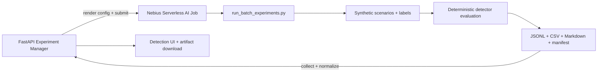
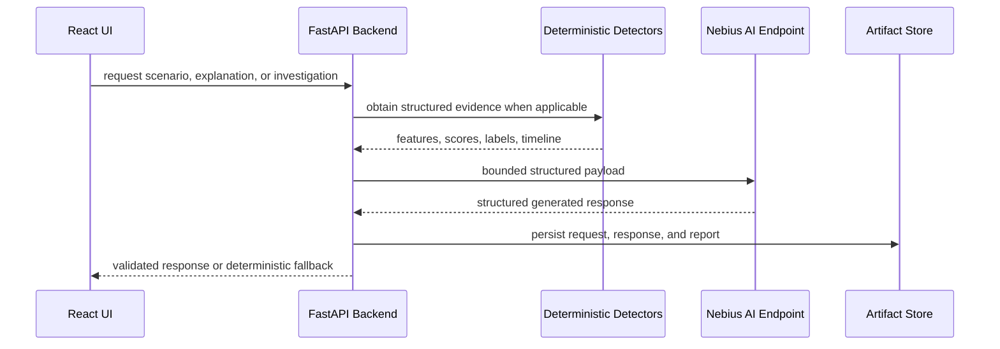

# Nebius Deployment

This project has two Nebius-oriented deployment surfaces:

- a serverless AI endpoint for explanations and report generation
- a serverless batch job for detector benchmarking

The Nebius design is intentionally split between offline jobs and interactive
endpoints. Jobs handle repeatable engineering work that can run outside the UI.
Endpoints handle low-latency explanation and narration requests from the FastAPI
backend.

## Nebius Serverless AI Jobs



Job responsibilities:

- run bounded batches of synthetic simulations
- generate small synthetic datasets for detector evaluation
- extract market microstructure features from event and snapshot artifacts
- run detector tournament benchmarks across scenario families
- produce experiment reports, charts, and reproducible benchmark artifacts

Jobs should use small run counts during development to control time and credit
usage. Large runs belong in final benchmark passes only.

## Nebius AI Endpoints



Endpoint responsibilities:

- explain detected synthetic incidents from structured evidence
- summarize selected timeline windows in Judge Mode
- narrate scenario behavior for the demo UI
- generate bounded red-team scenario drafts for the simulator

The UI does not call Nebius directly. The FastAPI backend owns endpoint URLs,
optional API tokens, fallback behavior, and request shaping.

## Product Mode Mapping

| Product mode | Nebius surface | Purpose |
| --- | --- | --- |
| Live Arena Mode | Nebius AI endpoint | Smart Detection, AI Investigator explanation generation, and scenario narration for selected incidents. |
| Experiment Mode | Managed Experiment job | Batch simulations, synthetic dataset generation, feature extraction, detector evaluation, and experiment reports. |
| Judge Mode | Nebius AI endpoint | Explain a selected timeline segment and produce an AI Investigator report. |

## Reproducibility Commands

Another practitioner should be able to run the Phase 4 path from the repository
root with these commands:

```bash
python scripts/generate_scenarios.py
python scripts/run_local_eval.py
python scripts/submit_nebius_job.py --dry-run
python scripts/call_endpoint.py --base-url http://localhost:9000 --route orderbook-alert
```

For a real Nebius submission, build and push images first:

```bash
SMOKE=true IMAGE_NAMESPACE=ghcr.io/<your-org> TAG=<tag> ./scripts/build-serverless-images.sh
PUSH=true IMAGE_NAMESPACE=ghcr.io/<your-org> TAG=<tag> ./scripts/build-serverless-images.sh
```

## Recommended Partial Nebius Deployment

For the current project shape, deploy only the AI execution surfaces to Nebius:

- Nebius AI Endpoint: single-GPU L40S local-vLLM inference for `/orderbook-alert`,
  `/investigation-report`, and related explanation routes.
- Nebius Serverless Jobs: on-demand detector tournaments and batch experiment
  runs using the pushed jobs image.
- Local Docker Compose: frontend, FastAPI backend, and agent-runner remain local
  by default.

Interactive investigation routes use the bounded request/response contracts in
[professional surveillance prompting](surveillance-prompting.md). The endpoint
summarizes episode evidence, excludes raw LOB streams, and gates Qwen inference
to high anomalies, detector disagreement, completed manipulation episodes, simulation
summaries, and benchmark generation.

This is the best current split because the expensive and Nebius-specific work is
model inference and batch execution. The UI/backend/agent-runner are lightweight,
stateful, and still use local artifact paths; moving them to cloud infrastructure
adds operational work before it adds demo value.

Use the partial deployment helper:

```bash
export IMAGE_NAMESPACE=ghcr.io/<your-org>
export TAG=<tag>
export NEBIUS_SUBNET_ID=<vpc-subnet-id>
export NEBIUS_PARENT_ID=<project-id>
export ENDPOINT_TOKEN=<endpoint-bearer-token>

./scripts/deploy-nebius-partial.sh --dry-run
./scripts/deploy-nebius-partial.sh
```

Default targets are `images,endpoint,backend-env`. The script builds and pushes
both serverless images, creates or reuses the GPU endpoint, and writes sourceable
backend wiring to:

```text
outputs/deployments/nebius-partial-latest.env
```

To wire local Compose to the cloud endpoint and job image:

```bash
set -a
. outputs/deployments/nebius-partial-latest.env
set +a
docker compose -f docker-compose.yml -f docker-compose.nebius.yml up -d --build
```

The override is intentionally required for real Nebius mode. It installs the
Nebius CLI in the backend image and mounts the host's
`$HOME/.nebius/config.yaml` and `$HOME/.nebius/credentials.yaml`. The default
Compose file omits those mounts and uses mock mode, so a new user does not need
Nebius credentials or a GPU.

Serverless Jobs do not need a long-running deployment. The jobs image is pushed
now; actual jobs are submitted on demand from the backend experiment flow. To
submit one sample job from the helper, opt in explicitly:

```bash
./scripts/deploy-nebius-partial.sh --sample-job
```

If you later need a public cloud-hosted app, prefer one small Nebius VM running
Docker Compose behind TLS before Kubernetes. A VM is enough for this app because
the backend has WebSockets, local artifact writes, and a single demo operator
profile. Move to Managed Kubernetes only after you need multi-user scale,
rolling deploys, separate worker pools, or HA. A generic serverless web-container
layer would make sense only if it supports WebSockets, persistent artifacts, and
the Nebius CLI/config needed by the backend; otherwise it creates more friction
than value for this repo today.

Then create the endpoint and job:

```bash
export NEBIUS_SUBNET_ID=<vpc-subnet-id>
export NEBIUS_PARENT_ID=<project-id>
export ENDPOINT_TOKEN=<endpoint-bearer-token>
export NEBIUS_ENDPOINT_IMAGE=ghcr.io/<your-org>/ai-market-abuse-detection-arena-endpoint:<tag>
export NEBIUS_JOB_IMAGE=ghcr.io/<your-org>/ai-market-abuse-detection-arena-jobs:<tag>

./scripts/create-nebius-ai-endpoint.sh
./scripts/create-nebius-ai-job.sh
```

To deploy the endpoint with local vLLM on one Nebius L40S:

```bash
export NEBIUS_SUBNET_ID=<vpc-subnet-id>
export NEBIUS_PARENT_ID=<project-id>
export ENDPOINT_TOKEN=<endpoint-bearer-token>
export NEBIUS_ENDPOINT_IMAGE=ghcr.io/<your-org>/ai-market-abuse-detection-arena-endpoint:<tag>
export NEBIUS_ENDPOINT_MODE=local_vllm
export NEBIUS_ENDPOINT_PLATFORM=gpu-l40s-g
export NEBIUS_ENDPOINT_PRESET=1gpu-16vcpu-200gb
export LOCAL_VLLM_MODEL=Qwen/Qwen2.5-14B-Instruct
export LOCAL_VLLM_HOST=127.0.0.1
export LOCAL_VLLM_PORT=8001
export LOCAL_VLLM_BASE_URL=http://127.0.0.1:8001/v1
export LOCAL_VLLM_DTYPE=auto
export LOCAL_VLLM_GPU_MEMORY_UTILIZATION=0.90
export LOCAL_VLLM_MAX_MODEL_LEN=16384
export LOCAL_VLLM_ENABLE_PREFIX_CACHING=true
export LOCAL_VLLM_MAX_NUM_SEQS=16
export LOCAL_VLLM_TRUST_REMOTE_CODE=true
export NEBIUS_PROMPT_SEED=42

./scripts/create-nebius-ai-endpoint.sh
```

Smoke the deployed endpoint with endpoint auth:

```bash
ENDPOINT_TOKEN=<endpoint-bearer-token> \
python scripts/call_endpoint.py \
  --base-url https://<endpoint-host> \
  --route orderbook-alert
```

### Cloud Validation For `local_vllm`

Apple Silicon Docker does not validate the L40S path. Use Nebius as the source
of truth:

```bash
export NEBIUS_ENDPOINT_IMAGE=ghcr.io/<your-org>/ai-market-abuse-detection-arena-endpoint:<tag>
docker buildx build --platform linux/amd64 \
  -f serverless/endpoint/Dockerfile \
  -t "${NEBIUS_ENDPOINT_IMAGE}" \
  --push \
  serverless/endpoint

export NEBIUS_SUBNET_ID=<vpc-subnet-id>
export NEBIUS_PARENT_ID=<project-id>
export ENDPOINT_TOKEN=<endpoint-bearer-token>
export NEBIUS_ENDPOINT_MODE=local_vllm
export NEBIUS_ENDPOINT_PLATFORM=gpu-l40s-g
export NEBIUS_ENDPOINT_PRESET=1gpu-16vcpu-200gb
export LOCAL_VLLM_MODEL=Qwen/Qwen2.5-14B-Instruct
export LOCAL_VLLM_HOST=127.0.0.1
export LOCAL_VLLM_PORT=8001
export LOCAL_VLLM_BASE_URL=http://127.0.0.1:8001/v1
export LOCAL_VLLM_DTYPE=auto
export LOCAL_VLLM_GPU_MEMORY_UTILIZATION=0.90
export LOCAL_VLLM_MAX_MODEL_LEN=16384
export LOCAL_VLLM_ENABLE_PREFIX_CACHING=true
export LOCAL_VLLM_MAX_NUM_SEQS=16
export LOCAL_VLLM_TRUST_REMOTE_CODE=true

./scripts/create-nebius-ai-endpoint.sh
```

Validate the deployed endpoint:

```bash
export NEBIUS_ENDPOINT_BASE_URL=https://<endpoint-host>
export NEBIUS_ENDPOINT_ID=<endpoint-id>
export ENDPOINT_TOKEN=<endpoint-bearer-token>

curl -fsS -H "Authorization: Bearer ${ENDPOINT_TOKEN}" \
  "${NEBIUS_ENDPOINT_BASE_URL%/}/health"

./scripts/validate-local-vllm-endpoint.sh validate
./scripts/validate-local-vllm-endpoint.sh logs
```

Success criteria:

- `endpoint_mode=local_vllm`
- `model_mode=local_vllm`
- `local_vllm_model=Qwen/Qwen2.5-14B-Instruct`
- `latency_ms > 0` on `/orderbook-alert` and `/investigation-report`

After the endpoint, backend, and jobs image are available, run the deployment smoke workflow:

```bash
NEBIUS_ENDPOINT_BASE_URL=https://<endpoint-host> \
BACKEND_BASE_URL=https://<backend-host> \
JOBS_IMAGE=ghcr.io/<your-org>/ai-market-abuse-detection-arena-jobs:<tag> \
./scripts/serverless-smoke.sh
```

The workflow writes `outputs/serverless-smoke/summary.json`. Real Nebius job submission is optional; if submit/artifact command templates are not configured, the summary marks those steps pending instead of failing the smoke.

The shell scripts use the current deterministic CLI surfaces:

- `nebius ai endpoint create`
- `nebius ai job create`
- `nebius ai endpoint logs <endpoint-id> --follow`
- `nebius ai job logs <job-id> --follow`

## Endpoint Contract

The endpoint under `serverless/endpoint` exposes:

- `POST /orderbook-alert`
- `POST /investigation-report`
- `POST /explain-event`
- `POST /explain-simulation`
- `POST /generate-incident-report`
- `POST /generate-scenario`
- `POST /generate-smart-scenario`

Primary routes:

| Route | Input | Output |
| --- | --- | --- |
| `/orderbook-alert` | recent L2 order book window, events, feature snapshot | suspicion score, detected synthetic pattern, reasons |
| `/investigation-report` | scenario trace, alerts, detector metrics | human-readable synthetic market abuse case report |

Configuration starts from `serverless/endpoint/endpoint_config.yaml`.

## Batch Benchmark Job

The batch job under `serverless/jobs` runs repeated synthetic simulations, injects labeled abuse-like patterns, computes detector metrics, and emits a benchmark report.

The smart batch job under `serverless/jobs/` runs attack/detect mode in parallel
batches. It covers:

- normal market
- spoofing attack
- layering attack
- quote stuffing
- pump-and-cancel pattern

Outputs:

- `order_book_events.jsonl`
- `trades.jsonl`
- `attack_labels.jsonl`
- `blue_team_alerts.jsonl`
- `detector_metrics.csv`
- `generated_report.md`
- `manifest.json`

Configuration starts from `serverless/jobs/nebius_job_config.yaml`. For
Phase 4.5 experiments, `serverless/jobs/render_job_config.py` renders
experiment-specific configs to
`outputs/experiments/<experiment_id>/nebius_job_config.rendered.yaml`, overriding
`runs`, `batch_size`, `scenarios`, the job output directory, and the job image
repository/tag while still using the existing `serverless/jobs/Dockerfile` and
`serverless/jobs/run_batch_experiments.py`.

## Phase 4.5 Experiment Flow

The managed experiment flow is available locally through FastAPI and the React UI:

- `/nebius` Managed Experiment Lab creates experiment manifests, generates attack manifests, runs local batches, aggregates outputs, and runs bounded mock/endpoint-backed AI Investigator reports.
- `/nebius` Real Nebius Deployment shows endpoint base URL, endpoint health, endpoint mode, model, job image, rendered job config path, submit-template readiness, latest cloud job status, and artifact collection state. Queued/running jobs are polled every five seconds; completion automatically syncs Object Storage artifacts and refreshes their UI links. Manual refresh and collection remain available.
- Detection outputs list experiments and show the selected experiment summary, detector leaderboard, `benchmark_report.md`, AI Investigator report files, `artifact_index.json`, canonical artifacts, and original `local-batch` files.
- Local batch execution reuses `serverless/jobs/run_batch_experiments.py` and writes under `outputs/experiments/<experiment_id>/`.
- `POST /api/experiments/{id}/render-nebius-job-config` renders the existing job config for an experiment without submitting it.
- `POST /api/experiments/{id}/submit-nebius` renders `nebius_job_config.rendered.yaml`. If `NEBIUS_JOB_SUBMIT_COMMAND_TEMPLATE` is unset, it records `real_nebius_pending`; if the template is set, it executes the command, parses a job id, and records a queued Nebius job.

The command-template adapter lives only in `backend/app/experiments/nebius_orchestrator.py`. It supports these environment variables:

| Variable | Purpose |
| --- | --- |
| `NEBIUS_JOB_SUBMIT_COMMAND_TEMPLATE` | Creates/submits the real Nebius job. Missing value keeps `real_nebius_pending`. |
| `NEBIUS_JOB_STATUS_COMMAND_TEMPLATE` | Refreshes queued/running jobs. |
| `NEBIUS_JOB_LOGS_COMMAND_TEMPLATE` | Optional logs collection command. |
| `NEBIUS_JOB_ARTIFACTS_COMMAND_TEMPLATE` | Optional artifacts collection command. |
| `NEBIUS_JOB_OUTPUT_URI` | Optional S3-compatible artifact root, for example `s3://bucket/aimada`. |
| `NEBIUS_OBJECT_STORAGE_ENDPOINT_URL` | Nebius S3-compatible endpoint, for example `https://storage.eu-north1.nebius.cloud`. |
| `NEBIUS_OBJECT_STORAGE_ACCESS_KEY_ID` / `NEBIUS_OBJECT_STORAGE_SECRET_ACCESS_KEY` | Object Storage credentials used by the job container to upload artifacts and by the backend to sync them. |
| `NEBIUS_EVIDENCE_ARCHIVE_ENABLED` | Archives every AI Endpoint call and Serverless Job lifecycle snapshot locally and to Object Storage. Enabled by the real-Nebius Compose override. |

Provision the private bucket, dedicated service account, access key, `.env` values, and backend validation with:

```bash
./scripts/configure-nebius-artifact-storage.sh \
  --project-id <project-id> \
  --tenant-id <tenant-id> \
  --bucket-name <globally-unique-bucket-name> \
  --apply --restart
```

The command is dry-run-only without `--apply`, never prints credential values, and does not build Serverless Job or Endpoint images.

Supported template variables are `{config_path}`, `{experiment_id}`, `{job_id}`, `{image}`, `{output_dir}`, `{job_args}`, `{subnet_id_arg}`, `{parent_id_arg}`, `{volume_arg}`, `{cloud_output_uri}`, `{object_storage_endpoint_url_arg}`, and `{object_storage_env_args}`. Command stdout/stderr is redacted before persistence. A job is not marked `completed` just because submission succeeded; refresh only marks it completed after status reports completion and artifact collection succeeds.

`POST /api/experiments/{id}/collect-nebius-artifacts` collects the existing job output format from mounted output, executes `NEBIUS_JOB_ARTIFACTS_COMMAND_TEMPLATE`, or syncs `{NEBIUS_JOB_OUTPUT_URI}/experiments/{id}/local-batch` with `aws s3 sync --endpoint-url`. It expects these files: `order_book_events.jsonl`, `trades.jsonl`, `attack_labels.jsonl`, `blue_team_alerts.jsonl`, `detector_metrics.csv`, `generated_report.md`, and `manifest.json`. The backend copies only files that exist into the canonical experiment layout, writes `artifact_index.json`, writes `cloud_artifact_evidence.json`, and exposes those files to the UI through existing artifact download endpoints; if no collection source is available, the experiment status becomes `cloud_artifacts_pending`.

The shared evidence archive covers all application cloud paths: managed
experiment Jobs, detector-tournament Jobs (including Polished E2E), and the six
AI Endpoint inference routes. It stores redacted request, response, metadata,
submit/status/log evidence locally under `outputs/nebius/evidence/` and mirrors
it to `{NEBIUS_JOB_OUTPUT_URI}/evidence/`. `GET /api/nebius/evidence` lists the
downloadable records; `POST /api/nebius/evidence/sync` retries failed uploads and
restores the S3 archive to backend-local disk. The Execution Trace UI provides
the same sync action and artifact links.

Do not treat the local batch path, a queued submit record, or `real_nebius_pending` records as evidence of completed real cloud execution. Archive Nebius job logs, metrics, and produced artifacts before making cloud execution claims.

## Local Configuration

Copy `.env.example` to `.env` and set:

- `NEBIUS_TENANT_ID`
- `NEBIUS_INCIDENT_EXPLAINER_URL`
- `NEBIUS_SCENARIO_GENERATOR_URL`
- `ENDPOINT_TOKEN`
- `ARENA_OUTPUT_DIR`

Keep secrets out of source control.

## Production Environment Mapping

Use the same key names, but place them in different deployment surfaces.

### Nebius AI Endpoint

Set these on the deployed endpoint container:

| Variable | Required | Purpose |
| --- | --- | --- |
| `NEBIUS_ENDPOINT_MODE` | yes | `mock` for deterministic fallback or `local_vllm` to start and call a local OpenAI-compatible vLLM server. |
| `NEBIUS_REQUEST_TIMEOUT_SECONDS` | no | Endpoint-to-vLLM inference timeout; default `180` seconds for Qwen2.5-14B on one L40S. |
| `NEBIUS_INFERENCE_TIMEOUT_SECONDS` | no | Backend-to-Endpoint inference timeout; default `180` seconds. |
| `LOCAL_VLLM_BASE_URL` | only for `local_vllm` overrides | Local vLLM OpenAI-compatible base URL. Defaults to `http://127.0.0.1:8001/v1`. |
| `LOCAL_VLLM_MODEL` | only for `local_vllm` overrides | Model name sent to vLLM. Defaults to `Qwen/Qwen2.5-14B-Instruct`. |
| `LOCAL_VLLM_HOST` | no | Local vLLM bind host. Defaults to `127.0.0.1`. |
| `LOCAL_VLLM_PORT` | no | Local vLLM port. Defaults to `8001`. |
| `LOCAL_VLLM_DTYPE` | no | Model and activation dtype. Defaults to `auto`. |
| `LOCAL_VLLM_GPU_MEMORY_UTILIZATION` | no | vLLM GPU memory utilization. Defaults to `0.90`. |
| `LOCAL_VLLM_MAX_MODEL_LEN` | no | vLLM maximum model context length. Defaults to `16384`. |
| `LOCAL_VLLM_ENABLE_PREFIX_CACHING` | no | Enables prefix caching. Defaults to `true`. |
| `LOCAL_VLLM_MAX_NUM_SEQS` | no | Scheduler concurrency cap. Defaults to `16`. |
| `LOCAL_VLLM_TRUST_REMOTE_CODE` | no | Passes vLLM `--trust-remote-code`. Defaults to `true`. |

The endpoint exposes:

```text
GET  /health
POST /orderbook-alert
POST /investigation-report
POST /explain-event
POST /generate-scenario
POST /explain-simulation
POST /generate-report
```

### FastAPI Backend

Set these on the backend container or backend Docker Compose environment:

| Variable | Required | Purpose |
| --- | --- | --- |
| `NEBIUS_TENANT_ID` | recommended | Tenant metadata shown by `/api/nebius/status`. |
| `NEBIUS_ENDPOINT_BASE_URL` | yes for real endpoint | Base URL for the deployed endpoint. The backend derives `/explain-event`, `/generate-scenario`, `/orderbook-alert`, and `/investigation-report`. |
| `NEBIUS_INCIDENT_EXPLAINER_URL` | no | Explicit full URL override for `/explain-event`. |
| `NEBIUS_SCENARIO_GENERATOR_URL` | no | Explicit full URL override for `/generate-scenario`. |
| `NEBIUS_ORDERBOOK_ALERT_URL` | no | Explicit full URL override for `/orderbook-alert`. |
| `NEBIUS_INVESTIGATION_REPORT_URL` | no | Explicit full URL override for `/investigation-report`. |
| `ENDPOINT_TOKEN` | optional | Bearer token if the deployed endpoint requires auth. |
| `ARENA_OUTPUT_DIR` | no | Local/output artifact path. |
| `LOG_LEVEL` | no | Backend logging level. |

Example backend production values:

```bash
NEBIUS_TENANT_ID=tenant-e00ek8wmcr5jzwfa9k
NEBIUS_ENDPOINT_BASE_URL=http://<nebius-endpoint>
ENDPOINT_TOKEN=<endpoint-auth-token-if-used>
```

`/api/nebius/status` and `/api/nebius/observatory` report whether the base URL, order-book alert route, investigation-report route, endpoint mode, and endpoint `/health` probe are configured. If the endpoint is unavailable, backend calls fall back to mock responses instead of failing the demo path.

### Frontend

Set these for the frontend build/runtime:

| Variable | Required | Purpose |
| --- | --- | --- |
| `VITE_API_BASE_URL` | yes | Public URL of the FastAPI backend. |
| `VITE_ARENA_MODE` | yes | Use `websocket` in production. |
| `VITE_ARENA_WS_URL` | yes | Backend WebSocket URL `/ws/arena`. |

Example frontend production values:

```bash
VITE_API_BASE_URL=https://<backend-host>
VITE_ARENA_MODE=websocket
VITE_ARENA_WS_URL=wss://<backend-host>/ws/arena
```

### Nebius Serverless Jobs

Jobs do not need endpoint URLs for the first benchmark path. Configure job
arguments instead:

```bash
python detector_tournament.py --runs 100 --scenarios normal_market,spoofing,layering,quote_stuffing,pump_and_cancel --detectors spoofing_like,layering_like,quote_stuffing,liquidity_shock --output /job/outputs/benchmark
python synthetic_dataset_factory.py --samples 100 --output /job/outputs/synthetic-dataset
python /job/serverless/jobs/run_batch_experiments.py --runs 1000 --batch-size 100 --output /job/outputs/serverless-batch
```

Keep run counts small for first deployment checks.

## Serverless Cost/Runtime Observatory

The React `Nebius AI` page reads `/api/nebius/observatory` and displays measured
request, latency, Job, and artifact data. Production Job and Endpoint records,
including S3 upload state, are preserved in the committed
[benchmark evidence bundle](../outputs/benchmark/EXP-18E88EAF/README.md).

Before final review, add Nebius console screenshots and consolidated billing and
runtime records to the [submission index](challenge-submission.md). Do not replace
or relabel the archived production evidence as mock output.

The current Phase 4.5 Detection output evidence is synthetic educational benchmark output from the simulator. It is useful for reproducibility and demo review, but it is not real market surveillance and is not compliance evidence.

## Architecture Records

Nebius implementation should follow the ARDs before adding runtime code:

- [ARD-0005: Nebius Endpoint Contract](architecture/ARD-0005-nebius-endpoint-contract.md)
- [ARD-0007: Nebius Serverless AI Jobs](architecture/ARD-0007-nebius-serverless-ai-jobs.md)
- [ARD-0008: Nebius Serverless AI Endpoints](architecture/ARD-0008-nebius-serverless-ai-endpoints.md)
- [ARD-0009: Judge Mode Investigation Reports](architecture/ARD-0009-judge-mode-investigation-reports.md)
