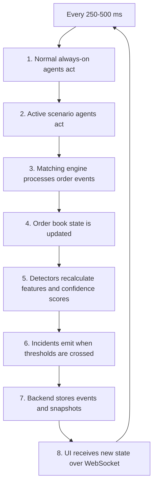

# Runtime Model

This document describes how the live arena runs, how agents participate in the exchange simulator, what the main UI screens show, and how runtime APIs and Nebius components fit together.

## Live Exchange Loop

The exchange simulator ticks continuously while the arena is running. A normal local cadence is one tick every 250-500 ms, fast enough for a live visual demo while still leaving the UI readable.



The backend owns the clock and publishes each state update to connected browser clients. REST endpoints control start, pause, reset, scenario launch, incident explanation, and benchmark summary retrieval.

Normal agents are scheduled in process by `AgentManager`. Agents receive a read-only market snapshot and return order intents. The exchange/order-book path remains a single writer: intents are sorted by tick, latency bucket, agent id, and sequence before they mutate the book. This lets the arena register hundreds of lightweight agents without allowing concurrent writes to shared market state.

Runtime scale knobs:

```text
ARENA_AGENT_COUNT=3
ARENA_AGENT_DECISION_TIMEOUT_SECONDS=0.05
ARENA_REMOTE_AGENT_URLS=
ARENA_REMOTE_AGENT_TIMEOUT_SECONDS=0.05
ARENA_BASELINE_LIQUIDITY_LEVELS=12
ARENA_BASELINE_LIQUIDITY_BASE_SIZE=1.5
ARENA_BASELINE_LIQUIDITY_TICK_SIZE=1.0
ARENA_BASELINE_LIQUIDITY_REFERENCE_PRICE=68125.0
ARENA_MAX_AGENT_QUOTE_SIZE=25.0
AGENT_RUNNER_AGENT_COUNT=24
AGENT_RUNNER_MAX_AGENT_COUNT=48
AGENT_RUNNER_HEAVY_AGENT_COUNT=0
AGENT_RUNNER_MAX_HEAVY_AGENT_COUNT=2
AGENT_RUNNER_HEAVY_AGENT_WORKERS=1
AGENT_RUNNER_MAX_HEAVY_AGENT_WORKERS=1
AGENT_RUNNER_LANGGRAPH_AGENT_COUNT=0
AGENT_RUNNER_MAX_LANGGRAPH_AGENT_COUNT=4
AGENT_RUNNER_LANGGRAPH_STRATEGY=liquidity_rebalancer
```

Local demo keeps `ARENA_REMOTE_AGENT_URLS` empty by default. Agents that miss the per-tick decision deadline are skipped for that tick. This keeps the live arena responsive. Runtime agent `set_level` intents update that agent's own bounded synthetic quote at a price level, so hundreds of agents can share one price without overwriting each other or compounding aggregate depth. The backend caps these quotes with `ARENA_MAX_AGENT_QUOTE_SIZE`. Worker-side `AGENT_RUNNER_MAX_*` caps clamp stale or aggressive env values before agents are built. After each tick, the backend applies a baseline liquidity guard that restores the configured minimum bid/ask ladder around `ARENA_BASELINE_LIQUIDITY_REFERENCE_PRICE`, including when a side has been fully consumed.

Phase 2 adds out-of-process agent runners. A runner exposes `POST /decide`, receives the same read-only `MarketSnapshot`, and returns `AgentIntent` JSON. Start it with `docker compose --profile remote-agents up agent-runner`, then point `ARENA_REMOTE_AGENT_URLS` at it. Only the backend applies accepted intents to the exchange. This preserves deterministic single-writer market state while allowing agent decision work to scale independently.

Phase 3 adds heavy and LangGraph-compatible remote agents. Heavy agents run their expensive decision function through a worker pool inside `agent-runner`. Generic LangGraph agents use `StateGraph` with `observe` and `decide` nodes, then emit the same `AgentIntent` contract. The backend does not import LangGraph and does not know whether a remote intent came from a simple function, a process-pool worker, or a LangGraph graph.

## Authentication Runtime

Google OAuth is completed server-side through `/api/auth/google/complete`. In configured mode, the backend verifies a Google ID token with `GOOGLE_CLIENT_ID`, or exchanges an authorization code with `GOOGLE_CLIENT_ID` and `GOOGLE_CLIENT_SECRET` before verification. The frontend Google Identity Services popup flow sends the browser origin as `redirect_uri`; redirect-mode clients can send their callback URI explicitly. The stable external user key is `payload.sub`, stored as `google_id` in `ARENA_OUTPUT_DIR/auth/auth.db`.

The stored user row contains `id`, `email`, `name`, `avatar_url`, `google_id`, `auth_provider`, `created_at`, and `updated_at`. After verification, the backend issues its own JWT using `AIMADA_JWT_SECRET`; clients may send it as `Authorization: Bearer <token>`. The legacy `X-AIMADA-Session-ID` header remains for existing session-history flows.

## UI Shell Runtime

The shared shell keeps presentation preferences in browser-local state, not backend state. Theme mode is stored as `aimada.themePreference` with `system`, `light`, and `dark` values. System mode follows `prefers-color-scheme` and applies the resolved mode through the document `data-theme` attribute. Shared widgets, status chips, order-book levels, Recharts timelines, tooltips, and the Liquidity Map canvas read semantic theme tokens rather than fixed dark colors. The auth widget expansion state is stored as `aimada.authPanelExpanded`, so the account area can collapse to a compact control for demos and screenshots without logging the user out.

Arena timeline-style widgets should only append frames when the backend tick advances. This keeps the Liquidity Map visually stable while the arena is paused or has not started from the UI.

## Agent Model

### Always-On Agents

These agents provide baseline market activity whenever the arena is running.

| Agent | Runtime Behavior |
| --- | --- |
| `TopOfBookMarketMaker` | Maintains bid and ask liquidity around the current mid price. |
| `DeterministicNoiseTrader` | Sends deterministic small depth updates to create background activity. |
| `PeriodicLiquidityTaker` | Occasionally sends aggressive buy or sell orders that consume visible liquidity. |
| Additional generated normal agents | Scale the same lightweight decision model to hundreds of registered agents. |

### Scenario Agents

Scenario agents are launched manually from the UI. They run for a bounded interval and inject labeled synthetic behavior for detector and explanation demos.

| Scenario Agent | Runtime Behavior |
| --- | --- |
| `SpoofingLikeAgent` | Places a large short-lived visible wall, then cancels before execution. |
| `LayeringLikeAgent` | Places multiple same-side levels, then cancels them as a group. |
| `QuoteStuffingLikeAgent` | Generates many place and cancel updates in a short time window. |
| `LiquidityEvaporationScenario` | Removes visible depth quickly and stresses liquidity-shock features. |
| `PanicSelloffScenario` | Sends aggressive sell pressure to simulate a sudden disorderly move. |

## Main UI Screens

### 1. Arena

The Arena screen is the live operator view.

Top bar:

```text
[Running/Paused] [Tick] [Selected Scenario] [Connection/Source] [Start] [Pause] [Reset]
```

Left section - Scenario / Attack Configuration:

- selected scenario and attack configuration
- Start / Pause / Reset controls
- attack builder and scenario launch controls

Center section - Market:

- Standard or Battlefield visualization mode
- order book ladder
- mid-price, spread, depth, and microstructure metrics
- switchable Heatmap and Timeline secondary views

Right section - Detection:

- detector confidence
- Evidence / Timeline tabs
- Incident Details with AI Investigator and AI cost/latency metrics

Scenario launcher examples:

```text
[Spoofing-like Wall]
[Layering-like Pattern]
[Quote Stuffing Burst]
[Liquidity Evaporation]
[Panic Selloff]
```

### 2. Incident Details

Incident Details opens when the user selects an incident card or when a new high-severity alert is raised.

```text
Suspicious Event Detected

Type: Spoofing-like liquidity wall
Agent: ABUSER_01
Confidence: 0.91
Severity: High

Evidence:
- ask depth increased 480%
- order lifetime 1.8 sec
- cancellation before execution
- imbalance shifted from +0.08 to -0.74

AI explanation:
...
```

Incident Details should show detector evidence first, then the generated explanation. AI text is supporting context, not the source of truth.

### 3. Detection / Experiments Benchmark Review

Detection and Experiments summarize offline detector quality by scenario family, replay evidence, generated reports, and Managed Experiment artifacts.

| Scenario | Precision | Recall | F1 |
| --- | ---: | ---: | ---: |
| Spoofing-like wall | 0.91 | 0.86 | 0.88 |
| Layering-like | 0.84 | 0.79 | 0.81 |
| Quote stuffing | 0.96 | 0.92 | 0.94 |
| Liquidity shock | 0.89 | 0.83 | 0.86 |

## Core Runtime Modules

### `exchange/`

`order_book.py`

- `add_limit_order()`
- `cancel_order()`
- `apply_market_order()`
- `get_l2_snapshot()`
- `get_best_bid_ask()`

`matching_engine.py`

- `process_event()`
- `match_market_order()`
- `update_book()`

`event_log.py`

- `append_event()`
- `replay_events()`

### `agents/`

`runtime.py`

- `AgentIntent`
- `MarketSnapshot`
- `AgentManager`
- `build_normal_agents()`
- `build_heavy_agents()`

`TopOfBookMarketMaker`

- maintains bid and ask liquidity around mid price

`DeterministicNoiseTrader`

- emits deterministic small depth updates

`PeriodicLiquidityTaker`

- occasionally sends aggressive buy and sell orders

`SpoofingLikeAgent`

- places a large short-lived wall and cancels before execution

`LayeringLikeAgent`

- places multiple same-side levels and then cancels them

`QuoteStuffingLikeAgent`

- generates many place and cancel updates in a short window

### `detectors/`

`features.py`

- `spread_bps`
- `depth_top_n`
- `imbalance`
- `message_rate`
- `cancel_to_trade_ratio`
- `order_lifetime`
- `wall_size_ratio`
- `depth_change_pct`

`spoofing_detector.py`

- detects short-lived large visible walls

`layering_detector.py`

- detects coordinated same-side multi-level orders

`quote_stuffing_detector.py`

- detects high update and cancel rates with low execution ratio

`liquidity_shock_detector.py`

- detects depth collapse and spread widening

### `explain/`

The explanation layer receives structured incident evidence and returns a user-facing summary.

Input:

```json
{
  "incident_id": "INC-00042",
  "type": "spoofing_like_wall",
  "confidence": 0.91,
  "evidence": {
    "wall_size_ratio": 8.4,
    "order_lifetime_ms": 1800,
    "cancelled_before_execution": true,
    "imbalance_before": 0.08,
    "imbalance_after": -0.74
  }
}
```

Output:

```json
{
  "title": "Spoofing-like liquidity wall detected",
  "risk_level": "high",
  "plain_english_summary": "...",
  "evidence": ["...", "..."],
  "recommended_action": "Flag this interval for manual review."
}
```

## Nebius Components

### Serverless AI Job

Purpose: run offline benchmark simulations.

```bash
python -m serverless.jobs.run_batch_benchmark \
  --runs 200 \
  --scenarios spoofing,layering,quote_stuffing,liquidity_evaporation \
  --output outputs/benchmark
```

Expected output structure:

```text
outputs/benchmark/
  benchmark_report.md
  benchmark_results.json
  incidents.jsonl
  detector_metrics.csv
  charts/
    f1_by_scenario.png
    confidence_distribution.png
    detection_latency.png
```

### Serverless AI Endpoint

Purpose: explain detected incidents and simulation outcomes.

```text
GET  /health
POST /explain-event
POST /explain-simulation
POST /generate-report
```

## API Design

The live demo backend should expose a compact control API for the UI.

```text
GET  /health

POST /simulation/start
POST /simulation/pause
POST /simulation/reset

POST /scenario/spoofing-like
POST /scenario/layering-like
POST /scenario/quote-stuffing-like
POST /scenario/liquidity-evaporation

GET  /incidents
POST /incidents/{id}/explain

GET  /benchmark/latest
```

WebSocket updates should publish the latest order book snapshot, active agent list, recent events, detector scores, active incidents, and simulation status.
