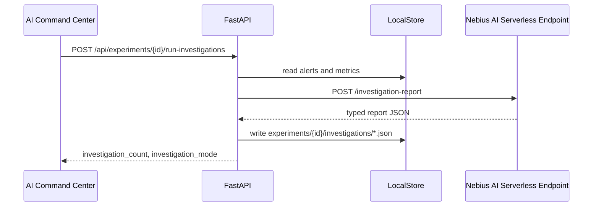
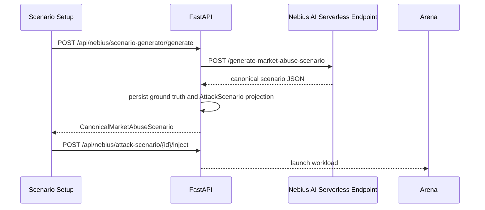
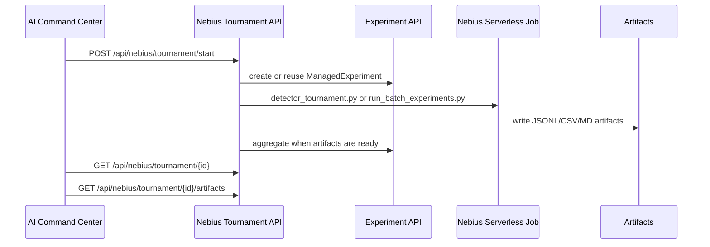

# Nebius Serverless Use Cases

Status: Draft

Date: 2026-07-06

## Product Position

LOB Arena is a Nebius AI Serverless-powered market surveillance platform for synthetic market workloads. It does not analyze real markets and does not provide compliance decisions. The platform value is a complete synthetic workflow:

1. Generate suspicious market workload.
2. Replay it in Arena.
3. Produce detector output and incidents.
4. Investigate with Nebius AI Serverless Endpoint.
5. Generate new scenarios with Nebius AI Serverless Endpoint.
6. Run detector tournaments with Nebius Serverless Jobs.

## Actors

| Actor | Needs |
| --- | --- |
| Demo Operator | Run a reliable local or cloud-backed product demo without Google Auth. |
| Surveillance Reviewer | Read synthetic incident explanations and evidence. |
| Scenario Designer | Generate bounded suspicious workload scenarios. |
| Detector Engineer | Compare detector behavior over many labeled synthetic runs. |
| Technical Judge | Inspect API contracts, artifacts, fallback behavior, and Nebius integration points. |

## Use Case 1: AI Investigation Team

### Objective

Turn detector alerts into structured investigation reports through Nebius AI Serverless Endpoint.

### Reused Code

- `POST /api/nebius/investigation-report`
- `POST /api/experiments/{experiment_id}/run-investigations`
- `NebiusClient.investigation_report()`
- `serverless/endpoint/app.py` route `POST /investigation-report`
- `backend/app/experiments/investigation_pipeline.py`

### Flow



### Payload Example

```json
{
  "scenario_trace": {"id": "Spoofing Attack #042", "source": "arena"},
  "alerts": [{"alert_id": "batch-000017-wall", "detector": "wall detector", "confidence": 0.91}],
  "metrics": {"precision": 0.82, "f1": 0.79}
}
```

### Acceptance Criteria

- Works with mock fallback.
- Shows real/fallback mode.
- Writes investigation artifacts.
- Keeps synthetic safety framing.

## Use Case 2: AI Scenario Generator

### Objective

Generate bounded synthetic market-abuse scenarios through Nebius AI Serverless that can be replayed in Arena and reused in tournaments.

### Reused Code

- `POST /api/nebius/scenario-generator/generate`
- `POST /api/nebius/attack-scenario`
- `POST /api/nebius/attack-scenario/variants`
- `POST /api/nebius/attack-scenario/{scenario_id}/inject`
- `NebiusClient.generate_red_team_scenario()`
- `serverless/endpoint/app.py` routes `POST /generate-market-abuse-scenario`, `POST /generate-scenario`, and `POST /generate-smart-scenario`
- `frontend/src/pages/AttackScenarioGeneratorPage.tsx`
- `backend/app/arena/engine.py` `SimulationEngine.launch_scenario()`

### Flow



### Payload Example

```json
{
  "manipulation_type": "spoofing",
  "difficulty": "medium",
  "symbol": "AIMD",
  "duration_ticks": 120,
  "liquidity_regime": "thin",
  "volatility_regime": "high",
  "seed": 42
}
```

### Response Example

```json
{
  "scenario_id": "ai-spoofing-aimd-120-001",
  "title": "Spoofing Pressure Near Mid",
  "description": "Synthetic spoofing workload with visible bid-side depth that cancels before execution.",
  "manipulation_type": "spoofing",
  "difficulty": "medium",
  "symbol": "AIMD",
  "duration_ticks": 120,
  "ground_truth": {
    "label": "spoofing",
    "manipulation_windows": [{"start_tick": 20, "end_tick": 96}],
    "manipulator_agent_ids": ["AI-SPOOF-001"],
    "expected_detector_targets": ["wall_size_ratio", "cancel_to_trade_ratio"],
    "positive_event_ids": ["evt-0020-place", "evt-0024-cancel"]
  },
  "events": [],
  "expected_detector_behavior": {
    "primary_signals": ["wall_size_ratio", "cancel_to_trade_ratio"],
    "expected_risk_score": 0.76,
    "false_positive_risk": "medium"
  },
  "explanation": "The workload creates transient visible depth and rapid cancellation without real execution.",
  "source": {
    "mode": "mock",
    "provider": "nebius_serverless",
    "endpoint": "/generate-market-abuse-scenario",
    "model": "deterministic-template"
  }
}
```

### Acceptance Criteria

- Scenario is launchable.
- Ground truth is preserved in the canonical scenario artifact.
- Existing `AttackScenario` projection is stored for current Arena inject.
- UI shows `Powered by Nebius AI Serverless Endpoint`.
- Raw endpoint/source metadata is stored in `source`.
- Mock fallback still produces scenario.
- Advanced tuning stays hidden by default.

## Use Case 3: AI Detector Tournament

### Objective

Run many synthetic workloads and compare detector precision, recall, F1, latency, leaderboard, and artifacts through Nebius Serverless Jobs.

### Reused Code

- `POST /api/nebius/tournament/start`
- `GET /api/nebius/tournament/{id}`
- `GET /api/nebius/tournament/{id}/artifacts`
- `POST /api/experiments`
- `POST /api/experiments/benchmark-runs`
- `POST /api/experiments/{id}/run-local-batch`
- `POST /api/experiments/{id}/render-nebius-job-config`
- `POST /api/experiments/{id}/submit-nebius`
- `POST /api/experiments/{id}/collect-nebius-artifacts`
- `POST /api/experiments/{id}/aggregate`
- `serverless/jobs/detector_tournament.py`
- `serverless/jobs/run_batch_experiments.py`
- `serverless/jobs/nebius_job_config.yaml`

### Flow



### Payload Example

```json
{
  "number_of_scenarios": 100,
  "manipulation_types": ["spoofing", "layering", "quote_stuffing"],
  "difficulty_mix": {
    "easy": 0.2,
    "medium": 0.5,
    "hard": 0.2,
    "adversarial": 0.1
  },
  "detector_set": ["spoofing_like", "layering_like", "quote_stuffing"],
  "random_seed": 42,
  "execution_mode": "local"
}
```

### Response Example

```json
{
  "tournament_id": "TRN-20260706-0001",
  "status": "completed",
  "started_at": "2026-07-06T10:00:00Z",
  "completed_at": "2026-07-06T10:01:12Z",
  "detectors": ["spoofing_like", "layering_like", "quote_stuffing"],
  "leaderboard": [
    {
      "detector": "spoofing_like",
      "scenario": "spoofing",
      "precision": 1.0,
      "recall": 0.75,
      "f1": 0.8571,
      "avg_detection_latency_ms": 1200
    }
  ],
  "metrics": {
    "total_scenarios": 100,
    "total_alerts": 87,
    "macro_f1": 0.81
  },
  "artifacts": {
    "results": "outputs/benchmark/TRN-20260706-0001/results.json",
    "metrics": "outputs/benchmark/TRN-20260706-0001/metrics.csv",
    "report": "outputs/benchmark/TRN-20260706-0001/benchmark_report.md"
  },
  "summary": "Local detector tournament completed with deterministic synthetic ground truth."
}
```

### Artifact Contract

| Artifact | Purpose |
| --- | --- |
| `metrics.csv` | Detector precision, recall, F1, and latency from `detector_tournament.py` |
| `results.json` | Per-detector tournament run details |
| `benchmark_report.md` | Human-readable tournament report |
| `charts/*.png` | F1, confidence, and latency charts |
| `order_book_events.jsonl` | Synthetic event stream |
| `trades.jsonl` | Synthetic trade events |
| `attack_labels.jsonl` | Ground-truth scenario labels |
| `blue_team_alerts.jsonl` | Detector alerts |
| `detector_metrics.csv` | Precision, recall, F1, latency inputs |
| `generated_report.md` | Human-readable run report |
| `manifest.json` | Run metadata and artifact paths |

### Acceptance Criteria

- Local fallback and serverless job write same artifact names.
- Pending job state is explicit when submit template missing.
- Aggregation generates summary and leaderboard.
- Artifacts are downloadable from command center.
- UI can start a tournament through `/api/nebius/tournament/start`.
- Mock/local mode works without Nebius credentials.

## Demo Narrative

1. Start in `/nebius`.
2. Show `Powered by Nebius AI Serverless` badge once.
3. Generate scenario.
4. Replay in Arena.
5. Produce detector alert.
6. Run AI Investigation.
7. Create Detector Tournament.
8. Run local fallback or submit serverless job.
9. Show artifacts, metrics, leaderboard, and fallback/real mode labels.

## Non-Goals

- No real market surveillance claims.
- No trading signal generation.
- No browser-side Nebius API key.
- No Google Auth dependency for local demo.
- No rewrite of simulator, detectors, jobs, or report pipeline.
