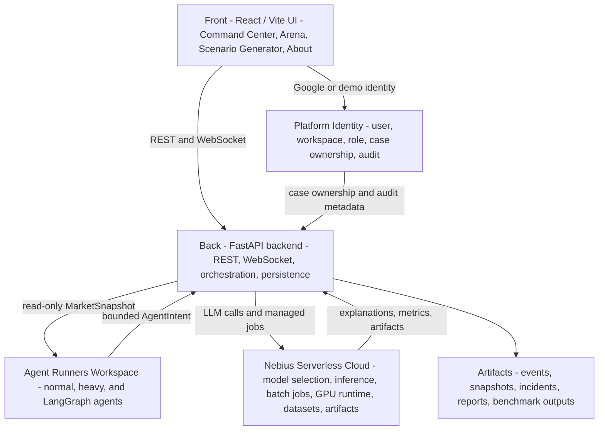
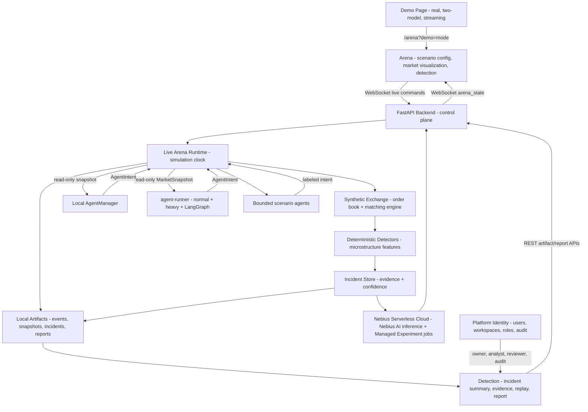
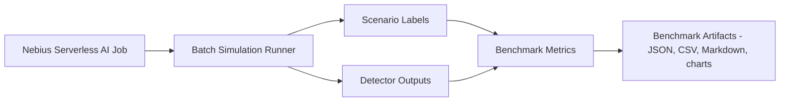
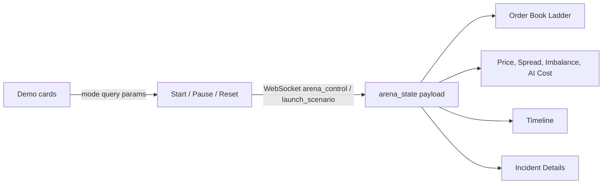
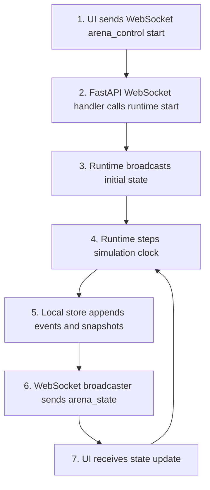
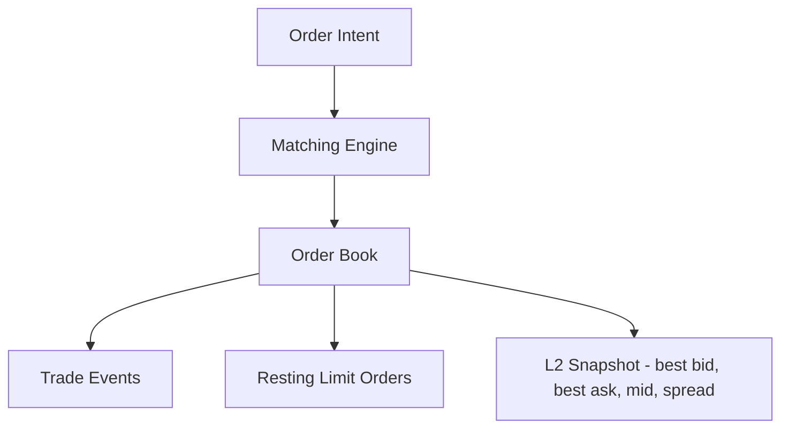
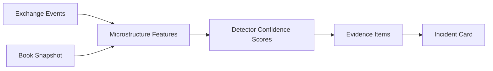

# ARD-0001: Overall Architecture

Status: Accepted

Date: 2026-05-31

## Implementation Status

Status as of 2026-07-13: `[partial]`

Implemented:

- React/Vite routed UI for AI Command Center, Arena / Workload Generator, Scenario Generator, and About pages.
- Old standalone demo, blue-team, report, experiment, and deployment pages have been removed or folded into current Command Center and Arena surfaces.
- FastAPI backend with simulation lifecycle APIs, WebSocket live state, scenario launch, incident persistence, benchmark/report APIs, and Nebius endpoint client fallback behavior.
- Synthetic exchange, matching engine, normal agents, scenario agents, deterministic detectors, evidence objects, and local artifact storage.
- In-process and remote agent runners with HTTP `MarketSnapshot` / `AgentIntent` protocol, heavy-agent worker pools, and LangGraph-compatible generic remote agents.
- Baseline liquidity invariant with additive per-agent quote ownership and quote-size guardrails.
- Google-authenticated user persistence with app-issued JWT sessions.
- Multiuser platform foundation with demo fallback identity, workspace metadata, case ownership, report attribution, and audit trail records.
- UI shell with AI-MADA banner asset, compact navigation control, collapsible auth widget, persisted day/night/system theme, Command Center orchestration, and paused-state-stable Liquidity Map behavior.
- Serverless endpoint/job scaffolds, Dockerfiles, configs, scripts, and local mock/cloud-adapter paths.
- Production Serverless Job and Endpoint evidence archived in the commit-safe benchmark bundle and frozen deployment evidence.
- Measured runtime/cost records are linked from the submission index; sanitized UI screenshots are committed under `assets/screenshots/`.

Production-grade surveillance integrations, real market data ingestion, compliance workflows, and trading signals remain intentionally out of scope.

## Context

AI Market Abuse Detection Arena is an educational simulation for demonstrating synthetic order-book anomaly detection and AI-generated explanations. It is not a production market surveillance system, does not detect real market manipulation, does not provide trading signals, and must not be used for compliance decisions.

The project needs to support two complementary workflows:

- a live visual arena where users can start a synthetic exchange, launch abuse-like scenarios, inspect detector confidence, and read generated incident explanations
- a deterministic 3-minute Demo page that launches Arena in Real Nebius AI Run, Two-Model Pipeline, or Streaming Explanation mode
- an offline benchmark path where many labeled synthetic simulations are run to measure deterministic detector behavior

The implementation should be easy to run locally, clear enough for reviewers to inspect, and structured so Nebius serverless components can be demonstrated without coupling the UI directly to AI services.

## Decision

Build the system as a React visual arena backed by a FastAPI simulator, with a local synthetic exchange/order book, normal and abuse-like agents, deterministic detectors, and separate Nebius serverless components for benchmarks and explanations.

The main architecture has four execution areas:

The batch path runs separately:

## Architecture Overview

### UI Layer

The UI is a React product shell under `frontend/`. It presents AI Command Center, Arena, Scenario Generator, and About without owning simulation logic.

Responsibilities:

- show the live order book ladder
- show mid-price, spread, imbalance, and detector confidence views
- provide Start, Pause, Reset, and scenario controls
- provide Command Center workflows that launch deterministic or Nebius-backed demo paths
- provide scenario launch buttons
- show agent activity and active agents
- show incident cards and Incident Details
- show Nebius AI operations for inference, batch execution, GPU utilization, experiments, artifacts, and cost context
- show evidence for persisted jobs, explanations, screenshots, exports, and promoted report artifacts
- provide role-aware Google auth/session controls that can collapse to a compact account widget
- provide the global workspace/user menu and show case ownership, reviewer, generated-by, and audit metadata where investigations are reviewed
- provide persisted day/night/system theme behavior across the shell
- keep paused visualizations stable by updating timeline-style widgets only when the arena tick advances
- show the educational disclaimer

The UI communicates with the backend through WebSocket for live Arena commands and state, and through REST for Nebius control-plane, artifact, and report actions.

### Backend Layer

The backend is a FastAPI application under `backend/`. It is the runtime control plane.

Responsibilities:

- own simulation lifecycle commands
- maintain the simulation clock
- launch and stop scenarios
- schedule local agents and remote agent runners with bounded per-tick deadlines
- run scenario agents
- process exchange events
- recalculate detector scores
- emit incidents
- broadcast live arena state over WebSocket
- persist local artifacts
- call the Nebius explanation endpoint

The backend isolates the browser from direct simulation internals and from direct Nebius endpoint calls.

### Synthetic Exchange Layer

The exchange layer models a simple limit order book and matching engine.

Key modules:

- `backend/app/exchange/order_book.py`
- `backend/app/exchange/matching_engine.py`
- `backend/app/exchange/event_log.py`
- `backend/app/exchange/schemas.py`

Responsibilities:

- add limit orders
- cancel orders
- apply market orders
- preserve price-time priority within a price level
- preserve fractional partial-fill remainders
- maintain best bid and ask
- expose L2 snapshots
- append replayable event logs

This layer should stay deterministic and testable. Regression coverage now includes add/cancel/market flows, price-time priority, partial fills, L2 snapshots, and deterministic simulation replay.

### Agent Layer

Agents generate synthetic market activity.

Always-on agents:

- `MarketMakerAgent`
- `NoiseTraderAgent`
- `LiquidityTakerAgent`

Scenario agents:

- `SpoofingLikeAgent`
- `LayeringLikeAgent`
- `QuoteStuffingLikeAgent`
- `LiquidityEvaporationScenario`
- `PanicSelloffScenario`

Normal agents provide background liquidity and order flow. Scenario agents are launched manually and emit labeled synthetic abuse-like patterns.

### Detector Layer

Detectors are deterministic and evidence-driven.

Feature families:

- spread bps
- top-N depth
- imbalance
- message rate
- cancel-to-trade ratio
- order lifetime
- wall size ratio
- depth change percentage

Detector families:

- spoofing-like wall detector
- layering-like detector
- quote-stuffing-like detector
- liquidity-shock detector

Detector output should include confidence, severity, evidence, involved agent or scenario, timestamps, and incident metadata.

### Explanation Layer

The explanation layer converts structured incident evidence into plain-English summaries.

Responsibilities:

- prepare explanation requests
- call the Nebius Serverless AI Endpoint
- receive structured explanation output
- store generated reports
- ensure AI text is framed as supporting explanation, not ground truth

### Nebius Serverless Components

The project uses Nebius in two places:

- Serverless AI Endpoint for incident and simulation explanations
- Serverless AI Job for offline benchmark simulations

The endpoint is interactive and request-driven. The job is batch-oriented and produces benchmark artifacts.

## Documentation Map

Core documentation:

- `README.md` - project entry point, setup, disclaimer, documentation links
- `PHASES.md` - phased implementation plan
- `docs/architecture.md` - high-level architecture diagram and component responsibilities
- `docs/runtime-model.md` - ticking runtime model, UI screens, APIs, and module responsibilities
- `docs/benchmark-methodology.md` - benchmark design and metrics
- `docs/nebius-deployment.md` - Nebius endpoint and job deployment notes
- `docs/research-notes.md` - research positioning and references
- `docs/safety-and-disclaimers.md` - safety language and non-production framing
- `docs/challenge-submission.md` - submission framing and assets

Architecture records:

- `docs/architecture/README.md` - ARD index and conventions
- `docs/architecture/ARD-0001-overall-architecture.md` - this record
- `docs/architecture/ARD-0012-google-authentication.md` - Google verification, user persistence, and app sessions
- `docs/architecture/ARD-0013-ui-shell-preferences.md` - UI shell preferences and demo presentation
- `docs/architecture/ARD-0014-multiuser-platform-foundation.md` - Users, workspaces, roles, case ownership, report attribution, and audit trail model

## Phased Implementation Approach

The project should be implemented in five phases.

### Phase 1: Core Live Arena

Build the minimum live loop:

- order book
- matching engine
- normal agents
- simulation clock
- WebSocket state stream
- basic UI ladder

Reasoning:

The order book and tick loop are the foundation. A credible visual arena must first show live, changing synthetic market state before scenario or AI features are added.

Exit criteria:

- simulator ticks continuously when started
- normal agents generate baseline activity
- matching engine updates the synthetic book
- UI shows bids, asks, best levels, and basic market state

### Phase 2: Scenario Agents And Operator Controls

Add manually launched synthetic scenarios:

- spoofing-like wall
- layering-like pattern
- quote-stuffing-like burst
- scenario buttons
- agent feed

Reasoning:

The project needs clear, visible demo moments. Scenario launch buttons make the system understandable to reviewers and create labeled events for later detectors and benchmarks.

Exit criteria:

- UI can launch each scenario manually
- active scenario state is visible
- agent activity appears in the feed
- scenario events are labeled

### Phase 3: Deterministic Detectors And Incidents

Add detection and evidence:

- microstructure features
- confidence scores
- incident cards
- evidence extraction

Reasoning:

Detector output should be explainable and reproducible before AI explanations are introduced. This keeps the model grounded in structured evidence instead of letting generated text define the detection.

Exit criteria:

- detector confidence updates while the simulation runs
- scenario activity can create incident cards
- incidents include structured evidence
- detector behavior is deterministic for a fixed seed

### Phase 4: Nebius Benchmark And Explanation Runtime

Add Nebius serverless surfaces:

- Serverless AI Job for benchmark
- Serverless AI Endpoint for explanation
- deployment docs
- screenshots of Nebius logs and metrics

Reasoning:

Nebius integration should attach to already-structured simulation and detector outputs. The endpoint explains incidents; the batch job evaluates detector behavior over many synthetic runs.

Exit criteria:

- benchmark job runs multiple synthetic scenarios
- precision, recall, and F1 are reported by scenario family
- explanation endpoint returns structured summaries
- deployment docs include commands and review evidence

### Phase 5: Polish And Submission Assets

Prepare the project for review:

- README
- architecture diagram
- blog post
- short video
- research notes
- sample benchmark report

Reasoning:

The final phase packages the work so the architecture, safety framing, demo flow, and benchmark value are clear without requiring reviewers to infer the story from code.

Exit criteria:

- README and docs explain the system clearly
- demo can be started with documented commands
- architecture and runtime model are documented
- supporting research notes and benchmark report are available
- claims remain limited to synthetic educational simulation

## Key Decisions

### Decision 1: Keep UI And Simulation Separate

The UI will not directly own exchange logic. It sends commands to the backend and receives state updates.

Rationale:

- keeps simulation testable outside the browser
- avoids duplicating state logic across frontend and backend
- allows batch jobs to reuse simulation concepts without UI dependencies

### Decision 2: Use Deterministic Detectors Before AI Explanations

The detector engine will calculate confidence and evidence deterministically. AI explanations summarize evidence but do not determine incidents.

Rationale:

- makes benchmark metrics meaningful
- improves reviewability
- avoids overstating AI-generated conclusions
- supports the educational safety framing

### Decision 3: Keep Nebius Endpoint And Job Separate

The Serverless AI Endpoint and Serverless AI Job serve different runtime needs.

Rationale:

- endpoint is latency-sensitive and interaction-driven
- job is throughput-oriented and benchmark-driven
- separation makes deployment and observability clearer

### Decision 4: Persist Artifacts Locally

The system writes local event, snapshot, incident, benchmark, and report artifacts under `outputs/`.

Rationale:

- supports replay and debugging
- supports benchmark reproducibility
- gives reviewers concrete artifacts
- avoids treating transient UI state as the only source of truth

### Decision 5: Use Explicit Safety Language

README, UI, docs, and generated reports must state that this is an educational simulation.

Rationale:

- scenarios are synthetic abuse-like patterns
- detectors are simplified and deterministic
- output must not be interpreted as real surveillance, trading advice, or compliance guidance

## Alternatives Considered

### Browser-Only Simulation

Rejected for the primary architecture.

Reason:

It would simplify the demo but make backend APIs, batch benchmarks, artifact persistence, and serverless integration less realistic.

### AI-First Detection

Rejected.

Reason:

AI-generated text is not a stable detector. The project needs deterministic detector outputs before explanation generation.

### Single Monolithic Service For UI, Simulation, Benchmark, And Explanation

Rejected.

Reason:

It would reduce deployment boundaries but obscure the distinction between live demo, offline benchmark, and AI explanation workloads.

## Consequences

Positive consequences:

- clear runtime boundaries
- testable simulation and detector logic
- UI can remain responsive and visual
- Nebius components have focused responsibilities
- benchmark outputs can be reproduced and reviewed

Tradeoffs:

- more modules and documentation to maintain
- WebSocket state contract needs to stay synchronized with UI needs
- benchmark and live runtime may diverge if shared logic is not kept aligned
- serverless deployment requires separate configuration and observability artifacts
- platform identity metadata needs durable backend persistence before it can become an authorization boundary

## Follow-Up ARDs

Architecture records that refine this decision:

- [ARD-0002: WebSocket State Schema](ARD-0002-websocket-state-schema.md)
- [ARD-0003: Detector Evidence Model](ARD-0003-detector-evidence-model.md)
- [ARD-0004: Benchmark Artifact Format](ARD-0004-benchmark-artifact-format.md)
- [ARD-0005: Nebius Endpoint Contract](ARD-0005-nebius-endpoint-contract.md)
- [ARD-0006: Scenario Labeling and Reproducibility](ARD-0006-scenario-labeling-and-reproducibility.md)
- [ARD-0010: Agent Runner Execution Architecture](ARD-0010-agent-runner-execution.md)
- [ARD-0011: Exchange Liquidity Invariant And Agent Quote Ownership](ARD-0011-exchange-liquidity-invariant.md)
- [ARD-0012: Google Authentication And App Sessions](ARD-0012-google-authentication.md)
- [ARD-0013: UI Shell Preferences And Demo Presentation](ARD-0013-ui-shell-preferences.md)
- [ARD-0014: Multiuser Platform Foundation](ARD-0014-multiuser-platform-foundation.md)

## CEO One-Pager: What The Project Does And Where It Can Go

### What It Is Today

AI Market Abuse Detection Arena is a visual AI demo and research prototype for showing how synthetic market abuse patterns can appear inside a live limit-order-book simulation. It is intentionally framed as an educational simulator, not a production surveillance product, trading system, or compliance decision engine.

The current architecture combines three things in one coherent demo:

1. A live synthetic exchange that simulates a limit order book, matching engine, normal market agents, and abuse-like scenario agents.
2. A deterministic detection layer that converts order-book behavior into measurable evidence, confidence scores, and incident cards.
3. A Nebius-backed AI explanation layer that turns structured detector evidence into readable incident summaries and simulation reports.

In the UI, a reviewer can start the arena, watch the order book change in real time, launch scenarios such as spoofing-like walls, layering-like behavior, quote-stuffing-like bursts, or liquidity shocks, and then inspect detector confidence and incident explanations. The important design choice is that AI does not decide whether abuse happened. The deterministic detector creates the evidence first; the AI endpoint explains that evidence in plain English.

### Why It Matters

The project demonstrates a practical pattern for AI systems in regulated or high-risk domains: keep the core decision logic deterministic, reproducible, and measurable, while using generative AI for explanation, reporting, and operator support.

This makes the demo credible for reviewers because it has clear boundaries:

- the simulation is synthetic and replayable
- scenario labels are controlled
- detector outputs are deterministic for a fixed seed
- incidents contain structured evidence
- explanations are grounded in detector output rather than hallucinated conclusions
- offline benchmarks can measure precision, recall, and F1 across many synthetic runs

For Nebius, this creates a compact but meaningful showcase of serverless AI endpoints and serverless jobs: an interactive endpoint for explanations, and a batch job for large-scale benchmark simulations.

### What It Can Become Next

The project can evolve from a demo into a broader synthetic market intelligence lab. The next version could support richer agent populations, configurable market regimes, historical replay, multi-asset behavior, adversarial agent tournaments, and continuous benchmark dashboards.

A stronger future architecture would add:

- scenario library: reusable scenario families with parameters, labels, and expected detector signatures
- agent marketplace: normal, opportunistic, adversarial, and defensive agents that compete inside the same simulated market
- historical calibration: use real historical market data to calibrate synthetic volatility, spread, depth, and message-rate distributions
- human-in-the-loop mode: analysts can accept, reject, annotate, and compare incidents
- real-time model validation: compare live simulated behavior against expected detector outcomes
- benchmark leaderboard: compare detectors, agents, and explanation prompts across repeatable simulation suites
- executive reporting: automatically generated summaries for each experiment, including what happened, why the detector reacted, and what changed between runs

The most valuable product direction is not “AI detects manipulation.” A more defensible direction is “AI-assisted simulation and explanation environment for understanding market microstructure risk, adversarial behavior, and detector robustness.”

### Future Ideas Inspired By Modeling Notes

The broader modeling direction is to treat the exchange as one example of a multidimensional time-series process. The same architecture could model not only quotes, trades, spreads, depth, and order-flow events, but also synchronized external context such as news, macro events, political statements, social signals, or other exogenous shocks.

This opens several future research and product directions:

- digital twin of a market process: run the real or historical process and a virtual mathematical version side by side, using differences between them to improve models and predictions
- adversarial behavior modeling: represent market participants as agents or groups of agents with conflicting goals, strategies, and observable consequences
- semantic attack simulation: model not only order-book abuse, but also misinformation, data poisoning, fake signals, deepfake-driven market narratives, and other context-level attacks
- online learning loop: continuously validate predictions, detector outputs, and decisions against the simulated or replayed process, then refine the model
- Boyd-cycle framing: model both attacker and defender loops of observe, orient, decide, and act, making the arena a conflict simulation rather than a passive dashboard
- cross-domain extension: use the same simulation pattern for other complex adversarial systems where multiple entities interact over time, such as competitive markets, information operations, supply chains, or social tension modeling

The exchange domain is a strong first case study because it has rich public data, clear event streams, measurable outcomes, visible agent behavior, and well-known market microstructure indicators. A convincing prototype here can become the foundation for a broader platform for simulation, prediction, and decision support in adversarial multidimensional systems.
